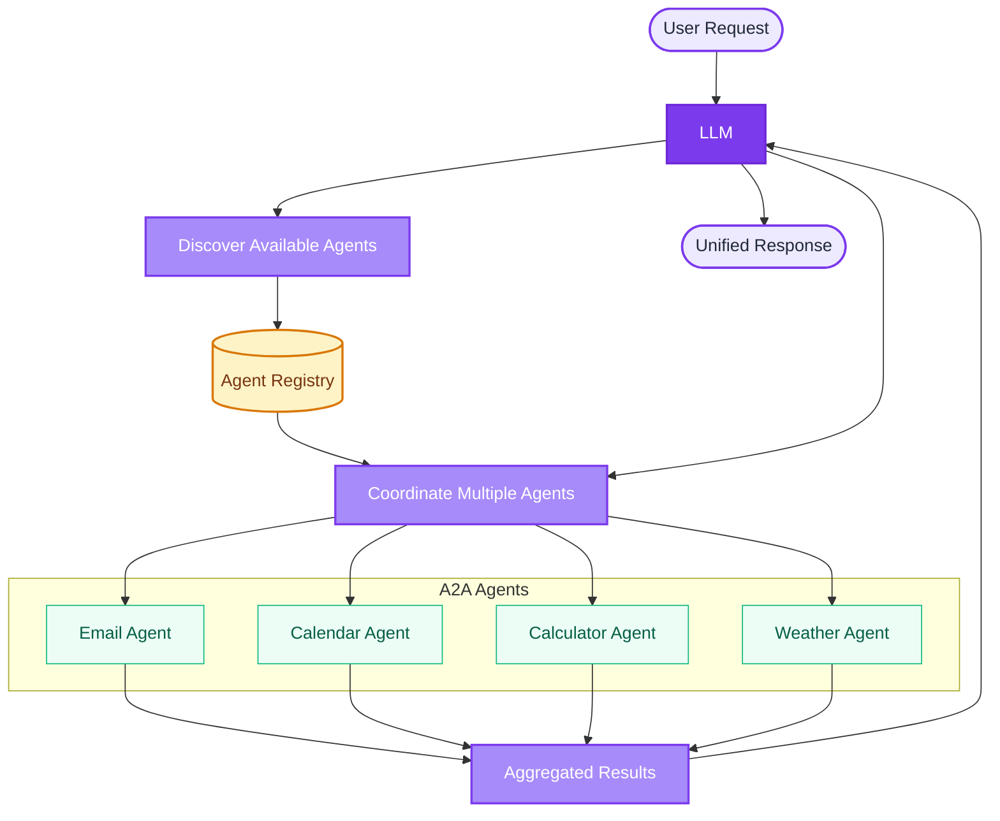

# Agent-To-Agent (A2A) Integration

The Inference Gateway supports **Agent-To-Agent (A2A)** integration, enabling Large Language Models (LLMs) to seamlessly coordinate with external specialized agents. This powerful feature allows LLMs to access and utilize a wide range of external tools and services through standardized agent interfaces.

## What is Agent-To-Agent (A2A)?

Agent-To-Agent (A2A) is a protocol that enables LLMs to discover, communicate with, and coordinate multiple specialized agents simultaneously. Each agent can provide specific capabilities (called "skills") that the LLM can automatically discover and use to fulfill user requests.

## Key Features

- **Automatic Agent Discovery**: The LLM automatically discovers available agents and their capabilities
- **Multi-Agent Coordination**: Coordinate multiple agents in a single conversation
- **Specialized Skills**: Each agent provides specialized tools for specific domains
- **Distributed Architecture**: Agents can run as separate services and scale independently
- **Natural Language Integration**: Users interact naturally while the LLM handles agent coordination
- **Protocol Standardization**: Based on standardized A2A protocol for interoperability

## How A2A Works



When a user makes a request:

1. **Request Analysis**: The LLM analyzes the user's request
2. **Agent Discovery**: Available agents and their skills are discovered
3. **Task Decomposition**: The request is broken down into tasks for specific agents
4. **Agent Coordination**: Multiple agents are called simultaneously or sequentially
5. **Result Integration**: Results from all agents are integrated into a coherent response

## Using A2A with the Inference Gateway CLI

The best way to use A2A is through the **Inference Gateway CLI**. The CLI provides seamless integration with A2A agents, allowing you to delegate specialized tasks to external agents directly from your chat sessions.

### Getting Started

First, install and initialize the CLI:

```bash
# Install the CLI
curl -fsSL https://raw.githubusercontent.com/inference-gateway/cli/main/install.sh | bash

# Initialize your project
infer init

# Start interactive chat
infer chat
```

### Adding A2A Agents

The CLI provides dedicated commands for managing A2A agents through the `infer agents` command.

> Browse available agents in the [A2A Registry](/registry/), hosted at [registry.inference-gateway.com](https://registry.inference-gateway.com).

```bash
# Initialize agents configuration
infer agents init

# Add a remote A2A agent
infer agents add <agent-name> <agent-url>

# Add a local agent with Docker support
infer agents add <agent-name> <agent-url> \
  --oci <oci-image> \
  --run

# Add an agent with environment variables
infer agents add <agent-name> <agent-url> \
  --environment KEY=value

# List configured agents
infer agents list

# Show details for a specific agent
infer agents show <agent-name>

# Remove an agent
infer agents remove <agent-name>
```

Agents can be configured at two levels:

- **Project-level**: `.infer/agents.yaml` - Agents specific to the current project
- **Userspace**: `~/.infer/agents.yaml` - Global agents available across all projects (use `--userspace` flag)

### Delegating Tasks to A2A Agents

Within the CLI, you can delegate specialized tasks to A2A agents. The CLI handles agent discovery, coordination, and result integration automatically.

```bash
infer chat
> "Schedule a team meeting for tomorrow at 2 PM using the calendar agent"
> "Check my calendar for conflicts this week"
```

For autonomous task execution with A2A agents:

```bash
infer agent "Analyze my calendar and suggest optimal meeting times for the team"
```

### A2A Tools

The CLI provides four A2A tools that LLMs can use to interact with agents:

- **A2A_QueryAgent**: Query agent capabilities and metadata for discovery
- **A2A_SubmitTask**: Submit tasks to specialized agents for processing
- **A2A_QueryTask**: Check the status and results of submitted tasks

### Viewing Connected Agents

During a chat session, you can use the `/a2a` shortcut to view all connected A2A agents and their capabilities:

```bash
infer chat
> /a2a
```

This displays information about each configured agent, including their available skills and status.

### Why Use the CLI for A2A?

The Inference Gateway CLI acts as an **A2A agent client**, providing a seamless interface for interacting with A2A-compatible agents. The CLI provides several advantages for A2A integration:

- **A2A Client Implementation**: The CLI implements the A2A client protocol, handling all communication with agents
- **Dedicated Agent Management**: Add, list, show, and remove agents with simple commands
- **Automatic Discovery**: Agents are discovered and coordinated automatically
- **Safety Controls**: Built-in approval workflows for sensitive operations
- **Interactive Experience**: Rich TUI with real-time feedback on agent interactions
- **Flexible Modes**: Switch between Standard, Plan, and Auto-Accept modes for different workflows
- **Docker Support**: Run agents locally with OCI image support

Learn more about the CLI in our [CLI Documentation](/cli/).

## Available Agents

### Google Calendar Agent

The Google Calendar Agent provides comprehensive calendar management and scheduling capabilities.

**Skill:**

The agent advertises a single high-level skill that the LLM discovers and delegates to:

- `schedule-meeting`: Schedule a meeting, book a slot, or find a time that works. Resolves a conflict-free booking by finding open slots, validating that nothing overlaps, and creating the event.

**Tools:**

The `schedule-meeting` skill is backed by a set of calendar tools the agent calls internally:

- `list_calendar_events`: List upcoming events for a time range, with optional free-text search
- `create_calendar_event`: Create a new event, including attendees and location
- `update_calendar_event`: Update an existing event by ID
- `delete_calendar_event`: Delete an event by ID
- `get_calendar_event`: Retrieve the details of a specific event by ID
- `find_available_time`: Find open time slots of a given duration within a date range
- `check_conflicts`: Check for scheduling conflicts in a time range
- `get_current_datetime`: Return the current date/time and the user's IANA timezone, called first for any time-relative request so events land in the correct timezone

**Features:**

- Timezone-aware scheduling: anchors the current time and the user's IANA timezone before emitting RFC3339 timestamps
- Conflict detection and availability checking
- Attendee and location handling on event creation and updates
- Google Calendar API integration

**Configuration:**

These options are set as environment variables, derived from the agent's `googleCalendar` config:

- `mockMode` / `GOOGLE_CALENDAR_MOCK_MODE` (default `false`): serve in-memory mock data instead of calling the Google Calendar API, useful for demos and testing without credentials
- `timezone` / `GOOGLE_CALENDAR_TIMEZONE` (default `UTC`): default IANA timezone applied when a request does not specify one

**Repository:** [github.com/inference-gateway/google-calendar-agent](https://github.com/inference-gateway/google-calendar-agent)

### Documentation Agent

The Documentation Agent provides Context7-style documentation retrieval, resolving a library name to a canonical ID and fetching version-scoped documentation so other agents can ground their code generation in up-to-date library docs.

**Skill:**

- `library-documentation-lookup`: Fetch up-to-date documentation for a third-party library or framework before writing code against it. Resolves the library name to a Context7-compatible ID and retrieves focused, topic-scoped documentation.

**Tools:**

- `resolve_library_id`: Resolve an official library name into a ranked list of Context7-compatible library IDs
- `get_library_docs`: Fetch up-to-date, topic-scoped documentation for a Context7-compatible library ID
- `read`: Read a file from disk (used to load skill bodies on demand)

**Repository:** [github.com/inference-gateway/documentation-agent](https://github.com/inference-gateway/documentation-agent)

For a full walkthrough of the Documentation Agent, its skill, tools, and configuration, see the [Dedicated Documentation Agent page](/documentation-agent/).

## Creating Custom Agents

> **Tip:** Use the [ADL CLI](/adl-cli/) to scaffold A2A agents from YAML definitions. It generates complete project structures with service injection, CI/CD pipelines, and deployment configurations.
>
> Writing the server by hand in TypeScript? See the [TypeScript ADK](/typescript-adk/) for the `@inference-gateway/adk` package, which ships the HTTP server core and JSON-RPC handlers (starting with `message/send`).

To create your own A2A-compatible agent, implement these endpoints:

### Required Endpoints

- `/.well-known/agent.json` - Agent capabilities and metadata
- `/a2a` - Main A2A protocol endpoint
- `/health` - Health check endpoint

### Agent Capabilities Schema

Your agent must expose its capabilities via the `/.well-known/agent.json` endpoint:

```json
{
  "capabilities": {
    "skills": [
      {
        "id": "your-skill-id",
        "name": "Your Skill Name",
        "description": "Description of what your skill does"
      }
    ]
  }
}
```

### A2A Protocol Implementation

Implement the A2A protocol at the `/a2a` endpoint to handle:

- `message/send` - Send a message and receive response
- `message/stream` - Send a streaming message
- `task/get` - Get task status (optional)
- `task/cancel` - Cancel a running task (optional)

## Best Practices

### Agent Design

- **Single Responsibility**: Each agent should focus on a specific domain
- **Stateless Operations**: Design agents to be stateless for better scalability
- **Error Handling**: Implement robust error handling and fallback mechanisms
- **Documentation**: Clearly document agent capabilities and expected inputs

### Security

- **Authentication**: Implement proper authentication between gateway and agents
- **Input Validation**: Validate all inputs to prevent injection attacks
- **Rate Limiting**: Implement rate limiting to prevent abuse
- **Network Security**: Use secure communication channels (HTTPS/TLS)

### Performance

- **Caching**: Implement caching for frequently accessed data
- **Timeouts**: Set appropriate timeouts for agent communications
- **Load Balancing**: Use load balancing for high-availability deployments
- **Monitoring**: Monitor agent performance and availability

## Related Resources

- [A2A Debugger](/a2a-debugger/) - Inspect, stream, and replay tasks on any A2A server from the CLI
- [A2A Registry](/registry/) - Discover available A2A agents and their capabilities ([registry.inference-gateway.com](https://registry.inference-gateway.com))
- [Documentation Agent](/documentation-agent/) - A dedicated A2A agent for Context7-style documentation retrieval
- [ADL CLI](/adl-cli/) - Generate A2A agents from YAML definitions
- [TypeScript ADK](/typescript-adk/) - Build A2A agents in TypeScript with `@inference-gateway/adk`
- [Inference Gateway CLI](/cli/) - Manage and chat with A2A agents
- [Awesome A2A](https://github.com/inference-gateway/awesome-a2a)
- [A2A Protocol Specification](https://github.com/inference-gateway/inference-gateway/tree/main/a2a)
