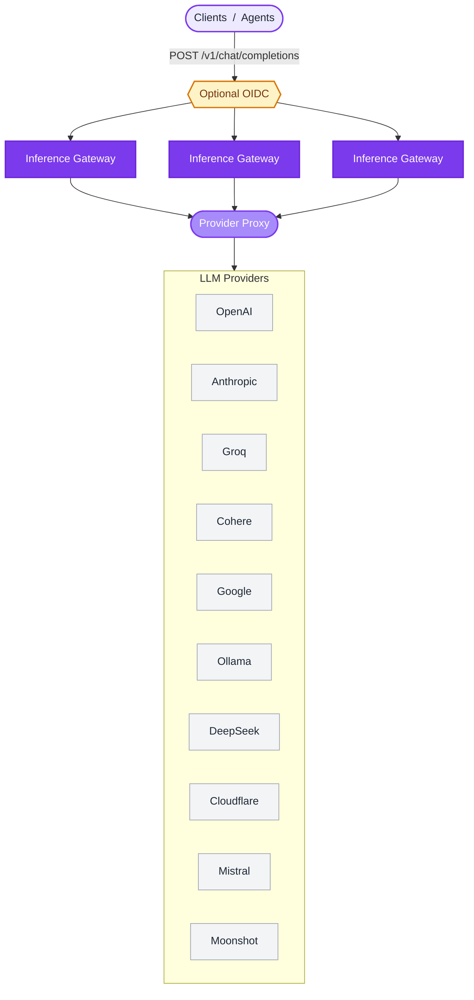
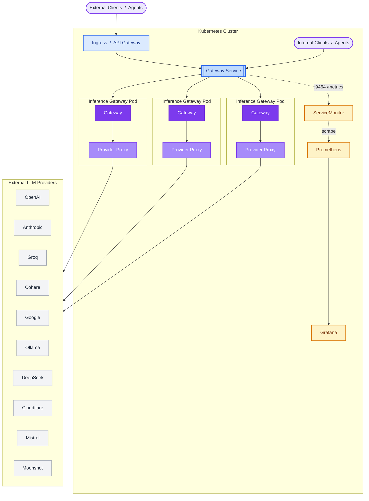

# Architecture Overview

This document provides a high-level overview of the architecture of the Inference Gateway. The Inference Gateway is designed to be modular and extensible, allowing easy integration of new models and providers.

## General Overview

A unified OpenAI-compatible request enters the gateway, optionally clears OIDC authentication, fans out to a horizontally-scalable gateway tier, and is normalised through a single proxy layer before being dispatched to whichever upstream provider serves the requested model.

The gateway tier is stateless. Replicas can be scaled horizontally behind any load balancer; per-request state (tool-call iteration, MCP context, A2A delegation) lives in the request lifecycle, not the pod.

## Kubernetes Setup

The Inference Gateway is built to run on Kubernetes. Traffic flows from an ingress through a `Service` to a pool of stateless gateway pods, each fronting the same provider proxy. Telemetry is scraped on a dedicated metrics port via a `ServiceMonitor`, and providers stay external.

Pods are interchangeable. Add capacity with an HPA; remove pods with rolling updates. The `ServiceMonitor` lets kube-prometheus-stack discover the metrics port without per-deployment scrape config. See [Observability](/observability) for the full Prometheus / Grafana / OTLP setup, and the [Kubernetes Operator](/operator) for managing this topology declaratively as Custom Resources.
