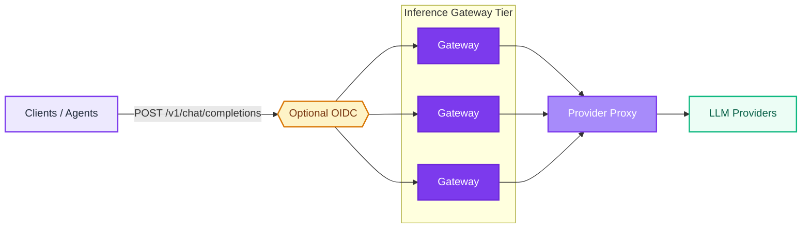
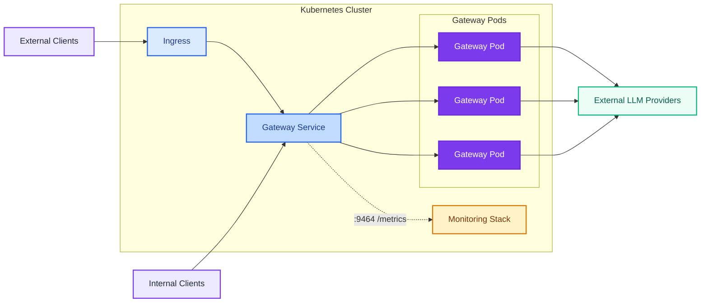

# Architecture Overview

This document provides a high-level overview of the architecture of the Inference Gateway. The gateway is designed to be modular and extensible, so new providers and routing strategies drop in without changing the request surface clients see.

## General Overview

A unified OpenAI-compatible request enters the gateway, optionally clears OIDC authentication, fans out to a horizontally-scalable gateway tier, and is normalised through a single proxy layer before being dispatched to whichever upstream provider serves the requested model.

The gateway tier is stateless - replicas scale horizontally behind any load balancer. Per-request state (tool-call iteration, MCP context, A2A delegation) lives in the request lifecycle, not the pod. See [Supported Providers](/supported-providers) for the full provider matrix: OpenAI, Anthropic, Groq, Cohere, Google, Ollama, DeepSeek, Cloudflare, Mistral, and Moonshot.

## Kubernetes Setup

The Inference Gateway is built to run on Kubernetes. Traffic flows from an ingress through a `Service` to a pool of stateless gateway pods, each fronting the same provider proxy. Telemetry is scraped on a dedicated metrics port via a `ServiceMonitor`, and providers stay external.

Pods are interchangeable. Add capacity with an HPA, remove pods with rolling updates. The `Monitoring Stack` here represents the `ServiceMonitor` + Prometheus + Grafana pipeline kube-prometheus-stack deploys around the gateway - see [Observability](/observability) for the full setup, and the [Kubernetes Operator](/operator) for managing this topology declaratively as Custom Resources.
