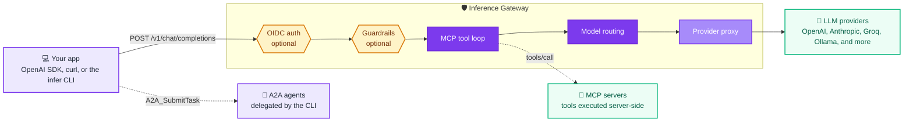
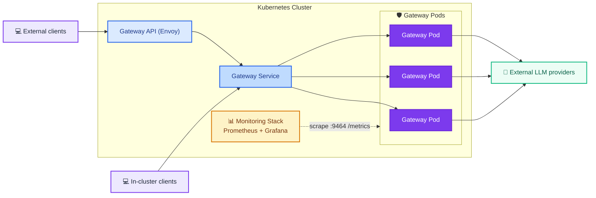

# Architecture Overview

This document provides a high-level overview of the architecture of the Inference Gateway. The gateway is designed to be modular and extensible, so new providers and routing strategies drop in without changing the request surface clients see.

## General Overview

A unified OpenAI-compatible request enters the gateway and passes through a middleware pipeline - optional [OIDC authentication](/authentication/), optional [guardrails](/configuration/), and the [MCP](/mcp/) tool-call loop - before [model routing](/model-routing/) resolves the target model and the provider proxy dispatches it to whichever upstream provider serves it. [A2A agents](/a2a/) sit outside this path: the [CLI](/cli/) delegates to them directly, the gateway does not proxy them.

```mermaid
flowchart LR
    Client["💻 Your app<br/>OpenAI SDK, curl, or the infer CLI"]
    Agents["🤖 A2A agents<br/>delegated by the CLI"]

    subgraph Gateway["🛡️ Inference Gateway"]
        direction LR
        Auth{{"OIDC auth<br/>optional"}}
        Guard{{"Guardrails<br/>optional"}}
        MCPLoop["MCP tool loop"]
        Routing["Model routing"]
        Proxy["Provider proxy"]
        Auth --> Guard --> MCPLoop --> Routing --> Proxy
    end

    MCP["🔌 MCP servers<br/>tools executed server-side"]
    Providers["🧠 LLM providers<br/>OpenAI, Anthropic, Groq, Ollama, and more"]

    Client -- "POST /v1/chat/completions" --> Auth
    Client -. "A2A_SubmitTask" .-> Agents
    MCPLoop -. "tools/call" .-> MCP
    Proxy --> Providers

    classDef client fill:#ede9fe,stroke:#7c3aed,stroke-width:2px,color:#1f2937
    classDef optional fill:#fef3c7,stroke:#d97706,stroke-width:2px,color:#78350f
    classDef stage fill:#7c3aed,stroke:#6d28d9,stroke-width:2px,color:#ffffff
    classDef proxy fill:#a78bfa,stroke:#7c3aed,stroke-width:2px,color:#ffffff
    classDef provider fill:#ecfdf5,stroke:#10b981,stroke-width:2px,color:#065f46

    class Client,Agents client
    class Auth,Guard optional
    class MCPLoop,Routing stage
    class Proxy proxy
    class MCP,Providers provider
```

The pipeline order matches the binary: `cmd/gateway/main.go` registers the auth, guardrails, and MCP middlewares in exactly this sequence before the `/v1/*` handlers. The gateway is stateless - replicas scale horizontally behind any load balancer, and per-request state (tool-call iteration, MCP context) lives in the request lifecycle, not the process. See [Supported Providers](/supported-providers/) for the full provider matrix: OpenAI, DeepSeek, Anthropic, Cohere, Groq, Cloudflare, Ollama, Ollama Cloud, Google, Mistral, MiniMax, Moonshot, and Nvidia.

## Kubernetes Setup

The Inference Gateway is built to run on Kubernetes. Traffic enters through the Kubernetes Gateway API - an [Envoy Gateway](https://gateway.envoyproxy.io/) data plane fronting a `Service` - and reaches a pool of stateless gateway pods, each fronting the same provider proxy. The operator provisions these Gateway API resources from a `Gateway` CR's `gatewayAPI` spec (the successor to Ingress); see the [Kubernetes Operator](/operator/#routing-gateway-api) guide. Telemetry is scraped on a dedicated metrics port via a `ServiceMonitor`, and providers stay external.

```mermaid
flowchart LR
    ExtClient["💻 External clients"]
    IntClient["💻 In-cluster clients"]
    Providers["🧠 External LLM providers"]

    subgraph Cluster["Kubernetes Cluster"]
        direction TB
        GwAPI["Gateway API (Envoy)"]
        Svc["Gateway Service"]

        subgraph Pods["🛡️ Gateway Pods"]
            direction TB
            Pod1["Gateway Pod"]
            Pod2["Gateway Pod"]
            Pod3["Gateway Pod"]
        end

        Monitoring["📊 Monitoring Stack<br/>Prometheus + Grafana"]

        GwAPI --> Svc
        Svc --> Pod1
        Svc --> Pod2
        Svc --> Pod3
        Monitoring -. "scrape :9464 /metrics" .-> Pods
    end

    ExtClient --> GwAPI
    IntClient --> Svc
    Pod1 --> Providers
    Pod2 --> Providers
    Pod3 --> Providers

    classDef client fill:#ede9fe,stroke:#7c3aed,stroke-width:2px,color:#1f2937
    classDef gatewayapi fill:#dbeafe,stroke:#2563eb,stroke-width:2px,color:#1e3a8a
    classDef service fill:#bfdbfe,stroke:#2563eb,stroke-width:2px,color:#1e3a8a
    classDef gateway fill:#7c3aed,stroke:#6d28d9,stroke-width:2px,color:#ffffff
    classDef monitor fill:#fef3c7,stroke:#d97706,stroke-width:2px,color:#78350f
    classDef provider fill:#ecfdf5,stroke:#10b981,stroke-width:2px,color:#065f46

    class ExtClient,IntClient client
    class GwAPI gatewayapi
    class Svc service
    class Pod1,Pod2,Pod3 gateway
    class Monitoring monitor
    class Providers provider
```

Pods are interchangeable. Add capacity with an HPA, remove pods with rolling updates. The `Monitoring Stack` here represents the `ServiceMonitor` + Prometheus + Grafana pipeline kube-prometheus-stack deploys around the gateway - see [Observability](/observability/) for the full setup, and the [Kubernetes Operator](/operator/) for managing this topology declaratively as Custom Resources.
