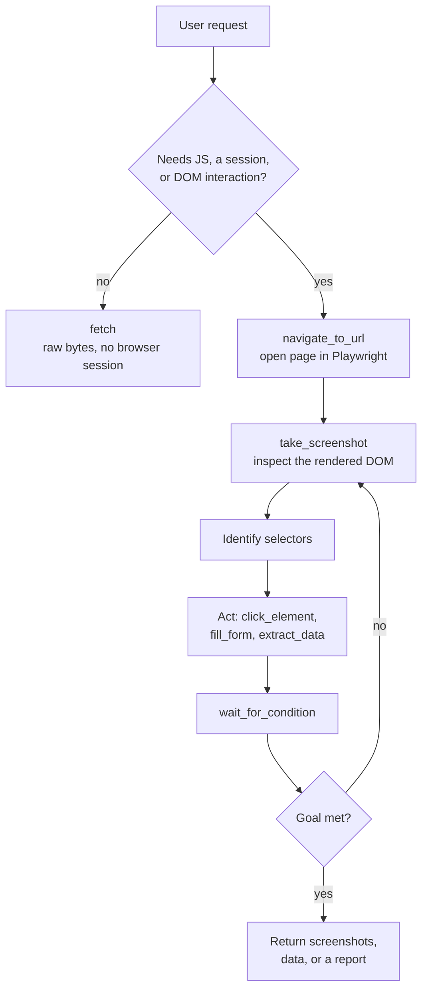

# Browser Agent

The **Browser Agent** is an [Agent-to-Agent (A2A)](/a2a/) server that automates a real web browser with [Playwright](https://playwright.dev/). Ask it to "log into the staging site and check that the checkout flow works" and it drives a headless Chromium session - navigating, screenshotting the rendered DOM to find selectors, clicking, filling forms, and waiting on dynamic content - then reports back with screenshots and extracted data as downloadable artifacts.

> The agent is open-source and scaffolded with the [ADL CLI](/adl-cli/). Source, releases, and the agent manifest live at [github.com/inference-gateway/browser-agent](https://github.com/inference-gateway/browser-agent). It is published as an OCI image at `ghcr.io/inference-gateway/browser-agent`.

## What it does

Reach for the Browser Agent when you want to:

- **Test a webapp end-to-end** - navigate a flow, exercise it like a user, and capture screenshots of each step to verify the UI renders and behaves.
- **Scrape structured data** - extract fields across one or more (paginated) pages and write the results out as a JSON or CSV artifact.
- **Automate forms** - fill and submit multi-step forms, optionally behind a login, and capture the post-submit confirmation.
- **Run deep research** - synthesize an answer to an open-ended question from multiple web sources, cross-referenced and written up as a cited markdown report.

It speaks the A2A protocol, so you drive it through the [Inference Gateway CLI](/cli/)'s `infer agents` commands, the [A2A Debugger](/a2a-debugger/), or any A2A-compatible client.

## How browser automation works

The agent runs as a Playwright automation expert. Its defining method is **reconnaissance-then-action**: rather than guessing selectors, it navigates, screenshots the rendered DOM, identifies the right selectors, then acts - looping until the goal is met. It also prefers the lightweight `fetch` tool over a full browser session whenever the target is static content that needs no JavaScript or session state.



## Capabilities

The agent advertises the following on its A2A agent card (`GET /.well-known/agent-card.json`):

| Capability               | Value   | Notes                                                           |
| ------------------------ | ------- | --------------------------------------------------------------- |
| Streaming                | `true`  | Status updates stream as the automation runs.                   |
| Push notifications       | `false` | -                                                               |
| State transition history | `false` | -                                                               |
| Artifacts                | enabled | Screenshots and extracted data are saved as downloadable files. |

## Skills

The agent ships four [Agent Skills](/skills/), loaded into the system prompt as bare scaffolds and read on demand via the `read` tool. Each one orchestrates a subset of the browser tools to cover a common automation scenario:

| Skill             | What it does                                                                                                                                                      | Tools used                                                                                                        |
| ----------------- | ----------------------------------------------------------------------------------------------------------------------------------------------------------------- | ----------------------------------------------------------------------------------------------------------------- |
| `webapp-testing`  | Verify, validate, or test a webapp end-to-end. Reconnaissance-then-action: navigate, screenshot the DOM, identify selectors, then exercise the flow.              | `navigate_to_url`, `click_element`, `fill_form`, `wait_for_condition`, `take_screenshot`                          |
| `web-scraping`    | Extract structured data from one or more pages. Drives extraction across paginated URLs, normalizes results, and writes a JSON/CSV artifact.                      | `extract_data`, `write`                                                                                           |
| `form-automation` | Complete a multi-step form, optionally behind a login, and capture the post-submit confirmation.                                                                  | `handle_authentication`, `navigate_to_url`, `fill_form`, `click_element`, `wait_for_condition`, `take_screenshot` |
| `deep-research`   | Answer an open-ended question by synthesizing multiple web sources. Plans sub-questions, visits and cross-references sources, and writes a cited markdown report. | `navigate_to_url`, `extract_data`, `write`                                                                        |

## Tools

The agent exposes eight purpose-built Playwright tools plus four file/fetch built-ins from the [ADK](/typescript-adk/) runtime:

| Tool                    | Source     | Purpose                                                                                 | Key parameters                                                                                       |
| ----------------------- | ---------- | --------------------------------------------------------------------------------------- | ---------------------------------------------------------------------------------------------------- |
| `navigate_to_url`       | playwright | Navigate to a URL and wait for the page to load.                                        | `url` (required), `wait_until`, `timeout`                                                            |
| `click_element`         | playwright | Click an element identified by selector, text, or other locator.                        | `selector` (required), `click_count`, `button`, `force`, `timeout`                                   |
| `fill_form`             | playwright | Fill form fields with provided data, optionally submitting.                             | `fields` (required), `submit`, `submit_selector`                                                     |
| `extract_data`          | playwright | Extract structured data from the page via selectors.                                    | `extractors` (required), `format` (`json`/`csv`/`text`)                                              |
| `take_screenshot`       | playwright | Capture a screenshot of the page or a specific element.                                 | `full_page`, `selector`, `type` (`png`/`jpeg`), `quality`                                            |
| `execute_script`        | playwright | Run custom JavaScript in the page via `page.evaluate()` (browser context, not Node.js). | `script` (required), `args`, `return_value`                                                          |
| `handle_authentication` | playwright | Handle basic, form, or OAuth authentication.                                            | `type` (required: `basic`/`form`/`oauth`), `username`, `password`, `login_url`, plus field selectors |
| `wait_for_condition`    | playwright | Wait for a selector, navigation, function, timeout, or network-idle condition.          | `condition` (required), `selector`, `state`, `timeout`, `custom_function`                            |
| `fetch`                 | built-in   | Fetch a URL over HTTP(S) without a browser - faster for static content and downloads.   | `url` (required), `method`, `save_path`, `headers`                                                   |
| `read`                  | built-in   | Read a file from disk; used to load a skill's `SKILL.md` body on demand.                | `file_path`, `offset`, `limit`                                                                       |
| `write`                 | built-in   | Write content to a file - used to persist scraped data and research reports.            | `file_path`, `content`                                                                               |
| `edit`                  | built-in   | Replace a unique string in a file with a new value.                                     | `file_path`, `old_string`, `new_string`                                                              |

The eight Playwright tools are backed by the agent's internal [Playwright service](#services-and-runtime); `read`, `write`, `edit`, and `fetch` are provided by the ADK runtime.

### fetch vs. browser

The agent is told to prefer `fetch` over `navigate_to_url` whenever the target does not need JavaScript or a stateful session: `fetch` is much faster, opens no browser session, and returns raw bytes directly (with an optional `save_path` for downloads). It reaches for `fetch` for static content (raw files, sitemaps, JSON/XML APIs, RSS feeds) and one-shot downloads, and for the full Playwright toolset when the page is a client-rendered SPA, sits behind authentication or cookies, or needs DOM interaction. When in doubt it tries `fetch` first and falls back to `navigate_to_url` if the response is an empty shell hydrated by JavaScript.

## Services and runtime

- **Server**: a single Go binary (`browser-agent`). `browser-agent start` boots the A2A server on port `8080`; `--help` and `--version` behave as expected. A multi-stage `Dockerfile` and the `ghcr.io/inference-gateway/browser-agent` image are provided. It exposes the standard A2A endpoints: `GET /.well-known/agent-card.json`, `GET /health`, and `POST /a2a`.
- **Playwright service** (`NewPlaywrightService`): an internal `BrowserAutomation` service that drives a real Chromium browser and backs all eight Playwright tools. This is the agent's defining runtime dependency - the image ships the browser-automation stack so the tools work out of the box.
- **LLM access**: the agent calls an OpenAI-compatible chat-completions endpoint. Point it at the [Inference Gateway](/) (recommended) or any compatible provider via the `A2A_AGENT_CLIENT_*` variables.
- **Artifacts**: artifact support is enabled, so screenshots and extracted-data files are attached to the task and returned as download links.

## Quick start

### Register with the Inference Gateway CLI

Pull and run the image, then register it with your gateway in one step:

```bash
infer agents add browser-agent http://localhost:8080 \
  --oci ghcr.io/inference-gateway/browser-agent:latest \
  --run
```

See the [A2A Integration guide](/a2a/#using-a2a-with-the-inference-gateway-cli) for the full CLI workflow, then start chatting:

```bash
infer chat
> "Open example.com, screenshot the page, and tell me what the main heading says"
```

### Run it directly and poke it with the debugger

Run the image and point the [A2A Debugger](/a2a-debugger/) at it to exercise the protocol by hand:

```bash
# Start the browser agent
docker run --rm -p 8080:8080 ghcr.io/inference-gateway/browser-agent:latest

# In another shell, submit a task with the debugger
docker run --rm -it --network host \
  ghcr.io/inference-gateway/a2a-debugger:latest \
  --server-url http://localhost:8080 tasks submit "What are your skills?"
```

## Configuration

The agent reads the standard ADK environment variables plus a set of custom `BROWSER_*` and `TOOLS_*` ones. The most relevant are below; the defaults come from `spec.config` in `agent.yaml` and the env vars override them at runtime.

| Category   | Variable                    | Description                                             | Default                     |
| ---------- | --------------------------- | ------------------------------------------------------- | --------------------------- |
| Server     | `A2A_PORT`                  | Server port                                             | `8080`                      |
| Server     | `A2A_DEBUG`                 | Enable debug logging                                    | `false`                     |
| LLM Client | `A2A_AGENT_CLIENT_PROVIDER` | LLM provider (`openai`, `anthropic`, `deepseek`, ...)   | -                           |
| LLM Client | `A2A_AGENT_CLIENT_MODEL`    | Model to use                                            | -                           |
| LLM Client | `A2A_AGENT_CLIENT_BASE_URL` | OpenAI-compatible endpoint (e.g. the Inference Gateway) | -                           |
| Artifacts  | `A2A_ARTIFACTS_ENABLE`      | Enable artifacts (required to return screenshots/data)  | `false`                     |
| Tools      | `TOOLS_READ_ENABLED`        | Enable the `read` tool (loads skill bodies on demand)   | `true`                      |
| Tools      | `TOOLS_WRITE_ENABLED`       | Enable the `write` tool (persists scraped data/reports) | `true`                      |
| Tools      | `TOOLS_FETCH_ENABLED`       | Enable the `fetch` tool (HTTP fetch without a browser)  | `true`                      |
| Tools      | `TOOLS_FETCH_DOWNLOAD_DIR`  | Directory for `fetch` downloads                         | `/tmp/playwright/artifacts` |

### Browser configuration

The Playwright browser is configured through `spec.config.browser` in `agent.yaml`, overridable at runtime with `BROWSER_*` variables:

| Variable                         | Description                                                         | Default                     |
| -------------------------------- | ------------------------------------------------------------------- | --------------------------- |
| `BROWSER_HEADLESS`               | Run the browser headless (no visible window)                        | `true`                      |
| `BROWSER_ENGINE`                 | Browser engine to drive                                             | `chromium`                  |
| `BROWSER_STEALTH_MODE`           | Apply anti-automation-detection tweaks                              | `false`                     |
| `BROWSER_SESSION_TIMEOUT`        | Maximum lifetime of a browser session                               | `2m`                        |
| `BROWSER_USER_AGENT`             | User-Agent string sent with requests                                | Chrome 131 on Linux x86_64  |
| `BROWSER_VIEWPORT_WIDTH`         | Viewport width in pixels                                            | `1920`                      |
| `BROWSER_VIEWPORT_HEIGHT`        | Viewport height in pixels                                           | `1080`                      |
| `BROWSER_DATA_DIR`               | Directory for browser data and artifacts                            | `/tmp/playwright/artifacts` |
| `BROWSER_XVFB_ENABLED`           | Run inside an Xvfb virtual framebuffer (non-headless in containers) | `false`                     |
| `BROWSER_XVFB_DISPLAY`           | Xvfb display number                                                 | `:99`                       |
| `BROWSER_XVFB_SCREEN_RESOLUTION` | Xvfb screen resolution                                              | `1920x1080x24`              |
| `BROWSER_ARGS`                   | Extra Chromium launch flags (stealth, sandboxing, performance)      | see `agent.yaml`            |

The agent also exposes `BROWSER_HEADER_*` variables for the default request headers (Accept, Accept-Language, Accept-Encoding, DNT, Connection, Upgrade-Insecure-Requests). The agent's [README](https://github.com/inference-gateway/browser-agent#configuration) documents the complete set of browser, tool, server, capability, storage, and authentication variables.

## Related

- [A2A Integration](/a2a/) - protocol overview and how agents plug into the gateway
- [A2A Registry](/registry/) - discover and publish A2A agents
- [n8n Agent](/n8n-agent/) - a worked A2A agent with its own skill and tools
- [Grafana Agent](/grafana-agent/) - another worked A2A agent, for Grafana dashboards and PromQL
- [Mock Agent](/mock-agent/) - a zero-config A2A testing aid (mock LLM, no API keys)
- [A2A Debugger](/a2a-debugger/) - inspect and stream tasks against the agent
- [Skills Catalog](/skills/) - how Agent Skills like `webapp-testing` are authored and indexed
- [ADL CLI](/adl-cli/) - the toolchain this agent is scaffolded with
- [Inference Gateway CLI](/cli/) - register and chat with the agent
- [Repository](https://github.com/inference-gateway/browser-agent) - source, releases, and the agent manifest
