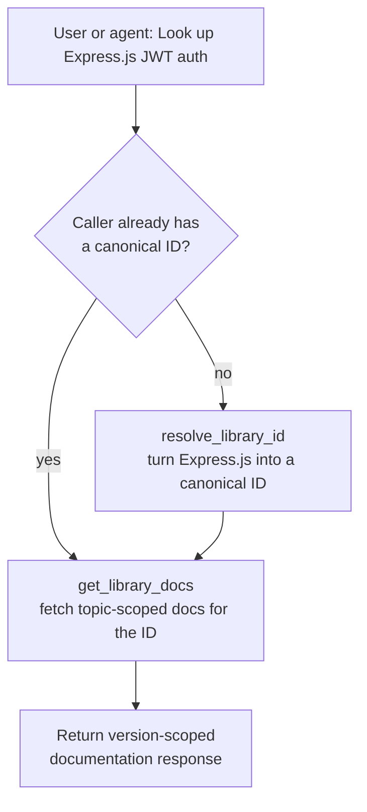

# Documentation Agent

The **Documentation Agent** is an [Agent-to-Agent (A2A)](/a2a/) server that provides Context7-style documentation retrieval for your agents. Ask it to "look up how to set up JWT auth in Express.js" and it resolves the library name to a canonical ID, then fetches focused, version-scoped documentation - so other agents can ground their code generation in up-to-date library docs before writing against an unfamiliar API.

> The agent is open-source and scaffolded with the [ADL CLI](/adl-cli/). Source, releases, and the agent manifest live at [github.com/inference-gateway/documentation-agent](https://github.com/inference-gateway/documentation-agent). It is published as an OCI image at `ghcr.io/inference-gateway/documentation-agent`.

## What it does

Reach for the Documentation Agent when you want to:

- **Resolve a library name to a canonical ID** - turn "Next.js", "Three.js", or "Express.js" into a Context7-compatible `/org/project` (or `/org/project/version`) identifier that other tools can use.
- **Fetch version-scoped documentation** - retrieve up-to-date, topic-scoped docs for a specific library API, hook, configuration option, or version-specific behavior.
- **Ground code generation in real docs** - give other agents (like a coding agent) authoritative documentation before they write code against a third-party library, reducing hallucinated APIs.
- **Skip straight to docs when you already know the ID** - if you already have the canonical `/org/project` identifier, go directly to fetching docs without the resolution step.

It speaks the A2A protocol, so you drive it through the [Inference Gateway CLI](/cli/)'s `infer agents` commands, the [A2A Debugger](/a2a-debugger/), or any A2A-compatible client.

## How documentation lookup works

The agent is a Context7-compatible documentation-lookup service. A typical request is two steps: first resolve the human-readable library name into a canonical identifier, then fetch version-scoped documentation for a specific question.



Callers that already know the exact `/org/project` (or `/org/project/version`) identifier can skip straight to `get_library_docs`. Responses are capped at `maxTokens` 4096, so queries should be specific ("How to set up JWT auth in Express.js", not "auth").

## Capabilities

The agent advertises the following on its A2A agent card (`GET /.well-known/agent-card.json`):

| Capability               | Value   | Notes                                                  |
| ------------------------ | ------- | ------------------------------------------------------ |
| Streaming                | `true`  | Status updates stream as the documentation is fetched. |
| Push notifications       | `false` | -                                                      |
| State transition history | `true`  | Full state transition history is tracked.              |

## Skills

The agent ships one [Agent Skill](/skills/) loaded into its system prompt, vendored as a bare scaffold and read on demand via the `read` tool:

| Skill                          | What it covers                                                                                                                                                                                                                                                                                                                                                                                                                     |
| ------------------------------ | ---------------------------------------------------------------------------------------------------------------------------------------------------------------------------------------------------------------------------------------------------------------------------------------------------------------------------------------------------------------------------------------------------------------------------------- |
| `library-documentation-lookup` | Fetch up-to-date documentation for a third-party library or framework before writing code against it. First resolves the library name to a Context7-compatible ID via `resolve_library_id` (when the caller does not already supply one), then retrieves focused, topic-scoped documentation via `get_library_docs`. Good for filling in unknowns about specific APIs, hooks, configuration options, or version-specific behavior. |

## Tools

The agent exposes two purpose-built documentation tools plus the `read` built-in from the [ADK](/typescript-adk/):

| Tool                 | Source   | Purpose                                                                                 | Key parameters                               |
| -------------------- | -------- | --------------------------------------------------------------------------------------- | -------------------------------------------- |
| `resolve_library_id` | custom   | Resolve an official library name into a ranked list of Context7-compatible library IDs. | `libraryName` (required), `query` (required) |
| `get_library_docs`   | custom   | Fetch up-to-date, topic-scoped documentation for a Context7-compatible library ID.      | `libraryId` (required), `query` (required)   |
| `read`               | built-in | Read a file from disk; used to load a skill's `SKILL.md` body on demand.                | `file_path`, `offset`, `limit`               |

The two documentation tools are implemented in Go in the agent itself; `read` is provided by the ADK runtime.

## Services and runtime

- **Server**: a single Go binary (`documentation-agent`). `documentation-agent start` boots the A2A server on port `8080`; `--help` and `--version` behave as expected. A multi-stage `Dockerfile` and the `ghcr.io/inference-gateway/documentation-agent` image are provided. It exposes the standard A2A endpoints: `GET /.well-known/agent-card.json`, `GET /health`, and `POST /a2a`.
- **Documentation service**: an internal service that implements the Context7-compatible documentation lookup protocol, backing both `resolve_library_id` and `get_library_docs`.
- **LLM access**: the agent calls an OpenAI-compatible chat-completions endpoint. Point it at the [Inference Gateway](/) (recommended) or any compatible provider via the `A2A_AGENT_CLIENT_*` variables.

## Quick start

### Register with the Inference Gateway CLI

Pull and run the image, then register it with your gateway in one step:

```bash
infer agents add documentation-agent http://localhost:8080 \
  --oci ghcr.io/inference-gateway/documentation-agent:latest \
  --run
```

See the [A2A Integration guide](/a2a/#using-a2a-with-the-inference-gateway-cli) for the full CLI workflow, then start chatting:

```bash
infer chat
> "Look up how to set up JWT authentication in Express.js"
```

### Run it directly and poke it with the debugger

Run the image and point the [A2A Debugger](/a2a-debugger/) at it to exercise the protocol by hand:

```bash
# Start the documentation agent
docker run --rm -p 8080:8080 ghcr.io/inference-gateway/documentation-agent:latest

# In another shell, submit a task with the debugger
docker run --rm -it --network host \
  ghcr.io/inference-gateway/a2a-debugger:latest \
  --server-url http://localhost:8080 tasks submit "What are your skills?"
```

## Configuration

The agent reads the standard ADK environment variables plus a small set of custom ones. The most relevant are below.

| Category   | Variable                      | Description                                             | Default |
| ---------- | ----------------------------- | ------------------------------------------------------- | ------- |
| Server     | `A2A_PORT`                    | Server port                                             | `8080`  |
| Server     | `A2A_DEBUG`                   | Enable debug logging                                    | `false` |
| LLM Client | `A2A_AGENT_CLIENT_PROVIDER`   | LLM provider (`openai`, `anthropic`, `deepseek`, ...)   | -       |
| LLM Client | `A2A_AGENT_CLIENT_MODEL`      | Model to use                                            | -       |
| LLM Client | `A2A_AGENT_CLIENT_API_KEY`    | API key for the LLM provider                            | -       |
| LLM Client | `A2A_AGENT_CLIENT_BASE_URL`   | OpenAI-compatible endpoint (e.g. the Inference Gateway) | -       |
| LLM Client | `A2A_AGENT_CLIENT_MAX_TOKENS` | Maximum tokens for documentation responses              | `4096`  |
| Tools      | `TOOLS_READ_ENABLED`          | Enable the `read` tool (loads skill bodies on demand)   | `true`  |

The defaults come from `spec.config` in `agent.yaml`; the env vars above override them at runtime. The agent's [README](https://github.com/inference-gateway/documentation-agent#configuration) documents the complete set of server, capability, storage, and authentication variables.

## Related

- [A2A Integration](/a2a/) - protocol overview and how agents plug into the gateway
- [A2A Registry](/registry/) - discover and publish A2A agents
- [n8n Agent](/n8n-agent/) - a worked A2A agent with its own skill and tools
- [Grafana Agent](/grafana-agent/) - another worked A2A agent, for Grafana dashboards and PromQL
- [Browser Agent](/browser-agent/) - a worked A2A agent for browser automation and web testing
- [A2A Debugger](/a2a-debugger/) - inspect and stream tasks against the agent
- [Skills Catalog](/skills/) - how Agent Skills like `library-documentation-lookup` are authored and indexed
- [ADL CLI](/adl-cli/) - the toolchain this agent is scaffolded with
- [Inference Gateway CLI](/cli/) - register and chat with the agent
- [Repository](https://github.com/inference-gateway/documentation-agent) - source, releases, and the agent manifest
