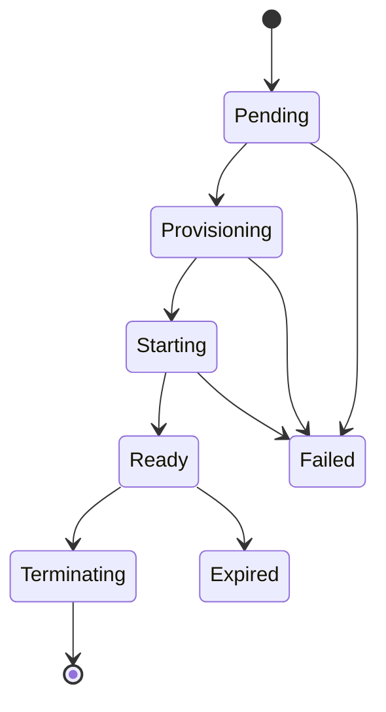

# GPU CRD

The `GPU` custom resource (`core.inference-gateway.com/v1alpha1`) provisions and manages externally hosted, GPU-backed inference runtimes through a pluggable provider interface (RunPod first). The Kubernetes cluster acts as the control plane only - GPU hardware, drivers, scheduling, and inference execution stay with the external infrastructure provider.

The operator publishes a connection Secret with the runtime endpoint and a per-allocation API key, which a `Gateway` can consume through its provider `env` / `secretKeyRef`.

Source: [`api/v1alpha1/gpu_types.go`](https://github.com/inference-gateway/operator/blob/main/api/v1alpha1/gpu_types.go).

## Spec

| Field                    | Type                       | Required | Description                                                                                                                                                                                |
| ------------------------ | -------------------------- | -------- | ------------------------------------------------------------------------------------------------------------------------------------------------------------------------------------------ |
| `provider`               | `string`                   | Yes      | Provider name (e.g. `"runpod"`). Determines which provider driver provisions the runtime.                                                                                                  |
| `credentialsRef`         | `corev1.SecretKeySelector` | Yes      | Reference to a Secret key holding the provider management API key. The operator reads this key to authenticate with the provider - it is never exposed in the generated connection Secret. |
| `image`                  | `string`                   | Yes      | Container image for the inference runtime (e.g. `"ghcr.io/inference-gateway/inference-gateway:latest"`).                                                                                   |
| `command`                | `string[]`                 |          | Optional command override for the container entrypoint.                                                                                                                                    |
| `gpuTypes`               | `string[]`                 | Yes      | Required GPU type identifiers (e.g. `["NVIDIA GeForce RTX 4090"]`). The provider allocates instances matching these types.                                                                 |
| `endpoint.port`          | `int32`                    |          | Container port the runtime listens on (default `8080`).                                                                                                                                    |
| `endpoint.readinessPath` | `string`                   |          | HTTP path the operator probes to determine readiness (default `"/health"`). The `Ready` condition becomes `True` only when this path responds successfully.                                |
| `maxRuntime`             | `metav1.Duration`          | Yes      | Maximum runtime duration (e.g. `"1h"`, `"30m"`). The resource transitions to `Expired` phase after this duration elapses, with no automatic reprovision.                                   |

## Status

| Field                 | Type                          | Description                                                                                                                      |
| --------------------- | ----------------------------- | -------------------------------------------------------------------------------------------------------------------------------- |
| `phase`               | `string`                      | Current lifecycle phase: `Pending`, `Provisioning`, `Starting`, `Ready`, `Terminating`, `Expired`, or `Failed`.                  |
| `instanceID`          | `string`                      | Provider-side instance identifier. Persisted for crash recovery - the controller recovers a single allocation by UID on restart. |
| `url`                 | `string`                      | The HTTP inference endpoint URL returned by the provider. Populated when the runtime is `Ready`.                                 |
| `connectionSecretRef` | `corev1.LocalObjectReference` | Name of the generated Secret holding the connection details. Named `<gpu-name>-connection`.                                      |
| `startedAt`           | `metav1.Time`                 | Timestamp when the runtime entered `Starting` phase.                                                                             |
| `expiresAt`           | `metav1.Time`                 | Timestamp when the runtime will expire (`startedAt + maxRuntime`).                                                               |
| `conditions`          | `metav1.Condition[]`          | Standard Kubernetes conditions. The `Ready` condition is `True` only when the `readinessPath` responds successfully.             |

### Connection Secret

The operator generates a Secret named `<gpu-name>-connection` in the same namespace as the `GPU` resource. The Secret contains:

| Key      | Description                                                                                                                                                                                                            |
| -------- | ---------------------------------------------------------------------------------------------------------------------------------------------------------------------------------------------------------------------- |
| `url`    | The HTTP inference endpoint URL.                                                                                                                                                                                       |
| `apiKey` | A per-allocation bearer token generated by the operator. This is **not** the provider management key from `credentialsRef` - it is an ephemeral token injected into the runtime as the `API_KEY` environment variable. |

## Lifecycle

The `GPU` resource progresses through the following phases:



| Phase          | Description                                                                                                                                                                         |
| -------------- | ----------------------------------------------------------------------------------------------------------------------------------------------------------------------------------- |
| `Pending`      | The resource has been created and is awaiting reconciliation.                                                                                                                       |
| `Provisioning` | The operator is calling the provider to allocate a GPU instance. On controller restart, the operator recovers an existing allocation by UID before creating a new one.              |
| `Starting`     | The instance is running but the `readinessPath` has not yet responded. The operator polls the endpoint until it becomes healthy.                                                    |
| `Ready`        | The `readinessPath` responds successfully. The `url` and `connectionSecretRef` are populated. The runtime is available for consumption.                                             |
| `Terminating`  | The resource is being deleted. The operator calls the provider to release the allocation. A finalizer prevents the resource from being removed until the provider confirms cleanup. |
| `Expired`      | The `maxRuntime` duration has elapsed. The runtime is no longer available. The operator does **not** automatically reprovision - a new `GPU` resource must be created.              |
| `Failed`       | An unrecoverable error occurred (e.g. invalid credentials, provider error, or missing `credentialsRef`).                                                                            |

### Readiness

The `Ready` condition is gated on the actual HTTP `readinessPath` responding successfully. Until the endpoint is reachable, the phase remains `Starting` and the condition is `False`. This ensures consumers only see the runtime as ready when it can actually serve inference requests.

### maxRuntime and Expiration

`maxRuntime` is **required** and sets a hard upper bound on how long the runtime runs. Once `startedAt + maxRuntime` passes, the resource transitions to `Expired` phase:

- The `Ready` condition is set to `False`.
- The provider allocation is **not** automatically released (the finalizer releases it on deletion).
- The resource remains in `Expired` for inspection until deleted.
- There is **no automatic reprovision** - create a new `GPU` resource to start a fresh runtime.

## Example: Gateway consuming a GPU connection Secret

The following example creates a `GPU` resource and a `Gateway` that consumes the generated connection Secret through a provider `env` / `secretKeyRef`.

```yaml
apiVersion: v1
kind: Secret
metadata:
  name: runpod-credentials
  namespace: inference-gateway
type: Opaque
stringData:
  RUNPOD_API_KEY: rp_abc123...
---
apiVersion: core.inference-gateway.com/v1alpha1
kind: GPU
metadata:
  name: my-gpu
  namespace: inference-gateway
spec:
  provider: runpod
  credentialsRef:
    name: runpod-credentials
    key: RUNPOD_API_KEY
  image: ghcr.io/inference-gateway/inference-gateway:latest
  gpuTypes:
    - 'NVIDIA GeForce RTX 4090'
  endpoint:
    port: 8080
    readinessPath: /health
  maxRuntime: 2h
---
apiVersion: core.inference-gateway.com/v1alpha1
kind: Gateway
metadata:
  name: my-gateway
  namespace: inference-gateway
spec:
  replicas: 1
  providers:
    - name: OpenAI
      enabled: true
      env:
        - name: OPENAI_API_KEY
          valueFrom:
            secretKeyRef:
              name: openai-secret
              key: OPENAI_API_KEY
    - name: Custom
      enabled: true
      env:
        - name: CUSTOM_API_URL
          valueFrom:
            secretKeyRef:
              name: my-gpu-connection
              key: url
        - name: CUSTOM_API_KEY
          valueFrom:
            secretKeyRef:
              name: my-gpu-connection
              key: apiKey
```

The `my-gpu-connection` Secret is generated by the operator when the `GPU` resource reaches `Ready`. The `apiKey` value is a per-allocation token generated by the operator - it is **not** the RunPod management key from `runpod-credentials`.

For a complete runnable example, see [`examples/gpu/`](https://github.com/inference-gateway/operator/tree/main/examples/gpu) in the operator repository.

## Status and Monitoring

```bash
kubectl get gpu -n inference-gateway
kubectl describe gpu my-gpu -n inference-gateway
```

The `GPU` status surfaces the current `phase`, the `url` when ready, and the `Ready` condition with a human-readable reason and message.

## Cleanup

Delete the `GPU` resource to release the provider allocation:

```bash
kubectl delete gpu my-gpu -n inference-gateway
```

The operator's finalizer calls the provider to destroy the instance before removing the resource. The connection Secret is automatically garbage-collected by Kubernetes owner reference.
