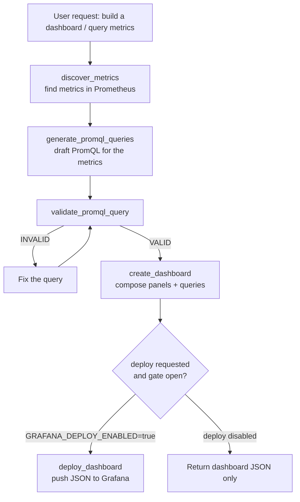

# Grafana Agent

The **Grafana Agent** is an [Agent-to-Agent (A2A)](/a2a/) server that turns plain-language observability requests into real Grafana dashboards. Ask it to "build a dashboard showing request rate, p95 latency, and error rate for my service" and it discovers the available Prometheus metrics, drafts and validates the PromQL, composes the panels, and - when you let it - deploys the dashboard straight to Grafana.

> The agent is open-source and scaffolded with the [ADL CLI](/adl-cli/). Source, releases, and the example stacks live at [github.com/inference-gateway/grafana-agent](https://github.com/inference-gateway/grafana-agent). It is published as an OCI image at `ghcr.io/inference-gateway/grafana-agent`.

## What it does

Reach for the Grafana Agent when you want to:

- **Build a dashboard from a description** - turn "monitor HTTP traffic for the checkout service" into a multi-panel Grafana dashboard with sensible visualizations.
- **Discover what's available** - ask which Prometheus metrics exist for a service, optionally filtering by name pattern or metric type (counter, gauge, histogram, summary).
- **Author and validate PromQL** - generate query suggestions for a set of metrics and validate expressions against a live Prometheus server before they land in a panel.
- **Deploy (or just design) dashboards** - push a dashboard JSON to Grafana Cloud or a self-hosted instance, or keep the agent in design-only mode so nothing is written until you flip the deploy gate.

It speaks the A2A protocol, so you drive it through the [Inference Gateway CLI](/cli/)'s `infer agents` commands, the [A2A Debugger](/a2a-debugger/), or any A2A-compatible client.

## How dashboard automation works

The agent runs as a Grafana expert guided by two [Agent Skills](#skills) (`promql` and `dashboarding`). A typical request flows through the metric, query, and dashboard tools in order: discover what metrics exist, generate PromQL for them, validate those queries, compose the dashboard, then optionally deploy it.



The metric, query, and Prometheus-validation steps target a Prometheus server; the dashboard steps target Grafana. Deployment is gated - see [Deploy gating](#deploy-gating).

## Capabilities

The agent advertises the following on its A2A agent card (`GET /.well-known/agent-card.json`):

| Capability               | Value   | Notes                                            |
| ------------------------ | ------- | ------------------------------------------------ |
| Streaming                | `true`  | Status updates stream as the dashboard is built. |
| Push notifications       | `false` | -                                                |
| State transition history | `false` | -                                                |

## Skills

The agent ships two [Agent Skills](/skills/) loaded into its system prompt, both vendored from the upstream [grafana/skills](https://github.com/grafana/skills) catalogue (pinned to commit `6311c4f`). They are loaded as bare scaffolds and the full `SKILL.md` body is read on demand via the `read` tool.

| Skill          | What it covers                                                                                                                                                                  |
| -------------- | ------------------------------------------------------------------------------------------------------------------------------------------------------------------------------- |
| `promql`       | Write, validate, and optimise PromQL for Prometheus and Grafana Cloud Metrics - rates, label aggregation, histogram quantiles, recording rules, and cardinality/perf debugging. |
| `dashboarding` | Create, modify, and organise Grafana dashboards - panels, template variables, transformations, thresholds, annotations, dashboard linking, and JSON export.                     |

## Tools

The agent exposes five purpose-built tools plus the `read` built-in from the [ADK](/typescript-adk/):

| Tool                      | Target     | Purpose                                                                         | Key parameters                                                                                                                                   |
| ------------------------- | ---------- | ------------------------------------------------------------------------------- | ------------------------------------------------------------------------------------------------------------------------------------------------ |
| `discover_metrics`        | Prometheus | List available metrics from a Prometheus endpoint, with optional filtering.     | `prometheus_url` (required), `name_pattern`, `metric_type` (`counter`/`gauge`/`histogram`/`summary`)                                             |
| `generate_promql_queries` | Prometheus | Suggest PromQL queries for given metric names by reading Prometheus metadata.   | `prometheus_url` (required), `metric_names` (required)                                                                                           |
| `validate_promql_query`   | Prometheus | Validate a PromQL query against a Prometheus server before it lands in a panel. | `prometheus_url` (required), `query` (required)                                                                                                  |
| `create_dashboard`        | Grafana    | Compose a Grafana dashboard from panels, queries, variables, and a time range.  | `dashboard_title` (required), `panels` (required), `description`, `grafana_url`, `deploy`, `tags`, `time_range`, `refresh_interval`, `variables` |
| `deploy_dashboard`        | Grafana    | Deploy a complete dashboard JSON to Grafana (Cloud or self-hosted).             | `dashboard_json` (required), `grafana_url`, `folder_uid`, `overwrite`, `message`                                                                 |
| `read`                    | built-in   | Read a file from disk; used to load a skill's `SKILL.md` body on demand.        | `file_path`, `offset`, `limit`                                                                                                                   |

The five Grafana/PromQL tools are implemented in Go in the agent itself and backed by two internal [services](#services-and-runtime); `read` is provided by the ADK runtime.

## Services and runtime

Internally the agent wires two services (declared under `spec.services` in `agent.yaml`) that back the tools:

- **Grafana service** (`NewGrafanaService`) - talks to the Grafana HTTP API to create and deploy dashboards. Used by `create_dashboard` and `deploy_dashboard`.
- **PromQL service** (`NewPromQLService`) - builds and validates Prometheus queries and reads metric metadata. Used by `discover_metrics`, `generate_promql_queries`, and `validate_promql_query`.

The agent itself is a single Go binary (`grafana-agent`): `grafana-agent start` boots the A2A server on port `8080`, and `--help` / `--version` behave as expected. A multi-stage `Dockerfile` and the `ghcr.io/inference-gateway/grafana-agent` image are provided. It exposes the standard A2A endpoints: `GET /.well-known/agent-card.json`, `GET /health`, and `POST /a2a`.

### External dependencies

| Dependency       | Why it's needed                                                              | How it's configured                                                                  |
| ---------------- | ---------------------------------------------------------------------------- | ------------------------------------------------------------------------------------ |
| **LLM endpoint** | Drives the agent's reasoning over an OpenAI-compatible chat-completions API. | Point at the [Inference Gateway](/) (recommended) via the `A2A_AGENT_CLIENT_*` vars. |
| **Prometheus**   | Source for metric discovery, query generation, and PromQL validation.        | `PROMETHEUS_URL`, or a `prometheus_url` argument on each metric/query tool call.     |
| **Grafana**      | Target for dashboard creation and deployment (Grafana Cloud or self-hosted). | `GRAFANA_URL` / `GRAFANA_API_KEY` / `GRAFANA_ORG_ID`, or a `grafana_url` per call.   |

Both example stacks in the repo wire these together for you: the [`examples/docker-compose`](https://github.com/inference-gateway/grafana-agent/tree/main/examples/docker-compose) stack brings up Grafana (`:3000`), Prometheus (`:9090`), and a demo OpenTelemetry service so you can ask for real dashboards immediately, and [`examples/kubernetes`](https://github.com/inference-gateway/grafana-agent/tree/main/examples/kubernetes) deploys the same stack on k3d using the Prometheus, Grafana, and [Inference Gateway](/operator/) operators.

## Quick start

### Register with the Inference Gateway CLI

Pull and run the image, then register it with your gateway in one step:

```bash
infer agents add grafana-agent http://localhost:8080 \
  --oci ghcr.io/inference-gateway/grafana-agent:latest \
  --run
```

See the [A2A Integration guide](/a2a/#using-a2a-with-the-inference-gateway-cli) for the full CLI workflow, then start chatting:

```bash
infer chat
> "Discover the HTTP metrics for the demo service and build a request-rate dashboard"
```

### Run the example stack

The repo's [`examples/docker-compose`](https://github.com/inference-gateway/grafana-agent/tree/main/examples/docker-compose) directory ships a full monitoring stack - the agent behind an Inference Gateway, plus Grafana, Prometheus, a demo OTEL service, the CLI, and the [A2A Debugger](/a2a-debugger/):

```bash
git clone https://github.com/inference-gateway/grafana-agent.git
cd grafana-agent/examples/docker-compose
cp .env.example .env   # set A2A_AGENT_CLIENT_PROVIDER / _MODEL and a provider API key
docker compose up --build
```

Grafana comes up on `http://localhost:3000` (admin/admin) and Prometheus on `http://localhost:9090`. Drive the agent with the interactive CLI or fire one-off requests at it:

```bash
# Interactive chat
docker compose run --rm cli

# One-off streaming request via the debugger
docker compose run --rm a2a-debugger tasks submit-streaming \
  "Create a dashboard named 'HTTP Performance' with request rate, p95/p99 latency, and error rate panels"
```

## Configuration

The agent reads the standard ADK environment variables plus a small set of custom ones for Grafana and Prometheus. The most relevant are below.

| Category   | Variable                    | Description                                                             | Default |
| ---------- | --------------------------- | ----------------------------------------------------------------------- | ------- |
| Server     | `A2A_PORT`                  | Server port                                                             | `8080`  |
| Server     | `A2A_DEBUG`                 | Enable debug logging                                                    | `false` |
| LLM Client | `A2A_AGENT_CLIENT_PROVIDER` | LLM provider (`openai`, `anthropic`, `deepseek`, ...)                   | -       |
| LLM Client | `A2A_AGENT_CLIENT_MODEL`    | Model to use                                                            | -       |
| LLM Client | `A2A_AGENT_CLIENT_BASE_URL` | OpenAI-compatible endpoint (e.g. the Inference Gateway)                 | -       |
| Prometheus | `PROMETHEUS_URL`            | Default Prometheus endpoint for the metric/query tools                  | -       |
| Grafana    | `GRAFANA_URL`               | Default Grafana base URL for dashboard tools                            | -       |
| Grafana    | `GRAFANA_API_KEY`           | Grafana API key / service-account token used to authenticate            | -       |
| Grafana    | `GRAFANA_ORG_ID`            | Grafana organization ID to target                                       | -       |
| Grafana    | `GRAFANA_DEPLOY_ENABLED`    | Master switch that allows dashboards to actually be deployed to Grafana | `false` |
| Tools      | `TOOLS_READ_ENABLED`        | Enable the `read` tool (loads skill bodies on demand)                   | `true`  |

The Grafana defaults come from `spec.config.grafana` in `agent.yaml`; the env vars above override them at runtime. Each metric/query tool also accepts a `prometheus_url` argument and each dashboard tool a `grafana_url` argument, which override the configured defaults for a single call. The agent's [README](https://github.com/inference-gateway/grafana-agent#configuration) documents the complete set of server, capability, storage, and authentication variables.

### Deploy gating

Writing to Grafana is **disabled by default**. `GRAFANA_DEPLOY_ENABLED` defaults to `false`, so the agent can freely discover metrics, generate and validate PromQL, and compose dashboard JSON without ever mutating your Grafana instance. Deployment happens only when **both** conditions hold:

1. `GRAFANA_DEPLOY_ENABLED=true` is set on the agent, and
2. a Grafana URL is available (via `GRAFANA_URL` or a per-call `grafana_url`).

This lets you run the agent safely in a design-only mode - reviewing generated dashboard JSON before anything is pushed - and only open the gate (for example, in a trusted environment with scoped Grafana credentials) when you want `create_dashboard`'s `deploy: true` option and the `deploy_dashboard` tool to take effect.

## Related

- [A2A Integration](/a2a/) - protocol overview and how agents plug into the gateway
- [n8n Agent](/n8n-agent/) - another worked A2A agent, with its own skill and tools
- [A2A Registry](/registry/) - discover and publish A2A agents
- [A2A Debugger](/a2a-debugger/) - inspect and stream tasks against the agent
- [Skills Catalog](/skills/) - how Agent Skills like `promql` and `dashboarding` are authored and indexed
- [ADL CLI](/adl-cli/) - the toolchain this agent is scaffolded with
- [Inference Gateway CLI](/cli/) - register and chat with the agent
- [Repository](https://github.com/inference-gateway/grafana-agent) - source, releases, and the example stacks
