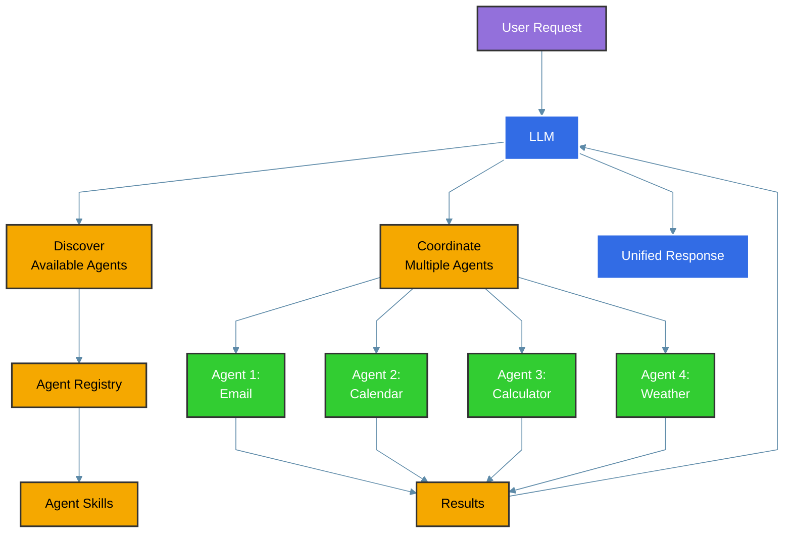

# Agent-To-Agent (A2A) Integration

The Inference Gateway supports **Agent-To-Agent (A2A)** integration, enabling Large Language Models (LLMs) to seamlessly coordinate with external specialized agents. This powerful feature allows LLMs to access and utilize a wide range of external tools and services through standardized agent interfaces.

## What is Agent-To-Agent (A2A)?

Agent-To-Agent (A2A) is a protocol that enables LLMs to discover, communicate with, and coordinate multiple specialized agents simultaneously. Each agent can provide specific capabilities (called "skills") that the LLM can automatically discover and use to fulfill user requests.

## Key Features

- **Automatic Agent Discovery**: The LLM automatically discovers available agents and their capabilities
- **Multi-Agent Coordination**: Coordinate multiple agents in a single conversation
- **Specialized Skills**: Each agent provides specialized tools for specific domains
- **Distributed Architecture**: Agents can run as separate services and scale independently
- **Natural Language Integration**: Users interact naturally while the LLM handles agent coordination
- **Protocol Standardization**: Based on standardized A2A protocol for interoperability

## How A2A Works



When a user makes a request:

1. **Request Analysis**: The LLM analyzes the user's request
2. **Agent Discovery**: Available agents and their skills are discovered
3. **Task Decomposition**: The request is broken down into tasks for specific agents
4. **Agent Coordination**: Multiple agents are called simultaneously or sequentially
5. **Result Integration**: Results from all agents are integrated into a coherent response

## Using A2A with the Inference Gateway CLI

The best way to use A2A is through the **Inference Gateway CLI**. The CLI provides seamless integration with A2A agents, allowing you to delegate specialized tasks to external agents directly from your chat sessions.

### Getting Started

First, install and initialize the CLI:

```bash
# Install the CLI
curl -fsSL https://raw.githubusercontent.com/inference-gateway/cli/main/install.sh | bash

# Initialize your project
infer init

# Start interactive chat
infer chat
```

### Adding A2A Agents

The CLI provides dedicated commands for managing A2A agents through the `infer agents` command.

> Browse available agents at [registry.inference-gateway.com](https://registry.inference-gateway.com)

```bash
# Initialize agents configuration
infer agents init

# Add a remote A2A agent
infer agents add <agent-name> <agent-url>

# Add a local agent with Docker support
infer agents add <agent-name> <agent-url> \
  --oci <oci-image> \
  --run

# Add an agent with environment variables
infer agents add <agent-name> <agent-url> \
  --environment KEY=value

# List configured agents
infer agents list

# Show details for a specific agent
infer agents show <agent-name>

# Remove an agent
infer agents remove <agent-name>
```

Agents can be configured at two levels:

- **Project-level**: `.infer/agents.yaml` - Agents specific to the current project
- **Userspace**: `~/.infer/agents.yaml` - Global agents available across all projects (use `--userspace` flag)

### Delegating Tasks to A2A Agents

Within the CLI, you can delegate specialized tasks to A2A agents. The CLI handles agent discovery, coordination, and result integration automatically.

```bash
infer chat
> "Schedule a team meeting for tomorrow at 2 PM using the calendar agent"
> "Check my calendar for conflicts this week"
```

For autonomous task execution with A2A agents:

```bash
infer agent "Analyze my calendar and suggest optimal meeting times for the team"
```

### A2A Tools

The CLI provides four A2A tools that LLMs can use to interact with agents:

- **A2A_QueryAgent**: Query agent capabilities and metadata for discovery
- **A2A_SubmitTask**: Submit tasks to specialized agents for processing
- **A2A_QueryTask**: Check the status and results of submitted tasks
- **A2A_DownloadArtifacts**: Download files and artifacts from completed tasks

### Viewing Connected Agents

During a chat session, you can use the `/a2a` shortcut to view all connected A2A agents and their capabilities:

```bash
infer chat
> /a2a
```

This displays information about each configured agent, including their available skills and status.

### Why Use the CLI for A2A?

The Inference Gateway CLI acts as an **A2A agent client**, providing a seamless interface for interacting with A2A-compatible agents. The CLI provides several advantages for A2A integration:

- **A2A Client Implementation**: The CLI implements the A2A client protocol, handling all communication with agents
- **Dedicated Agent Management**: Add, list, show, and remove agents with simple commands
- **Automatic Discovery**: Agents are discovered and coordinated automatically
- **Safety Controls**: Built-in approval workflows for sensitive operations
- **Interactive Experience**: Rich TUI with real-time feedback on agent interactions
- **Flexible Modes**: Switch between Standard, Plan, and Auto-Accept modes for different workflows
- **Docker Support**: Run agents locally with OCI image support

Learn more about the CLI in our [CLI Documentation](/cli).

## Available Agents

### Google Calendar Agent

The Google Calendar Agent provides comprehensive calendar management capabilities:

**Skills:**

- `list-events`: List calendar events for specified time periods
- `create-event`: Create new calendar events with natural language parsing
- `update-event`: Update existing calendar events
- `delete-event`: Delete calendar events

**Features:**

- Natural language date/time parsing ("tomorrow at 2pm", "next Monday")
- Smart attendee extraction ("meeting with John and Sarah")
- Location detection and parsing
- Google Calendar API integration

**Repository:** [github.com/inference-gateway/google-calendar-agent](https://github.com/inference-gateway/google-calendar-agent)

## Creating Custom Agents

To create your own A2A-compatible agent, implement these endpoints:

### Required Endpoints

- `/.well-known/agent.json` - Agent capabilities and metadata
- `/a2a` - Main A2A protocol endpoint
- `/health` - Health check endpoint

### Agent Capabilities Schema

Your agent must expose its capabilities via the `/.well-known/agent.json` endpoint:

```json
{
  "capabilities": {
    "skills": [
      {
        "id": "your-skill-id",
        "name": "Your Skill Name",
        "description": "Description of what your skill does"
      }
    ]
  }
}
```

### A2A Protocol Implementation

Implement the A2A protocol at the `/a2a` endpoint to handle:

- `message/send` - Send a message and receive response
- `message/stream` - Send a streaming message
- `task/get` - Get task status (optional)
- `task/cancel` - Cancel a running task (optional)

## Best Practices

### Agent Design

- **Single Responsibility**: Each agent should focus on a specific domain
- **Stateless Operations**: Design agents to be stateless for better scalability
- **Error Handling**: Implement robust error handling and fallback mechanisms
- **Documentation**: Clearly document agent capabilities and expected inputs

### Security

- **Authentication**: Implement proper authentication between gateway and agents
- **Input Validation**: Validate all inputs to prevent injection attacks
- **Rate Limiting**: Implement rate limiting to prevent abuse
- **Network Security**: Use secure communication channels (HTTPS/TLS)

### Performance

- **Caching**: Implement caching for frequently accessed data
- **Timeouts**: Set appropriate timeouts for agent communications
- **Load Balancing**: Use load balancing for high-availability deployments
- **Monitoring**: Monitor agent performance and availability

## Related Resources

- [Awesome A2A](https://github.com/inference-gateway/awesome-a2a)
- [A2A Protocol Specification](https://github.com/inference-gateway/inference-gateway/tree/main/a2a)
- [Inference Gateway CLI](/cli)
- [A2A Registry](https://registry.inference-gateway.com/) - Discover available A2A agents and their capabilities
