# Agent-To-Agent (A2A) Integration

The Inference Gateway now supports **Agent-To-Agent (A2A)** integration, enabling Large Language Models (LLMs) to seamlessly coordinate with external specialized agents. This powerful feature allows LLMs to access and utilize a wide range of external tools and services through standardized agent interfaces.

## What is Agent-To-Agent (A2A)?

Agent-To-Agent (A2A) is a protocol that enables LLMs to discover, communicate with, and coordinate multiple specialized agents simultaneously. Each agent can provide specific capabilities (called "skills") that the LLM can automatically discover and use to fulfill user requests.

## Key Features

- **🤖 Automatic Agent Discovery**: The LLM automatically discovers available agents and their capabilities
- **🔄 Multi-Agent Coordination**: Coordinate multiple agents in a single conversation
- **🛠️ Specialized Skills**: Each agent provides specialized tools for specific domains
- **🌐 Distributed Architecture**: Agents can run as separate services and scale independently
- **💬 Natural Language Integration**: Users interact naturally while the LLM handles agent coordination
- **🔌 Protocol Standardization**: Based on standardized A2A protocol for interoperability

## How A2A Works

```mermaid
%%{init: {'theme': 'base', 'themeVariables': { 'primaryColor': '#326CE5', 'primaryTextColor': '#fff', 'lineColor': '#5D8AA8', 'secondaryColor': '#006100' }, 'flowchart': { 'nodeSpacing': 50, 'rankSpacing': 80, 'curve': 'linear' }}}%%

graph TD
    A[👤 User Request] --> B[🧠 LLM]
    B --> C[🔍 Discover<br/>Available Agents]
    C --> D[📋 Agent Registry]
    D --> E[🤖 Agent Skills]
    B --> F[🎯 Coordinate<br/>Multiple Agents]
    F --> G[📧 Agent 1:<br/>Email]
    F --> H[📅 Agent 2:<br/>Calendar]
    F --> I[🧮 Agent 3:<br/>Calculator]
    F --> J[🌤️ Agent 4:<br/>Weather]
    G --> K[📤 Results]
    H --> K
    I --> K
    J --> K
    K --> B
    B --> L[✨ Unified Response]

    classDef user fill:#9370DB,stroke:#333,stroke-width:2px,color:white;
    classDef llm fill:#326CE5,stroke:#fff,stroke-width:2px,color:white;
    classDef agent fill:#32CD32,stroke:#333,stroke-width:2px,color:white;
    classDef system fill:#F5A800,stroke:#333,stroke-width:2px,color:black;

    class A user;
    class B,L llm;
    class G,H,I,J agent;
    class C,D,E,F,K system;
```



When a user makes a request:

1. **Request Analysis**: The LLM analyzes the user's request
2. **Agent Discovery**: Available agents and their skills are discovered
3. **Task Decomposition**: The request is broken down into tasks for specific agents
4. **Agent Coordination**: Multiple agents are called simultaneously or sequentially
5. **Result Integration**: Results from all agents are integrated into a coherent response

## Configuration

### Environment Variables

Enable A2A integration by setting these environment variables:

```bash
# Enable A2A protocol support
A2A_ENABLE=true

# Expose A2A endpoints for debugging and agent discovery
A2A_EXPOSE=true

# Comma-separated list of A2A agent URLs
# Note: Replace with actual agent URLs in production
A2A_AGENTS=http://google-calendar-agent:3003

# Example with multiple agents (replace with real implementations):
# A2A_AGENTS=http://google-calendar-agent:3003,http://your-custom-agent:3004

# A2A client timeout (default: 30s)
A2A_CLIENT_TIMEOUT=30s
```

### Docker Compose Example

> **Note**: This example shows how to configure multiple agents. Replace the example agents (helloworld-agent, calculator-agent, weather-agent) with your actual agent implementations. Only the Google Calendar Agent is currently available as a real implementation.

```yaml
version: '3.8'
services:
  inference-gateway:
    image: ghcr.io/inference-gateway/inference-gateway:latest
    ports:
      - '8080:8080'
    environment:
      - A2A_ENABLE=true
      - A2A_EXPOSE=true
      # Update with your actual agent URLs
      - A2A_AGENTS=http://google-calendar-agent:8084
      # Example with multiple agents:
      # - A2A_AGENTS=http://google-calendar-agent:8084,http://your-custom-agent:8085
      - DEEPSEEK_API_KEY=${DEEPSEEK_API_KEY}
    depends_on:
      - google-calendar-agent

  # Google Calendar Agent - Real implementation
  google-calendar-agent:
    image: ghcr.io/inference-gateway/google-calendar-agent:latest
    ports:
      - '8084:8084'
    environment:
      - GOOGLE_CALENDAR_SA_JSON=${GOOGLE_CALENDAR_SA_JSON}

  # Example agents for demonstration (not real implementations)
  # Replace these with your actual custom agents

  # helloworld-agent:
  #   image: your-registry/your-helloworld-agent:latest
  #   ports:
  #     - '8081:8081'

  # calculator-agent:
  #   image: your-registry/your-calculator-agent:latest
  #   ports:
  #     - '8082:8082'

  # weather-agent:
  #   image: your-registry/your-weather-agent:latest
  #   ports:
  #     - '8083:8083'
```

## Available Agents

> **Note**: The following agents are provided as examples to demonstrate A2A capabilities. Currently, only the **Google Calendar Agent** is a fully implemented and available agent. The other agents (Calculator, Weather, Hello World) serve as examples for developers to understand the A2A protocol and can be used as templates for creating custom agents.

### Google Calendar Agent

The Google Calendar Agent provides comprehensive calendar management capabilities and is the **only fully implemented agent** available:

**Skills:**

- `list-events`: List calendar events for specified time periods
- `create-event`: Create new calendar events with natural language parsing
- `update-event`: Update existing calendar events
- `delete-event`: Delete calendar events

**Features:**

- Natural language date/time parsing ("tomorrow at 2pm", "next Monday")
- Smart attendee extraction ("meeting with John and Sarah")
- Location detection and parsing
- Google Calendar API integration with fallback to mock service

### Calculator Agent (Example)

_This is an example agent for demonstration purposes._

Provides mathematical computation capabilities:

**Skills:**

- `add`: Add two numbers together
- `subtract`: Subtract one number from another
- `multiply`: Multiply two numbers together
- `divide`: Divide one number by another

### Weather Agent (Example)

_This is an example agent for demonstration purposes._

Provides weather information services:

**Skills:**

- `get_weather`: Get current weather information for a location
- `get_forecast`: Get weather forecast for a location

### Hello World Agent (Example)

_This is an example agent for demonstration purposes._

A simple demonstration agent:

**Skills:**

- `hello_world`: Returns a simple greeting message

## API Endpoints

### List Available Agents

Get information about all configured A2A agents and their capabilities:

```bash
curl -X GET http://localhost:8080/v1/a2a/agents
```

**Response:**

```json
{
  "agents": [
    {
      "url": "http://calculator-agent:8082",
      "capabilities": {
        "skills": [
          {
            "id": "add",
            "name": "Add Numbers",
            "description": "Add two numbers together"
          },
          {
            "id": "multiply",
            "name": "Multiply Numbers",
            "description": "Multiply two numbers together"
          }
        ]
      }
    },
    {
      "url": "http://google-calendar-agent:8084",
      "capabilities": {
        "skills": [
          {
            "id": "list-events",
            "name": "List Calendar Events",
            "description": "List calendar events for a specified time period"
          },
          {
            "id": "create-event",
            "name": "Create Calendar Event",
            "description": "Create new calendar events with natural language parsing"
          }
        ]
      }
    }
  ]
}
```

## Usage Examples

> **Note**: The following examples demonstrate A2A interactions. Replace the example agents with your actual implementations. Only interactions with the Google Calendar Agent will work with real functionality.

### Single Agent Interaction

Request a simple greeting from the Hello World agent (example):

```bash
curl -X POST http://localhost:8080/v1/chat/completions \
  -H "Content-Type: application/json" \
  -d '{
  "model": "deepseek/deepseek-chat",
  "messages": [
    {
      "role": "system",
      "content": "You are a helpful assistant."
    },
    {
      "role": "user",
      "content": "Say hello using the hello world agent."
    }
  ]
}'
```

### Mathematical Calculations (Example)

Use the calculator agent for mathematical operations (example agent):

```bash
curl -X POST http://localhost:8080/v1/chat/completions \
  -H "Content-Type: application/json" \
  -d '{
  "model": "deepseek/deepseek-chat",
  "messages": [
    {
      "role": "system",
      "content": "You are a helpful assistant with access to mathematical tools."
    },
    {
      "role": "user",
      "content": "Calculate the result of 15 + 27 * 3."
    }
  ]
}'
```

### Weather Information (Example)

Get current weather information using the weather agent (example agent):

```bash
curl -X POST http://localhost:8080/v1/chat/completions \
  -H "Content-Type: application/json" \
  -d '{
  "model": "deepseek/deepseek-chat",
  "messages": [
    {
      "role": "system",
      "content": "You are a helpful assistant with access to weather information."
    },
    {
      "role": "user",
      "content": "What is the current weather in New York?"
    }
  ]
}'
```

### Calendar Management (Real Implementation)

Manage calendar events using the Google Calendar agent (this works with the actual implementation):

```bash
curl -X POST http://localhost:8080/v1/chat/completions \
  -H "Content-Type: application/json" \
  -d '{
  "model": "deepseek/deepseek-chat",
  "messages": [
    {
      "role": "system",
      "content": "You are a helpful assistant with access to calendar management tools."
    },
    {
      "role": "user",
      "content": "Schedule a team meeting tomorrow at 2 PM for 1 hour."
    }
  ]
}'
```

### Multi-Agent Coordination (Mixed Example)

The real power of A2A comes from coordinating multiple agents in a single request. **Note**: This example mixes real (Google Calendar) and example agents:

```bash
curl -X POST http://localhost:8080/v1/chat/completions \
  -H "Content-Type: application/json" \
  -d '{
  "model": "deepseek/deepseek-chat",
  "messages": [
    {
      "role": "system",
      "content": "You are a helpful assistant with access to multiple specialized agents."
    },
    {
      "role": "user",
      "content": "Check my calendar for today and schedule a meeting tomorrow at 2 PM."
    }
  ]
}'
```

In this example, the LLM will:

1. Use the Google Calendar agent to check today's events (real functionality)
2. Use the Google Calendar agent to schedule the meeting (real functionality)

For a fully functional multi-agent setup, you would need to implement additional custom agents based on your requirements.

## Creating Custom Agents

To create your own A2A-compatible agent, implement these endpoints:

### Required Endpoints

- `/.well-known/agent.json` - Agent capabilities and metadata
- `/a2a` - Main A2A protocol endpoint
- `/health` - Health check endpoint

### Agent Capabilities Schema

Your agent must expose its capabilities via the `/.well-known/agent.json` endpoint:

```json
{
  "capabilities": {
    "skills": [
      {
        "id": "your-skill-id",
        "name": "Your Skill Name",
        "description": "Description of what your skill does"
      }
    ]
  }
}
```

### A2A Protocol Implementation

Implement the A2A protocol at the `/a2a` endpoint to handle:

- `message/send` - Send a message and receive response
- `message/stream` - Send a streaming message
- `task/get` - Get task status (optional)
- `task/cancel` - Cancel a running task (optional)

## Kubernetes Deployment

Deploy A2A agents in Kubernetes environments:

```yaml
apiVersion: apps/v1
kind: Deployment
metadata:
  name: calendar-agent
  namespace: inference-gateway
spec:
  replicas: 2
  selector:
    matchLabels:
      app: calendar-agent
  template:
    metadata:
      labels:
        app: calendar-agent
    spec:
      containers:
        - name: calendar-agent
          image: ghcr.io/inference-gateway/google-calendar-agent:latest
          ports:
            - containerPort: 8080
          env:
            - name: GOOGLE_CALENDAR_SA_JSON
              valueFrom:
                secretKeyRef:
                  name: google-credentials
                  key: service-account.json
---
apiVersion: v1
kind: Service
metadata:
  name: calendar-agent
  namespace: inference-gateway
spec:
  selector:
    app: calendar-agent
  ports:
    - port: 8080
      targetPort: 8080
```

## Best Practices

### Agent Design

- **Single Responsibility**: Each agent should focus on a specific domain
- **Stateless Operations**: Design agents to be stateless for better scalability
- **Error Handling**: Implement robust error handling and fallback mechanisms
- **Documentation**: Clearly document agent capabilities and expected inputs

### Security

- **Authentication**: Implement proper authentication between gateway and agents
- **Input Validation**: Validate all inputs to prevent injection attacks
- **Rate Limiting**: Implement rate limiting to prevent abuse
- **Network Security**: Use secure communication channels (HTTPS/TLS)

### Performance

- **Caching**: Implement caching for frequently accessed data
- **Timeouts**: Set appropriate timeouts for agent communications
- **Load Balancing**: Use load balancing for high-availability deployments
- **Monitoring**: Monitor agent performance and availability

## Troubleshooting

### Common Issues

#### Agents Not Discovered

- Verify `A2A_ENABLE=true` is set
- Check that agent URLs in `A2A_AGENTS` are accessible
- Ensure agents expose the `/.well-known/agent.json` endpoint

#### Connection Timeouts

- Adjust `A2A_CLIENT_TIMEOUT` setting
- Check network connectivity between gateway and agents
- Verify agent health endpoints are responding

#### Agent Communication Failures

- Check agent logs for errors
- Verify A2A protocol implementation in custom agents
- Test agent endpoints directly with curl

### Debugging

Enable debug logging for A2A operations:

```bash
A2A_EXPOSE=true
LOG_LEVEL=debug
```

Then check agent discovery:

```bash
curl -X GET http://localhost:8080/v1/a2a/agents
```

## Future Enhancements

The A2A integration is continuously evolving. Planned enhancements include:

- **Agent Marketplace**: Discover and install agents from a central marketplace
- **Advanced Routing**: Intelligent routing based on agent capabilities and load
- **Agent Composition**: Combine multiple agents into composite workflows
- **Enhanced Security**: Advanced authentication and authorization mechanisms
- **Monitoring Dashboard**: Visual monitoring and management of agent ecosystems

## Related Resources

- [Awesome A2A](https://github.com/inference-gateway/awesome-a2a)
  - [Google Calendar Agent Repository](https://github.com/inference-gateway/google-calendar-agent)
- [A2A Protocol Specification](https://github.com/inference-gateway/inference-gateway/tree/main/a2a)
- [Example Agents](https://github.com/inference-gateway/inference-gateway/tree/main/examples/docker-compose/a2a)
- [Kubernetes Examples](https://github.com/inference-gateway/inference-gateway/tree/main/examples/kubernetes)
