# Architecture Overview

This document provides a high-level overview of the architecture of the Inference Gateway. The Inference-Gateway is designed to be modular and extensible, allowing easy integration of new models and providers.

## General Overview

```mermaid
%%{init: {'theme': 'base', 'themeVariables': { 'primaryColor': '#326CE5', 'primaryTextColor': '#fff', 'lineColor': '#5D8AA8', 'secondaryColor': '#006100' }, 'fontFamily': 'Arial', 'flowchart': {'nodeSpacing': 50, 'rankSpacing': 70, 'padding': 15}}}%%


graph TD
    %% Client nodes
    A["👥 Clients / 🤖 Agents"] --> |POST /v1/chat/completions| Auth

    %% Auth node
    Auth["🔒 Optional OIDC"] --> |Auth?| IG1
    Auth --> |Auth?| IG2
    Auth --> |Auth?| IG3

    %% Gateway nodes
    IG1["🖥️ Inference Gateway"] --> P
    IG2["🖥️ Inference Gateway"] --> P
    IG3["🖥️ Inference Gateway"] --> P

    %% Proxy and providers
    P["🔌 Proxy Gateway"] --> C["🦙 Ollama"]
    P --> D["🚀 Groq"]
    P --> E["☁️ OpenAI"]
    P --> G["⚡ Cloudflare"]
    P --> H1["💬 Cohere"]
    P --> H2["🧠 Anthropic"]
    P --> H3["🐋 DeepSeek"]
    P --> H4["🌟 Mistral"]
    P --> H5["🌙 Moonshot"]

    %% Define styles
    classDef client fill:#9370DB,stroke:#333,stroke-width:1px,color:white;
    classDef auth fill:#F5A800,stroke:#333,stroke-width:1px,color:black;
    classDef gateway fill:#326CE5,stroke:#fff,stroke-width:1px,color:white;
    classDef provider fill:#32CD32,stroke:#333,stroke-width:1px,color:white;

    %% Apply styles
    class A client;
    class Auth auth;
    class IG1,IG2,IG3,P gateway;
    class C,D,E,G,H1,H2,H3,H4,H5 provider;
```

## Kubernetes Setup

The Inference Gateway is designed to run on Kubernetes. The following diagram shows the high-level architecture of the Inference Gateway running on Kubernetes.

