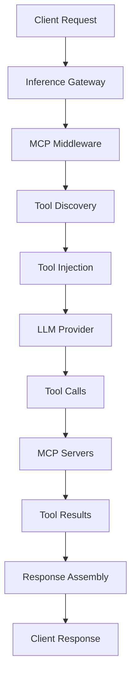

import Link from 'next/link';

# Model Context Protocol (MCP) Integration

The Inference Gateway supports **Model Context Protocol (MCP)** integration, enabling seamless access to external tools and data sources for Large Language Models (LLMs). This powerful feature automatically discovers and provides tools to LLMs without requiring clients to manage them individually.

## What is Model Context Protocol?

The [Model Context Protocol](https://modelcontextprotocol.io/) is an open standard that enables AI applications to securely access external data sources and tools. It provides a unified way for LLMs to interact with:

- **File systems** - Read, write, and manage files
- **Databases** - Query and manipulate data
- **APIs** - Access external services and data
- **Search engines** - Retrieve information from the web
- **Development tools** - Git operations, code analysis, and more

## Key Features

- 🔌 **Automatic Tool Discovery**: MCP servers are automatically discovered and their tools are made available to LLMs
- 🛠️ **Multi-Server Support**: Connect to multiple MCP servers simultaneously
- 🔄 **Dynamic Tool Injection**: Tools are automatically injected into LLM requests based on available MCP servers
- 🎯 **Seamless Execution**: Tool calls are executed transparently and results returned to the LLM
- 🚀 **Zero Client Configuration**: Clients don't need to know about or manage individual tools
- 📊 **Built-in Monitoring**: Full observability through OpenTelemetry integration

## How It Works



1. **Request Processing**: Client sends a chat completion request
2. **Tool Discovery**: Gateway discovers available tools from all connected MCP servers
3. **Tool Injection**: Available tools are automatically added to the LLM request
4. **LLM Processing**: LLM decides which tools to use based on the request
5. **Tool Execution**: Gateway executes tool calls via MCP protocol
6. **Result Integration**: Tool results are integrated into the conversation
7. **Response Delivery**: Complete response is returned to the client

## Configuration

### Environment Variables

Enable MCP integration by setting these environment variables:

```bash
# Enable MCP middleware
MCP_ENABLE=true

# Expose MCP endpoints for debugging
MCP_EXPOSE=true

# Comma-separated list of MCP server URLs
MCP_SERVERS="http://time-server:8081/mcp,http://search-server:8082/mcp,http://filesystem-server:8083/mcp"

# Timeout configurations (optional)
MCP_CLIENT_TIMEOUT=10s
MCP_DIAL_TIMEOUT=5s
MCP_TLS_HANDSHAKE_TIMEOUT=5s
MCP_RESPONSE_HEADER_TIMEOUT=5s
MCP_EXPECT_CONTINUE_TIMEOUT=2s
MCP_REQUEST_TIMEOUT=10s
```

### Using Docker Compose

```yaml
version: '3.8'
services:
  inference-gateway:
    image: ghcr.io/inference-gateway/inference-gateway:latest
    environment:
      - MCP_ENABLE=true
      - MCP_EXPOSE=true
      - MCP_SERVERS=http://mcp-time-server:8081/mcp,http://mcp-search-server:8082/mcp
      - GROQ_API_KEY=${GROQ_API_KEY}
    ports:
      - '8080:8080'
    depends_on:
      - mcp-time-server
      - mcp-search-server

  mcp-time-server:
    image: mcp/time-server:latest
    ports:
      - '8081:8081'

  mcp-search-server:
    image: mcp/search-server:latest
    ports:
      - '8082:8082'
```

### Using Kubernetes

When deploying with the Inference Gateway Helm chart, configure MCP in your `values.yaml`:

```yaml
env:
  MCP_ENABLE: 'true'
  MCP_EXPOSE: 'true'
  MCP_SERVERS: 'http://mcp-time-server:8081/mcp,http://mcp-search-server:8082/mcp'
  MCP_CLIENT_TIMEOUT: '10s'
  MCP_REQUEST_TIMEOUT: '10s'
```

## Usage Examples

### Basic Usage

Once configured, MCP tools are automatically available to all LLM requests:

```bash
curl -X POST http://localhost:8080/v1/chat/completions \\
  -H "Content-Type: application/json" \\
  -d '{
    "model": "gpt-4o",
    "messages": [
      {
        "role": "user",
        "content": "What time is it and create a file called hello.txt with greeting message?"
      }
    ]
  }'
```

### With Streaming

MCP works seamlessly with streaming responses:

```bash
curl -X POST http://localhost:8080/v1/chat/completions \\
  -H "Content-Type: application/json" \\
  -d '{
    "model": "gpt-4o",
    "messages": [
      {
        "role": "user",
        "content": "Search for information about Model Context Protocol and summarize it"
      }
    ],
    "stream": true
  }'
```

### Multiple Tool Usage

LLMs can use multiple tools in a single conversation:

```bash
curl -X POST http://localhost:8080/v1/chat/completions \\
  -H "Content-Type: application/json" \\
  -d '{
    "model": "groq/meta-llama/llama-4-scout-17b-16e-instruct",
    "messages": [
      {
        "role": "system",
        "content": "You are a helpful assistant with access to various tools."
      },
      {
        "role": "user",
        "content": "Check the current time, search for recent news about AI, and save a summary to a file named daily-ai-update.txt"
      }
    ]
  }'
```

## Available MCP Endpoints

When `MCP_EXPOSE=true`, the gateway exposes additional endpoints for debugging:

### List Available Tools

```bash
GET /v1/mcp/tools
```

Returns all available tools from connected MCP servers:

```json
{
  "tools": [
    {
      "name": "get_time",
      "description": "Get current time in various formats",
      "server": "http://time-server:8081/mcp",
      "inputSchema": {
        "type": "object",
        "properties": {
          "format": {
            "type": "string",
            "description": "Time format (ISO, human-readable, etc.)"
          }
        }
      }
    },
    {
      "name": "search",
      "description": "Perform web search",
      "server": "http://search-server:8082/mcp",
      "inputSchema": {
        "type": "object",
        "properties": {
          "query": {
            "type": "string",
            "description": "Search query"
          }
        },
        "required": ["query"]
      }
    }
  ]
}
```

### Check MCP Server Health

```bash
GET /v1/mcp/health
```

Returns the health status of all connected MCP servers.

## Common MCP Server Types

### Filesystem Server

Provides file and directory operations:

- **read_file**: Read content from files
- **write_file**: Write content to files (supports overwrite and append)
- **delete_file**: Delete files
- **list_directory**: List directory contents (supports recursive listing)
- **create_directory**: Create directories
- **file_exists**: Check if files or directories exist
- **file_info**: Get detailed file/directory information

### Search Server

Provides web search capabilities:

- **search**: Perform web searches for information
- **find_info**: Find specific information on topics

### Time Server

Provides time-related utilities:

- **get_time**: Get current time in various formats
- **get_timezone**: Get timezone information
- **time_difference**: Calculate time differences

### Database Server

Provides database access:

- **query**: Execute SQL queries
- **insert**: Insert data into tables
- **update**: Update existing records
- **delete**: Delete records

## Error Handling

The MCP middleware includes comprehensive error handling:

- **Connection Failures**: Graceful fallback when MCP servers are unavailable
- **Tool Execution Errors**: Detailed error messages returned to LLMs
- **Timeout Handling**: Configurable timeouts prevent hanging requests
- **Retry Logic**: Automatic retries for transient failures

## Security Considerations

### Production Deployment

⚠️ **Important**: The example MCP servers provided in the repository are for demonstration only. For production deployments:

1. **Implement Authentication**: Use proper authentication mechanisms
2. **Add Authorization**: Implement role-based access control
3. **Input Validation**: Validate and sanitize all inputs
4. **Rate Limiting**: Implement rate limiting to prevent abuse
5. **Audit Logging**: Log all tool executions for security monitoring
6. **Network Security**: Use TLS for all MCP communications
7. **Sandboxing**: Isolate MCP servers and limit their capabilities

## Debugging and Monitoring

### MCP Inspector

Use the [MCP Inspector](https://github.com/modelcontextprotocol/inspector) for debugging:

```bash
# Access the inspector (when included in deployment)
open http://localhost:6274
```

The inspector provides:

- Server connection status
- Available tools exploration
- Interactive tool testing
- Protocol message monitoring

### Logging

Enable debug logging for MCP operations:

```bash
LOG_LEVEL=debug
```

This will log:

- MCP server connections
- Tool discovery events
- Tool execution details
- Error conditions

### Metrics

MCP middleware exposes metrics through OpenTelemetry:

- `mcp_requests_total`: Total MCP requests
- `mcp_request_duration`: Request duration
- `mcp_tool_calls_total`: Total tool calls
- `mcp_errors_total`: Total errors

## Examples and Tutorials

### Docker Compose Example

See the complete [Docker Compose MCP example](https://github.com/inference-gateway/inference-gateway/tree/main/examples/docker-compose/mcp) that includes:

- Inference Gateway with MCP enabled
- Multiple MCP servers (time, search, filesystem)
- MCP Inspector for debugging
- Ready-to-run configuration

### Kubernetes Example

See the [Kubernetes MCP example](https://github.com/inference-gateway/inference-gateway/tree/main/examples/kubernetes/mcp) that demonstrates:

- Helm chart deployment with MCP configuration
- Multiple MCP servers as Kubernetes services
- Ingress configuration
- Comprehensive monitoring setup

### Custom MCP Server

To create your own MCP server, implement the [MCP specification](https://modelcontextprotocol.io/specification):

```python
# Example Python MCP server structure
from mcp.server import Server
from mcp.tools import Tool

server = Server("my-custom-server")

@server.tool("my_tool")
def my_tool(param1: str, param2: int) -> str:
    """Description of what this tool does."""
    # Tool implementation
    return f"Result: {param1} - {param2}"

if __name__ == "__main__":
    server.run()
```

## Troubleshooting

### Common Issues

#### MCP Server Connection Failed

```bash
# Check if MCP server is running
curl http://mcp-server:8081/mcp/health

# Verify network connectivity
kubectl exec -it inference-gateway-pod -- curl http://mcp-server:8081/mcp
```

#### Tools Not Appearing

1. Verify `MCP_ENABLE=true`
2. Check `MCP_SERVERS` configuration
3. Ensure MCP servers are accessible
4. Check logs for connection errors

#### Tool Execution Timeouts

Increase timeout values:

```bash
MCP_REQUEST_TIMEOUT=30s
MCP_CLIENT_TIMEOUT=30s
```

### Health Checks

Monitor MCP integration health:

```bash
# Check gateway health
curl http://localhost:8080/health

# Check MCP-specific health (if MCP_EXPOSE=true)
curl http://localhost:8080/v1/mcp/health

# List available tools
curl http://localhost:8080/v1/mcp/tools
```

## Best Practices

1. **Start Simple**: Begin with one or two MCP servers and gradually add more
2. **Monitor Performance**: Track tool execution times and success rates
3. **Implement Fallbacks**: Design your system to work even if some MCP servers are unavailable
4. **Version Management**: Use proper versioning for your MCP servers
5. **Documentation**: Document your custom tools and their expected inputs/outputs
6. **Testing**: Thoroughly test tool interactions before production deployment

## Learn More

- [Model Context Protocol Documentation](https://modelcontextprotocol.io/)
- [MCP Specification](https://modelcontextprotocol.io/specification)
- [Docker Compose Example](https://github.com/inference-gateway/inference-gateway/tree/main/examples/docker-compose/mcp)
- [Kubernetes Example](https://github.com/inference-gateway/inference-gateway/tree/main/examples/kubernetes/mcp)
- [Inference Gateway Repository](https://github.com/inference-gateway/inference-gateway)

Ready to get started? Try our <Link href="/examples">examples</Link> or check out the <Link href="/getting-started">Getting Started guide</Link> to set up your first MCP-enabled Inference Gateway.
