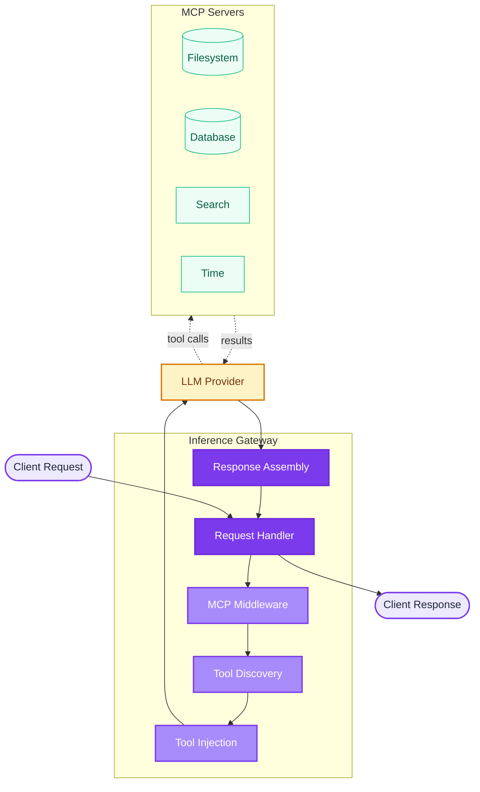

# Model Context Protocol (MCP) Integration

The Inference Gateway supports **Model Context Protocol (MCP)** integration, enabling seamless access to external tools and data sources for Large Language Models (LLMs). This powerful feature automatically discovers and provides tools to LLMs without requiring clients to manage them individually.

## What is Model Context Protocol?

The [Model Context Protocol](https://modelcontextprotocol.io/) is an open standard that enables AI applications to securely access external data sources and tools. It provides a unified way for LLMs to interact with:

- **File systems** - Read, write, and manage files
- **Databases** - Query and manipulate data
- **APIs** - Access external services and data
- **Search engines** - Retrieve information from the web
- **Development tools** - Git operations, code analysis, and more

## Key Features

- **Automatic Tool Discovery**: MCP servers are automatically discovered and their tools are made available to LLMs
- **Multi-Server Support**: Connect to multiple MCP servers simultaneously
- **Gateway as an MCP Server**: A single JSON-RPC `POST /mcp` endpoint aggregates every configured MCP server, so MCP clients configure one entry instead of one per server
- **Per-Server Namespacing**: Tools are named `mcp_<server alias>_<tool name>`, so two servers can expose the same tool name without colliding
- **Dynamic Tool Injection**: Tools are automatically injected into LLM requests based on available MCP servers
- **Two Exposure Modes**: Choose between **selector** mode (default) with two meta-tools for discovery and dispatch, or **direct** mode for full schema injection
- **Seamless Execution**: Tool calls are executed transparently and results returned to the LLM
- **Zero Client Configuration**: Clients don't need to know about or manage individual tools
- **Built-in Monitoring**: Full observability through OpenTelemetry integration

## How It Works



1. **Request Processing**: Client sends a chat completion request
2. **Tool Discovery**: Gateway discovers available tools from all connected MCP servers
3. **Tool Injection**: Available tools are automatically added to the LLM request
4. **LLM Processing**: LLM decides which tools to use based on the request
5. **Tool Execution**: Gateway executes tool calls via MCP protocol
6. **Result Integration**: Tool results are integrated into the conversation
7. **Response Delivery**: Complete response is returned to the client

## Configuration

> **Gateway-level vs agent-level MCP.** This page covers MCP on the **Inference Gateway** itself, configured through `MCP_*` environment variables (or the Operator's `Gateway` `spec.mcp` block). An individual [ADL](/adl/) agent has its own MCP client, declared in its `agent.yaml` manifest under [`spec.agent.mcp`](/adl-cli/#mcp-servers) - that connects the agent directly to MCP servers, independently of the gateway.

### Environment Variables

Enable MCP integration by setting these environment variables:

```bash
# Enable MCP middleware
MCP_ENABLED=true

# Expose the gateway itself as an MCP server on POST /mcp
MCP_EXPOSE=true

# Comma-separated list of MCP servers as alias=url
# Without "alias=", the alias is derived from the URL host
MCP_SERVERS="time=http://time-server:8081/mcp,search=http://search-server:8082/mcp,files=http://filesystem-server:8083/mcp"

# Tool filtering (optional)
# Allowlist of tool names to inject - if empty, all discovered tools are injected
MCP_INCLUDE_TOOLS=""
# Denylist of tool names to skip - takes lower precedence than MCP_INCLUDE_TOOLS
MCP_EXCLUDE_TOOLS=""

# Tool exposure mode (optional)
# selector (default): injects two meta-tools (mcp_tools_get, mcp_tools_execute)
# direct: injects every tool schema into every request
MCP_TOOL_MODE=selector

# Timeout configurations (optional)
MCP_CLIENT_TIMEOUT=10s
MCP_DIAL_TIMEOUT=5s
MCP_TLS_HANDSHAKE_TIMEOUT=5s
MCP_RESPONSE_HEADER_TIMEOUT=5s
MCP_EXPECT_CONTINUE_TIMEOUT=2s
MCP_REQUEST_TIMEOUT=10s
```

### Using Docker Compose

```yaml
version: '3.8'
services:
  inference-gateway:
    image: ghcr.io/inference-gateway/inference-gateway:latest
    environment:
      - MCP_ENABLED=true
      - MCP_EXPOSE=true
      - MCP_SERVERS=time=http://mcp-time-server:8081/mcp,search=http://mcp-search-server:8082/mcp
      - GROQ_API_KEY=${GROQ_API_KEY}
    ports:
      - '8080:8080'
    depends_on:
      - mcp-time-server
      - mcp-search-server

  mcp-time-server:
    image: mcp/time-server:latest
    ports:
      - '8081:8081'

  mcp-search-server:
    image: mcp/search-server:latest
    ports:
      - '8082:8082'
```

### Using Kubernetes

On Kubernetes, run the gateway with the [Kubernetes Operator](/operator/) and configure MCP through the `Gateway` resource's `spec.mcp` block - see [MCP Servers (`spec.mcp`)](/operator/#mcp-servers-spec-mcp):

```yaml
spec:
  mcp:
    enabled: true
    expose: true
    servers:
      - name: time
        url: http://mcp-time-server:8081/mcp
      - name: search
        url: http://mcp-search-server:8082/mcp
    timeouts:
      client: 10s
      request: 10s
```

The operator renders each entry as `name=url`, so `spec.mcp.servers[].name` is the alias that namespaces that server's tools. Servers picked up through `spec.mcp.serviceDiscovery` use the `MCP` CR's `metadata.name` as their alias. `status.mcpServers` on the `Gateway` mirrors the resulting `MCP_SERVERS` value.

Without the operator, set the same settings as environment variables on the pod:

```yaml
env:
  MCP_ENABLED: 'true'
  MCP_EXPOSE: 'true'
  MCP_SERVERS: 'time=http://mcp-time-server:8081/mcp,search=http://mcp-search-server:8082/mcp'
  MCP_CLIENT_TIMEOUT: '10s'
  MCP_REQUEST_TIMEOUT: '10s'
```

### Server Aliases and Tool Namespacing

Each entry in `MCP_SERVERS` carries an **alias** that namespaces the tools it provides. Tools are exposed to models - and over the [`/mcp` endpoint](#gateway-as-an-mcp-server) - as `mcp_<alias>_<tool name>`:

```bash
# Explicit aliases
MCP_SERVERS="deepwiki=https://mcp.deepwiki.com/mcp,time=http://mcp-time-server:8081/mcp"

# Mixed: the second entry derives its alias from the URL host
MCP_SERVERS="deepwiki=https://mcp.deepwiki.com/mcp,http://mcp-time-server:8081/mcp"
```

With that configuration, DeepWiki's `ask_question` tool reaches the model as `mcp_deepwiki_ask_question`.

Rules:

- **Explicit alias** - write `alias=url`. Omit it and the alias is derived from the URL host.
- **Format** - aliases must match `^[a-z0-9_-]+$`, so the resulting tool name stays valid across all LLM providers.
- **Uniqueness** - an invalid or duplicate alias fails startup with an actionable error rather than silently shadowing a server.
- **Reserved names** - `mcp_tools_get` and `mcp_tools_execute` belong to the gateway's selector meta-tools, so an alias of `tools` is rejected.

On Kubernetes the aliases come from the `Gateway` resource instead of a hand-written string: `spec.mcp.servers[].name` for static servers, and the discovered `MCP` CR's `metadata.name` for `spec.mcp.serviceDiscovery`. A name that breaks the rules above is rendered as a bare URL rather than failing the reconcile, so the gateway falls back to the host-derived alias - see [MCP Servers (`spec.mcp`)](/operator/#mcp-servers-spec-mcp).

Namespacing is what makes two servers exposing the same tool name both work: tool calls are routed by alias instead of scanning every server for a matching name.

### Filtering Injected Tools

By default every tool discovered across all connected MCP servers is injected into LLM requests. Use `MCP_INCLUDE_TOOLS` and `MCP_EXCLUDE_TOOLS` to narrow that set - for example to hide destructive operations or to expose only a curated toolset. Both accept a comma-separated list of tool names and default to empty:

- **`MCP_INCLUDE_TOOLS`** - allowlist. When empty (the default), all discovered tools are injected. When set, only the listed tools are injected.
- **`MCP_EXCLUDE_TOOLS`** - denylist. When empty (the default), no tools are excluded. When set, the listed tools are skipped.

`MCP_INCLUDE_TOOLS` takes precedence over `MCP_EXCLUDE_TOOLS`: when both are set, the allowlist is applied and the denylist is ignored.

```bash
# Inject only the time and search tools, ignore everything else
MCP_INCLUDE_TOOLS="get_time,search"

# Inject all discovered tools except the destructive filesystem ones
MCP_EXCLUDE_TOOLS="delete_file,write_file"
```

Matching accepts either form of the name - the bare tool name or the fully namespaced one - so `read_wiki_structure` and `deepwiki_read_wiki_structure` both select the same tool. Use the namespaced form when two servers expose the same tool name and you only want one of them:

```bash
# Only DeepWiki's search, not the search server's
MCP_INCLUDE_TOOLS="deepwiki_search"
```

Tool names match those reported by the [`tools/list`](#listing-tools) method of the `/mcp` endpoint (available when `MCP_EXPOSE=true`).

### Tool Exposure Mode

`MCP_TOOL_MODE` controls how MCP tool schemas are presented to the LLM. It accepts two values:

- **`selector`** (default) - The model sees exactly two gateway-defined meta-tools instead of every individual tool schema. Discovery and dispatch happen server-side, reducing request size significantly for deployments with many tools (benchmarked ~23x smaller for 50 tools). The meta-tools are:

  - **`mcp_tools_get`** - Lists available tools. With no arguments returns a compact catalog (namespaced name, description, server alias). Pass `names` to get full input schemas for specific tools. Honors `MCP_INCLUDE_TOOLS` / `MCP_EXCLUDE_TOOLS`.
  - **`mcp_tools_execute`** - Calls a tool by name on the correct MCP server. The gateway unwraps the call so guardrails evaluate the underlying tool name and arguments.

- **`direct`** - Restores the previous behavior: every tool schema from every connected MCP server is injected into every chat completion request. Per Anthropic guidance, this is fine for small tool sets (under ~10 tools) but grows request size linearly with each tool.

In selector mode, `MCP_INCLUDE_TOOLS` and `MCP_EXCLUDE_TOOLS` control which tools the model can discover through `mcp_tools_get` and execute through `mcp_tools_execute`.

A catalog returned by `mcp_tools_get` reports the namespaced name and the server alias:

```json
{
  "tools": [
    {
      "name": "mcp_deepwiki_ask_question",
      "description": "Ask a question about a GitHub repository",
      "server": "deepwiki"
    },
    {
      "name": "mcp_time_get_time",
      "description": "Get the current time in a given timezone",
      "server": "time"
    }
  ]
}
```

`mcp_tools_execute` takes that same namespaced name, which is what routes the call to the right server:

```json
{
  "name": "mcp_time_get_time",
  "arguments": { "timezone": "UTC" }
}
```

## Usage Examples

### Basic Usage

Once configured, MCP tools are automatically available to all LLM requests:

```bash
curl -X POST http://localhost:8080/v1/chat/completions \
  -H "Content-Type: application/json" \
  -d '{
    "model": "deepseek/deepseek-v4-flash",
    "messages": [
      {
        "role": "user",
        "content": "What time is it and create a file called hello.txt with greeting message?"
      }
    ]
  }'
```

### With Streaming

MCP works seamlessly with streaming responses:

```bash
curl -X POST http://localhost:8080/v1/chat/completions \
  -H "Content-Type: application/json" \
  -d '{
    "model": "deepseek/deepseek-v4-flash",
    "messages": [
      {
        "role": "user",
        "content": "Search for information about Model Context Protocol and summarize it"
      }
    ],
    "stream": true
  }'
```

### Multiple Tool Usage

LLMs can use multiple tools in a single conversation:

```bash
curl -X POST http://localhost:8080/v1/chat/completions \
  -H "Content-Type: application/json" \
  -d '{
    "model": "groq/meta-llama/llama-4-scout-17b-16e-instruct",
    "messages": [
      {
        "role": "system",
        "content": "You are a helpful assistant with access to various tools."
      },
      {
        "role": "user",
        "content": "Check the current time, search for recent news about AI, and save a summary to a file named daily-ai-update.txt"
      }
    ]
  }'
```

## Gateway as an MCP Server

Besides injecting tools into chat completions, the gateway can act as an **MCP server itself**. When `MCP_ENABLED=true` and `MCP_EXPOSE=true`, it serves a stateless JSON-RPC 2.0 endpoint speaking MCP `2026-07-28` at:

```bash
POST /mcp
```

Every server in `MCP_SERVERS` is aggregated behind that single URL, so an MCP client (opencode, `infer`, IDE assistants) declares **one** entry and gets the whole fleet - with the gateway's auth, metrics, and guardrails applied to every tool call, and no client config churn when a backend server is added or removed.

The endpoint lives at the **root**, not under `/v1`: `/v1/*` is the OpenAI-compatible surface, while MCP is its own protocol and clients expect a plain `/mcp`.

### Protocol Version and Headers

The endpoint speaks MCP `2026-07-28` **only**, over the stateless Streamable HTTP transport with `application/json` responses. There is no `initialize` handshake and no session: every request stands alone and carries its own context.

Each request repeats that context in both the body and the headers:

- `params._meta` is a `RequestMetaObject` carrying `io.modelcontextprotocol/protocolVersion`, `io.modelcontextprotocol/clientInfo` and `io.modelcontextprotocol/clientCapabilities`.
- `MCP-Protocol-Version` (required) must equal `params._meta["io.modelcontextprotocol/protocolVersion"]`.
- `Mcp-Method` (required) must equal the JSON-RPC `method`.
- `Mcp-Name` (required for `tools/call`) must equal `params.name`. Non-ASCII values use the `=?base64?<value>?=` encoding.

A missing, malformed, or disagreeing header answers `400` with JSON-RPC code `-32020` - so any proxy in front of the gateway must forward these headers unchanged. A legacy `initialize` request lands in the same error.

Every result carries `resultType: "complete"` and identifies the gateway in `_meta["io.modelcontextprotocol/serverInfo"]`.

### Supported Methods

| Method            | Params                                    | Result                                                                       |
| ----------------- | ----------------------------------------- | ---------------------------------------------------------------------------- |
| `server/discover` | `_meta` only                              | `supportedVersions` (`["2026-07-28"]`) and `capabilities` (`tools`)          |
| `tools/list`      | `_meta`, optional `cursor`                | `ListToolsResult` - the aggregated, namespaced tools of every healthy server |
| `tools/call`      | `_meta`, `name` (namespaced), `arguments` | `CallToolResult`                                                             |

Param and result shapes are the [MCP specification](https://modelcontextprotocol.io/specification) types; the gateway only wraps them in JSON-RPC envelopes.

Transport is plain JSON request/response: one JSON-RPC message per `POST`, one JSON body back. There is no SSE response stream, no standalone `GET` stream and no session to delete - `GET /mcp` and `DELETE /mcp` answer `405`.

### Discovering the Server

`server/discover` replaces the old handshake. It takes nothing but `_meta` and reports which protocol versions and capabilities the gateway supports:

```bash
curl -X POST http://localhost:8080/mcp \
  -H "Content-Type: application/json" \
  -H "MCP-Protocol-Version: 2026-07-28" \
  -H "Mcp-Method: server/discover" \
  -d '{
    "jsonrpc": "2.0",
    "id": 1,
    "method": "server/discover",
    "params": {
      "_meta": {
        "io.modelcontextprotocol/protocolVersion": "2026-07-28",
        "io.modelcontextprotocol/clientInfo": { "name": "my-client", "version": "1.0.0" },
        "io.modelcontextprotocol/clientCapabilities": {}
      }
    }
  }'
```

```json
{
  "jsonrpc": "2.0",
  "id": 1,
  "result": {
    "resultType": "complete",
    "supportedVersions": ["2026-07-28"],
    "capabilities": { "tools": { "listChanged": true } },
    "_meta": {
      "io.modelcontextprotocol/serverInfo": { "name": "inference-gateway", "version": "1.0.0" }
    }
  }
}
```

A request naming any other protocol version is rejected with `400` and code `-32022`, whose `data` carries `requested` and `supported`.

### Listing Tools

```bash
curl -X POST http://localhost:8080/mcp \
  -H "Content-Type: application/json" \
  -H "MCP-Protocol-Version: 2026-07-28" \
  -H "Mcp-Method: tools/list" \
  -d '{
    "jsonrpc": "2.0",
    "id": 2,
    "method": "tools/list",
    "params": {
      "_meta": {
        "io.modelcontextprotocol/protocolVersion": "2026-07-28",
        "io.modelcontextprotocol/clientInfo": { "name": "my-client", "version": "1.0.0" },
        "io.modelcontextprotocol/clientCapabilities": {}
      }
    }
  }'
```

```json
{
  "jsonrpc": "2.0",
  "id": 2,
  "result": {
    "tools": [
      {
        "name": "mcp_time_get_time",
        "description": "Get current time in various formats",
        "inputSchema": {
          "type": "object",
          "properties": {
            "format": {
              "type": "string",
              "description": "Time format (ISO, human-readable, etc.)"
            }
          }
        }
      },
      {
        "name": "mcp_search_search",
        "description": "Perform web search",
        "inputSchema": {
          "type": "object",
          "properties": {
            "query": { "type": "string", "description": "Search query" }
          },
          "required": ["query"]
        }
      }
    ]
  }
}
```

`tools/list` tolerates partial availability: if one configured server is unreachable, its tools are omitted and the healthy servers' tools are still returned instead of failing the whole call. `MCP_INCLUDE_TOOLS` and `MCP_EXCLUDE_TOOLS` apply here too.

### Calling a Tool

Use the namespaced name - the gateway routes the call to the server that owns the alias:

```bash
curl -X POST http://localhost:8080/mcp \
  -H "Content-Type: application/json" \
  -H "MCP-Protocol-Version: 2026-07-28" \
  -H "Mcp-Method: tools/call" \
  -H "Mcp-Name: mcp_deepwiki_ask_question" \
  -d '{
    "jsonrpc": "2.0",
    "id": 3,
    "method": "tools/call",
    "params": {
      "name": "mcp_deepwiki_ask_question",
      "arguments": {
        "repoName": "inference-gateway/inference-gateway",
        "question": "How is MCP wired up?"
      },
      "_meta": {
        "io.modelcontextprotocol/protocolVersion": "2026-07-28",
        "io.modelcontextprotocol/clientInfo": { "name": "my-client", "version": "1.0.0" },
        "io.modelcontextprotocol/clientCapabilities": {}
      }
    }
  }'
```

A `tools/call` here is the same tool call the chat-completions agent loop makes, so it gets the same enforcement and observability:

- **Guardrails** - the `tool_args` policy phase runs before the upstream call and `tool_output` after it, so one policy covers both `/v1/chat/completions` and `POST /mcp`. Policies see the namespaced `mcp_<alias>_<tool>` name; see [Guardrails](/configuration/#guardrails) for the per-phase `input` shape.
- **Metrics** - every call that resolves to an advertised, allowed tool increments `inference_gateway.tool_calls` with `source=gateway`, `gen_ai.tool.type=mcp` and `gen_ai.tool.name=<namespaced name>`. Provider and model are empty: nothing about this path involves a model. Unresolved names are not counted, so a client cannot inflate label cardinality.
- **Traces** - the call runs inside an `execute_tool <name>` span carrying the resolved `mcp.server.alias`.

A policy block answers HTTP `403` with a JSON-RPC error envelope (code `-32001`, see [Errors](#errors)) instead of running the tool. `GUARDRAILS_FAIL_MODE` decides what a tool-phase evaluation _error_ does: `closed` blocks the call, `open` allows it and logs a warning.

### Authentication

Gateway auth is global, so `/mcp` is protected by the same `AUTH_*` settings as every other route except `/health`. With `AUTH_ENABLED=true`, send a bearer token:

```bash
curl -X POST http://localhost:8080/mcp \
  -H "Authorization: Bearer $TOKEN" \
  -H "Content-Type: application/json" \
  -H "MCP-Protocol-Version: 2026-07-28" \
  -H "Mcp-Method: tools/list" \
  -d '{ "jsonrpc": "2.0", "id": 1, "method": "tools/list", "params": { "_meta": { ... } } }'
```

See the [Authentication guide](/authentication/) for configuring the OIDC provider.

#### Protected Resource Metadata (RFC 9728)

MCP `2026-07-28` requires every protected MCP server to publish [OAuth 2.0 Protected Resource Metadata](https://datatracker.ietf.org/doc/html/rfc9728) so a client can discover the authorization server itself instead of being handed a pre-configured token:

```bash
curl http://localhost:8080/.well-known/oauth-protected-resource/mcp
```

```json
{
  "resource": "https://gateway.example.com/mcp",
  "authorization_servers": ["https://keycloak.example.com/realms/inference-gateway-realm"],
  "bearer_methods_supported": ["header"]
}
```

The document is served **without** a token - besides `/health` it is the one route that skips gateway auth, since a client fetches it precisely because it has no credentials yet. It returns `404` unless `AUTH_ENABLED=true` **and** the MCP endpoint is exposed (`MCP_ENABLED=true` and `MCP_EXPOSE=true`): with no authorization server there is nothing to advertise.

`resource` is `MCP_RESOURCE_URL` when set, and otherwise the request scheme (honouring `X-Forwarded-Proto`) and `Host` with `/mcp` appended. Behind an ingress that rewrites either, set `MCP_RESOURCE_URL` to the canonical public URL clients use. On Kubernetes, set the `Gateway` CRD's [`spec.mcp.resourceUrl`](/operator/#protected-resource-url-mcp-resourceurl) and the operator emits the variable for you.

Every `401` from `POST /mcp` points a client at that document through the `resource_metadata` parameter of its `WWW-Authenticate` challenge:

```http
HTTP/1.1 401 Unauthorized
WWW-Authenticate: Bearer realm="inference-gateway", error="invalid_token", resource_metadata="https://gateway.example.com/.well-known/oauth-protected-resource/mcp"
```

Tokens must then be requested **for that resource** ([RFC 8707](https://datatracker.ietf.org/doc/html/rfc8707)) - the client sends the `resource` value as the `resource` parameter at the token endpoint. When the IdP stamps that indicator into the token's `aud`, list the same value in `AUTH_OIDC_AUDIENCE`; see [Audience validation](/authentication/#audience-validation).

### Errors

Errors come back as JSON-RPC error envelopes; most use HTTP `200`, the transport-level ones carry a status of their own:

| Code     | Meaning                                                                               | HTTP  |
| -------- | ------------------------------------------------------------------------------------- | ----- |
| `-32700` | Parse error - malformed JSON                                                          | `200` |
| `-32600` | Invalid request - missing or wrong `jsonrpc` version                                  | `200` |
| `-32601` | Method not found - unknown method                                                     | `404` |
| `-32602` | Invalid params - unknown tool name or bad arguments                                   | `200` |
| `-32603` | Internal error - upstream MCP server failed or unavailable                            | `200` |
| `-32020` | Header mismatch - a required header is missing, malformed, or disagrees with the body | `400` |
| `-32022` | Unsupported protocol version - `data` carries `requested` and `supported`             | `400` |
| `-32001` | Blocked by guardrails - a policy refused the request                                  | `403` |

`-32001` is a server-defined code (the JSON-RPC `-32000..-32099` range), so a client can tell a policy refusal from an upstream failure (`-32603`). It is returned for a block at any phase that touches `/mcp` - `pre_call` on the request body, or `tool_args` / `tool_output` around a `tools/call` - and the envelope echoes the request `id` with the policy's message:

```json
{
  "jsonrpc": "2.0",
  "id": 3,
  "error": { "code": -32001, "message": "that tool is off limits" }
}
```

A policy that returns no message, and a fail-closed evaluation error, use `request blocked by guardrails` and `guardrail evaluation failed` respectively. The underlying evaluator error stays in the gateway log.

| HTTP  | Meaning                                                                                                                     |
| ----- | --------------------------------------------------------------------------------------------------------------------------- |
| `401` | Auth is enabled and the token is missing or invalid                                                                         |
| `403` | The MCP surface is not exposed (`MCP_EXPOSE=false`), guardrails blocked the call, or the request carried an `Origin` header |
| `405` | `GET` or `DELETE` on `/mcp` - the endpoint is POST only                                                                     |

An `Origin` header is rejected outright: MCP clients are not browsers, and refusing them blocks DNS-rebinding attacks. `/mcp` cannot be called from browser JavaScript.

### Deploying Behind a Proxy

The endpoint is stateless, which keeps the deployment story short:

- **Forward the MCP headers unchanged.** `MCP-Protocol-Version`, `Mcp-Method` and `Mcp-Name` are part of the contract; an ingress, Gateway API filter, or reverse proxy that strips or rewrites them breaks every request with `400` / `-32020`. NGINX passes unknown headers through by default, but an explicit allowlist must include all three.
- **No session affinity.** There is no `Mcp-Session-Id`, so consecutive requests from one client can land on different replicas. `/mcp` load-balances freely; no sticky sessions, no `sessionAffinity: ClientIP`.
- **Never probe `/mcp`.** It answers `405` to `GET` and `403` to an unauthenticated or `Origin`-bearing request, so a liveness, readiness, or ingress health check pointed at it always fails. Use `/health`.
- **Set `MCP_RESOURCE_URL`** when the proxy rewrites the scheme, host, or path, so the discovery document advertises a URL clients can reach. On Kubernetes this is the `Gateway` CRD's [`spec.mcp.resourceUrl`](/operator/#protected-resource-url-mcp-resourceurl), which the operator defaults to the first `gatewayAPI.httpRoute` hostname.
- **Route the discovery path too.** `/.well-known/oauth-protected-resource/mcp` must reach the gateway alongside `/mcp`; the operator-managed `HTTPRoute` already covers it with its `/` prefix match.

### Using It from an Agent Client

Point your client's MCP configuration at the gateway. One entry replaces one entry per backend server, and adding or removing a server in `MCP_SERVERS` needs no client change. The client must speak MCP `2026-07-28`; one that only implements an earlier version fails its handshake with `-32020` or `-32022`.

For [opencode](https://opencode.ai/), in `opencode.json`:

```json
{
  "$schema": "https://opencode.ai/config.json",
  "mcp": {
    "servers": {
      "inference-gateway": {
        "type": "remote",
        "url": "http://localhost:8080/mcp",
        "oauth": false,
        "headers": { "Authorization": "Bearer {env:INFERENCE_GATEWAY_TOKEN}" }
      }
    }
  }
}
```

Drop `oauth` and `headers` when `AUTH_ENABLED=false`. Clients using the common `mcpServers` shape take the same URL:

```json
{
  "mcpServers": {
    "inference-gateway": {
      "url": "http://localhost:8080/mcp",
      "headers": { "Authorization": "Bearer $INFERENCE_GATEWAY_TOKEN" }
    }
  }
}
```

A tool hidden by `MCP_INCLUDE_TOOLS` / `MCP_EXCLUDE_TOOLS` is invisible to these clients as well - the lists gate `/mcp` exactly as they gate chat completions, so a filtered tool is neither listed by `tools/list` nor callable through `tools/call`.

Agent clients that run their own local tools (bash, read, edit) should combine this with the `X-MCP-Bypass` header on their **chat completion** requests:

```bash
curl -X POST http://localhost:8080/v1/chat/completions \
  -H "X-MCP-Bypass: true" \
  -H "Content-Type: application/json" \
  -d '{ "model": "deepseek/deepseek-v4-flash", "messages": [...], "tools": [...] }'
```

The two compose cleanly:

- **`/v1/chat/completions` with `X-MCP-Bypass: true`** - the gateway does not inject or execute MCP tools, so the client's own tools reach the model untouched and are executed client-side.
- **`POST /mcp`** - the client pulls the backend tools it wants over MCP and lets the gateway execute them server-side.

Without the bypass header, the MCP middleware manages tools for the chat-completions path as usual - see [Tool Exposure Mode](#tool-exposure-mode).

### Check MCP Server Health

```bash
GET /v1/mcp/health
```

Returns the health status of all connected MCP servers.

> The legacy `GET /v1/mcp/tools` listing is superseded by `tools/list` over `POST /mcp` and is being removed. Its entries now report namespaced tool names and the server alias while it remains available.

## Common MCP Server Types

### Filesystem Server

Provides file and directory operations:

- **read_file**: Read content from files
- **write_file**: Write content to files (supports overwrite and append)
- **delete_file**: Delete files
- **list_directory**: List directory contents (supports recursive listing)
- **create_directory**: Create directories
- **file_exists**: Check if files or directories exist
- **file_info**: Get detailed file/directory information

### Search Server

Provides web search capabilities:

- **search**: Perform web searches for information
- **find_info**: Find specific information on topics

### Time Server

Provides time-related utilities:

- **get_time**: Get current time in various formats
- **get_timezone**: Get timezone information
- **time_difference**: Calculate time differences

### Database Server

Provides database access:

- **query**: Execute SQL queries
- **insert**: Insert data into tables
- **update**: Update existing records
- **delete**: Delete records

## Error Handling

The MCP middleware includes comprehensive error handling:

- **Connection Failures**: Graceful fallback when MCP servers are unavailable
- **Tool Execution Errors**: Detailed error messages returned to LLMs
- **Timeout Handling**: Configurable timeouts prevent hanging requests
- **Retry Logic**: Automatic retries for transient failures

## Security Considerations

### Production Deployment

**Important**: The example MCP servers provided in the repository are for demonstration only. For production deployments:

1. **Implement Authentication**: Use proper authentication mechanisms
2. **Add Authorization**: Implement role-based access control
3. **Input Validation**: Validate and sanitize all inputs
4. **Rate Limiting**: Implement rate limiting to prevent abuse
5. **Audit Logging**: Log all tool executions for security monitoring
6. **Network Security**: Use TLS for all MCP communications
7. **Sandboxing**: Isolate MCP servers and limit their capabilities

## Debugging and Monitoring

### MCP Inspector

Use the [MCP Inspector](https://github.com/modelcontextprotocol/inspector) for debugging:

```bash
# Access the inspector (when included in deployment)
open http://localhost:6274
```

The inspector provides:

- Server connection status
- Available tools exploration
- Interactive tool testing
- Protocol message monitoring

### Logging

Enable debug logging for MCP operations:

```bash
LOG_LEVEL=debug
```

This will log:

- MCP server connections
- Tool discovery events
- Tool execution details
- Error conditions

### Metrics

MCP middleware exposes metrics through OpenTelemetry:

- `mcp_requests_total`: Total MCP requests
- `mcp_request_duration`: Request duration
- `mcp_tool_calls_total`: Total tool calls
- `mcp_errors_total`: Total errors

## Examples and Tutorials

### Docker Compose Example

See the complete [Docker Compose MCP example](https://github.com/inference-gateway/inference-gateway/tree/main/examples/docker-compose/mcp) that includes:

- Inference Gateway with MCP enabled
- Multiple MCP servers (time, search, filesystem)
- MCP Inspector for debugging
- Ready-to-run configuration

### Kubernetes Example

See the [Kubernetes MCP example](https://github.com/inference-gateway/inference-gateway/tree/main/examples/kubernetes/mcp) that demonstrates:

- Gateway deployment with MCP configuration
- Multiple MCP servers as Kubernetes services
- Gateway API routing (Envoy Gateway)
- Comprehensive monitoring setup

### Custom MCP Server

To create your own MCP server, implement the [MCP specification](https://modelcontextprotocol.io/specification):

```python
# Example Python MCP server structure
from mcp.server import Server
from mcp.tools import Tool

server = Server("my-custom-server")

@server.tool("my_tool")
def my_tool(param1: str, param2: int) -> str:
    """Description of what this tool does."""
    # Tool implementation
    return f"Result: {param1} - {param2}"

if __name__ == "__main__":
    server.run()
```

## Troubleshooting

### Common Issues

#### MCP Server Connection Failed

```bash
# Check if MCP server is running
curl http://mcp-server:8081/mcp/health

# Verify network connectivity
kubectl exec -it inference-gateway-pod -- curl http://mcp-server:8081/mcp
```

#### Tools Not Appearing

1. Verify `MCP_ENABLED=true`
2. Check `MCP_SERVERS` configuration
3. Ensure MCP servers are accessible
4. Check logs for connection errors

#### Tool Execution Timeouts

Increase timeout values:

```bash
MCP_REQUEST_TIMEOUT=30s
MCP_CLIENT_TIMEOUT=30s
```

### Health Checks

Monitor MCP integration health:

```bash
# Check gateway health - the only route to point a probe at
curl http://localhost:8080/health

# Check MCP-specific health (if MCP_EXPOSE=true)
curl http://localhost:8080/v1/mcp/health

# List available tools (POST only - a GET on /mcp answers 405)
curl -X POST http://localhost:8080/mcp \
  -H "Content-Type: application/json" \
  -H "MCP-Protocol-Version: 2026-07-28" \
  -H "Mcp-Method: tools/list" \
  -d '{ "jsonrpc": "2.0", "id": 1, "method": "tools/list", "params": { "_meta": { ... } } }'
```

## Best Practices

1. **Start Simple**: Begin with one or two MCP servers and gradually add more
2. **Monitor Performance**: Track tool execution times and success rates
3. **Implement Fallbacks**: Design your system to work even if some MCP servers are unavailable
4. **Version Management**: Use proper versioning for your MCP servers
5. **Documentation**: Document your custom tools and their expected inputs/outputs
6. **Testing**: Thoroughly test tool interactions before production deployment

## Learn More

- [Model Context Protocol Documentation](https://modelcontextprotocol.io/)
- [MCP Specification](https://modelcontextprotocol.io/specification)
- [Docker Compose Example](https://github.com/inference-gateway/inference-gateway/tree/main/examples/docker-compose/mcp)
- [Kubernetes Example](https://github.com/inference-gateway/inference-gateway/tree/main/examples/kubernetes/mcp)
- [Inference Gateway Repository](https://github.com/inference-gateway/inference-gateway)

Ready to get started? Try our [examples](/examples/) or check out the [Getting Started guide](/getting-started/) to set up your first MCP-enabled Inference Gateway.
