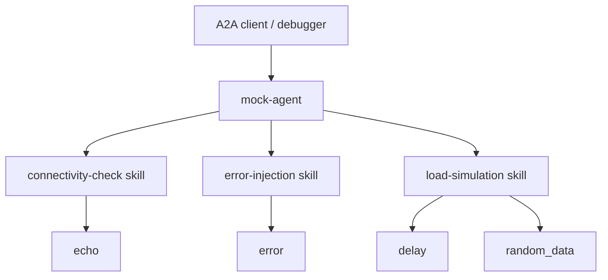

# Mock Agent

The **Mock Agent** is an [Agent-to-Agent (A2A)](/a2a/) server built for testing and development rather than real work. It runs a **mock LLM client**, so it needs no provider, model, or API key - boot it and it answers immediately with consistent, reproducible responses. Use it to exercise A2A clients, the [Inference Gateway](/), and the [A2A Debugger](/a2a-debugger/) without provisioning a real agent or burning tokens.

> The agent is open-source and scaffolded with the [ADL CLI](/adl-cli/). Source, releases, and the agent manifest live at [github.com/inference-gateway/mock-agent](https://github.com/inference-gateway/mock-agent). It is published as an OCI image at `ghcr.io/inference-gateway/mock-agent`.

## When to reach for it

Reach for the Mock Agent when you want to:

- **Verify connectivity** - confirm a client, gateway, or pipeline can reach an A2A server and round-trip a message, with no LLM provider in the loop.
- **Test failure handling** - make the agent return validation, timeout, internal, and not-found errors on demand so you can prove your client handles each path.
- **Simulate load and latency** - introduce configurable delays and generate test payloads to see how clients behave under slow responses.
- **Develop against a stable target** - get deterministic, reproducible replies while building or debugging an A2A integration, instead of fighting a real model's variability.

It speaks the A2A protocol, so you drive it through the [Inference Gateway CLI](/cli/)'s `infer agents` commands, the [A2A Debugger](/a2a-debugger/), or any A2A-compatible client. It is the same image the A2A Debugger's [example stack](/a2a-debugger/#running-against-the-example-stack) uses as its no-API-key test server.

## How the testing skills map to tools

The agent loads three [Agent Skills](/skills/) into its system prompt, each orchestrating one or more of the mock tools to cover a common testing scenario:



You can also call the tools directly - the skills exist to make the common scenarios one-shot prompts.

## Capabilities

The agent advertises the following on its A2A agent card (`GET /.well-known/agent-card.json`):

| Capability               | Value   | Notes                                                   |
| ------------------------ | ------- | ------------------------------------------------------- |
| Streaming                | `true`  | Status and artifact events stream as the task runs.     |
| Push notifications       | `false` | -                                                       |
| State transition history | `false` | -                                                       |
| Artifacts                | enabled | Artifact support is on, so tools can attach test files. |

## Skills

The agent ships three [Agent Skills](/skills/), loaded into the system prompt as bare scaffolds and read on demand via the `read` tool. Each one drives the mock tools to cover a common A2A testing scenario:

| Skill                | What it does                                                                                                                                                                              | Tools used             |
| -------------------- | ----------------------------------------------------------------------------------------------------------------------------------------------------------------------------------------- | ---------------------- |
| `connectivity-check` | Verify the agent is reachable and responding correctly - invokes `echo` with a known payload and confirms the round-trip succeeded.                                                       | `echo`                 |
| `error-injection`    | Test how a client handles different failure modes - invokes `error` across the supported `error_type` values (`validation`, `timeout`, `internal`, `not_found`) so each error path fires. | `error`                |
| `load-simulation`    | Test client behaviour under slow responses with realistic payloads - combines `delay` (to add latency) with `random_data` (to produce a test payload of the requested shape).             | `delay`, `random_data` |

## Tools

The agent exposes five purpose-built mock tools plus the `read` built-in from the ADK runtime:

| Tool          | Source   | Purpose                                                             | Key parameters                                                                        |
| ------------- | -------- | ------------------------------------------------------------------- | ------------------------------------------------------------------------------------- |
| `echo`        | mock     | Echo back the input message - the simplest connectivity check.      | `message` (required)                                                                  |
| `delay`       | mock     | Simulate slow responses with a configurable delay.                  | `duration_seconds` (default `2`), `message`                                           |
| `error`       | mock     | Simulate error conditions for testing error handling.               | `error_type` (required: `validation`/`timeout`/`internal`/`not_found`), `message`     |
| `random_data` | mock     | Generate random test data.                                          | `data_type` (required: `uuid`/`email`/`name`/`number`/`json`), `count` (default `1`)  |
| `validate`    | mock     | Validate input against common patterns.                             | `input` (required), `validation_type` (required: `email`/`url`/`json`/`uuid`/`phone`) |
| `read`        | built-in | Read a file from disk; used to load a skill's `SKILL.md` on demand. | `file_path`, `offset`, `limit`                                                        |

The five mock tools are implemented in Go in the agent itself; `read` is provided by the ADK runtime.

## Runtime and dependencies

- **Server**: a single Go binary (`mock-agent`). `mock-agent start` boots the A2A server on port `8080`; `--help` and `--version` behave as expected. A `Dockerfile` and the `ghcr.io/inference-gateway/mock-agent` image are provided. It exposes the standard A2A endpoints: `GET /.well-known/agent-card.json`, `GET /health`, and `POST /a2a`.
- **Mock LLM client**: the agent ships with no configured provider or model and answers from a built-in mock client. **No API keys are required** - this is what makes it safe to run anywhere and cheap to use in CI and demos.
- **Artifacts**: artifact support is enabled, so tools can attach files to a task for end-to-end artifact testing.

## Quick start

### Register with the Inference Gateway CLI

Pull and run the image, then register it with your gateway in one step - no API key needed:

```bash
infer agents add mock-agent http://localhost:8080 \
  --oci ghcr.io/inference-gateway/mock-agent:latest \
  --run
```

See the [A2A Integration guide](/a2a/#using-a2a-with-the-inference-gateway-cli) for the full CLI workflow, then start chatting:

```bash
infer chat
> "Run a connectivity check"
```

### Run it directly and poke it with the debugger

Run the image and point the [A2A Debugger](/a2a-debugger/) at it to exercise the protocol by hand:

```bash
# Start the mock agent
docker run --rm -p 8080:8080 ghcr.io/inference-gateway/mock-agent:latest

# In another shell, submit a task with the debugger
docker run --rm -it --network host \
  ghcr.io/inference-gateway/a2a-debugger:latest \
  --server-url http://localhost:8080 tasks submit "What are your skills?"
```

For a ready-made stack that wires the mock agent and the debugger together with no setup, use the debugger's [example stack](/a2a-debugger/#running-against-the-example-stack).

## Configuration

The agent reads the standard ADK environment variables. The ones most relevant to running it are below; none are required, since the mock LLM client needs no credentials.

| Category     | Variable                     | Description                                           | Default |
| ------------ | ---------------------------- | ----------------------------------------------------- | ------- |
| Server       | `A2A_PORT`                   | Server port                                           | `8080`  |
| Server       | `A2A_DEBUG`                  | Enable debug logging                                  | `false` |
| Capabilities | `A2A_CAPABILITIES_STREAMING` | Stream status and artifact events                     | `true`  |
| Tools        | `TOOLS_READ_ENABLED`         | Enable the `read` tool (loads skill bodies on demand) | `true`  |
| Tools        | `TOOLS_READ_MAX_LINES`       | Maximum number of lines the `read` tool returns       | `2000`  |

The tool defaults come from `spec.config.tools` in `agent.yaml`; the env vars above override them at runtime. The agent's [README](https://github.com/inference-gateway/mock-agent#configuration) documents the complete set of server, capability, storage, and artifact variables.

## Related

- [A2A Debugger](/a2a-debugger/) - inspect and stream tasks against the mock agent
- [A2A Integration](/a2a/) - protocol overview and how agents plug into the gateway
- [A2A Registry](/registry/) - discover and publish A2A agents
- [n8n Agent](/n8n-agent/) - a worked A2A agent with its own skill and tools
- [Grafana Agent](/grafana-agent/) - another worked A2A agent, for Grafana dashboards and PromQL
- [Skills Catalog](/skills/) - how Agent Skills like `connectivity-check` are authored and indexed
- [ADL CLI](/adl-cli/) - the toolchain this agent is scaffolded with
- [Inference Gateway CLI](/cli/) - register and chat with the agent
- [Repository](https://github.com/inference-gateway/mock-agent) - source, releases, and the agent manifest
