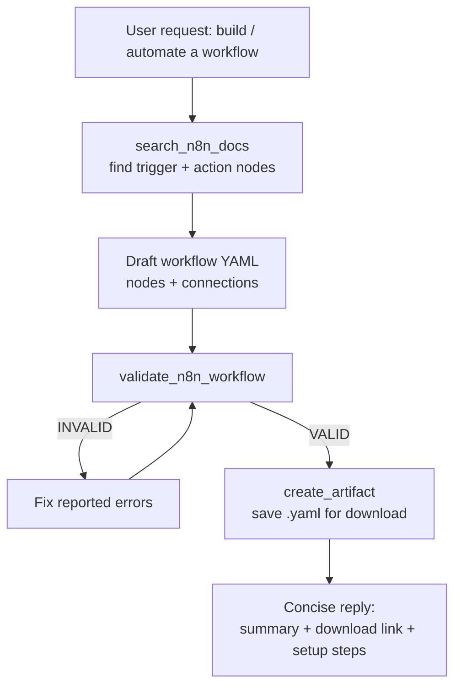

# n8n Agent

The **n8n Agent** is an [Agent-to-Agent (A2A)](/a2a/) server that turns plain-language automation requests into complete, validated [n8n](https://n8n.io/) workflows. Ask it to "create a workflow that sends a Slack message when a new email arrives" and it searches its bundled node documentation, drafts the workflow YAML, validates it against the n8n schema, and hands back a ready-to-import file as a downloadable artifact.

> The agent is open-source and scaffolded with the [ADL CLI](/adl-cli/). Source, releases, and the bundled node corpus live at [github.com/inference-gateway/n8n-agent](https://github.com/inference-gateway/n8n-agent). It is published as an OCI image at `ghcr.io/inference-gateway/n8n-agent`.

## What it does

Reach for the n8n Agent when you want to:

- **Generate a workflow from a description** - turn "monitor a GitHub repo for new issues and create Trello cards" into a complete, importable workflow YAML.
- **Look up node usage** - ask how a specific node works, what parameters it takes, or which node fits a task, answered from bundled n8n documentation rather than a general model guess.
- **Validate workflow YAML/JSON** - check a hand-written or generated workflow against the n8n schema before importing it.
- **Keep chat output clean** - generated workflows are saved as artifacts and returned as a download link plus a short summary, instead of dumping large YAML blocks into the conversation.

It speaks the A2A protocol, so you drive it through the [Inference Gateway CLI](/cli/)'s `infer agents` commands, the [A2A Debugger](/a2a-debugger/), or any A2A-compatible client.

## How workflow generation works

When a request looks like a workflow-generation task, the agent follows its [`n8n-workflow-generation` skill](#skill-n8n-workflow-generation), which orchestrates the tools in a fixed order: search the node docs, draft YAML, validate it (looping until it passes), then persist it as an artifact.



The validate and save steps are mandatory - the skill never inlines the full YAML in the reply, and never persists a workflow that has not passed validation.

## Capabilities

The agent advertises the following on its A2A agent card (`GET /.well-known/agent-card.json`):

| Capability               | Value   | Notes                                                       |
| ------------------------ | ------- | ----------------------------------------------------------- |
| Streaming                | `true`  | Status and artifact events stream as the workflow is built. |
| Push notifications       | `false` | -                                                           |
| State transition history | `false` | -                                                           |
| Artifacts                | enabled | Generated workflows are saved to the artifact server.       |

## Skill: n8n-workflow-generation

The agent ships a single [Agent Skill](/skills/), `n8n-workflow-generation`, loaded into the system prompt as a bare scaffold and read on demand via the `read` tool. Its routing description:

> Use this when the user requests a new n8n workflow or asks to automate a process. Searches relevant nodes with `search_n8n_docs`, drafts the workflow YAML, validates it with `validate_n8n_workflow`, then saves it via `create_artifact`.

The skill runs a five-step playbook:

1. **Search for nodes** - call `search_n8n_docs` for each capability the workflow needs (trigger, integrations, transformations, output), narrowing with the `node_type` and `category` filters.
2. **Draft the workflow YAML** - compose `name`, a `nodes` list (each with `id`, `name`, a `type` matching `n8n-nodes-base.*` or `@n8n/n8n-nodes-langchain.*`, `parameters`, and a `position` as `[x, y]`), and `connections` linking nodes by `id` with `sourceIndex`/`targetIndex`. It biases toward including a trigger node so the workflow can run.
3. **Validate (mandatory)** - call `validate_n8n_workflow`; on `INVALID`, fix every reported error and re-run until it returns `VALID`.
4. **Save the artifact (mandatory)** - call `create_artifact` with a descriptive `.yaml` filename and the validated YAML.
5. **Respond concisely** - a 2-3 sentence summary, the artifact download link, and a short list of follow-up configuration (credentials, webhook URLs, environment variables).

## Tools

The agent exposes two purpose-built tools plus two built-ins from the [ADK](/typescript-adk/):

| Tool                    | Source   | Purpose                                                                     | Key parameters                                                 |
| ----------------------- | -------- | --------------------------------------------------------------------------- | -------------------------------------------------------------- |
| `search_n8n_docs`       | custom   | Search the bundled n8n node docs for nodes, parameters, and usage patterns. | `query` (required), `node_type`, `category`                    |
| `validate_n8n_workflow` | custom   | Validate workflow YAML/JSON against the n8n schema before it is persisted.  | `workflow_content` (required), `format` (`yaml`/`json`/`auto`) |
| `read`                  | built-in | Read a file from disk; used to load the skill's `SKILL.md` body on demand.  | `file_path`, `offset`, `limit`                                 |
| `create_artifact`       | built-in | Persist the validated workflow YAML as a downloadable artifact.             | filename, content                                              |

`search_n8n_docs` and `validate_n8n_workflow` are implemented in Go in the agent itself; `read` and `create_artifact` are provided by the ADK runtime (artifacts must be enabled - see [Configuration](#configuration)).

## Bundled n8n node documentation

The agent ships with documentation for **520+ n8n nodes** - both the standard `n8n-nodes-base.*` nodes and the LangChain AI `@n8n/n8n-nodes-langchain.*` nodes - stored as markdown under `docs/nodes/` in the repo. This is the corpus `search_n8n_docs` queries, which is what lets the agent cite real node names and parameters instead of hallucinating them.

The corpus is generated, not hand-written. A [Deno](https://deno.com/) script, `scripts/generator.ts`, parses the upstream [n8n-io/n8n](https://github.com/n8n-io/n8n) source and emits one markdown file per node. The `Update N8N Node Documentation` workflow (manual `workflow_dispatch`) clones the latest n8n source, runs the generator, and opens a pull request with any changed node docs - so the bundle tracks upstream n8n without manual editing.

## Runtime and dependencies

- **Server**: a single Go binary (`n8n-agent`). `n8n-agent start` boots the A2A server; `--help` and `--version` behave as expected. A multi-stage `Dockerfile` and the `ghcr.io/inference-gateway/n8n-agent` image are provided.
- **Deno** (`deno@^2.7.14`): declared under `spec.development.deps` in `agent.yaml` and provisioned in the Flox dev sandbox. Deno is the toolchain for the node-docs generator described above - it is **not** required to run the agent server at runtime.
- **LLM access**: the agent calls an OpenAI-compatible chat-completions endpoint. Point it at the [Inference Gateway](/) (recommended) or any compatible provider via the `A2A_AGENT_CLIENT_*` variables.

## Quick start

### Register with the Inference Gateway CLI

Pull and run the image, then register it with your gateway in one step:

```bash
infer agents add n8n-agent http://localhost:8080 \
  --oci ghcr.io/inference-gateway/n8n-agent:latest \
  --run
```

See the [A2A Integration guide](/a2a/#using-a2a-with-the-inference-gateway-cli) for the full CLI workflow, then start chatting:

```bash
infer chat
> "Create a workflow that sends a Slack notification when a new email arrives"
```

### Run the example stack

The repo's [`example/`](https://github.com/inference-gateway/n8n-agent/tree/main/example) directory ships a `docker-compose.yaml` that runs the agent behind an Inference Gateway, with the CLI and [A2A Debugger](/a2a-debugger/) wired in:

```bash
git clone https://github.com/inference-gateway/n8n-agent.git
cd n8n-agent/example
cp .env.example .env   # set A2A_AGENT_CLIENT_PROVIDER / _MODEL and a provider API key
docker compose up --build
```

The agent listens on `8080` (A2A) and `8081` (artifact server); generated workflows are written to `./workflows`. Drive it with the interactive CLI or fire one-off requests at it:

```bash
# Interactive chat
docker compose run --rm cli

# One-off streaming request via the debugger
docker compose run --rm a2a-debugger tasks submit-streaming \
  "Build a workflow that fetches an API hourly and stores rows in PostgreSQL"
```

## Configuration

The agent reads the standard ADK environment variables. The ones most relevant to running it are below; artifacts must be enabled for workflow generation to return downloadable files.

| Category   | Variable                          | Description                                             | Default       |
| ---------- | --------------------------------- | ------------------------------------------------------- | ------------- |
| Server     | `A2A_PORT`                        | Server port                                             | `8080`        |
| Server     | `A2A_DEBUG`                       | Enable debug logging                                    | `false`       |
| LLM Client | `A2A_AGENT_CLIENT_PROVIDER`       | LLM provider (`openai`, `anthropic`, `deepseek`, ...)   | -             |
| LLM Client | `A2A_AGENT_CLIENT_MODEL`          | Model to use                                            | -             |
| LLM Client | `A2A_AGENT_CLIENT_BASE_URL`       | OpenAI-compatible endpoint (e.g. the Inference Gateway) | -             |
| Artifacts  | `A2A_ARTIFACTS_ENABLE`            | Enable artifacts (required to save generated workflows) | `false`       |
| Artifacts  | `A2A_ARTIFACTS_STORAGE_PROVIDER`  | Artifact storage backend (`filesystem` or `minio`)      | `filesystem`  |
| Artifacts  | `A2A_ARTIFACTS_STORAGE_BASE_PATH` | Base path for filesystem artifact storage               | `./artifacts` |
| Tools      | `TOOLS_READ_ENABLED`              | Enable the `read` tool (loads the skill body on demand) | `true`        |

The agent's [README](https://github.com/inference-gateway/n8n-agent#configuration) documents the complete set of server, capability, storage, and authentication variables.

## Related

- [A2A Integration](/a2a/) - protocol overview and how agents plug into the gateway
- [A2A Registry](/registry/) - discover and publish A2A agents
- [Grafana Agent](/grafana-agent/) - another worked A2A agent, for Grafana dashboards and PromQL
- [A2A Debugger](/a2a-debugger/) - inspect and stream tasks against the agent
- [Skills Catalog](/skills/) - how Agent Skills like `n8n-workflow-generation` are authored and indexed
- [ADL CLI](/adl-cli/) - the toolchain this agent is scaffolded with
- [Inference Gateway CLI](/cli/) - register and chat with the agent
- [Repository](https://github.com/inference-gateway/n8n-agent) - source, releases, and the bundled node docs
