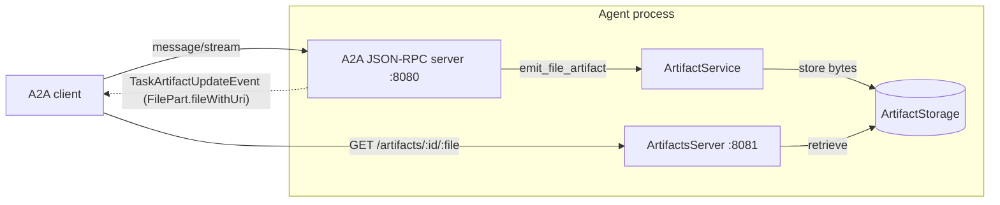

# Rust ADK

The Rust ADK (`inference-gateway-adk`) is the Rust [Agent Development Kit](https://github.com/inference-gateway/rust-adk) for building [A2A (Agent-to-Agent)](/a2a/) servers. It mirrors the [Go ADK](https://github.com/inference-gateway/adk) handler semantics and consumes the same canonical A2A schema, so agents written against either ADK speak the same wire protocol.

> **Pre-1.0 status.** The Rust ADK is in early development and its public API may change between minor versions. Pin an exact version in production.

This page is a feature reference for the crate: the server and agent builders, the client and its typed JSON-RPC helpers, custom tools and task handlers, authentication, TLS/mTLS, agent-card overrides, the artifacts subsystem, and the full environment-variable surface. The canonical upstream source is the crate [`README.md`](https://github.com/inference-gateway/rust-adk/blob/main/README.md).

## Installation

Add the crate to your `Cargo.toml`:

```toml
[dependencies]
inference-gateway-adk = "0.4"
```

Two optional Cargo features extend the defaults:

| Feature | Pulls in                                            | Enables                                                                   |
| ------- | --------------------------------------------------- | ------------------------------------------------------------------------- |
| `redis` | a Redis client                                      | `RedisStorage`, selected when `A2A_QUEUE_PROVIDER=redis`.                 |
| `minio` | the [`minio`](https://crates.io/crates/minio) crate | `MinioArtifactStorage`, selected when `ARTIFACTS_STORAGE_PROVIDER=minio`. |

```toml
inference-gateway-adk = { version = "0.4", features = ["redis", "minio"] }
```

The crate requires Rust 1.94 or later.

## Quick start

### Minimal server

The smallest runnable server loads an agent card and opts into the built-in task handlers. `A2AServerBuilder::build()` validates its inputs: an agent card is **required** (via `with_agent_card` or `with_agent_card_from_file`), and at least one task handler must be configured.

```rust
use inference_gateway_adk::A2AServerBuilder;
use tracing::{error, info};

#[tokio::main]
async fn main() -> Result<(), Box<dyn std::error::Error>> {
    tracing_subscriber::fmt().init();

    let server = A2AServerBuilder::new()
        .with_agent_card_from_file(".well-known/agent.json", None)
        .with_default_task_handlers()
        .build()
        .await?;

    let addr = "0.0.0.0:8080".parse()?;
    info!("A2A server listening on {addr}");

    if let Err(e) = server.serve(addr).await {
        error!("server stopped: {e}");
    }
    Ok(())
}
```

With no `Agent` attached, the default handlers fall back to a built-in echo reply, so the server runs end-to-end without any LLM credentials. The agent card can also be supplied programmatically with `with_agent_card(card)` instead of loading it from disk.

### AI-powered server

`Config` is a plain `serde` struct; pick whichever loader you like. The bundled examples use [`envy`](https://docs.rs/envy) with the `A2A_` prefix - the same convention adopted by the sibling Go and TypeScript ADKs. With `A2A_AGENT_CLIENT_*` env vars set, `AgentBuilder` produces a fully wired LLM agent:

```rust
use inference_gateway_adk::{A2AServerBuilder, AgentBuilder, Config};
use inference_gateway_sdk::{
    ChatCompletionTool, ChatCompletionToolType, FunctionObject, FunctionParameters,
};
use serde_json::{Value, json};
use tracing::{error, info};

#[tokio::main]
async fn main() -> Result<(), Box<dyn std::error::Error>> {
    tracing_subscriber::fmt().init();

    // Load A2A_AGENT_CLIENT_PROVIDER, A2A_AGENT_CLIENT_MODEL,
    // A2A_AGENT_CLIENT_API_KEY, A2A_SERVER_PORT, etc. AgentBuilder
    // fails fast at startup if provider/model are missing.
    let config: Config = envy::prefixed("A2A_").from_env()?;

    let tools = vec![ChatCompletionTool {
        type_: ChatCompletionToolType::Function,
        function: FunctionObject {
            name: "get_weather".to_string(),
            description: Some("Get weather information for a city".to_string()),
            parameters: Some(FunctionParameters(
                json!({
                    "type": "object",
                    "properties": {
                        "location": { "type": "string", "description": "City name" }
                    },
                    "required": ["location"]
                })
                .as_object()
                .unwrap()
                .clone(),
            )),
            strict: false,
        },
    }];

    let agent = AgentBuilder::new()
        .with_config(&config.agent_config)
        .with_system_prompt("You are a helpful weather assistant.")
        .with_toolbox(tools)
        .with_function_tool("get_weather".to_string(), |args: Value| {
            let location = args["location"].as_str().unwrap_or("Unknown");
            Ok(json!({ "location": location, "temperature": "22C" }).to_string())
        })
        .build()
        .await?;

    let port = config.server_config.port;
    let server = A2AServerBuilder::new()
        .with_config(config)
        .with_agent(agent)
        .with_agent_card_from_file(".well-known/agent.json", None)
        .with_default_task_handlers()
        .build()
        .await?;

    let addr = format!("0.0.0.0:{port}").parse()?;
    info!("AI-powered A2A server running on {addr}");

    if let Err(e) = server.serve(addr).await {
        error!("Server failed to start: {e}");
    }
    Ok(())
}
```

### Switching providers and models

`AgentBuilder` is provider-agnostic. To swap models, change `A2A_AGENT_CLIENT_PROVIDER` and `A2A_AGENT_CLIENT_MODEL` and supply the matching API key - no code edits:

<!-- GENERATED:adk-provider-table START (do not edit - run: task generate) -->

| Provider     | `A2A_AGENT_CLIENT_PROVIDER` | Example `A2A_AGENT_CLIENT_MODEL`           | API key env var                                       |
| ------------ | --------------------------- | ------------------------------------------ | ----------------------------------------------------- |
| OpenAI       | `openai`                    | `gpt-5-mini`                               | `OPENAI_API_KEY`                                      |
| DeepSeek     | `deepseek`                  | `deepseek-v4-flash`                        | `DEEPSEEK_API_KEY`                                    |
| Anthropic    | `anthropic`                 | `claude-opus-4-8`                          | `ANTHROPIC_API_KEY`                                   |
| Cohere       | `cohere`                    | `command-a-03-2025`                        | `COHERE_API_KEY`                                      |
| Groq         | `groq`                      | `llama-3.3-70b-versatile`                  | `GROQ_API_KEY`                                        |
| Cloudflare   | `cloudflare`                | `@cf/meta/llama-3.3-70b-instruct-fp8-fast` | `CLOUDFLARE_API_KEY`                                  |
| Ollama       | `ollama`                    | `llama3.3`                                 | none (set `A2A_AGENT_CLIENT_BASE_URL` to your Ollama) |
| Ollama Cloud | `ollama_cloud`              | `gpt-oss:120b`                             | `OLLAMA_CLOUD_API_KEY`                                |
| Google       | `google`                    | `gemini-3-flash`                           | `GOOGLE_API_KEY`                                      |
| Mistral      | `mistral`                   | `mistral-large-3`                          | `MISTRAL_API_KEY`                                     |
| MiniMax      | `minimax`                   | `MiniMax-M3`                               | `MINIMAX_API_KEY`                                     |
| Moonshot     | `moonshot`                  | `kimi-latest`                              | `MOONSHOT_API_KEY`                                    |
| NVIDIA       | `nvidia`                    | `nvidia/meta/llama-3.1-8b-instruct`        | `NVIDIA_API_KEY`                                      |

<!-- GENERATED:adk-provider-table END (do not edit - run: task generate) -->

Set `A2A_AGENT_CLIENT_API_KEY` to override the per-provider lookup, and `A2A_AGENT_CLIENT_BASE_URL` to point at the [Inference Gateway](https://github.com/inference-gateway/inference-gateway) (recommended - it normalizes provider quirks so the same agent code talks to every provider unchanged) or any other OpenAI-compatible endpoint. The full `A2A_AGENT_CLIENT_*` surface is in the [environment variable reference](#environment-variable-reference).

## The server and its builder

`A2AServer` is the runtime that terminates the A2A JSON-RPC protocol. You never construct it directly - `A2AServerBuilder` assembles one with a fluent interface, and `A2AServer::serve(addr)` binds the listener (plaintext, or TLS when `Config.tls_config` is enabled) and - when artifacts are enabled - spawns the artifacts server and retention loop alongside it.

| Method                                                        | Purpose                                                                                     |
| ------------------------------------------------------------- | ------------------------------------------------------------------------------------------- |
| `with_config(Config)`                                         | Apply a fully-loaded `Config` (port, TLS, auth, queue, telemetry, artifacts).               |
| `with_agent(Agent)`                                           | Attach an LLM-backed agent built via `AgentBuilder`.                                        |
| `with_agent_card(AgentCard)`                                  | Configure the card served at `/.well-known/agent.json` from an in-memory value.             |
| `with_agent_card_from_file(path, Option<AgentCardOverrides>)` | Load the card from a JSON file, applying optional field overrides.                          |
| `with_gateway_url(url)`                                       | Override the Inference Gateway base URL (default `http://gateway:8080/v1`).                 |
| `with_storage(Arc<dyn Storage>)`                              | Swap the task store (`InMemoryStorage` default; `RedisStorage` behind the `redis` feature). |
| `with_background_task_handler(h)`                             | Register a custom `message/send` handler.                                                   |
| `with_streaming_task_handler(h)`                              | Register a custom `message/stream` handler.                                                 |
| `with_default_background_task_handler()`                      | Opt into the bundled `message/send` default.                                                |
| `with_default_streaming_task_handler()`                       | Opt into the bundled `message/stream` default.                                              |
| `with_default_task_handlers()`                                | Opt into both defaults at once.                                                             |
| `with_workers(n)`                                             | Number of background queue workers (defaults to `A2A_QUEUE_WORKERS`).                       |
| `with_auth_verifier(Arc<dyn AuthVerifier>)`                   | Plug in a custom verifier (overrides `A2A_AUTH_ENABLE`).                                    |
| `with_artifact_service(Arc<dyn ArtifactService>)`             | Supply a custom artifact service / storage backend.                                         |

> **Builder validation.** `build()` returns an error unless an agent card is configured and at least one task handler is present. It also cross-checks the card's `capabilities.streaming` flag: a streaming-enabled card requires a streaming handler, and a streaming-disabled card requires a background handler. `with_default_task_handlers()` satisfies both.

The default handlers delegate to the registered `Agent` when one is present (via `with_agent`); without an agent they return a built-in echo reply, which is what makes the [minimal server](#minimal-server) above work with no LLM wired up.

## AgentBuilder

`AgentBuilder` constructs the OpenAI-compatible `Agent` that lives inside the server. Seed it with an entire `AgentConfig` via `with_config(&cfg)`, or set fields individually - per-field setters layered on top of a config override **that field only**.

```rust
use inference_gateway_adk::AgentBuilder;

// Driven entirely by AgentConfig (provider, model, key, ...)
let agent = AgentBuilder::new()
    .with_config(&config.agent_config)
    .with_toolbox(tools)
    .build()
    .await?;

// Or with explicit per-field setters
let agent = AgentBuilder::new()
    .with_provider("deepseek")
    .with_model("deepseek-v4-flash")
    .with_system_prompt("You are a helpful assistant")
    .with_max_chat_completion_iterations(10)
    .build()
    .await?;
```

| Method                                             | Purpose                                                                                                                 |
| -------------------------------------------------- | ----------------------------------------------------------------------------------------------------------------------- |
| `with_config(&AgentConfig)`                        | Seed the builder from an `AgentConfig`. Later setters win per field.                                                    |
| `with_provider(s)` / `with_model(s)`               | LLM provider and model id. Both are required - `build()` fails fast if either is unset.                                 |
| `with_api_key(s)`                                  | Provider API key.                                                                                                       |
| `with_base_url(s)`                                 | Override the LLM gateway base URL for the default client.                                                               |
| `with_timeout(Duration)` / `with_max_retries(u32)` | Per-request timeout and retry budget.                                                                                   |
| `with_max_chat_completion_iterations(u32)`         | Cap on chat-completion round trips in the agent loop (`A2A_AGENT_CLIENT_MAX_CHAT_COMPLETION_ITERATIONS`, default `10`). |
| `with_max_tokens(u32)` / `with_temperature(f32)`   | Generation parameters.                                                                                                  |
| `with_system_prompt(s)`                            | System prompt prepended to every conversation.                                                                          |
| `with_enable_usage_metadata(bool)`                 | Override whether terminal tasks carry token usage + execution stats (default from config, `true`).                      |
| `with_max_conversation_history(u32)`               | Max conversation-history messages retained (default `20`).                                                              |
| `with_toolbox(Vec<ChatCompletionTool>)`            | Declare the tool schema advertised to the model.                                                                        |
| `with_tool_handler(name, h)`                       | Register a `ToolHandler` for a named tool.                                                                              |
| `with_function_tool(name, closure)`                | Register a synchronous closure tool handler.                                                                            |
| `with_async_function_tool(name, closure)`          | Register an async closure tool handler.                                                                                 |
| `with_llm_client(C: LLMClient)`                    | Replace the default `OpenAICompatibleLLMClient` with a custom transport.                                                |

> `AgentBuilder::build()` fails fast when `provider` or `model` are unset (or the provider is unsupported), so a misconfigured server errors out at startup instead of on the first chat request.

### Switching providers and models

The Rust ADK is provider-agnostic: every model is driven through the [Inference Gateway](https://github.com/inference-gateway/inference-gateway) SDK, so switching providers is a configuration change, not a code change. Set `A2A_AGENT_CLIENT_PROVIDER` and `A2A_AGENT_CLIENT_MODEL` (or call `with_provider(...)` / `with_model(...)`) and supply the matching API key - no rebuild required:

<!-- GENERATED:adk-provider-table START (do not edit - run: task generate) -->

| Provider     | `A2A_AGENT_CLIENT_PROVIDER` | Example `A2A_AGENT_CLIENT_MODEL`           | API key env var                                       |
| ------------ | --------------------------- | ------------------------------------------ | ----------------------------------------------------- |
| OpenAI       | `openai`                    | `gpt-5-mini`                               | `OPENAI_API_KEY`                                      |
| DeepSeek     | `deepseek`                  | `deepseek-v4-flash`                        | `DEEPSEEK_API_KEY`                                    |
| Anthropic    | `anthropic`                 | `claude-opus-4-8`                          | `ANTHROPIC_API_KEY`                                   |
| Cohere       | `cohere`                    | `command-a-03-2025`                        | `COHERE_API_KEY`                                      |
| Groq         | `groq`                      | `llama-3.3-70b-versatile`                  | `GROQ_API_KEY`                                        |
| Cloudflare   | `cloudflare`                | `@cf/meta/llama-3.3-70b-instruct-fp8-fast` | `CLOUDFLARE_API_KEY`                                  |
| Ollama       | `ollama`                    | `llama3.3`                                 | none (set `A2A_AGENT_CLIENT_BASE_URL` to your Ollama) |
| Ollama Cloud | `ollama_cloud`              | `gpt-oss:120b`                             | `OLLAMA_CLOUD_API_KEY`                                |
| Google       | `google`                    | `gemini-3-flash`                           | `GOOGLE_API_KEY`                                      |
| Mistral      | `mistral`                   | `mistral-large-3`                          | `MISTRAL_API_KEY`                                     |
| MiniMax      | `minimax`                   | `MiniMax-M3`                               | `MINIMAX_API_KEY`                                     |
| Moonshot     | `moonshot`                  | `kimi-k2-thinking`                         | `MOONSHOT_API_KEY`                                    |
| NVIDIA       | `nvidia`                    | `nvidia/meta/llama-3.1-8b-instruct`        | `NVIDIA_API_KEY`                                      |

<!-- GENERATED:adk-provider-table END (do not edit - run: task generate) -->

NVIDIA serves the [build.nvidia.com](https://build.nvidia.com) NIM catalog (Nemotron, Llama, DeepSeek, Mistral, Qwen) with bearer-token auth at `https://integrate.api.nvidia.com/v1`. Point `A2A_AGENT_CLIENT_BASE_URL` at the Inference Gateway (recommended - it normalizes each provider's quirks so the same agent talks to every provider unchanged) or any other OpenAI-compatible endpoint. See [Supported Providers](/supported-providers) for the full matrix, auth modes, default URLs, and vision support.

### Custom LLM clients

The default `OpenAICompatibleLLMClient` wraps the Inference Gateway SDK. To route requests through a different backend - or a mock for tests - implement the `LLMClient` trait (`create_chat_completion` + `create_streaming_chat_completion`, mirroring the Go ADK) and pass it to `with_llm_client(...)`:

```rust
use inference_gateway_adk::{AgentBuilder, OpenAICompatibleLLMClient};

// Build the default client explicitly (synchronous; no await)
let llm_client = OpenAICompatibleLLMClient::new(&config.agent_config)?;

let agent = AgentBuilder::new()
    .with_llm_client(llm_client)
    .with_system_prompt("You are a coding assistant.")
    .build()
    .await?;
```

## Custom tools

Tools are declared with the Inference Gateway SDK's `ChatCompletionTool` / `FunctionObject` types (the schema the model sees) and backed by a handler keyed on the tool name. Register a synchronous closure with `with_function_tool`, an async closure with `with_async_function_tool`, or any `ToolHandler` implementation with `with_tool_handler`. When the model emits a tool call, the matching handler runs and its return value is appended to the conversation as a tool message.

```rust
use inference_gateway_adk::AgentBuilder;
use inference_gateway_sdk::{
    ChatCompletionTool, ChatCompletionToolType, FunctionObject, FunctionParameters,
};
use serde_json::{Value, json};

let tools = vec![ChatCompletionTool {
    type_: ChatCompletionToolType::Function,
    function: FunctionObject {
        name: "search_web".to_string(),
        description: Some("Search the web for information".to_string()),
        parameters: Some(FunctionParameters(
            json!({
                "type": "object",
                "properties": {
                    "query": { "type": "string" },
                    "limit": { "type": "integer", "default": 5 }
                },
                "required": ["query"]
            })
            .as_object()
            .unwrap()
            .clone(),
        )),
        strict: false,
    },
}];

let agent = AgentBuilder::new()
    .with_config(&config.agent_config)
    .with_system_prompt("You can answer questions and search the web.")
    .with_toolbox(tools)
    .with_function_tool("search_web".to_string(), |args: Value| {
        let query = args["query"].as_str().unwrap_or("");
        Ok(json!({ "query": query, "results": [] }).to_string())
    })
    .build()
    .await?;
```

Use `with_async_function_tool` when the handler needs to `.await` (HTTP calls, database lookups). The closure signature is the same except it returns a future:

```rust
let agent = AgentBuilder::new()
    .with_config(&config.agent_config)
    .with_toolbox(tools)
    .with_async_function_tool("search_web".to_string(), |args: Value| async move {
        let query = args["query"].as_str().unwrap_or("").to_string();
        let results = my_async_search(&query).await?;
        Ok(serde_json::to_string(&results)?)
    })
    .build()
    .await?;
```

See [`examples/ai-powered/`](https://github.com/inference-gateway/rust-adk/tree/main/examples/ai-powered) for a multi-tool walkthrough (weather, math, search).

## Custom task handlers

The server's two extension points for task execution are the `TaskHandler` trait (for `message/send`, the background/queue path) and `StreamableTaskHandler` (for `message/stream`, the SSE path). The defaults wired in by `with_default_task_handlers()` delegate to the registered `Agent`; implement either trait to plug in custom logic.

```rust
use async_trait::async_trait;
use inference_gateway_adk::{
    A2AServerBuilder, TaskHandler,
    a2a_types::{Message, Part, Role, Task, TaskState, TaskStatus},
};

#[derive(Debug)]
struct EchoHandler;

#[async_trait]
impl TaskHandler for EchoHandler {
    async fn handle(&self, task: Task, message: Message) -> anyhow::Result<Task> {
        let reply = message
            .parts
            .iter()
            .filter_map(|p| p.text.as_deref())
            .collect::<Vec<_>>()
            .join(" ");

        let mut updated = task.clone();
        updated.status = TaskStatus {
            state: TaskState::TaskStateCompleted,
            ..updated.status
        };
        updated.history.push(Message {
            role: Role::RoleAgent,
            parts: vec![Part { text: Some(reply), ..Default::default() }],
            ..message
        });
        Ok(updated)
    }
}

let server = A2AServerBuilder::new()
    .with_agent_card_from_file(".well-known/agent.json", None)
    .with_background_task_handler(EchoHandler)
    .build()
    .await?;
```

Streaming handlers receive a `StreamEmitter` and push status updates and artifacts over the SSE stream as work progresses - see [Emitting artifacts from a streaming handler](#emitting-artifacts-from-a-streaming-handler) for a worked example. For runnable demos, see [`examples/streaming/`](https://github.com/inference-gateway/rust-adk/tree/main/examples/streaming) and the `TaskStateInputRequired` flow in [`examples/input-required/`](https://github.com/inference-gateway/rust-adk/tree/main/examples/input-required).

## A2AClient

`A2AClient` is the typed client for talking to an A2A server. Construct it with a base URL, or with a `ClientConfig` for explicit timeout and retry control:

```rust
use inference_gateway_adk::A2AClient;

let client = A2AClient::new("http://localhost:8080")?;

// Discovery endpoints (always public, no auth required)
let agent_card = client.get_agent_card().await?;
let health = client.get_health().await?;
```

### JSON-RPC method helpers

The client exposes a typed helper for every method in the A2A specification. Each takes a request struct and returns the matching response struct from [`inference_gateway_adk::a2a_types`](https://github.com/inference-gateway/rust-adk/blob/main/src/a2a_types.rs). Runnable end-to-end examples - one client binary per method - live in [`examples/a2a-methods/`](https://github.com/inference-gateway/rust-adk/tree/main/examples/a2a-methods).

| Method                                | `A2AClient` helper                     | Request type                              | Response type                            |
| ------------------------------------- | -------------------------------------- | ----------------------------------------- | ---------------------------------------- |
| `message/send`                        | `send_message`                         | `SendMessageRequest`                      | `SendMessageResponse`                    |
| `message/stream`                      | `send_streaming_message`               | `SendMessageRequest`                      | `SendMessageResponse`                    |
| `tasks/get`                           | `get_task`                             | `GetTaskRequest`                          | `Task`                                   |
| `tasks/list`                          | `list_tasks`                           | `ListTasksRequest`                        | `ListTasksResponse`                      |
| `tasks/cancel`                        | `cancel_task`                          | `CancelTaskRequest`                       | `Task`                                   |
| `tasks/resubscribe`                   | `resubscribe_task`                     | `SubscribeToTaskRequest`                  | `Stream<StreamResponse>` (SSE)           |
| `tasks/pushNotificationConfig/set`    | `set_task_push_notification_config`    | `SetTaskPushNotificationConfigRequest`    | `TaskPushNotificationConfig`             |
| `tasks/pushNotificationConfig/get`    | `get_task_push_notification_config`    | `GetTaskPushNotificationConfigRequest`    | `TaskPushNotificationConfig`             |
| `tasks/pushNotificationConfig/list`   | `list_task_push_notification_configs`  | `ListTaskPushNotificationConfigRequest`   | `ListTaskPushNotificationConfigResponse` |
| `tasks/pushNotificationConfig/delete` | `delete_task_push_notification_config` | `DeleteTaskPushNotificationConfigRequest` | `serde_json::Value`                      |
| `agent/getAuthenticatedExtendedCard`  | `get_authenticated_extended_card`      | `GetExtendedAgentCardRequest`             | `AgentCard`                              |

A representative `message/send` call, using the typed structs end-to-end:

```rust
use inference_gateway_adk::a2a_types::{Message, Part, Role, SendMessageRequest};

let response = client
    .send_message(SendMessageRequest {
        configuration: None,
        message: Some(Message {
            context_id: None,
            extensions: vec![],
            message_id: uuid::Uuid::new_v4().to_string(),
            metadata: None,
            parts: vec![Part {
                data: None,
                file: None,
                metadata: None,
                text: Some("Hello via message/send".to_string()),
            }],
            reference_task_ids: vec![],
            role: Role::RoleUser,
            task_id: None,
        }),
        metadata: None,
        tenant: "example".to_string(),
    })
    .await?;

let task = response.task.expect("server returned a task");
```

### Health monitoring

`get_health()` returns the agent's `HealthStatus` for service discovery and load-balancer probes. The `status` string is one of:

- `healthy` - fully operational.
- `degraded` - partially operational; some functionality may be limited.
- `unhealthy` - not operational or experiencing significant issues.

## Push notifications

A2A servers persist per-task webhook configurations through the four `tasks/pushNotificationConfig/*` control-plane methods on `A2AClient` (`set`, `get`, `list`, `delete`). Each uses the typed structs from `a2a_types` and is exercised by a dedicated binary under [`examples/a2a-methods/`](https://github.com/inference-gateway/rust-adk/tree/main/examples/a2a-methods).

```rust
use inference_gateway_adk::a2a_types::{
    PushNotificationConfig, SetTaskPushNotificationConfigRequest, TaskPushNotificationConfig,
};

let parent = format!("tasks/{task_id}");
let name = format!("{parent}/pushNotificationConfigs/primary");

client
    .set_task_push_notification_config(SetTaskPushNotificationConfigRequest {
        parent: parent.clone(),
        config_id: "primary".to_string(),
        tenant: Some("example".to_string()),
        config: TaskPushNotificationConfig {
            name: name.clone(),
            push_notification_config: PushNotificationConfig {
                authentication: None,
                id: None,
                token: Some("shared-secret".to_string()),
                url: "https://your-app.example/webhooks/a2a".to_string(),
            },
        },
    })
    .await?;
```

> **Webhook delivery is still in development.** The four control-plane methods are fully wired up and durably stored by the server, but the HTTP _sender_ that fans state changes out to the configured URLs is tracked in a follow-up ticket. Configurations attached today are picked up automatically once that sender lands.

## Agent card and metadata

The agent card served at `/.well-known/agent.json` is the discovery document for your agent. There are two complementary ways to set its metadata.

**Build-time metadata** is embedded into the binary at compile time via env vars read by `env!` macros - immutable and ideal for production:

```bash
AGENT_NAME="Weather Assistant" \
AGENT_DESCRIPTION="Specialized weather analysis agent" \
AGENT_VERSION="2.0.0" \
cargo build --release
```

**Runtime overrides** layer on top of whatever was loaded from disk. Pass `AgentCardOverrides` to `with_agent_card_from_file(...)`; the file supplies the baseline and each explicitly-set override wins:

```rust
use inference_gateway_adk::{A2AServerBuilder, AgentCardOverrides, Config};

let config: Config = envy::prefixed("A2A_").from_env()?;

let server = A2AServerBuilder::new()
    .with_config(config)
    .with_agent_card_from_file(
        ".well-known/agent.json",
        Some(
            AgentCardOverrides::new()
                .with_name("Development Weather Assistant")
                .with_description("Development version with debug features")
                .with_version("dev-1.0.0")
                .with_url("http://localhost:8080/a2a"),
        ),
    )
    .build()
    .await?;
```

`AgentCardOverrides` exposes `with_name`, `with_description`, `with_version`, and `with_url`. See [`examples/static-agent-card/`](https://github.com/inference-gateway/rust-adk/tree/main/examples/static-agent-card) for a runnable demo.

The card's `supportsExtendedAgentCard` flag gates `agent/getAuthenticatedExtendedCard`: when `false` the method returns JSON-RPC `-32601 METHOD_NOT_FOUND`, so production agents can advertise the extended card only when their auth policy allows it.

## Authentication

When `A2A_AUTH_ENABLE=true`, the server gates `POST /a2a` behind an `Authorization: Bearer <token>` header. `GET /health` and `GET /.well-known/agent.json` stay public so probes and discovery clients keep working without a credential. Tokens that fail validation get **HTTP 401** with a `WWW-Authenticate: Bearer realm="a2a"` header.

The bundled `OidcJwtVerifier`:

1. Performs OIDC discovery at `<A2A_AUTH_ISSUER_URL>/.well-known/openid-configuration`.
2. Fetches and caches the JWKS advertised by the discovery document.
3. Validates the JWT signature, `iss`, `exp`, and - when `A2A_AUTH_CLIENT_ID` is set - the `aud` claim.

| Variable                 | Default | Purpose                                                                                             |
| ------------------------ | ------- | --------------------------------------------------------------------------------------------------- |
| `A2A_AUTH_ENABLE`        | `false` | When `true`, `POST /a2a` requires a valid bearer token.                                             |
| `A2A_AUTH_ISSUER_URL`    | (empty) | OIDC issuer; the server performs discovery + JWKS lookup against it. Required when auth is enabled. |
| `A2A_AUTH_CLIENT_ID`     | (empty) | Validated as the JWT audience (`aud`) when set.                                                     |
| `A2A_AUTH_CLIENT_SECRET` | (empty) | Reserved for client-side OAuth2 flows; currently unused server-side.                                |

On success the verifier produces an `AuthenticatedPrincipal` - `subject` (`sub`), `tenant` (first of `tenant`/`tid`/`organization`), `issuer`, and the full `claims` map - and attaches it to the request as an Axum extension so the JSON-RPC dispatcher can scope behaviour by tenant.

To plug in a custom backend (a static signing key, an internal identity service, a mock for tests), implement `AuthVerifier` and pass it to `with_auth_verifier(...)`. This **overrides** whatever `A2A_AUTH_ENABLE` selects, the same way `with_storage(...)` overrides the task store:

```rust
use async_trait::async_trait;
use inference_gateway_adk::{AuthError, AuthVerifier, AuthenticatedPrincipal};

#[derive(Debug)]
struct StaticToken(&'static str);

#[async_trait]
impl AuthVerifier for StaticToken {
    async fn verify(&self, token: &str) -> Result<AuthenticatedPrincipal, AuthError> {
        if token == self.0 {
            Ok(AuthenticatedPrincipal {
                subject: "demo-user".to_string(),
                tenant: "demo-tenant".to_string(),
                issuer: "static".to_string(),
                claims: Default::default(),
            })
        } else {
            Err(AuthError::InvalidToken("unrecognized token".to_string()))
        }
    }
}

let server = A2AServerBuilder::new()
    .with_agent_card_from_file(".well-known/agent.json", None)
    .with_default_task_handlers()
    .with_auth_verifier(std::sync::Arc::new(StaticToken("demo-token-123")))
    .build()
    .await?;
```

When auth is disabled the middleware is not attached, and `agent/getAuthenticatedExtendedCard` returns the configured card whenever `supportsExtendedAgentCard == true`. See [`examples/auth/`](https://github.com/inference-gateway/rust-adk/tree/main/examples/auth) for an end-to-end demo that runs both a static-token verifier and a Keycloak-backed `OidcJwtVerifier`.

## TLS and mTLS

When `A2A_SERVER_TLS_ENABLE=true`, `A2AServer::serve` swaps its plaintext listener for [`axum-server`](https://github.com/programatik29/axum-server) backed by [`rustls`](https://github.com/rustls/rustls) 0.23 (with the `ring` crypto provider) and serves the same router over HTTPS. Rustls was chosen over native-tls because it is pure Rust - avoiding the OpenSSL toolchain on container builds - and because it gives programmatic access to the negotiated connection, which is what makes the mTLS subject extraction below tractable.

| Variable                        | Default | Purpose                                                                                                                                                       |
| ------------------------------- | ------- | ------------------------------------------------------------------------------------------------------------------------------------------------------------- |
| `A2A_SERVER_TLS_ENABLE`         | `false` | When `true`, `A2AServer::serve` binds an HTTPS listener.                                                                                                      |
| `A2A_SERVER_TLS_CERT_PATH`      | (empty) | PEM file with the server certificate chain.                                                                                                                   |
| `A2A_SERVER_TLS_KEY_PATH`       | (empty) | PEM file with the server private key (PKCS#1, PKCS#8, or SEC1).                                                                                               |
| `A2A_SERVER_TLS_CLIENT_CA_PATH` | (unset) | When set, the server requires mTLS and trusts client certificates signed by any CA in this PEM bundle - the `MutualTlsSecurityScheme` the A2A spec describes. |

When mTLS is enabled, the TLS acceptor parses the peer's leaf certificate and exposes it to handlers as an `axum::Extension<PeerCert>` - the same plumbing pattern the bearer-token middleware uses for `AuthenticatedPrincipal`. The wrapped `ClientCertPrincipal` carries the subject DN, the Common Name (when present), the issuer DN, and the raw DER bytes of the leaf:

```rust
use axum::Extension;
use inference_gateway_adk::PeerCert;

async fn my_handler(Extension(peer): Extension<PeerCert>) {
    if let Some(p) = peer.0 {
        tracing::info!("authenticated client: {} (issued by {})", p.subject, p.issuer);
    }
}
```

`PeerCert` is injected on every TLS connection; for plain HTTPS (no `A2A_SERVER_TLS_CLIENT_CA_PATH`) its inner `Option` is `None` because the client presented no certificate. Because the artifacts server reuses the same `build_server_config` machinery, enabling TLS/mTLS on the agent covers the artifacts endpoint too.

See [`examples/tls/`](https://github.com/inference-gateway/rust-adk/tree/main/examples/tls) for an end-to-end demo with a `make-certs.sh` script that mints a self-signed CA plus server and client certificates, and exercises both modes via the `tls` and `mtls` Compose profiles.

## Artifacts

The ADK ships a first-class **artifacts subsystem** so agents can produce downloadable file artifacts (reports, images, structured-data dumps) and hand A2A clients a **URI** rather than inline base64 bytes embedded in JSON-RPC responses. It mirrors the Go ADK artifacts surface, so artifact-producing agents behave identically on the wire across ADKs. The subsystem landed in [rust-adk#34](https://github.com/inference-gateway/rust-adk/pull/34).

The subsystem has four moving parts, each behind a trait so production deployments can swap in their own backends:

| Layer         | Trait / type                                                               | Default                                         |
| ------------- | -------------------------------------------------------------------------- | ----------------------------------------------- |
| Configuration | `ArtifactsConfig` (in `config.rs`)                                         | disabled (`ARTIFACTS_ENABLE=false`)             |
| Storage       | `ArtifactStorage` (`store`, `retrieve`, `exists`, `delete`, `cleanup_*`)   | `FilesystemArtifactStorage`                     |
| Service       | `ArtifactService` (`create_*_artifact`, `add_artifact_to_task`, retention) | `DefaultArtifactService`                        |
| HTTP surface  | `ArtifactsServer` (`GET /health`, `GET /artifacts/:artifact_id/:filename`) | `0.0.0.0:8081` listener with byte-range support |

When `ARTIFACTS_ENABLE=true`, `A2AServer::serve(...)` starts the artifacts HTTP server on its own socket alongside the main A2A JSON-RPC server and runs a background retention loop that prunes expired and over-cap blobs. The artifacts server reuses the same TLS machinery as the A2A endpoint, so it can sit behind TLS/mTLS too.



The streaming handler writes the artifact through the service into storage, attaches an `Artifact` (carrying a `FilePart` with `fileWithUri` set) to the stored task, and emits a `TaskArtifactUpdateEvent` over the SSE stream. The client treats the URI as opaque and downloads the bytes directly - either from the ADK's artifacts server or, with the MinIO backend, straight from the object store.

All artifact types live behind the public exports from the crate root (`inference_gateway_adk`): `ArtifactStorage`, `FilesystemArtifactStorage`, `MinioArtifactStorage`, `ArtifactService`, `DefaultArtifactService`, `ArtifactsServer`, plus the config types `ArtifactsConfig`, `ArtifactsServerConfig`, `ArtifactsStorageConfig`, `ArtifactRetentionConfig`, and `ArtifactsStorageProvider`.

### Storage backends

`ArtifactStorage` is the pluggable backend trait. Its surface is intentionally small - `store`, `retrieve`, `exists`, `delete`, plus `cleanup_expired` / `cleanup_oldest` for the retention loop and a `url(...)` helper that builds the public URI baked into file artifacts. Two backends ship in the box.

#### Filesystem (default)

`FilesystemArtifactStorage` is the zero-config default. It lays files out under `<base_path>/<artifact_id>/<filename>` and sanitizes paths to prevent traversal. The artifacts HTTP server streams blobs back out of this directory with content-type inference, a `Content-Disposition` header, and HTTP byte-range support.

#### MinIO (behind the `minio` Cargo feature)

`MinioArtifactStorage` implements the same `ArtifactStorage` trait against an S3-compatible MinIO server. It is gated behind the `minio` Cargo feature, which pulls in the [`minio`](https://crates.io/crates/minio) crate:

```toml
[dependencies]
inference-gateway-adk = { version = "0.4", features = ["minio"] }
```

Selecting `ARTIFACTS_STORAGE_PROVIDER=minio` **without** compiling the `minio` feature is not an error - the builder logs a `warn!` and falls back to the filesystem store, so the `ARTIFACTS_STORAGE_*` env surface stays valid either way.

On startup `MinioArtifactStorage::from_config` checks for the target bucket and creates it if missing. With `ARTIFACTS_STORAGE_BASE_URL` pointed at the MinIO endpoint, `url(...)` emits a path-style `http://<endpoint>/<bucket>/<artifact_id>/<filename>` so clients download **directly from MinIO**, bypassing the ADK's artifacts HTTP server entirely - the way you would offload bulk transfer in production. See [Production notes](#production-notes) for the private-bucket trade-off.

### The artifact service

`ArtifactService` is the helper layer between your handler and the storage backend. The bundled `DefaultArtifactService` covers the full artifact lifecycle:

- `create_text_artifact`, `create_file_artifact`, `create_uri_artifact`, and `create_data_artifact` - mint the different `Part` kinds. File and data artifacts are persisted to storage and returned as a `FilePart` with `fileWithUri` set (data artifacts also serialize as A2A `DataPart`s).
- `add_artifact_to_task` - attach a created `Artifact` to a stored task so it is included in `tasks/get` responses.
- `retrieve` / `exists` / `cleanup` - read-side and retention helpers used by the artifacts server and the background cleanup loop.

Most handlers never call the service directly; they go through the `StreamEmitter` helpers below, which wrap it.

### The artifacts HTTP server

`ArtifactsServer` is a standalone [Axum](https://github.com/tokio-rs/axum) app on its own socket (default `0.0.0.0:8081`), kept separate from the A2A JSON-RPC surface so bulk-download traffic does not entangle the protocol endpoint. It exposes two routes:

| Route                                   | Purpose                                                                                    |
| --------------------------------------- | ------------------------------------------------------------------------------------------ |
| `GET /health`                           | Liveness probe for load balancers and orchestrators.                                       |
| `GET /artifacts/:artifact_id/:filename` | Streams a stored blob with content-type inference, `Content-Disposition`, and byte ranges. |

Because it reuses the A2A endpoint's `build_server_config` TLS machinery, enabling TLS/mTLS on the agent also covers the artifacts server.

### Enabling artifacts on the server

`A2AServerBuilder::with_config(config)` auto-wires the artifacts subsystem from `config.artifacts_config` whenever `enable` is `true` - no extra builder calls are required. `A2AServer::serve(addr)` then spawns the artifacts server and the retention loop next to the A2A server:

```rust
use inference_gateway_adk::{
    A2AServerBuilder, ArtifactsConfig, ArtifactsServerConfig, ArtifactsStorageConfig, Config,
};

let config = Config {
    artifacts_config: ArtifactsConfig {
        enable: true,
        server: ArtifactsServerConfig {
            port: 8088,
            ..Default::default()
        },
        storage: ArtifactsStorageConfig {
            base_path: "./artifacts-data".to_string(),
            base_url: "http://localhost:8088".to_string(),
            ..Default::default()
        },
        retention: Default::default(),
    },
    ..Config::default()
};

let server = A2AServerBuilder::new()
    .with_config(config)
    .with_agent_card_from_file(".well-known/agent.json", None)
    .with_default_task_handlers()
    .build()
    .await?;

// Serves the A2A JSON-RPC API on this address AND the artifacts
// server on `config.artifacts_config.server` (here :8088).
server.serve("0.0.0.0:8087".parse()?).await?;
```

To supply a custom backend - your own `ArtifactStorage` or a fully custom `ArtifactService` - pass it via `A2AServerBuilder::with_artifact_service(...)`, the same way `with_storage(...)` overrides the task store.

#### Loading config from the environment

The artifacts subsystem uses its own `ARTIFACTS_` env prefix (matching the Go ADK and the bundled examples) rather than the `A2A_` prefix the rest of `Config` uses. Load it independently and assign the result onto `Config::artifacts_config`:

```rust
use inference_gateway_adk::{ArtifactsConfig, Config};

let artifacts_config = envy::prefixed("ARTIFACTS_")
    .from_env::<ArtifactsConfig>()
    .unwrap_or_default();

let config = Config {
    artifacts_config,
    ..Config::default()
};
```

> `Config::artifacts_config` is `#[serde(skip)]`, so an `envy::prefixed("A2A_").from_env::<Config>()` load never touches it. Load the two prefixes separately.

### Emitting artifacts from a streaming handler

Streaming task handlers mint artifacts mid-stream through the `StreamEmitter`:

- `emit_file_artifact(task_id, context_id, filename, bytes, content_type, last_chunk)` - persists raw bytes and emits a file artifact whose `FilePart.fileWithUri` points at the artifacts server (URL prefix taken from `ARTIFACTS_STORAGE_BASE_URL`).
- `emit_data_artifact(...)` - emits a structured-data artifact as an A2A `DataPart`.

Both routes write to storage, attach the `Artifact` to the stored task, and publish a `TaskArtifactUpdateEvent` to the SSE stream. The following handler emits a one-shot text report as `report.txt`:

```rust
use inference_gateway_adk::a2a_types::{Message as A2AMessage, Task, TaskState};
use inference_gateway_adk::{StreamEmitter, StreamableTaskHandler};

#[derive(Debug)]
struct ReportHandler;

#[async_trait::async_trait]
impl StreamableTaskHandler for ReportHandler {
    async fn handle_streaming_task(
        &self,
        task: Task,
        _message: Option<A2AMessage>,
        emitter: StreamEmitter,
    ) -> anyhow::Result<()> {
        // 1. Announce that work has started.
        emitter
            .emit_status(&task.id, &task.context_id, TaskState::TaskStateWorking, None, false)
            .await?;

        // 2. Produce and persist a file artifact. The trailing `true`
        //    marks this as the final (and only) chunk of the artifact.
        let report = format!(
            "# Generated Report\n\nTask id: {}\nContext id: {}\n",
            task.id, task.context_id,
        );
        emitter
            .emit_file_artifact(
                &task.id,
                &task.context_id,
                "report.txt",
                report.into_bytes(),
                Some("text/plain"),
                true,
            )
            .await?;

        // 3. Close out the task.
        emitter
            .emit_status(&task.id, &task.context_id, TaskState::TaskStateCompleted, None, true)
            .await
    }
}
```

Wire the handler into the builder with `.with_streaming_task_handler(ReportHandler)`. The client opens `message/stream`, reads the `FilePart.fileWithUri` off the `TaskArtifactUpdateEvent`, and fetches it with a plain HTTP GET - it never needs to know about artifact IDs or storage layout.

### Artifacts configuration reference

The artifacts subsystem is configured entirely through the `ARTIFACTS_*` environment-variable surface, loaded via `envy::prefixed("ARTIFACTS_").from_env::<ArtifactsConfig>()`. Every value falls back to the default below when unset.

| Variable                               | Default                 | Description                                                                                                                                            |
| -------------------------------------- | ----------------------- | ------------------------------------------------------------------------------------------------------------------------------------------------------ |
| `ARTIFACTS_ENABLE`                     | `false`                 | Master switch. When `true`, `A2AServer::serve(...)` spawns the artifacts server and retention loop.                                                    |
| `ARTIFACTS_SERVER_HOST`                | `0.0.0.0`               | Bind address of the artifacts HTTP server.                                                                                                             |
| `ARTIFACTS_SERVER_PORT`                | `8081`                  | Port of the artifacts HTTP server.                                                                                                                     |
| `ARTIFACTS_SERVER_READ_TIMEOUT`        | `30s`                   | Per-request read timeout.                                                                                                                              |
| `ARTIFACTS_SERVER_WRITE_TIMEOUT`       | `30s`                   | Per-response write timeout.                                                                                                                            |
| `ARTIFACTS_STORAGE_PROVIDER`           | `filesystem`            | `filesystem` or `minio`. The `minio` provider requires the `minio` Cargo feature; without it, requests fall back to filesystem storage with a `warn!`. |
| `ARTIFACTS_STORAGE_BASE_PATH`          | `./artifacts`           | On-disk root for the `filesystem` provider.                                                                                                            |
| `ARTIFACTS_STORAGE_BASE_URL`           | `http://localhost:8081` | Public URL prefix baked into file artifact URIs. Point it at wherever the artifacts server (or MinIO endpoint) is externally reachable.                |
| `ARTIFACTS_STORAGE_ENDPOINT`           | unset                   | MinIO endpoint URL. A `https://` scheme implies SSL.                                                                                                   |
| `ARTIFACTS_STORAGE_ACCESS_KEY`         | unset                   | MinIO access key.                                                                                                                                      |
| `ARTIFACTS_STORAGE_SECRET_KEY`         | unset                   | MinIO secret key.                                                                                                                                      |
| `ARTIFACTS_STORAGE_BUCKET_NAME`        | unset                   | MinIO bucket name. Created on startup if missing.                                                                                                      |
| `ARTIFACTS_STORAGE_REGION`             | unset                   | MinIO region.                                                                                                                                          |
| `ARTIFACTS_STORAGE_USE_SSL`            | `false`                 | Whether to use TLS when talking to the MinIO endpoint.                                                                                                 |
| `ARTIFACTS_RETENTION_MAX_ARTIFACTS`    | `5`                     | Cap on the total number of artifacts kept by the backend.                                                                                              |
| `ARTIFACTS_RETENTION_MAX_AGE`          | `168h`                  | Maximum age before an artifact is pruned.                                                                                                              |
| `ARTIFACTS_RETENTION_CLEANUP_INTERVAL` | `24h`                   | Frequency of the retention loop.                                                                                                                       |

Duration values (`*_TIMEOUT`, `*_MAX_AGE`, `*_CLEANUP_INTERVAL`) accept Go-style suffixes - `30s`, `15m`, `2h`, `7d` - or a bare integer interpreted as seconds. An unknown suffix such as `5w` is rejected at load time.

### Example: filesystem backend

A runnable end-to-end demo lives at [`examples/artifacts-filesystem`](https://github.com/inference-gateway/rust-adk/tree/main/examples/artifacts-filesystem). The streaming handler emits a small text report and the client downloads it directly from the artifacts server. Two HTTP servers run in the same process: A2A JSON-RPC on `:8087` and the artifacts server on `:8088`.

```yaml
# examples/artifacts-filesystem/docker-compose.yaml (env excerpt)
services:
  server:
    ports:
      - '8087:8087' # A2A JSON-RPC
      - '8088:8088' # Artifacts HTTP (exposed for host-side curl/debug)
    environment:
      ARTIFACTS_ENABLE: 'true'
      ARTIFACTS_SERVER_HOST: '0.0.0.0'
      ARTIFACTS_SERVER_PORT: '8088'
      ARTIFACTS_STORAGE_PROVIDER: filesystem
      ARTIFACTS_STORAGE_BASE_PATH: /data/artifacts
      # Baked into FilePart.fileWithUri. Uses the Docker service name so the
      # client container can resolve it; host-side curl still works via 8088.
      ARTIFACTS_STORAGE_BASE_URL: http://server:8088
      ARTIFACTS_RETENTION_MAX_ARTIFACTS: '5'
      ARTIFACTS_RETENTION_MAX_AGE: '168h'
      ARTIFACTS_RETENTION_CLEANUP_INTERVAL: '24h'
    volumes:
      - ./server/artifacts-data:/data/artifacts
```

Run it:

```bash
cd examples/artifacts-filesystem
docker compose up --build
```

No `.env` and no provider keys are required. The filesystem provider lays files out under `<base_path>/<artifact_id>/<filename>`; the compose stack bind-mounts the container store to `./server/artifacts-data/` so produced files are inspectable after the run. The full artifact URI is printed by the client log line beginning `received file artifact`.

### Example: MinIO backend

[`examples/artifacts-minio`](https://github.com/inference-gateway/rust-adk/tree/main/examples/artifacts-minio) demonstrates the same flow against a MinIO container, with `FilePart.fileWithUri` pointing **directly at MinIO**. The compose stack adds a `minio/minio` service plus a one-shot `minio/mc` init container that creates the `artifacts` bucket with an anonymous-download policy, and builds the server with `CARGO_FEATURES=minio`.

```yaml
# examples/artifacts-minio/docker-compose.yaml (excerpt)
services:
  minio:
    image: minio/minio:latest
    command: server /data --console-address ':9001'
    ports:
      - '9000:9000' # MinIO API
      - '9001:9001' # MinIO console
    environment:
      MINIO_ROOT_USER: minioadmin
      MINIO_ROOT_PASSWORD: minioadmin

  createbucket:
    image: minio/mc:latest
    depends_on:
      minio:
        condition: service_healthy
    entrypoint:
      - /bin/sh
      - -c
      - |
        /usr/bin/mc alias set local http://minio:9000 minioadmin minioadmin &&
        /usr/bin/mc mb --ignore-existing local/artifacts &&
        /usr/bin/mc anonymous set download local/artifacts &&
        exit 0

  server:
    build:
      args:
        CARGO_FEATURES: minio # compiles the `minio` crate in
    environment:
      ARTIFACTS_STORAGE_ENDPOINT: http://minio:9000
      ARTIFACTS_STORAGE_ACCESS_KEY: minioadmin
      ARTIFACTS_STORAGE_SECRET_KEY: minioadmin
      ARTIFACTS_STORAGE_BUCKET_NAME: artifacts
      # Points at MinIO via the Docker service name; downloads bypass the
      # artifacts HTTP server entirely. The bucket has an anonymous-download
      # policy (set by `createbucket` above).
      ARTIFACTS_STORAGE_BASE_URL: http://minio:9000
```

The MinIO server's handler picks `ArtifactsStorageProvider::Minio` and runs the same `emit_file_artifact` code as the filesystem example - only the storage backend and `ARTIFACTS_STORAGE_*` env differ:

```rust
use inference_gateway_adk::{ArtifactsConfig, ArtifactsStorageProvider, Config};

let mut artifacts_config = envy::prefixed("ARTIFACTS_")
    .from_env::<ArtifactsConfig>()?;
artifacts_config.enable = true;
artifacts_config.storage.provider = ArtifactsStorageProvider::Minio;

let config = Config { artifacts_config, ..Config::default() };
```

Run it:

```bash
cd examples/artifacts-minio
docker compose up --build
```

The MinIO-specific env vars default to a local-friendly setup:

| Variable                        | Example default         | Description                                          |
| ------------------------------- | ----------------------- | ---------------------------------------------------- |
| `ARTIFACTS_STORAGE_ENDPOINT`    | `http://localhost:9000` | MinIO endpoint URL. `https://` implies SSL.          |
| `ARTIFACTS_STORAGE_ACCESS_KEY`  | `minioadmin`            | Static access key.                                   |
| `ARTIFACTS_STORAGE_SECRET_KEY`  | `minioadmin`            | Static secret key.                                   |
| `ARTIFACTS_STORAGE_BUCKET_NAME` | `artifacts`             | Target bucket. Created on startup if missing.        |
| `ARTIFACTS_STORAGE_BASE_URL`    | `http://localhost:9000` | Public URL prefix baked into `FilePart.fileWithUri`. |

The retention and artifacts-server bind variables from the [artifacts configuration reference](#artifacts-configuration-reference) apply here too.

### Production notes

- **Anonymous-read buckets are a deployment choice, not a default.** If your MinIO bucket is private, point `ARTIFACTS_STORAGE_BASE_URL` at the ADK's artifacts HTTP server instead of the object store; the server then proxies the fetch through `ArtifactStorage::retrieve()`. The trade-off is bulk traffic flowing through your agent process rather than straight from MinIO.
- **Pre-signed URLs are not yet wired in.** A future enhancement could have `MinioArtifactStorage::url(...)` mint a time-limited pre-signed GET so a private bucket needs no proxying.
- **Retention** runs `cleanup_expired` / `cleanup_oldest` over a listing of stored objects - fine for thousands of artifacts. Past that, prefer MinIO bucket lifecycle policies for the bulk of expiry.

## Examples

The [`examples/`](https://github.com/inference-gateway/rust-adk/tree/main/examples) directory ships fourteen runnable scenarios, each its own Cargo package with a `docker-compose.yaml`. The catalogue is grouped by whether the scenario needs an LLM provider.

**Without AI** - no Inference Gateway, no provider keys:

| Example                                                                                                 | What it shows                                                                           |
| ------------------------------------------------------------------------------------------------------- | --------------------------------------------------------------------------------------- |
| [minimal](https://github.com/inference-gateway/rust-adk/tree/main/examples/minimal)                     | Bare A2A server + client with the built-in echo reply - no agent wired up.              |
| [static-agent-card](https://github.com/inference-gateway/rust-adk/tree/main/examples/static-agent-card) | Load agent metadata from JSON and patch it at runtime with `AgentCardOverrides`.        |
| [streaming](https://github.com/inference-gateway/rust-adk/tree/main/examples/streaming)                 | A custom streaming handler emits a sentence word-by-word over SSE.                      |
| [input-required](https://github.com/inference-gateway/rust-adk/tree/main/examples/input-required)       | A handler parks a task in `TaskStateInputRequired` when the user message is incomplete. |

**With AI** - Inference Gateway container plus a provider key:

| Example                                                                                                       | What it shows                                                                                      |
| ------------------------------------------------------------------------------------------------------------- | -------------------------------------------------------------------------------------------------- |
| [default-handlers](https://github.com/inference-gateway/rust-adk/tree/main/examples/default-handlers)         | An LLM agent with `with_default_task_handlers()` - no custom handler code.                         |
| [ai-powered](https://github.com/inference-gateway/rust-adk/tree/main/examples/ai-powered)                     | An LLM agent with custom function tools (weather, math, search).                                   |
| [ai-powered-streaming](https://github.com/inference-gateway/rust-adk/tree/main/examples/ai-powered-streaming) | The same agent streamed over `message/stream`.                                                     |
| [usage-metadata](https://github.com/inference-gateway/rust-adk/tree/main/examples/usage-metadata)             | Default handlers attach token `usage` and `execution_stats` to `task.metadata` on terminal states. |

**Storage and protocol coverage:**

| Example                                                                                                       | What it shows                                                                                                        |
| ------------------------------------------------------------------------------------------------------------- | -------------------------------------------------------------------------------------------------------------------- |
| [queue-storage](https://github.com/inference-gateway/rust-adk/tree/main/examples/queue-storage)               | Queue-driven `message/send` with in-memory or Redis storage, selectable via Compose profiles.                        |
| [a2a-methods](https://github.com/inference-gateway/rust-adk/tree/main/examples/a2a-methods)                   | One client binary per JSON-RPC method in the A2A spec, sharing a single offline server.                              |
| [auth](https://github.com/inference-gateway/rust-adk/tree/main/examples/auth)                                 | Bearer-token auth on `POST /a2a` with public `/health` and `/.well-known/agent.json`; static-token or Keycloak OIDC. |
| [tls](https://github.com/inference-gateway/rust-adk/tree/main/examples/tls)                                   | TLS termination via `axum-server` + `rustls`, with optional mTLS exposing the client-cert subject as the principal.  |
| [artifacts-filesystem](https://github.com/inference-gateway/rust-adk/tree/main/examples/artifacts-filesystem) | A streaming handler emits a `FilePart` served by the standalone artifacts HTTP server, backed by an on-disk store.   |
| [artifacts-minio](https://github.com/inference-gateway/rust-adk/tree/main/examples/artifacts-minio)           | The same flow backed by a MinIO bucket instead of the local filesystem.                                              |

## Environment variable reference

The library never reads the environment itself. You pick a loader - typically [`envy::prefixed("A2A_").from_env::<Config>()`](https://docs.rs/envy/latest/envy/fn.prefixed.html) - and hand the resulting `Config` to [`A2AServerBuilder::with_config`](#the-server-and-its-builder). Every variable below is optional and falls back to the default shown; switch prefixes by changing the loader, not the code.

`*_SECS` variables are plain integer seconds. The Go-style duration grammar (`30s`, `15m`, `2h`, `7d`) applies only to the `ARTIFACTS_` durations in the [artifacts configuration reference](#artifacts-configuration-reference). The artifacts subsystem loads under its own `ARTIFACTS_` prefix and is **not** part of the `A2A_` surface. The agent card's identity fields are read from build-time `AGENT_*` variables (see [Agent card and metadata](#agent-card-and-metadata)), separate from the runtime `A2A_` config here.

**Server and core** - the listener and top-level toggles.

| Variable                                    | Default                        | Purpose                                                      |
| ------------------------------------------- | ------------------------------ | ------------------------------------------------------------ |
| `A2A_SERVER_HOST`                           | `0.0.0.0`                      | Bind address for the A2A JSON-RPC server.                    |
| `A2A_SERVER_PORT`                           | `8080`                         | Listener port.                                               |
| `A2A_AGENT_URL`                             | `http://helloworld-agent:8080` | Public URL advertised for this agent.                        |
| `A2A_DEBUG`                                 | `false`                        | Verbose logging.                                             |
| `A2A_STREAMING_STATUS_UPDATE_INTERVAL_SECS` | `1`                            | Seconds between `TaskStatusUpdateEvent`s on a streamed task. |

**Agent (LLM client)** - these mirror the [`AgentBuilder`](#agentbuilder) setters; an explicit setter overrides the env value.

| Variable                                          | Default   | Purpose                                                         |
| ------------------------------------------------- | --------- | --------------------------------------------------------------- |
| `A2A_AGENT_CLIENT_PROVIDER`                       | _(empty)_ | LLM provider id (e.g. `openai`, `nvidia`, `ollama`, `groq`).    |
| `A2A_AGENT_CLIENT_MODEL`                          | _(empty)_ | Model name.                                                     |
| `A2A_AGENT_CLIENT_BASE_URL`                       | _(unset)_ | Override the gateway/provider base URL.                         |
| `A2A_AGENT_CLIENT_API_KEY`                        | _(unset)_ | Provider API key.                                               |
| `A2A_AGENT_CLIENT_TIMEOUT_SECS`                   | `30`      | Per-request timeout.                                            |
| `A2A_AGENT_CLIENT_MAX_RETRIES`                    | `3`       | Retry budget for failed LLM calls.                              |
| `A2A_AGENT_CLIENT_MAX_CHAT_COMPLETION_ITERATIONS` | `10`      | Max tool-call/completion loop iterations per turn.              |
| `A2A_AGENT_CLIENT_MAX_TOKENS`                     | `4096`    | Max tokens per completion.                                      |
| `A2A_AGENT_CLIENT_TEMPERATURE`                    | `0.7`     | Sampling temperature.                                           |
| `A2A_AGENT_CLIENT_SYSTEM_PROMPT`                  | _(unset)_ | System prompt prepended to conversations.                       |
| `A2A_AGENT_CLIENT_ENABLE_USAGE_METADATA`          | `true`    | Attach token usage + execution stats to terminal task metadata. |

**Capabilities** - what the agent card advertises.

| Variable                                    | Default | Purpose                                     |
| ------------------------------------------- | ------- | ------------------------------------------- |
| `A2A_CAPABILITIES_STREAMING`                | `true`  | Advertise `message/stream` support.         |
| `A2A_CAPABILITIES_PUSH_NOTIFICATIONS`       | `true`  | Advertise push-notification config support. |
| `A2A_CAPABILITIES_STATE_TRANSITION_HISTORY` | `false` | Record task state-transition history.       |

**Queue and storage** - selects the `Storage` backend the server factory wires up.

| Variable                 | Default   | Purpose                                                                   |
| ------------------------ | --------- | ------------------------------------------------------------------------- |
| `A2A_QUEUE_PROVIDER`     | `memory`  | `memory` or `redis`.                                                      |
| `A2A_QUEUE_URL`          | _(unset)_ | Backend URL, e.g. `redis://host:6379`. Required when provider is `redis`. |
| `A2A_QUEUE_NAMESPACE`    | `a2a`     | Key prefix for backend keys.                                              |
| `A2A_QUEUE_WORKERS`      | `1`       | Number of `DefaultTaskManager` workers draining the queue.                |
| `A2A_QUEUE_MAX_SIZE`     | `1000`    | Advisory in-flight cap for the in-memory backend.                         |
| `A2A_QUEUE_TIMEOUT_SECS` | `30`      | Per-operation backend timeout.                                            |

**Authentication** - see [Authentication](#authentication) for the full flow.

| Variable                 | Default   | Purpose                                       |
| ------------------------ | --------- | --------------------------------------------- |
| `A2A_AUTH_ENABLE`        | `false`   | Enable OIDC bearer-token auth on `POST /a2a`. |
| `A2A_AUTH_ISSUER_URL`    | _(empty)_ | OIDC issuer used for discovery + JWKS.        |
| `A2A_AUTH_CLIENT_ID`     | _(empty)_ | Expected `aud` claim on incoming tokens.      |
| `A2A_AUTH_CLIENT_SECRET` | _(empty)_ | Client secret, for flows that require it.     |

**TLS and mTLS** - see [TLS and mTLS](#tls-and-mtls).

| Variable                        | Default   | Purpose                                                        |
| ------------------------------- | --------- | -------------------------------------------------------------- |
| `A2A_SERVER_TLS_ENABLE`         | `false`   | Terminate TLS on the A2A listener.                             |
| `A2A_SERVER_TLS_CERT_PATH`      | _(empty)_ | PEM file with the server certificate chain.                    |
| `A2A_SERVER_TLS_KEY_PATH`       | _(empty)_ | PEM file with the server private key.                          |
| `A2A_SERVER_TLS_CLIENT_CA_PATH` | _(unset)_ | Trusted client-CA bundle; presence flips the server into mTLS. |

**Telemetry** - OpenTelemetry export.

| Variable                 | Default   | Purpose                      |
| ------------------------ | --------- | ---------------------------- |
| `A2A_TELEMETRY_ENABLE`   | `false`   | Enable OpenTelemetry export. |
| `A2A_TELEMETRY_ENDPOINT` | _(unset)_ | OTLP collector endpoint.     |

## Related

- [Agent Definition Language (ADL)](/adl) - define an agent declaratively in YAML instead of wiring the builders by hand.
- [ADL CLI](/adl-cli) - scaffold a Rust A2A agent project (built on this ADK) from an ADL file, then fill in the generated tool stubs.
- [A2A Integration](/a2a) - the Agent-to-Agent protocol these agents speak.
- [TypeScript ADK](/typescript-adk) - the sibling ADK for Node/TypeScript agents.
- [Go ADK](https://github.com/inference-gateway/adk) - the reference ADK whose semantics the Rust port mirrors.
- [Rust ADK on GitHub](https://github.com/inference-gateway/rust-adk) - source, issues, and the full example catalogue.
- [Inference Gateway](https://github.com/inference-gateway/inference-gateway) - the gateway the agents call for LLM completions.
