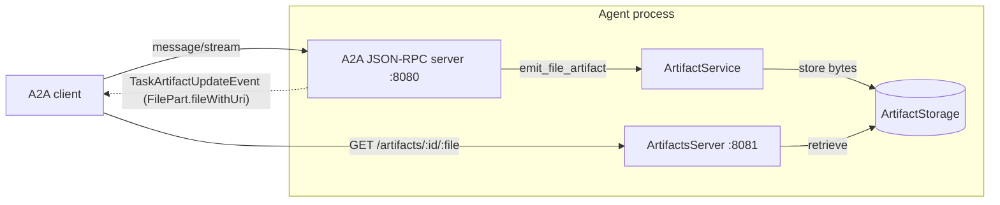

# Rust ADK

The Rust ADK (`inference-gateway-adk`) is the Rust [Agent Development Kit](https://github.com/inference-gateway/rust-adk) for building [A2A (Agent-to-Agent)](/a2a/) servers. It mirrors the [Go ADK](https://github.com/inference-gateway/adk) handler semantics and consumes the same canonical A2A schema, so agents written against either ADK speak the same wire protocol.

> **Pre-1.0 status.** The Rust ADK is in early development and its public API may change between minor versions. Pin an exact version in production.

This page documents the **artifacts subsystem** - the way agents produce downloadable file artifacts (reports, images, structured-data dumps) and hand A2A clients a **URI** rather than inline base64 bytes embedded in JSON-RPC responses. It mirrors the Go ADK artifacts surface too, so artifact-producing agents behave identically on the wire across ADKs. The subsystem landed in [rust-adk#34](https://github.com/inference-gateway/rust-adk/pull/34).

## Overview

The subsystem has four moving parts, each behind a trait so production deployments can swap in their own backends:

| Layer         | Trait / type                                                               | Default                                         |
| ------------- | -------------------------------------------------------------------------- | ----------------------------------------------- |
| Configuration | `ArtifactsConfig` (in `config.rs`)                                         | disabled (`ARTIFACTS_ENABLE=false`)             |
| Storage       | `ArtifactStorage` (`store`, `retrieve`, `exists`, `delete`, `cleanup_*`)   | `FilesystemArtifactStorage`                     |
| Service       | `ArtifactService` (`create_*_artifact`, `add_artifact_to_task`, retention) | `DefaultArtifactService`                        |
| HTTP surface  | `ArtifactsServer` (`GET /health`, `GET /artifacts/:artifact_id/:filename`) | `0.0.0.0:8081` listener with byte-range support |

When `ARTIFACTS_ENABLE=true`, `A2AServer::serve(...)` starts the artifacts HTTP server on its own socket alongside the main A2A JSON-RPC server and runs a background retention loop that prunes expired and over-cap blobs. The artifacts server reuses the same TLS machinery as the A2A endpoint, so it can sit behind TLS/mTLS too.



The streaming handler writes the artifact through the service into storage, attaches an `Artifact` (carrying a `FilePart` with `fileWithUri` set) to the stored task, and emits a `TaskArtifactUpdateEvent` over the SSE stream. The client treats the URI as opaque and downloads the bytes directly - either from the ADK's artifacts server or, with the MinIO backend, straight from the object store.

All artifact types live behind the public exports from the crate root (`inference_gateway_adk`): `ArtifactStorage`, `FilesystemArtifactStorage`, `MinioArtifactStorage`, `ArtifactService`, `DefaultArtifactService`, `ArtifactsServer`, plus the config types `ArtifactsConfig`, `ArtifactsServerConfig`, `ArtifactsStorageConfig`, `ArtifactRetentionConfig`, and `ArtifactsStorageProvider`.

## Storage backends

`ArtifactStorage` is the pluggable backend trait. Its surface is intentionally small - `store`, `retrieve`, `exists`, `delete`, plus `cleanup_expired` / `cleanup_oldest` for the retention loop and a `url(...)` helper that builds the public URI baked into file artifacts. Two backends ship in the box.

### Filesystem (default)

`FilesystemArtifactStorage` is the zero-config default. It lays files out under `<base_path>/<artifact_id>/<filename>` and sanitizes paths to prevent traversal. The artifacts HTTP server streams blobs back out of this directory with content-type inference, a `Content-Disposition` header, and HTTP byte-range support.

### MinIO (behind the `minio` Cargo feature)

`MinioArtifactStorage` implements the same `ArtifactStorage` trait against an S3-compatible MinIO server. It is gated behind the `minio` Cargo feature, which pulls in the [`minio`](https://crates.io/crates/minio) crate:

```toml
[dependencies]
inference-gateway-adk = { version = "0.4", features = ["minio"] }
```

Selecting `ARTIFACTS_STORAGE_PROVIDER=minio` **without** compiling the `minio` feature is not an error - the builder logs a `warn!` and falls back to the filesystem store, so the `ARTIFACTS_STORAGE_*` env surface stays valid either way.

On startup `MinioArtifactStorage::from_config` checks for the target bucket and creates it if missing. With `ARTIFACTS_STORAGE_BASE_URL` pointed at the MinIO endpoint, `url(...)` emits a path-style `http://<endpoint>/<bucket>/<artifact_id>/<filename>` so clients download **directly from MinIO**, bypassing the ADK's artifacts HTTP server entirely - the way you would offload bulk transfer in production. See [Production notes](#production-notes) for the private-bucket trade-off.

## The artifact service

`ArtifactService` is the helper layer between your handler and the storage backend. The bundled `DefaultArtifactService` covers the full artifact lifecycle:

- `create_text_artifact`, `create_file_artifact`, `create_uri_artifact`, and `create_data_artifact` - mint the different `Part` kinds. File and data artifacts are persisted to storage and returned as a `FilePart` with `fileWithUri` set (data artifacts also serialize as A2A `DataPart`s).
- `add_artifact_to_task` - attach a created `Artifact` to a stored task so it is included in `tasks/get` responses.
- `retrieve` / `exists` / `cleanup` - read-side and retention helpers used by the artifacts server and the background cleanup loop.

Most handlers never call the service directly; they go through the `StreamEmitter` helpers below, which wrap it.

## The artifacts HTTP server

`ArtifactsServer` is a standalone [Axum](https://github.com/tokio-rs/axum) app on its own socket (default `0.0.0.0:8081`), kept separate from the A2A JSON-RPC surface so bulk-download traffic does not entangle the protocol endpoint. It exposes two routes:

| Route                                   | Purpose                                                                                    |
| --------------------------------------- | ------------------------------------------------------------------------------------------ |
| `GET /health`                           | Liveness probe for load balancers and orchestrators.                                       |
| `GET /artifacts/:artifact_id/:filename` | Streams a stored blob with content-type inference, `Content-Disposition`, and byte ranges. |

Because it reuses the A2A endpoint's `build_server_config` TLS machinery, enabling TLS/mTLS on the agent also covers the artifacts server.

## Enabling artifacts on the server

`A2AServerBuilder::with_config(config)` auto-wires the artifacts subsystem from `config.artifacts_config` whenever `enable` is `true` - no extra builder calls are required. `A2AServer::serve(addr)` then spawns the artifacts server and the retention loop next to the A2A server:

```rust
use inference_gateway_adk::{
    A2AServerBuilder, ArtifactsConfig, ArtifactsServerConfig, ArtifactsStorageConfig, Config,
};

let config = Config {
    artifacts_config: ArtifactsConfig {
        enable: true,
        server: ArtifactsServerConfig {
            port: 8088,
            ..Default::default()
        },
        storage: ArtifactsStorageConfig {
            base_path: "./artifacts-data".to_string(),
            base_url: "http://localhost:8088".to_string(),
            ..Default::default()
        },
        retention: Default::default(),
    },
    ..Config::default()
};

let server = A2AServerBuilder::new()
    .with_config(config)
    .with_agent_card_from_file(".well-known/agent.json", None)
    .with_default_task_handlers()
    .build()
    .await?;

// Serves the A2A JSON-RPC API on this address AND the artifacts
// server on `config.artifacts_config.server` (here :8088).
server.serve("0.0.0.0:8087".parse()?).await?;
```

To supply a custom backend - your own `ArtifactStorage` or a fully custom `ArtifactService` - pass it via `A2AServerBuilder::with_artifact_service(...)`, the same way `with_storage(...)` overrides the task store.

### Loading config from the environment

The artifacts subsystem uses its own `ARTIFACTS_` env prefix (matching the Go ADK and the bundled examples) rather than the `A2A_` prefix the rest of `Config` uses. Load it independently and assign the result onto `Config::artifacts_config`:

```rust
use inference_gateway_adk::{ArtifactsConfig, Config};

let artifacts_config = envy::prefixed("ARTIFACTS_")
    .from_env::<ArtifactsConfig>()
    .unwrap_or_default();

let config = Config {
    artifacts_config,
    ..Config::default()
};
```

> `Config::artifacts_config` is `#[serde(skip)]`, so an `envy::prefixed("A2A_").from_env::<Config>()` load never touches it. Load the two prefixes separately.

## Emitting artifacts from a streaming handler

Streaming task handlers mint artifacts mid-stream through the `StreamEmitter`:

- `emit_file_artifact(task_id, context_id, filename, bytes, content_type, last_chunk)` - persists raw bytes and emits a file artifact whose `FilePart.fileWithUri` points at the artifacts server (URL prefix taken from `ARTIFACTS_STORAGE_BASE_URL`).
- `emit_data_artifact(...)` - emits a structured-data artifact as an A2A `DataPart`.

Both routes write to storage, attach the `Artifact` to the stored task, and publish a `TaskArtifactUpdateEvent` to the SSE stream. The following handler emits a one-shot text report as `report.txt`:

```rust
use inference_gateway_adk::a2a_types::{Message as A2AMessage, Task, TaskState};
use inference_gateway_adk::{StreamEmitter, StreamableTaskHandler};

#[derive(Debug)]
struct ReportHandler;

#[async_trait::async_trait]
impl StreamableTaskHandler for ReportHandler {
    async fn handle_streaming_task(
        &self,
        task: Task,
        _message: Option<A2AMessage>,
        emitter: StreamEmitter,
    ) -> anyhow::Result<()> {
        // 1. Announce that work has started.
        emitter
            .emit_status(&task.id, &task.context_id, TaskState::TaskStateWorking, None, false)
            .await?;

        // 2. Produce and persist a file artifact. The trailing `true`
        //    marks this as the final (and only) chunk of the artifact.
        let report = format!(
            "# Generated Report\n\nTask id: {}\nContext id: {}\n",
            task.id, task.context_id,
        );
        emitter
            .emit_file_artifact(
                &task.id,
                &task.context_id,
                "report.txt",
                report.into_bytes(),
                Some("text/plain"),
                true,
            )
            .await?;

        // 3. Close out the task.
        emitter
            .emit_status(&task.id, &task.context_id, TaskState::TaskStateCompleted, None, true)
            .await
    }
}
```

Wire the handler into the builder with `.with_streaming_task_handler(ReportHandler)`. The client opens `message/stream`, reads the `FilePart.fileWithUri` off the `TaskArtifactUpdateEvent`, and fetches it with a plain HTTP GET - it never needs to know about artifact IDs or storage layout.

## Configuration reference

The artifacts subsystem is configured entirely through the `ARTIFACTS_*` environment-variable surface, loaded via `envy::prefixed("ARTIFACTS_").from_env::<ArtifactsConfig>()`. Every value falls back to the default below when unset.

| Variable                               | Default                 | Description                                                                                                                                            |
| -------------------------------------- | ----------------------- | ------------------------------------------------------------------------------------------------------------------------------------------------------ |
| `ARTIFACTS_ENABLE`                     | `false`                 | Master switch. When `true`, `A2AServer::serve(...)` spawns the artifacts server and retention loop.                                                    |
| `ARTIFACTS_SERVER_HOST`                | `0.0.0.0`               | Bind address of the artifacts HTTP server.                                                                                                             |
| `ARTIFACTS_SERVER_PORT`                | `8081`                  | Port of the artifacts HTTP server.                                                                                                                     |
| `ARTIFACTS_SERVER_READ_TIMEOUT`        | `30s`                   | Per-request read timeout.                                                                                                                              |
| `ARTIFACTS_SERVER_WRITE_TIMEOUT`       | `30s`                   | Per-response write timeout.                                                                                                                            |
| `ARTIFACTS_STORAGE_PROVIDER`           | `filesystem`            | `filesystem` or `minio`. The `minio` provider requires the `minio` Cargo feature; without it, requests fall back to filesystem storage with a `warn!`. |
| `ARTIFACTS_STORAGE_BASE_PATH`          | `./artifacts`           | On-disk root for the `filesystem` provider.                                                                                                            |
| `ARTIFACTS_STORAGE_BASE_URL`           | `http://localhost:8081` | Public URL prefix baked into file artifact URIs. Point it at wherever the artifacts server (or MinIO endpoint) is externally reachable.                |
| `ARTIFACTS_STORAGE_ENDPOINT`           | unset                   | MinIO endpoint URL. A `https://` scheme implies SSL.                                                                                                   |
| `ARTIFACTS_STORAGE_ACCESS_KEY`         | unset                   | MinIO access key.                                                                                                                                      |
| `ARTIFACTS_STORAGE_SECRET_KEY`         | unset                   | MinIO secret key.                                                                                                                                      |
| `ARTIFACTS_STORAGE_BUCKET_NAME`        | unset                   | MinIO bucket name. Created on startup if missing.                                                                                                      |
| `ARTIFACTS_STORAGE_REGION`             | unset                   | MinIO region.                                                                                                                                          |
| `ARTIFACTS_STORAGE_USE_SSL`            | `false`                 | Whether to use TLS when talking to the MinIO endpoint.                                                                                                 |
| `ARTIFACTS_RETENTION_MAX_ARTIFACTS`    | `5`                     | Cap on the total number of artifacts kept by the backend.                                                                                              |
| `ARTIFACTS_RETENTION_MAX_AGE`          | `168h`                  | Maximum age before an artifact is pruned.                                                                                                              |
| `ARTIFACTS_RETENTION_CLEANUP_INTERVAL` | `24h`                   | Frequency of the retention loop.                                                                                                                       |

Duration values (`*_TIMEOUT`, `*_MAX_AGE`, `*_CLEANUP_INTERVAL`) accept Go-style suffixes - `30s`, `15m`, `2h`, `7d` - or a bare integer interpreted as seconds. An unknown suffix such as `5w` is rejected at load time.

## Example: filesystem backend

A runnable end-to-end demo lives at [`examples/artifacts-filesystem`](https://github.com/inference-gateway/rust-adk/tree/main/examples/artifacts-filesystem). The streaming handler emits a small text report and the client downloads it directly from the artifacts server. Two HTTP servers run in the same process: A2A JSON-RPC on `:8087` and the artifacts server on `:8088`.

```yaml
# examples/artifacts-filesystem/docker-compose.yaml (env excerpt)
services:
  server:
    ports:
      - '8087:8087' # A2A JSON-RPC
      - '8088:8088' # Artifacts HTTP (exposed for host-side curl/debug)
    environment:
      ARTIFACTS_ENABLE: 'true'
      ARTIFACTS_SERVER_HOST: '0.0.0.0'
      ARTIFACTS_SERVER_PORT: '8088'
      ARTIFACTS_STORAGE_PROVIDER: filesystem
      ARTIFACTS_STORAGE_BASE_PATH: /data/artifacts
      # Baked into FilePart.fileWithUri. Uses the Docker service name so the
      # client container can resolve it; host-side curl still works via 8088.
      ARTIFACTS_STORAGE_BASE_URL: http://server:8088
      ARTIFACTS_RETENTION_MAX_ARTIFACTS: '5'
      ARTIFACTS_RETENTION_MAX_AGE: '168h'
      ARTIFACTS_RETENTION_CLEANUP_INTERVAL: '24h'
    volumes:
      - ./server/artifacts-data:/data/artifacts
```

Run it:

```bash
cd examples/artifacts-filesystem
docker compose up --build
```

No `.env` and no provider keys are required. The filesystem provider lays files out under `<base_path>/<artifact_id>/<filename>`; the compose stack bind-mounts the container store to `./server/artifacts-data/` so produced files are inspectable after the run. The full artifact URI is printed by the client log line beginning `received file artifact`.

## Example: MinIO backend

[`examples/artifacts-minio`](https://github.com/inference-gateway/rust-adk/tree/main/examples/artifacts-minio) demonstrates the same flow against a MinIO container, with `FilePart.fileWithUri` pointing **directly at MinIO**. The compose stack adds a `minio/minio` service plus a one-shot `minio/mc` init container that creates the `artifacts` bucket with an anonymous-download policy, and builds the server with `CARGO_FEATURES=minio`.

```yaml
# examples/artifacts-minio/docker-compose.yaml (excerpt)
services:
  minio:
    image: minio/minio:latest
    command: server /data --console-address ':9001'
    ports:
      - '9000:9000' # MinIO API
      - '9001:9001' # MinIO console
    environment:
      MINIO_ROOT_USER: minioadmin
      MINIO_ROOT_PASSWORD: minioadmin

  createbucket:
    image: minio/mc:latest
    depends_on:
      minio:
        condition: service_healthy
    entrypoint:
      - /bin/sh
      - -c
      - |
        /usr/bin/mc alias set local http://minio:9000 minioadmin minioadmin &&
        /usr/bin/mc mb --ignore-existing local/artifacts &&
        /usr/bin/mc anonymous set download local/artifacts &&
        exit 0

  server:
    build:
      args:
        CARGO_FEATURES: minio # compiles the `minio` crate in
    environment:
      ARTIFACTS_STORAGE_ENDPOINT: http://minio:9000
      ARTIFACTS_STORAGE_ACCESS_KEY: minioadmin
      ARTIFACTS_STORAGE_SECRET_KEY: minioadmin
      ARTIFACTS_STORAGE_BUCKET_NAME: artifacts
      # Points at MinIO via the Docker service name; downloads bypass the
      # artifacts HTTP server entirely. The bucket has an anonymous-download
      # policy (set by `createbucket` above).
      ARTIFACTS_STORAGE_BASE_URL: http://minio:9000
```

The MinIO server's handler picks `ArtifactsStorageProvider::Minio` and runs the same `emit_file_artifact` code as the filesystem example - only the storage backend and `ARTIFACTS_STORAGE_*` env differ:

```rust
use inference_gateway_adk::{ArtifactsConfig, ArtifactsStorageProvider, Config};

let mut artifacts_config = envy::prefixed("ARTIFACTS_")
    .from_env::<ArtifactsConfig>()?;
artifacts_config.enable = true;
artifacts_config.storage.provider = ArtifactsStorageProvider::Minio;

let config = Config { artifacts_config, ..Config::default() };
```

Run it:

```bash
cd examples/artifacts-minio
docker compose up --build
```

The MinIO-specific env vars default to a local-friendly setup:

| Variable                        | Example default         | Description                                          |
| ------------------------------- | ----------------------- | ---------------------------------------------------- |
| `ARTIFACTS_STORAGE_ENDPOINT`    | `http://localhost:9000` | MinIO endpoint URL. `https://` implies SSL.          |
| `ARTIFACTS_STORAGE_ACCESS_KEY`  | `minioadmin`            | Static access key.                                   |
| `ARTIFACTS_STORAGE_SECRET_KEY`  | `minioadmin`            | Static secret key.                                   |
| `ARTIFACTS_STORAGE_BUCKET_NAME` | `artifacts`             | Target bucket. Created on startup if missing.        |
| `ARTIFACTS_STORAGE_BASE_URL`    | `http://localhost:9000` | Public URL prefix baked into `FilePart.fileWithUri`. |

The retention and artifacts-server bind variables from the [configuration reference](#configuration-reference) apply here too.

## Production notes

- **Anonymous-read buckets are a deployment choice, not a default.** If your MinIO bucket is private, point `ARTIFACTS_STORAGE_BASE_URL` at the ADK's artifacts HTTP server instead of the object store; the server then proxies the fetch through `ArtifactStorage::retrieve()`. The trade-off is bulk traffic flowing through your agent process rather than straight from MinIO.
- **Pre-signed URLs are not yet wired in.** A future enhancement could have `MinioArtifactStorage::url(...)` mint a time-limited pre-signed GET so a private bucket needs no proxying.
- **Retention** runs `cleanup_expired` / `cleanup_oldest` over a listing of stored objects - fine for thousands of artifacts. Past that, prefer MinIO bucket lifecycle policies for the bulk of expiry.

## Related

- [A2A Integration](/a2a/) - the Agent-to-Agent protocol the artifacts ride on.
- [TypeScript ADK](/typescript-adk/) - the Node.js ADK with the same A2A semantics.
- [Rust ADK on GitHub](https://github.com/inference-gateway/rust-adk) - source, the `README.md` artifacts section, and the runnable examples.
