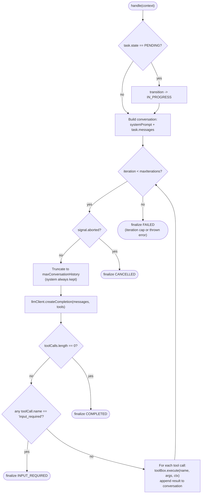

# TypeScript ADK

The TypeScript ADK (`@inference-gateway/adk`) is the Node.js Agent Development Kit for building [A2A (Agent-to-Agent)](/a2a/) servers in TypeScript. It mirrors the [Go ADK](https://github.com/inference-gateway/adk) handler semantics and consumes the same canonical A2A schema (pinned from [inference-gateway/schemas](https://github.com/inference-gateway/schemas)), so agents written against either ADK speak the same wire protocol.

> **Pre-1.0 status.** The package is in early bootstrap. The public API is not yet stable and may change between minor versions until `1.0.0` is cut. Pin an exact version in production until then.

## Installation

```bash
pnpm add @inference-gateway/adk
```

- Requires **Node.js 24 LTS or newer**.
- The package is **ESM-only** (no CommonJS build). Consumers must use `import` syntax or dynamic `import()`.
- Repository: [inference-gateway/typescript-adk](https://github.com/inference-gateway/typescript-adk).

## What ships today

The ADK currently exposes the HTTP server core and the first A2A JSON-RPC method handler:

| Surface                                     | Status    | Notes                                                                                                          |
| ------------------------------------------- | --------- | -------------------------------------------------------------------------------------------------------------- |
| `A2AServer` / `createA2AServer`             | Available | Hono-backed HTTP server. Serves `/.well-known/agent-card.json`, `/health`, and JSON-RPC.                       |
| `MethodRegistry` / `registerMethod`         | Available | Per-server JSON-RPC method dispatch table.                                                                     |
| `InMemoryTaskStorage`                       | Available | In-process task queue + active task map. Swap for a custom `TaskStorage` in production.                        |
| `createMessageSendHandler`                  | Available | Synchronous `message/send` handler.                                                                            |
| `createMessageStreamHandler`                | Available | Streaming `message/stream` handler. SSE response wrapped in CloudEvents v1.0 envelopes.                        |
| `createTaskGetHandler`                      | Available | Synchronous `tasks/get` handler. Looks up a task across active and dead-letter storage.                        |
| `createTaskListHandler`                     | Available | Synchronous `tasks/list` handler. Filterable, keyset-paginated over `(createdAt, id)`.                         |
| `createTaskCancelHandler`                   | Available | Synchronous `tasks/cancel` handler. Drops `PENDING` from the queue, aborts in-flight.                          |
| `TaskCancellationRegistry`                  | Available | Shared `taskId -> AbortController` map bridging `tasks/cancel` and streaming handlers.                         |
| `DefaultBackgroundTaskHandler`              | Available | LLM-driven agentic loop with tool dispatch, history truncation, and an iteration cap.                          |
| `AgentBuilder`                              | Available | Fluent builder for an `OpenAICompatibleAgent`; defaults match the Go ADK byte-for-byte.                        |
| `A2AServerBuilder`                          | Available | Fluent server builder; validates that the agent card's capabilities match the handlers.                        |
| `createGetAuthenticatedExtendedCardHandler` | Available | Synchronous `agent/getAuthenticatedExtendedCard` handler; returns the configured extended card.                |
| `HTTPPushNotificationSender`                | Available | HTTP webhook delivery primitive for `task_update` payloads, with retry / auth / fan-out helpers.               |
| `ArtifactService` + storage backends        | Available | Build text/file/data artifacts; persist via filesystem, MinIO/S3, or in-memory storage.                        |
| `registerArtifactsRoute`                    | Available | `GET /artifacts/:artifactId/:filename` download route; auto-mounted by `createA2AServer({ artifactStorage })`. |
| `TelemetryProvider`                         | Available | OpenTelemetry tracing; emits `adk.jsonrpc.request` server spans exported over OTLP.                            |
| `MetricsRegistry` / `MetricsServer`         | Available | Prometheus `a2a_*` metrics via a standalone `/metrics` server plus a request middleware.                       |
| TLS server / client                         | Available | HTTPS and mutual TLS for `A2AServer` and the bundled A2A client.                                               |

## The `message/send` JSON-RPC method

`message/send` is the synchronous entrypoint a client uses to submit a new conversation turn to the agent. The handler:

1. Validates the JSON-RPC `params` payload against `MessageSendParams`.
2. Mints a fresh task `id` (always) and, when the inbound message omits them, a fresh `contextId` and `messageId`.
3. Constructs a `PENDING` `ManagedTask`, persists it, and enqueues it on the configured `TaskStorage`.
4. Returns the wire-format `Task` immediately - it does **not** wait for any background worker.

This mirrors the Go ADK's [`HandleMessageSend`](https://github.com/inference-gateway/adk) / `CreateTaskFromMessage` semantics. Examples written against the Go ADK transfer over directly.

> Need the agent's reply to land incrementally rather than after the whole turn finishes? Use [`message/stream`](#the-message-stream-json-rpc-method) instead - same JSON-RPC params, but the response is a Server-Sent Events stream of CloudEvents v1.0 frames carrying status transitions and partial-message deltas.

### Registering the handler

```ts
import {
  MESSAGE_SEND_METHOD,
  createA2AServer,
  createMessageSendHandler,
} from '@inference-gateway/adk';
import { InMemoryTaskStorage } from '@inference-gateway/adk';
import type { AgentCard } from '@inference-gateway/adk';

const card: AgentCard = {
  name: 'echo-agent',
  description: 'Echoes user input back.',
  version: '0.1.0',
  protocolVersion: '1.0',
  defaultInputModes: ['text/plain'],
  defaultOutputModes: ['text/plain'],
  capabilities: { streaming: false },
  skills: [{ id: 'echo', name: 'Echo', description: 'Echo input.', tags: [] }],
};

const storage = new InMemoryTaskStorage();
const server = createA2AServer({ card });

server.registerMethod(MESSAGE_SEND_METHOD, createMessageSendHandler({ storage }));

await server.listen(8080, '0.0.0.0');
```

> **Use the exported method-name constant.** `MESSAGE_SEND_METHOD` resolves to the string `'message/send'`. Importing it (rather than hard-coding the literal) keeps the registration in lockstep with conformance tests and other consumers.

### Handler options

`createMessageSendHandler(options)` accepts:

| Option        | Required | Default             | Description                                                                                                   |
| ------------- | -------- | ------------------- | ------------------------------------------------------------------------------------------------------------- |
| `storage`     | Yes      | -                   | Implementation of `TaskStorage` used to persist and enqueue the created task.                                 |
| `idGenerator` | No       | `crypto.randomUUID` | UUID generator used for the new task id, and for the context/message ids when the inbound message omits them. |
| `now`         | No       | `() => new Date()`  | Clock injection point for the task's status timestamp. Useful for deterministic tests.                        |

Both injection points exist primarily for testability. Production code should rely on the defaults.

### Request shape (`MessageSendParams`)

The JSON-RPC `params` object for `message/send` is:

```ts
interface MessageSendParams {
  readonly message: Message; // required
  readonly configuration?: SendMessageConfiguration;
  readonly metadata?: Struct; // free-form per-call metadata
}
```

`message` follows the A2A `Message` type from the generated schema:

| Field       | Required        | Notes                                                                                                 |
| ----------- | --------------- | ----------------------------------------------------------------------------------------------------- |
| `role`      | Yes             | Typically `'ROLE_USER'` for inbound traffic.                                                          |
| `parts`     | Yes (non-empty) | Array of `Part` objects (text, file, data). At least one element.                                     |
| `messageId` | No              | If omitted or empty, the handler mints a UUID.                                                        |
| `contextId` | No              | If omitted or empty, the handler mints a UUID. When present, it is reused so multi-turn state aligns. |

> The shape of `MessageSendParams` deliberately mirrors `types.MessageSendParams` from the Go ADK. The generated A2A schema models the HTTP-level `SendMessageRequest` envelope, which is a different shape from the JSON-RPC `params` payload - the ADK exposes the JSON-RPC form so registrations stay aligned with the dispatcher.

### Response shape

On success the handler returns the wire-format `Task`:

```jsonc
{
  "id": "9c8b8b7e-...", // always freshly minted
  "contextId": "ctx-1", // reused from request, or freshly minted
  "status": {
    "state": "TASK_STATE_SUBMITTED", // wire representation of the internal PENDING state
    "timestamp": "2026-05-26T12:00:00.000Z",
  },
  "history": [
    {
      "messageId": "client-msg",
      "role": "ROLE_USER",
      "contextId": "ctx-1",
      "parts": [{ "text": "hello agent" }],
    },
  ],
}
```

> **Status mapping.** The task is stored as `PENDING` in the internal `ManagedTask` model, and surfaced on the wire as `TASK_STATE_SUBMITTED`. Both refer to the same lifecycle stage: "accepted, queued, not yet processed." Clients see only the wire form.

The handler returns synchronously - the task is **already enqueued** by the time the caller receives the response. Downstream processing (LLM invocation, tool calls, status transitions) happens out of band and will eventually update the stored task; clients poll subsequent updates via [`tasks/get`](#the-tasks-get-json-rpc-method) or stream them via [`message/stream`](#the-message-stream-json-rpc-method).

### Id semantics

The id contract is intentionally narrow so that proxies, fan-out clients, and replay tooling all behave predictably:

| Field               | Behaviour                                                                                 |
| ------------------- | ----------------------------------------------------------------------------------------- |
| Task `id`           | **Always freshly minted.** A client-supplied task id (if any) is ignored.                 |
| `message.contextId` | **Reused** when the client provides a non-empty value. Otherwise, a fresh UUID is minted. |
| `message.messageId` | **Reused** when the client provides a non-empty value. Otherwise, a fresh UUID is minted. |

The freshly-minted `contextId` (when applicable) is written back onto the message in `history`, so the stored conversation always carries the canonical id.

### Validation contract

All validation failures surface as JSON-RPC error code `-32602 Invalid Params` with a human-readable `message`. The handler rejects:

| Failure                                               | Error message contains                      |
| ----------------------------------------------------- | ------------------------------------------- |
| `params` is `null`, an array, or not an object        | `expected MessageSendParams object`         |
| `params.message` is missing, `null`, or not an object | `message is required and must be an object` |
| `params.message.parts` is missing or not an array     | `message.parts must be a non-empty array`   |
| `params.message.parts` is an empty array              | `message.parts must be a non-empty array`   |

On validation failure the handler throws **before** touching storage, so the task queue is never partially populated.

## Runnable example

Start the server from the [Registering the handler](#registering-the-handler) snippet above (`node ./dist/server.js` or whatever your build emits), then send a happy-path request:

```bash
curl -sS -X POST http://localhost:8080/ \
  -H 'Content-Type: application/json' \
  --data '{
    "jsonrpc": "2.0",
    "id": 1,
    "method": "message/send",
    "params": {
      "message": {
        "messageId": "client-msg",
        "role": "ROLE_USER",
        "contextId": "ctx-1",
        "parts": [{ "text": "hello agent" }]
      }
    }
  }'
```

Response:

```json
{
  "jsonrpc": "2.0",
  "id": 1,
  "result": {
    "id": "9c8b8b7e-3f4a-4b6e-9a1d-1b2c3d4e5f60",
    "contextId": "ctx-1",
    "status": {
      "state": "TASK_STATE_SUBMITTED",
      "timestamp": "2026-05-26T12:00:00.000Z"
    },
    "history": [
      {
        "messageId": "client-msg",
        "role": "ROLE_USER",
        "contextId": "ctx-1",
        "parts": [{ "text": "hello agent" }]
      }
    ]
  }
}
```

An invalid request (missing `parts`) returns a structured JSON-RPC error envelope rather than a 4xx HTTP status:

```bash
curl -sS -X POST http://localhost:8080/ \
  -H 'Content-Type: application/json' \
  --data '{
    "jsonrpc": "2.0",
    "id": 2,
    "method": "message/send",
    "params": {
      "message": { "messageId": "m", "role": "ROLE_USER" }
    }
  }'
```

```json
{
  "jsonrpc": "2.0",
  "id": 2,
  "error": {
    "code": -32602,
    "message": "invalid params: message.parts must be a non-empty array"
  }
}
```

The integration fixtures backing every example on this page live at [`tests/server/message-send.test.ts`](https://github.com/inference-gateway/typescript-adk/blob/main/tests/server/message-send.test.ts) in the source repo - useful as a copy-paste starting point for your own tests.

## The `tasks/get` JSON-RPC method

`tasks/get` is the synchronous lookup method a client uses to fetch a single task by id. The handler:

1. Validates the JSON-RPC `params` payload against `TaskGetParams`.
2. Calls `TaskStorage.getTask(taskId)`, which searches the active map first and then the dead-letter store.
3. Returns the wire-format `Task` - optionally truncating `history` to the most recent `historyLength` messages.

This mirrors the Go ADK's [`HandleTaskGet`](https://github.com/inference-gateway/adk/blob/main/server/task_handler.go) semantics, including the choice to surface a missing task as JSON-RPC `-32602` rather than a custom error code. To enumerate tasks rather than fetch one by id, use [`tasks/list`](#the-tasks-list-json-rpc-method) instead.

### Registering the handler

```ts
import { TASK_GET_METHOD, createTaskGetHandler } from '@inference-gateway/adk';

server.registerMethod(TASK_GET_METHOD, createTaskGetHandler({ storage }));
```

> `TASK_GET_METHOD` resolves to the string `'tasks/get'`. Use the exported constant rather than the literal so the registration stays in lockstep with conformance tests.

### Request and response shape

```ts
interface TaskGetParams {
  readonly taskId: string; // required, non-empty
  readonly historyLength?: number; // non-negative integer; omit for full history
  readonly metadata?: Struct;
}
```

On success the handler returns the wire-format `Task` - the same shape `message/send` returns - reflecting the task's current `status`, full or truncated `history`, and any `artifacts` produced so far.

### Validation contract

All failures surface as JSON-RPC error code `-32602 Invalid Params`:

| Failure                                                | Error message contains                              |
| ------------------------------------------------------ | --------------------------------------------------- |
| `params` is `null`, an array, or not an object         | `expected TaskGetParams object`                     |
| `taskId` missing, empty, or not a string               | `taskId is required and must be a non-empty string` |
| `historyLength` present but not a non-negative integer | `historyLength must be a non-negative integer`      |
| No task exists with the supplied `taskId`              | `task not found`                                    |

The "not found" case is intentionally surfaced as `-32602` (not a custom code) to mirror the Go ADK; both ADKs return the same JSON-RPC envelope for a missing task.

## The `tasks/list` JSON-RPC method

`tasks/list` is the synchronous enumeration method a client uses to page through stored tasks. The handler:

1. Validates the JSON-RPC `params` payload against `TaskListParams`.
2. Calls `TaskStorage.listTasks(filter)`, which spans both active and dead-letter stores in FIFO `createdAt` order.
3. Applies the optional `state` / `contextId` filter and a `limit`-bounded keyset slice starting from the supplied `cursor` (if any).
4. Returns `{ tasks, nextCursor? }` - `nextCursor` is **omitted on the final page**, so clients stop paginating when it's absent.

The wire format and pagination semantics match the Go ADK's task-list handler. Use [`tasks/get`](#the-tasks-get-json-rpc-method) when you already know the id of a single task.

### Registering the handler

```ts
import { TASK_LIST_METHOD, createTaskListHandler } from '@inference-gateway/adk';

server.registerMethod(TASK_LIST_METHOD, createTaskListHandler({ storage }));
```

> `TASK_LIST_METHOD` resolves to the string `'tasks/list'`. Use the exported constant rather than the literal so the registration stays in lockstep with conformance tests.

### Handler options

`createTaskListHandler(options)` accepts:

| Option         | Required | Default | Description                                                                                                                                      |
| -------------- | -------- | ------- | ------------------------------------------------------------------------------------------------------------------------------------------------ |
| `storage`      | Yes      | -       | Implementation of `TaskStorage` used to enumerate tasks.                                                                                         |
| `defaultLimit` | No       | `100`   | Page size when the caller omits `limit`. Clamped to `[1, maxLimit]` at construction time so a misconfiguration cannot silently exceed the cap.   |
| `maxLimit`     | No       | `100`   | Hard cap on page size. Requests with `limit` above this are clamped down silently (consistent with the Go ADK's pagination caps - not an error). |

Both `defaultLimit` and `maxLimit` must be positive integers; otherwise the factory throws at registration time.

### Request shape (`TaskListParams`)

```ts
interface TaskListParams {
  readonly state?: TaskState; // filter by status.state (e.g., 'TASK_STATE_COMPLETED')
  readonly contextId?: string; // filter by contextId
  readonly limit?: number; // positive integer; clamped to maxLimit
  readonly cursor?: string; // opaque continuation token from a previous nextCursor
  readonly metadata?: Struct; // free-form per-call metadata
}
```

All fields are optional - a request with no params returns the first page of every task in storage.

> **Treat `cursor` as opaque.** The handler encodes the `(createdAt, id)` of the last item on the previous page as a base64url JSON envelope. The encoding is an implementation detail and may change in any release; clients must round-trip `nextCursor` verbatim and never parse, mutate, or construct one by hand.

### Response shape (`TaskListResult`)

```ts
interface TaskListResult {
  readonly tasks: Task[]; // wire-format tasks, up to `limit` entries
  readonly nextCursor?: string; // omitted on the last page - stop when absent
}
```

### Pagination semantics

The handler uses **keyset pagination on `(createdAt, id)`** rather than offset/limit. The guarantees:

- **Stable under concurrent inserts.** Tasks created between page fetches appear on later pages without shifting items on earlier ones.
- **Stable under concurrent deletes.** If the task referenced by the cursor is deleted, pagination resumes from the first task strictly after that `(createdAt, id)` keypair - the response is well-defined even if the cursor's task no longer exists.
- **No duplicates, no skips.** Each task appears at most once across the full pagination, regardless of insert/delete activity.

This is the same property the Go ADK provides, and is the reason the cursor is keyset-encoded rather than a numeric offset.

### Validation contract

All failures surface as JSON-RPC error code `-32602 Invalid Params` - the same envelope `message/send` and `tasks/get` use:

| Failure                                                                   | Error message contains                                    |
| ------------------------------------------------------------------------- | --------------------------------------------------------- |
| `params` is `null`, an array, or not an object                            | `expected TaskListParams object`                          |
| `state` present but not a non-empty string                                | `state must be a non-empty string`                        |
| `contextId` present but not a non-empty string                            | `contextId must be a non-empty string`                    |
| `limit` present but not a positive integer (`0`, negatives, non-integers) | `limit must be a positive integer`                        |
| `cursor` present but not a non-empty string                               | `cursor must be a non-empty string`                       |
| `cursor` cannot be base64url-decoded                                      | `cursor is not a valid base64url string`                  |
| `cursor` decodes to invalid JSON                                          | `cursor payload is not valid JSON`                        |
| `cursor` decodes to something other than the `{ createdAt, id }` envelope | `cursor payload is malformed` / `missing required fields` |
| `metadata` present but not an object                                      | `metadata must be an object`                              |

A `limit` above `maxLimit` is **not** an error - it is clamped down silently. A `state` value that doesn't match any stored task yields an empty `tasks` array, also not an error.

### Paginating from a client

The canonical loop: keep calling `tasks/list` with the previous response's `nextCursor` until the response omits it.

```ts
import type { Task, TaskListResult } from '@inference-gateway/adk';

const all: Task[] = [];
let cursor: string | undefined;

do {
  const res = await fetch('http://localhost:8080/', {
    method: 'POST',
    headers: { 'Content-Type': 'application/json' },
    body: JSON.stringify({
      jsonrpc: '2.0',
      id: crypto.randomUUID(),
      method: 'tasks/list',
      params: {
        state: 'TASK_STATE_COMPLETED',
        limit: 50,
        ...(cursor !== undefined ? { cursor } : {}),
      },
    }),
  });
  const { result } = (await res.json()) as { result: TaskListResult };
  all.push(...result.tasks);
  cursor = result.nextCursor;
} while (cursor !== undefined);
```

The same flow works against a `curl` loop or any JSON-RPC client - the cursor is a string, full stop.

A single-page request looks like:

```bash
curl -sS -X POST http://localhost:8080/ \
  -H 'Content-Type: application/json' \
  --data '{
    "jsonrpc": "2.0",
    "id": 1,
    "method": "tasks/list",
    "params": { "state": "TASK_STATE_COMPLETED", "limit": 2 }
  }'
```

Response (first page, with a continuation token):

```json
{
  "jsonrpc": "2.0",
  "id": 1,
  "result": {
    "tasks": [
      {
        "id": "9c8b...",
        "contextId": "ctx-1",
        "status": { "state": "TASK_STATE_COMPLETED", "timestamp": "2026-05-26T12:00:00.000Z" },
        "history": []
      },
      {
        "id": "ab12...",
        "contextId": "ctx-1",
        "status": { "state": "TASK_STATE_COMPLETED", "timestamp": "2026-05-26T12:00:01.000Z" },
        "history": []
      }
    ],
    "nextCursor": "eyJjcmVhdGVkQXQiOiIyMDI2LTA1LTI2VDEyOjAwOjAxLjAwMFoiLCJpZCI6ImFiMTIifQ"
  }
}
```

When the next call returns a `result` without `nextCursor`, the client has exhausted the listing.

The integration fixtures for this handler live at [`tests/server/task-list.test.ts`](https://github.com/inference-gateway/typescript-adk/blob/main/tests/server/task-list.test.ts) in the source repo.

## The `tasks/cancel` JSON-RPC method

`tasks/cancel` is the synchronous cancellation method a client uses to stop a queued or in-flight task. The handler:

1. Validates the JSON-RPC `params` payload against `TaskCancelParams`.
2. Looks the task up via `TaskStorage.getTask(taskId)`.
3. Routes by current state:
   - `PENDING` -> drops the task from the FIFO queue so no worker dequeues it, transitions the stored task to `CANCELLED`, writes it to the dead-letter store.
   - `IN_PROGRESS` / `INPUT_REQUIRED` -> calls `registry.cancel(taskId, reason)` on the shared [`TaskCancellationRegistry`](#taskcancellationregistry), which aborts the `AbortController` the running handler registered, then transitions and dead-letters the task.
   - terminal (`COMPLETED` / `FAILED` / `CANCELLED`) -> rejects the call with a JSON-RPC `-32602` error.
   - unknown `taskId` -> rejects the call with a JSON-RPC `-32602` "task not found" error.
4. Returns the wire-format `Task` reflecting the post-cancellation state.

This mirrors the Go ADK's `CancelTask` in [`adk/server/task_manager.go`](https://github.com/inference-gateway/adk/blob/main/server/task_manager.go), including the choice to surface "cannot cancel" cases as `-32602` (same envelope as `tasks/get` and `tasks/list`) rather than a custom error code.

> **Signal, don't wait.** The state transition and dead-letter write are synchronous, but the call does **not** wait for the aborted handler to fully unwind. The handler observes `signal.aborted`, finishes any cleanup it wants, and returns at its own pace. Clients that need to confirm the handler has finished should poll [`tasks/get`](#the-tasks-get-json-rpc-method) for a task whose stored state has settled.

### Registering the handler

```ts
import {
  TASK_CANCEL_METHOD,
  TaskCancellationRegistry,
  createTaskCancelHandler,
} from '@inference-gateway/adk';

const registry = new TaskCancellationRegistry();

server.registerMethod(TASK_CANCEL_METHOD, createTaskCancelHandler({ storage, registry }));
```

> `TASK_CANCEL_METHOD` resolves to the string `'tasks/cancel'`. Use the exported constant rather than the literal so the registration stays in lockstep with conformance tests.

The same `registry` instance must be supplied to every long-running handler (streaming or background) that should be cancellable through `tasks/cancel`. See [`TaskCancellationRegistry`](#taskcancellationregistry) below for the registration / unregistration contract handlers must follow.

When the server is constructed via [`A2AServerBuilder`](#wiring-into-a2aserverbuilder), the builder creates a single `TaskCancellationRegistry`, wires it into the streaming handler, and registers `tasks/cancel` automatically. Manual registration as above is only needed when assembling an `A2AServer` directly.

### Handler options

`createTaskCancelHandler(options)` accepts:

| Option     | Required | Default            | Description                                                                                                                                                                              |
| ---------- | -------- | ------------------ | ---------------------------------------------------------------------------------------------------------------------------------------------------------------------------------------- |
| `storage`  | Yes      | -                  | Implementation of `TaskStorage` used to look up, drop from queue, transition, and dead-letter the task.                                                                                  |
| `registry` | No       | `undefined`        | Shared [`TaskCancellationRegistry`](#taskcancellationregistry). Required when the server runs long-lived handlers; may be omitted for servers that only enqueue work without processing. |
| `now`      | No       | `() => new Date()` | Clock injection point for the cancellation timestamp. Useful for deterministic tests.                                                                                                    |

Omitting `registry` is supported because `PENDING` tasks can still be cancelled without it (they are dropped directly from the FIFO queue). For `IN_PROGRESS` / `INPUT_REQUIRED` tasks the handler still flips the stored state and dead-letters the task, but no `AbortController` is signalled, so the running handler will keep running until it finishes naturally. In a production server you almost always want to pass the registry.

### Request shape (`TaskCancelParams`)

```ts
interface TaskCancelParams {
  readonly taskId: string; // required, non-empty
  readonly metadata?: Struct; // free-form per-call metadata
}
```

`taskId` mirrors the [`tasks/get`](#the-tasks-get-json-rpc-method) field name (the Go ADK's `types.TaskIdParams` uses `id`, but the TypeScript ADK uses `taskId` across the entire `tasks/*` family for consistency).

### Response shape

On success the handler returns the wire-format `Task` whose `status.state` is `TASK_STATE_CANCELLED`:

```jsonc
{
  "id": "9c8b8b7e-...",
  "contextId": "ctx-1",
  "status": {
    "state": "TASK_STATE_CANCELLED",
    "timestamp": "2026-05-26T12:00:01.500Z",
  },
  "history": [/* ... whatever messages had been recorded so far */],
}
```

The cancelled task is moved into the dead-letter store, so a subsequent [`tasks/get`](#the-tasks-get-json-rpc-method) call returns the same record (with `status.state = 'TASK_STATE_CANCELLED'`).

### State-machine behaviour

The handler's branch table - the canonical reference for what `tasks/cancel` does for each inbound state:

| Current task state                             | Queue effect                 | Registry effect                            | Stored state after | Dead-letter | Response                                                      |
| ---------------------------------------------- | ---------------------------- | ------------------------------------------ | ------------------ | ----------- | ------------------------------------------------------------- |
| `PENDING` (`TASK_STATE_SUBMITTED`)             | Removed from FIFO queue      | `cancel()` is still called (no-op if none) | `CANCELLED`        | Written     | `Task` wire form with `status.state = 'TASK_STATE_CANCELLED'` |
| `IN_PROGRESS` (`TASK_STATE_WORKING`)           | No change (was never queued) | `AbortController.abort(reason)` invoked    | `CANCELLED`        | Written     | `Task` wire form with `status.state = 'TASK_STATE_CANCELLED'` |
| `INPUT_REQUIRED` (`TASK_STATE_INPUT_REQUIRED`) | No change                    | `AbortController.abort(reason)` invoked    | `CANCELLED`        | Written     | `Task` wire form with `status.state = 'TASK_STATE_CANCELLED'` |
| `COMPLETED` / `FAILED` / `CANCELLED`           | No change                    | Not invoked                                | Unchanged          | Unchanged   | JSON-RPC `-32602` `task cannot be cancelled in state <state>` |
| Unknown `taskId`                               | No change                    | Not invoked                                | -                  | -           | JSON-RPC `-32602` `task not found`                            |

The abort reason supplied by the handler is a `DOMException('Task cancelled via tasks/cancel', 'AbortError')`. Downstream executors that read `signal.reason` after the abort see this exact instance, so log lines and surfaced errors can distinguish "client disconnected" (the streaming handler's own abort path) from "cancelled via `tasks/cancel`" (this handler's abort path).

### Validation contract

All failures surface as JSON-RPC error code `-32602 Invalid Params` - the same envelope every other `tasks/*` method uses:

| Failure                                        | Error message contains                              |
| ---------------------------------------------- | --------------------------------------------------- |
| `params` is `null`, an array, or not an object | `expected TaskCancelParams object`                  |
| `taskId` missing, empty, or not a string       | `taskId is required and must be a non-empty string` |
| `metadata` present but not an object           | `metadata must be an object`                        |
| No task exists with the supplied `taskId`      | `task not found`                                    |
| Task is already in a terminal state            | `task cannot be cancelled in state <state>`         |

`<state>` is rendered as the internal `ManagedTask` state (`COMPLETED` / `FAILED` / `CANCELLED`), not the wire form, so logs grep against the same identifiers the storage layer uses.

### `TaskCancellationRegistry`

`TaskCancellationRegistry` is the shared `taskId -> AbortController` map that bridges `tasks/cancel` and any long-running handler (streaming, future background worker, custom). It is exported from the server entry of `@inference-gateway/adk` so advanced consumers can plug their own handlers into the cancel pipeline.

The class is single-threaded by virtue of JavaScript's execution model - all mutations are atomic between awaits, so no internal locking is required. It mirrors the Go ADK's `RegisterTaskCancelFunc` / `UnregisterTaskCancelFunc` / `runningTasks` map on `DefaultTaskManager` in [`adk/server/task_manager.go`](https://github.com/inference-gateway/adk/blob/main/server/task_manager.go).

```ts
import { TaskCancellationRegistry } from '@inference-gateway/adk';

const registry = new TaskCancellationRegistry();
```

#### Methods

| Method                         | Returns   | Description                                                                                                                                                      |
| ------------------------------ | --------- | ---------------------------------------------------------------------------------------------------------------------------------------------------------------- |
| `register(taskId, controller)` | `void`    | Register `controller` as the abort controller for `taskId`. Replaces any previously registered controller for the same id.                                       |
| `unregister(taskId)`           | `boolean` | Drop the controller for `taskId` **without** aborting it. Returns `true` if one was registered, `false` otherwise. Safe to call unconditionally from `finally`.  |
| `cancel(taskId, reason?)`      | `boolean` | Abort the controller for `taskId` and drop it. Returns `true` if a controller was registered (and aborted), `false` if no controller was registered for that id. |
| `has(taskId)`                  | `boolean` | True when a controller is registered for `taskId`.                                                                                                               |
| `size()`                       | `number`  | Number of currently registered controllers. Diagnostics only.                                                                                                    |
| `clear()`                      | `void`    | Drop every registered controller without aborting them. Intended for tests; production code should rely on per-task `unregister` calls.                          |

#### Lifecycle contract for handlers

Any handler that owns a long-running task and wants to be cancellable through `tasks/cancel` must register its controller before work starts and unregister it on exit so the map never leaks past task completion:

```ts
import { TaskCancellationRegistry } from '@inference-gateway/adk';
import type { StreamingTaskExecutor } from '@inference-gateway/adk';

function createCustomExecutor(registry: TaskCancellationRegistry): StreamingTaskExecutor {
  return async function* ({ task, signal }) {
    // Bridge the request-scoped `signal` to a controller we can register.
    const controller = new AbortController();
    const forward = () => controller.abort(signal.reason);
    if (signal.aborted) {
      forward();
    } else {
      signal.addEventListener('abort', forward, { once: true });
    }

    registry.register(task.id, controller);
    try {
      // ... drive the LLM / tool calls, propagating `controller.signal`
      // to every cancellable downstream call. Yield deltas / status events
      // as usual. The executor MUST stop yielding promptly once the signal
      // aborts so the outer handler can finalise the task.
      yield { type: 'delta', message: /* ... */ };
    } finally {
      registry.unregister(task.id);
      signal.removeEventListener('abort', forward);
    }
  };
}
```

`unregister` is idempotent: calling it after `cancel()` (or after a different handler took over the same id) returns `false` rather than throwing. That makes the `finally` block above safe regardless of which side of the race finished first.

The bundled streaming handler ([`createMessageStreamHandler`](#the-message-stream-json-rpc-method)) follows this contract internally when wired through [`A2AServerBuilder`](#wiring-into-a2aserverbuilder), so the example above is only relevant when assembling custom executors or non-streaming background handlers that need to participate in cancellation.

### Runnable example

Cancel a task that another client has just enqueued via `message/send`:

```bash
curl -sS -X POST http://localhost:8080/ \
  -H 'Content-Type: application/json' \
  --data '{
    "jsonrpc": "2.0",
    "id": 1,
    "method": "tasks/cancel",
    "params": {
      "taskId": "9c8b8b7e-3f4a-4b6e-9a1d-1b2c3d4e5f60"
    }
  }'
```

Response on a successful cancellation:

```json
{
  "jsonrpc": "2.0",
  "id": 1,
  "result": {
    "id": "9c8b8b7e-3f4a-4b6e-9a1d-1b2c3d4e5f60",
    "contextId": "ctx-1",
    "status": {
      "state": "TASK_STATE_CANCELLED",
      "timestamp": "2026-05-26T12:00:01.500Z"
    },
    "history": [
      {
        "messageId": "client-msg",
        "role": "ROLE_USER",
        "contextId": "ctx-1",
        "parts": [{ "text": "hello agent" }]
      }
    ]
  }
}
```

A cancel against a terminal task returns the structured error envelope (note the HTTP status is still `200`):

```bash
curl -sS -X POST http://localhost:8080/ \
  -H 'Content-Type: application/json' \
  --data '{
    "jsonrpc": "2.0",
    "id": 2,
    "method": "tasks/cancel",
    "params": { "taskId": "9c8b8b7e-3f4a-4b6e-9a1d-1b2c3d4e5f60" }
  }'
```

```json
{
  "jsonrpc": "2.0",
  "id": 2,
  "error": {
    "code": -32602,
    "message": "invalid params: task cannot be cancelled in state COMPLETED"
  }
}
```

And against an unknown id:

```json
{
  "jsonrpc": "2.0",
  "id": 3,
  "error": {
    "code": -32602,
    "message": "invalid params: task not found"
  }
}
```

The integration fixtures backing every assertion above (per-state branch coverage, registry interaction, dead-letter persistence, conformance over the JSON-RPC wire) live at [`tests/server/task-cancel.test.ts`](https://github.com/inference-gateway/typescript-adk/blob/main/tests/server/task-cancel.test.ts) and the registry's own unit tests at [`tests/server/task-cancellation.test.ts`](https://github.com/inference-gateway/typescript-adk/blob/main/tests/server/task-cancellation.test.ts) in the source repo.

## The `message/stream` JSON-RPC method

`message/stream` is the streaming counterpart to `message/send`. The JSON-RPC `params` are structurally identical to `MessageSendParams` - the difference is the response: instead of a single JSON-RPC envelope, the server holds the HTTP connection open and emits an `text/event-stream` response carrying [CloudEvents v1.0](https://github.com/cloudevents/spec/blob/v1.0.2/cloudevents/spec.md) envelopes that narrate the task's lifecycle from `WORKING` through to a terminal state.

The wire format is **byte-identical to the Go ADK's emitter** in `server/agent_streamable.go`. Both ADKs default to `source = 'adk/agent'` for every CloudEvents envelope so cross-language consumers can dedupe / route on a single value. A client that streams correctly against one ADK streams correctly against the other.

### Advertise streaming in the agent card

The agent must declare streaming support in its `AgentCard.capabilities`:

```ts
const card: AgentCard = {
  name: 'streaming-agent',
  description: 'Streams a reply token-by-token.',
  version: '0.1.0',
  protocolVersion: '1.0',
  defaultInputModes: ['text/plain'],
  defaultOutputModes: ['text/plain'],
  capabilities: { streaming: true },
  skills: [{ id: 'echo', name: 'Echo', description: 'Echo input.', tags: [] }],
};
```

Clients that respect the agent card MUST NOT issue `message/stream` against an agent that advertises `streaming: false`.

### Registering the handler

Streaming methods are registered on the server via `registerStreamingMethod`, not `registerMethod`. The server routes incoming requests to the streaming handler when the JSON-RPC `method` matches a streaming registration, opens an SSE response, and drives a user-supplied **executor** through the task lifecycle.

```ts
import {
  AGENT_EVENT_TYPE,
  InMemoryTaskStorage,
  MESSAGE_STREAM_METHOD,
  createA2AServer,
  createMessageStreamHandler,
  type StreamingTaskExecutor,
} from '@inference-gateway/adk';

const storage = new InMemoryTaskStorage();

const executor: StreamingTaskExecutor = async function* ({ message, signal }) {
  for (const chunk of ['hel', 'lo ', 'world']) {
    if (signal.aborted) return;
    yield {
      type: 'delta',
      message: {
        messageId: crypto.randomUUID(),
        role: 'ROLE_AGENT',
        parts: [{ text: chunk }],
      },
    };
  }
  // Returning without yielding a terminal status transitions the task to COMPLETED.
};

const server = createA2AServer({ card });
server.registerStreamingMethod(
  MESSAGE_STREAM_METHOD,
  createMessageStreamHandler({ storage, executor })
);

await server.listen(8080, '0.0.0.0');
```

> **Use the exported method-name constant.** `MESSAGE_STREAM_METHOD` resolves to the string `'message/stream'`. Importing it (rather than hard-coding the literal) keeps the registration in lockstep with conformance tests and other consumers.

#### Executor contract

`StreamingTaskExecutor` is an async generator that yields one of three event shapes:

| Yielded event                                | Effect                                                                                                                                                                   |
| -------------------------------------------- | ------------------------------------------------------------------------------------------------------------------------------------------------------------------------ |
| `{ type: 'delta', message }`                 | Emits an `adk.agent.delta` SSE frame carrying a partial assistant `Message`. Does not change task state.                                                                 |
| `{ type: 'statusChanged', state, message? }` | Transitions the task to `state`, persists it, and emits `adk.agent.task.status.changed`. Terminal states (`COMPLETED` / `FAILED` / `CANCELLED`) end the stream.          |
| `{ type: 'inputRequired', message }`         | Transitions to `INPUT_REQUIRED` with `message` attached. Shortcut for the common tool-use pause; equivalent to a `statusChanged` event but kept separate for ergonomics. |

Lifecycle guarantees the handler enforces on top of what the executor yields:

- **Natural completion** (iterator exhausts without throwing and without yielding a terminal status) -> task transitions to `COMPLETED` automatically.
- **Thrown error** -> task transitions to `FAILED`; the error message is embedded in the final status frame's `status.message`.
- **`signal` aborted** -> task transitions to `CANCELLED`; the executor is expected to stop yielding promptly once it observes the abort.

The executor MUST NOT yield `PENDING` or attempt to re-enter terminal states.

### Handler options

`createMessageStreamHandler(options)` accepts:

| Option                   | Required | Default                                                                | Description                                                                                                                                                                                 |
| ------------------------ | -------- | ---------------------------------------------------------------------- | ------------------------------------------------------------------------------------------------------------------------------------------------------------------------------------------- |
| `storage`                | Yes      | -                                                                      | Implementation of `TaskStorage` used to persist task lifecycle transitions.                                                                                                                 |
| `executor`               | Yes      | -                                                                      | Producer that drives the task; see [Executor contract](#executor-contract).                                                                                                                 |
| `idGenerator`            | No       | `crypto.randomUUID`                                                    | UUID generator used for the task id and for the context / message ids when the inbound message omits them.                                                                                  |
| `now`                    | No       | `() => new Date()`                                                     | Clock injection point for status timestamps. Useful for deterministic tests.                                                                                                                |
| `statusUpdateIntervalMs` | No       | Parsed from `STREAMING_STATUS_UPDATE_INTERVAL`, falling back to `1000` | Interval (ms) between periodic `task.status.changed` re-emits while the task is `IN_PROGRESS`. Pass `0` to disable the heartbeat-style status updates (state-transition frames still fire). |
| `heartbeatMs`            | No       | `30000` (writer default)                                               | SSE comment-frame heartbeat interval. Keeps intermediate proxies from closing the connection. Pass `0` to disable.                                                                          |
| `eventSource`            | No       | `'adk/agent'`                                                          | Override the CloudEvents `source` attribute. Supply a stable URI-reference when running multiple agents and consumers need to disambiguate.                                                 |
| `env`                    | No       | `process.env`                                                          | Override the environment-variable source. Mainly a test seam.                                                                                                                               |

### Event sequence

Every successful `message/stream` invocation emits frames in this order:

1. **`adk.agent.task.status.changed`** with `status.state = 'TASK_STATE_WORKING'`, `final: false` - the task has transitioned out of `PENDING`.
2. **Zero or more `adk.agent.delta`** frames - partial assistant messages, in the order the executor yields them. Each frame carries a `Message` whose `role` is typically `ROLE_AGENT`.
3. **Optional periodic `adk.agent.task.status.changed`** frames with `status.state = 'TASK_STATE_WORKING'`, `final: false` - re-emitted every `statusUpdateIntervalMs` while the task is `IN_PROGRESS`. Acts as an application-level heartbeat distinct from the transport-level SSE comment heartbeat.
4. **Stream-ending `adk.agent.task.status.changed`** - exactly one of:
   - **Terminal**: `status.state in {'TASK_STATE_COMPLETED', 'TASK_STATE_FAILED', 'TASK_STATE_CANCELLED'}`, `final: true`. The stream then closes.
   - **Input required**: `status.state = 'TASK_STATE_INPUT_REQUIRED'`, `final: false`. The task is paused (not done); the stream still closes so the client can submit a follow-up `message/send` against the same `contextId`.

Clients should treat any `task.status.changed` frame as the stream's final application-level frame and stop reading once they have seen it. After the final frame the server closes the underlying TCP connection.

Interleaved transport-level frames the client should be ready to skip:

- **SSE comment heartbeats** of the form `: heartbeat\n\n` - emitted every `heartbeatMs` (default `30s`) while the stream is open. Carry no payload; safe to ignore.

### CloudEvents v1.0 envelope shape

Every `data:` frame body is a CloudEvents v1.0 JSON structured-mode envelope:

```json
{
  "specversion": "1.0",
  "id": "f4d9b1d2-...",
  "source": "adk/agent",
  "type": "adk.agent.task.status.changed",
  "time": "2026-05-26T12:00:00.123Z",
  "datacontenttype": "application/json",
  "subject": "9c8b8b7e-3f4a-4b6e-9a1d-1b2c3d4e5f60",
  "data": {
    "taskId": "9c8b8b7e-3f4a-4b6e-9a1d-1b2c3d4e5f60",
    "contextId": "ctx-1",
    "status": {
      "state": "TASK_STATE_WORKING",
      "timestamp": "2026-05-26T12:00:00.123Z"
    },
    "final": false
  }
}
```

Attribute meanings:

| CloudEvents attribute | Value                                                                                                                          |
| --------------------- | ------------------------------------------------------------------------------------------------------------------------------ |
| `specversion`         | Always `"1.0"`.                                                                                                                |
| `id`                  | Unique per envelope (random UUID by default). Combined with `source`, satisfies the CloudEvents uniqueness rule.               |
| `source`              | `"adk/agent"` by default. Override via `eventSource` to disambiguate fleets of agents.                                         |
| `type`                | One of the `AGENT_EVENT_TYPE.*` constants - for the streaming transport, `adk.agent.task.status.changed` or `adk.agent.delta`. |
| `time`                | RFC 3339 timestamp of when the frame was emitted.                                                                              |
| `datacontenttype`     | Always `"application/json"`.                                                                                                   |
| `subject`             | The `taskId`. Stable across every frame on the stream - use it to correlate frames with the originating call.                  |
| `data`                | The payload. A `TaskStatusUpdateEvent` for `task.status.changed`, or a `Message` for `delta`.                                  |

`data` shape for a `delta` frame:

```json
{
  "specversion": "1.0",
  "id": "...",
  "source": "adk/agent",
  "type": "adk.agent.delta",
  "time": "2026-05-26T12:00:00.250Z",
  "datacontenttype": "application/json",
  "subject": "9c8b8b7e-3f4a-4b6e-9a1d-1b2c3d4e5f60",
  "data": {
    "messageId": "chunk-2",
    "role": "ROLE_AGENT",
    "parts": [{ "text": "lo " }]
  }
}
```

The full list of streaming event-type constants exposed on `AGENT_EVENT_TYPE` (identical to the Go ADK):

| Constant                               | Wire value                      |
| -------------------------------------- | ------------------------------- |
| `AGENT_EVENT_TYPE.DELTA`               | `adk.agent.delta`               |
| `AGENT_EVENT_TYPE.TASK_STATUS_CHANGED` | `adk.agent.task.status.changed` |
| `AGENT_EVENT_TYPE.INPUT_REQUIRED`      | `adk.agent.input.required`      |
| `AGENT_EVENT_TYPE.ITERATION_COMPLETED` | `adk.agent.iteration.completed` |
| `AGENT_EVENT_TYPE.TOOL_STARTED`        | `adk.agent.tool.started`        |
| `AGENT_EVENT_TYPE.TOOL_COMPLETED`      | `adk.agent.tool.completed`      |
| `AGENT_EVENT_TYPE.TOOL_FAILED`         | `adk.agent.tool.failed`         |
| `AGENT_EVENT_TYPE.TOOL_RESULT`         | `adk.agent.tool.result`         |
| `AGENT_EVENT_TYPE.TASK_INTERRUPTED`    | `adk.agent.task.interrupted`    |
| `AGENT_EVENT_TYPE.STREAM_FAILED`       | `adk.agent.stream.failed`       |

`message/stream` itself emits only `DELTA` and `TASK_STATUS_CHANGED`. The remaining types are reserved for higher-level agent loops (tool dispatch, iteration tracking) layered on top of the streaming transport.

### `STREAMING_STATUS_UPDATE_INTERVAL` environment variable

| Variable                           | Default | Format                                                                                                                            | Effect                                                                                                                                                                                |
| ---------------------------------- | ------- | --------------------------------------------------------------------------------------------------------------------------------- | ------------------------------------------------------------------------------------------------------------------------------------------------------------------------------------- |
| `STREAMING_STATUS_UPDATE_INTERVAL` | `1s`    | Bare integer (interpreted as milliseconds, e.g. `250`), or a duration with a `ms` / `s` / `m` suffix (e.g. `500ms`, `30s`, `2m`). | Period at which the handler re-emits `task.status.changed` while the task is `IN_PROGRESS`. Set to `0` to disable the periodic re-emit entirely (state-transition frames still fire). |

The handler reads the variable from `process.env` once at construction. Set it via process environment, container `ENV`, or by passing an explicit `statusUpdateIntervalMs` (or an `env` override) to `createMessageStreamHandler` - the explicit option always wins.

The Go ADK exposes the same variable name and default in `server/config/config.go`, so a deployment that pins `STREAMING_STATUS_UPDATE_INTERVAL=500ms` produces the same on-the-wire cadence regardless of which ADK is serving.

Invalid values (negative numbers, unrecognised units, non-integer millisecond results) cause `createMessageStreamHandler` to throw `TypeError` at construction time - fail-fast rather than silently emitting at the wrong cadence.

### Cancellation on client disconnect

When the originating HTTP request is cancelled (browser navigates away, `fetch` is aborted, intermediate proxy drops the connection, server shuts down), the handler:

1. Aborts the `AbortSignal` it passed to the executor via `StreamingExecutorContext.signal`. Executors that propagate the signal to downstream calls (LLM provider, tool invocation, database query) unwind promptly.
2. Transitions the task to `TASK_STATE_CANCELLED` and persists the transition through `TaskStorage`.
3. Emits a final `adk.agent.task.status.changed` frame with `status.state = 'TASK_STATE_CANCELLED'` and `final: true` (best-effort; if the underlying socket is already gone, the frame is dropped silently).
4. Closes the SSE stream and moves the task into the dead-letter map for later inspection via `tasks/get`.

The executor is expected to observe the abort cooperatively. The handler does not forcibly terminate generator iteration; long-running executor work that ignores the signal will keep running until it naturally yields or returns.

### External cancellation via `tasks/cancel`

`message/stream` also participates in the shared [`TaskCancellationRegistry`](#taskcancellationregistry) so an unrelated client can cancel a running stream by issuing a [`tasks/cancel`](#the-tasks-cancel-json-rpc-method) call against the same `taskId`. When the streaming handler is wired through [`A2AServerBuilder`](#wiring-into-a2aserverbuilder), the wiring is automatic - the builder constructs a single `TaskCancellationRegistry`, passes it to both handlers, and the streaming handler registers its internal `AbortController` against `task.id` before invoking the executor and unregisters it once the task settles.

The end-to-end sequence when an external `tasks/cancel` arrives mid-stream:

1. The cancel handler calls `registry.cancel(taskId, reason)`, aborting the streaming handler's controller (the `reason` is a `DOMException('Task cancelled via tasks/cancel', 'AbortError')`).
2. The streaming handler observes the abort on `StreamingExecutorContext.signal`, lets the executor unwind, and emits the final `adk.agent.task.status.changed` frame with `status.state = 'TASK_STATE_CANCELLED'` and `final: true`.
3. The cancel handler also writes the task to the dead-letter store synchronously, before the streaming handler's own cleanup runs. The streaming handler's cleanup respects an existing dead-letter entry rather than overwriting it, so the timestamp on the stored task reflects when `tasks/cancel` was received, not when the executor finished unwinding.

The result is byte-identical to a client-side abort from the streaming consumer's perspective - the same `TASK_STATE_CANCELLED` SSE frame, the same dead-letter record - so clients do not need a separate code path for "I aborted my own stream" vs. "someone else cancelled my task."

### Validation and JSON-RPC error mapping

Validation runs **synchronously, before any SSE response is opened.** Failures surface as a regular JSON-RPC error envelope (HTTP 200 with `Content-Type: application/json`), and the SSE stream is never opened - clients that see a JSON response back from `message/stream` should treat it as a hard failure of the entire call.

| Failure                                               | JSON-RPC `error.code`     | `error.message` contains                    |
| ----------------------------------------------------- | ------------------------- | ------------------------------------------- |
| `params` is `null`, an array, or not an object        | `-32602` (Invalid Params) | `expected MessageStreamParams object`       |
| `params.message` is missing, `null`, or not an object | `-32602`                  | `message is required and must be an object` |
| `params.message.parts` is missing or not an array     | `-32602`                  | `message.parts must be a non-empty array`   |
| `params.message.parts` is an empty array              | `-32602`                  | `message.parts must be a non-empty array`   |

Errors that surface mid-stream (executor throws, storage write fails) are converted into a final `adk.agent.task.status.changed` frame with `status.state = 'TASK_STATE_FAILED'` and `final: true`, because the SSE response headers have already been flushed and there is no longer a way to switch to a JSON-RPC error envelope.

### Minimal client sample

Consuming a `message/stream` response with the platform `fetch` API and a tiny SSE parser:

```ts
type CloudEventFrame = {
  specversion: '1.0';
  id: string;
  source: string;
  type: string;
  time: string;
  datacontenttype: string;
  subject: string;
  data: unknown;
};

type TaskStatusUpdateEvent = {
  taskId: string;
  contextId: string;
  status: { state: string; timestamp?: string; message?: unknown };
  final: boolean;
};

async function streamMessage(baseUrl: string): Promise<void> {
  const res = await fetch(`${baseUrl}/`, {
    method: 'POST',
    headers: {
      'Content-Type': 'application/json',
      Accept: 'text/event-stream',
    },
    body: JSON.stringify({
      jsonrpc: '2.0',
      id: 1,
      method: 'message/stream',
      params: {
        message: {
          messageId: crypto.randomUUID(),
          role: 'ROLE_USER',
          contextId: 'ctx-1',
          parts: [{ text: 'hello agent' }],
        },
      },
    }),
  });

  const contentType = res.headers.get('content-type') ?? '';
  if (!contentType.startsWith('text/event-stream')) {
    // Validation failed before the stream opened - JSON-RPC error envelope.
    const body = await res.json();
    throw new Error(`message/stream rejected: ${JSON.stringify(body.error)}`);
  }
  if (res.body === null) throw new Error('no response body');

  const reader = res.body.getReader();
  const decoder = new TextDecoder();
  let buffer = '';

  while (true) {
    const { value, done } = await reader.read();
    if (done) break;
    buffer += decoder.decode(value, { stream: true });

    // SSE frames are separated by a blank line (\n\n).
    while (true) {
      const idx = buffer.indexOf('\n\n');
      if (idx < 0) break;
      const raw = buffer.slice(0, idx);
      buffer = buffer.slice(idx + 2);

      // Skip comment heartbeats (": heartbeat") and anything that is not a data frame.
      if (!raw.startsWith('data: ')) continue;

      const envelope = JSON.parse(raw.slice('data: '.length)) as CloudEventFrame;

      if (envelope.type === 'adk.agent.delta') {
        // Partial assistant message - append to the in-progress reply.
        process.stdout.write(JSON.stringify(envelope.data));
        continue;
      }

      if (envelope.type === 'adk.agent.task.status.changed') {
        const status = envelope.data as TaskStatusUpdateEvent;
        if (status.final) {
          // Terminal state reached (COMPLETED / FAILED / CANCELLED).
          console.log(`\n[task ${status.taskId} -> ${status.status.state}]`);
          return;
        }
        if (status.status.state === 'TASK_STATE_INPUT_REQUIRED') {
          // Paused, awaiting a follow-up message/send against the same contextId.
          console.log(`\n[task ${status.taskId} -> INPUT_REQUIRED]`);
          return;
        }
        // Otherwise: an IN_PROGRESS heartbeat - safe to ignore for display.
      }
    }
  }
}
```

The same code works in browsers (no Node-specific APIs are used beyond the optional `process.stdout` write). Production clients should also handle network failures with retry / backoff, but the parser above is the complete happy-path implementation - no third-party SSE library required.

Integration tests covering every conformance assertion above (event ordering, envelope shape, validation, cancellation, periodic re-emit cadence) live at [`tests/server/message-stream-conformance.test.ts`](https://github.com/inference-gateway/typescript-adk/blob/main/tests/server/message-stream-conformance.test.ts) in the source repo.

### End-to-end runnable example

The [`examples/ai-powered-streaming/`](https://github.com/inference-gateway/typescript-adk/tree/main/examples/ai-powered-streaming) folder in the source repo is the canonical runnable counterpart of every assertion above. It wires `OpenAICompatibleLLMClient` + `DefaultToolBox` (weather + time tools) into `DefaultStreamingTaskHandler`, registers `message/stream` via [`createMessageStreamHandler`](#registering-the-handler), and ships a `client.ts` that consumes the SSE response, decodes the CloudEvents v1.0 envelopes, and prints `delta` tokens and tool events as they arrive. It mirrors the Go ADK's [`examples/ai-powered-streaming/`](https://github.com/inference-gateway/adk/tree/main/examples/ai-powered-streaming) for cross-language consistency.

What the example covers, by file:

| File                                                                                                                       | Role                                                                                                                                                                                        |
| -------------------------------------------------------------------------------------------------------------------------- | ------------------------------------------------------------------------------------------------------------------------------------------------------------------------------------------- |
| [`server.ts`](https://github.com/inference-gateway/typescript-adk/blob/main/examples/ai-powered-streaming/server.ts)       | Boots an `A2AServer` with `capabilities.streaming = true`, registers `message/stream` via `createMessageStreamHandler`, and drives the loop with `DefaultStreamingTaskHandler.asHandler()`. |
| [`client.ts`](https://github.com/inference-gateway/typescript-adk/blob/main/examples/ai-powered-streaming/client.ts)       | Plain `fetch`-based SSE consumer. Decodes each CloudEvents v1.0 frame inline, accumulates `delta` text, and surfaces `tool.*` and `task.status.changed` transitions live.                   |
| [`.env.example`](https://github.com/inference-gateway/typescript-adk/blob/main/examples/ai-powered-streaming/.env.example) | Per-provider configuration template. Set `A2A_AGENT_CLIENT_PROVIDER`, `A2A_AGENT_CLIENT_MODEL`, and the matching `<PROVIDER>_API_KEY` to switch models without touching code.               |
| [`README.md`](https://github.com/inference-gateway/typescript-adk/blob/main/examples/ai-powered-streaming/README.md)       | Full walkthrough: layout, running it, configuration matrix, expected event order, troubleshooting, and "how the pieces fit together."                                                       |

#### Expected event order

For a single user prompt that triggers one tool call before the final answer, the SSE stream emits this exact sequence (UUIDs and timestamps differ per run):

1. `adk.agent.task.status.changed` - `state=TASK_STATE_WORKING`, `final=false`. First frame; marks the transition out of `PENDING`.
2. Zero or more periodic `adk.agent.task.status.changed` keep-alive frames at [`STREAMING_STATUS_UPDATE_INTERVAL`](#streaming_status_update_interval-environment-variable) (default `1s`), `final=false`.
3. `adk.agent.delta` - first assistant token batch, if the model emits text before the tool call. May be absent when the model jumps straight to a tool call.
4. `adk.agent.tool.started` - the model requested `get_weather`. Payload carries the JSON-stringified `arguments`.
5. `adk.agent.tool.completed` - the tool finished. (`adk.agent.tool.failed` is emitted instead when the tool throws.)
6. `adk.agent.tool.result` - payload carries the raw string the tool returned (fed back into the LLM conversation). `isError` distinguishes the two outcomes.
7. `adk.agent.iteration.completed` - closes iteration 1.
8. `adk.agent.delta` - the model's final natural-language answer, emitted as one or more frames depending on the provider's streaming granularity.
9. `adk.agent.iteration.completed` - closes the final iteration.
10. `adk.agent.task.status.changed` - `state=TASK_STATE_COMPLETED`, `final=true`. Last frame; the stream closes immediately after.

Other terminal states are possible:

- `state=TASK_STATE_INPUT_REQUIRED` if the LLM invokes the reserved [`input_required`](#reserved-input_required-tool) tool. An `adk.agent.input.required` frame carrying the prompt precedes the terminal status frame; the task stays in storage so a subsequent `message/stream` or `message/send` against the same `contextId` resumes it.
- `state=TASK_STATE_CANCELLED` if the client disconnects, the server shuts down, or [`tasks/cancel`](#the-tasks-cancel-json-rpc-method) fires during the run.
- `state=TASK_STATE_FAILED` if the iteration cap is hit or the executor throws. The terminal frame embeds the error text in `status.message`.

The full event-type matrix exposed on `AGENT_EVENT_TYPE` is documented in [CloudEvents v1.0 envelope shape](#cloudevents-v10-envelope-shape).

#### Switching providers and models

`server.ts` is provider-agnostic. To swap models, change `A2A_AGENT_CLIENT_PROVIDER` and `A2A_AGENT_CLIENT_MODEL` and supply the matching API key - no code edits:

<!-- GENERATED:adk-provider-table START (do not edit - run: task generate) -->

| Provider     | `A2A_AGENT_CLIENT_PROVIDER` | Example `A2A_AGENT_CLIENT_MODEL`           | API key env var                                            |
| ------------ | --------------------------- | ------------------------------------------ | ---------------------------------------------------------- |
| OpenAI       | `openai`                    | `gpt-5-mini`                               | `OPENAI_API_KEY`                                           |
| DeepSeek     | `deepseek`                  | `deepseek-v4-flash`                        | `DEEPSEEK_API_KEY`                                         |
| Anthropic    | `anthropic`                 | `claude-opus-4-8`                          | `ANTHROPIC_API_KEY`                                        |
| Cohere       | `cohere`                    | `command-a-03-2025`                        | `COHERE_API_KEY`                                           |
| Groq         | `groq`                      | `llama-3.3-70b-versatile`                  | `GROQ_API_KEY`                                             |
| Cloudflare   | `cloudflare`                | `@cf/meta/llama-3.3-70b-instruct-fp8-fast` | `CLOUDFLARE_API_KEY`                                       |
| Ollama       | `ollama`                    | `llama3.3`                                 | none (gateway reaches Ollama via `OLLAMA_API_URL`)         |
| Ollama Cloud | `ollama_cloud`              | `gpt-oss:120b`                             | `OLLAMA_CLOUD_API_KEY`                                     |
| Google       | `google`                    | `gemini-3-flash`                           | `GOOGLE_API_KEY`                                           |
| Mistral      | `mistral`                   | `mistral-large-3`                          | `MISTRAL_API_KEY`                                          |
| MiniMax      | `minimax`                   | `MiniMax-M3`                               | `MINIMAX_API_KEY`                                          |
| Moonshot     | `moonshot`                  | `kimi-latest`                              | `MOONSHOT_API_KEY`                                         |
| NVIDIA       | `nvidia`                    | `nvidia/meta/llama-3.1-8b-instruct`        | `NVIDIA_API_KEY`                                           |
| llama.cpp    | `llamacpp`                  | `llama-3.2-3b-instruct`                    | none (gateway reaches llama-server via `LLAMACPP_API_URL`) |
| Z-AI         | `zai`                       | `glm-5.2`                                  | `ZAI_API_KEY`                                              |

<!-- GENERATED:adk-provider-table END (do not edit - run: task generate) -->

Set `A2A_AGENT_CLIENT_API_KEY` to override the per-provider lookup, and `A2A_AGENT_CLIENT_BASE_URL` to point at the [Inference Gateway](https://github.com/inference-gateway/inference-gateway) (recommended - it normalizes provider quirks so the same agent code talks to every provider unchanged) or any other OpenAI-compatible endpoint. The full configuration matrix, troubleshooting checklist, and example client output live in the example's [`README.md`](https://github.com/inference-gateway/typescript-adk/blob/main/examples/ai-powered-streaming/README.md).

## The `agent/getAuthenticatedExtendedCard` JSON-RPC method

`agent/getAuthenticatedExtendedCard` is the synchronous lookup an authenticated client uses to fetch the **extended** agent card - a richer descriptor that lives alongside the public `/.well-known/agent-card.json` and carries metadata the agent only exposes once the caller has proven who they are. The handler:

1. Validates the JSON-RPC `params` payload against `GetAuthenticatedExtendedCardParams` (every field optional; `params` itself may be omitted).
2. Returns the configured extended `AgentCard` verbatim - it does **not** mutate, filter, or re-decorate the card.

Authentication is **not** enforced inside the handler; it relies on the authenticator wired into the JSON-RPC route (`A2AServerConfig.authenticator`) to reject unauthenticated requests with HTTP `401` + JSON-RPC [`-32001`](#unauthenticated-request) before dispatch ever runs.

This mirrors the Go ADK's [`HandleGetAuthenticatedExtendedCard`](https://github.com/inference-gateway/adk/blob/main/server/task_handler.go) in `server/task_handler.go`, including the optional `tenant` parameter and the choice to leak no card data when auth is misconfigured (the method is simply not registered).

### Why an extended card

The public well-known card (`GET /.well-known/agent-card.json`) is served unauthenticated so any prospective client can discover what the agent does. The extended card is the place to surface anything that should only be visible to authenticated callers:

- **Auth schemes** (`securitySchemes` / `security`) - keep credential requirements off the public card so the public card can stay infrastructure-neutral and cacheable.
- **Private capabilities and skills** - admin-only tools, paid-tier skills, internal endpoints, or anything else the agent only advertises after authentication.
- **Per-tenant variations** - the optional `tenant` param is forwarded to logs and can be threaded through your own card builder if the extended card needs to vary per caller. The bundled handler returns the configured card verbatim; tenant-aware variation is a layer you build on top.

The public card signals that an extended variant exists by setting `supportsExtendedAgentCard: true`. Clients that respect the agent card discovery convention check this flag and only then attempt the JSON-RPC call against the authenticated endpoint.

### Registering the handler

The handler is **auto-registered** when an extended card is configured on the server - manual registration is rarely needed. The two recommended wiring paths:

#### Via `A2AServerBuilder.withAuthConfig(...)`

The fluent path: install an authenticator, supply the auth config, and the builder produces the decorated extended card and registers the handler for you. The public well-known card is left undecorated and gets `supportsExtendedAgentCard: true`.

```ts
import {
  A2AServerBuilder,
  createAuthenticator,
  loadAuthConfigFromEnv,
  type AgentCard,
} from '@inference-gateway/adk';

const authConfig = loadAuthConfigFromEnv(); // AUTH_ENABLE / AUTH_ISSUER_URL / AUTH_CLIENT_ID / AUTH_CLIENT_SECRET
const authenticator = await createAuthenticator({ config: authConfig });

const card: AgentCard = {
  name: 'support-agent',
  description: 'Answers product questions and looks up account state.',
  version: '0.1.0',
  protocolVersion: '1.0',
  defaultInputModes: ['text/plain'],
  defaultOutputModes: ['text/plain'],
  capabilities: { streaming: false },
  skills: [{ id: 'support', name: 'Support', description: 'Answer questions.', tags: [] }],
};

const server = new A2AServerBuilder()
  .withAgentCard(card)
  .withAuthenticator(authenticator)
  .withAuthConfig(authConfig)
  .withDefaultBackgroundTaskHandler()
  .build();

await server.listen(8080, '0.0.0.0');
```

What the builder does at `build()` time when both `withAuthenticator(...)` and `withAuthConfig(...)` are supplied:

1. Calls `decorateAgentCardWithAuth(card, authConfig)` to produce the **extended** card - the public card plus an `openIdConnectSecurityScheme` entry (`securitySchemes.oidc`) pointing at `<issuerUrl>/.well-known/openid-configuration`, and a matching `security` requirement naming the same scheme.
2. Clones the **public** card and sets `supportsExtendedAgentCard: true` on the clone (the original card stays untouched, auth schemes never appear on the public card).
3. Constructs the `A2AServer` with both `card` (public) and `extendedCard`, which causes the server to auto-register `agent/getAuthenticatedExtendedCard` against the extended card.
4. Wires the authenticator's middleware on the JSON-RPC route, so the handler's "trust upstream auth" contract holds.

> **Behavior change vs. prior versions.** Earlier releases of the TypeScript ADK decorated the **public** card with auth schemes when `withAuthConfig(...)` was supplied. As of [typescript-adk#36](https://github.com/inference-gateway/typescript-adk/pull/36) the public card is left undecorated; auth schemes live only on the extended card. Clients that relied on parsing `securitySchemes` from the well-known card must either switch to fetching the extended card after authentication, or look for the `supportsExtendedAgentCard: true` flag and then negotiate. The Go ADK has always behaved this way; the TS ADK is now aligned.

#### Via `A2AServer` directly

For callers assembling an `A2AServer` without the builder (custom card pipelines, tests, advanced wiring), pass `extendedCard` on the config. The server auto-registers the handler when the field is present:

```ts
import {
  AGENT_CARD_PATH,
  createA2AServer,
  decorateAgentCardWithAuth,
  loadAuthConfigFromEnv,
  type AgentCard,
} from '@inference-gateway/adk';

const authConfig = loadAuthConfigFromEnv();
const publicCard: AgentCard = {
  /* ... */
  // signal availability:
  supportsExtendedAgentCard: true,
};
const extendedCard = decorateAgentCardWithAuth(publicCard, authConfig);

const server = createA2AServer({
  card: publicCard,
  extendedCard,
  // authenticator: ... // wire the same middleware that protects your JSON-RPC route
});
```

When `extendedCard` is **omitted**, the server does not register the method; a JSON-RPC call against it receives the standard `-32601 method not found` envelope.

> **Pair `extendedCard` with an enabled authenticator.** The handler trusts that the upstream middleware has already verified the bearer token - registering the extended card without an authenticator lets anonymous callers fetch the very metadata the extended endpoint is meant to gate. The builder enforces this pairing by design (`withAuthConfig(...)` only produces an extended card when paired with `withAuthenticator(...)`); direct `A2AServer` callers must wire both themselves.

### Manual registration

If you need to register the handler against a custom card pipeline (e.g., per-tenant card built on demand from a request-scoped context), import the factory directly and register it on a fresh `A2AServer`:

```ts
import {
  GET_AUTHENTICATED_EXTENDED_CARD_METHOD,
  createA2AServer,
  createGetAuthenticatedExtendedCardHandler,
  type AgentCard,
} from '@inference-gateway/adk';

const extendedCard: AgentCard = {/* ... */};

const server = createA2AServer({ card: publicCard /* ...authenticator */ });
server.registerMethod(
  GET_AUTHENTICATED_EXTENDED_CARD_METHOD,
  createGetAuthenticatedExtendedCardHandler({ card: extendedCard })
);
```

> **Use the exported method-name constant.** `GET_AUTHENTICATED_EXTENDED_CARD_METHOD` resolves to the string `'agent/getAuthenticatedExtendedCard'`. Importing it (rather than hard-coding the literal) keeps the registration in lockstep with conformance tests and other consumers.

### Handler options

`createGetAuthenticatedExtendedCardHandler(options)` accepts:

| Option | Required | Default | Description                                                                                                                                                                                                        |
| ------ | -------- | ------- | ------------------------------------------------------------------------------------------------------------------------------------------------------------------------------------------------------------------ |
| `card` | Yes      | -       | The `AgentCard` returned verbatim to every authenticated caller. The handler does not mutate or filter it; ensure the card itself does not leak data the caller should not see (per-tenant variation is your job). |

### Request shape (`GetAuthenticatedExtendedCardParams`)

The JSON-RPC `params` object - all fields optional, and the entire `params` field may be omitted from the request:

```ts
interface GetAuthenticatedExtendedCardParams {
  readonly tenant?: string; // opaque to the framework; forwarded to logs only
}
```

`tenant` mirrors the Go ADK's `types.GetAuthenticatedExtendedCardParams.Tenant`. The bundled handler does not branch on its value - it is provided so wrapper handlers, observability layers, and per-tenant card builders downstream can correlate calls. Anything the caller relies on must be enforced by the layer that constructs the extended card, not by the handler.

### Response shape

On success the handler returns the configured `AgentCard` verbatim:

```jsonc
{
  "name": "support-agent",
  "description": "Answers product questions and looks up account state.",
  "version": "0.1.0",
  "protocolVersion": "1.0",
  "defaultInputModes": ["text/plain"],
  "defaultOutputModes": ["text/plain"],
  "capabilities": { "streaming": false },
  "skills": [
    { "id": "support", "name": "Support", "description": "Answer questions.", "tags": [] },
  ],
  "securitySchemes": {
    "oidc": {
      "openIdConnectSecurityScheme": {
        "openIdConnectUrl": "https://issuer.example.com/.well-known/openid-configuration",
        "description": "OpenID Connect authentication via JWT Bearer tokens.",
      },
    },
  },
  "security": [{ "schemes": { "oidc": { "list": [] } } }],
}
```

When `decorateAgentCardWithAuth(...)` produces the card (the `A2AServerBuilder.withAuthConfig(...)` path), the `securitySchemes.oidc` and `security` entries above are the only fields it adds; every other field is copied from the public card unchanged. Manual extended cards are returned verbatim, so any private skills / capabilities / metadata you want gated behind auth go directly on the card you pass to `extendedCard`.

### Validation contract

All validation failures surface as JSON-RPC error code `-32602 Invalid Params`:

| Failure                                        | Error message contains                               |
| ---------------------------------------------- | ---------------------------------------------------- |
| `params` is an array or a non-object primitive | `expected GetAuthenticatedExtendedCardParams object` |
| `params.tenant` is present but not a string    | `tenant must be a string when provided`              |

Omitting `params` entirely, passing `null`, or passing an empty object are all valid and produce a successful response. The validator only rejects `params` shapes that JSON-RPC clients should never construct in practice.

### Method-not-found

When the server is built **without** an extended card configured, the method is not registered. A call against it receives the standard JSON-RPC `-32601 method not found` envelope:

```json
{
  "jsonrpc": "2.0",
  "id": 1,
  "error": {
    "code": -32601,
    "message": "method not found: agent/getAuthenticatedExtendedCard"
  }
}
```

This is a deliberate fail-closed default: a misconfigured server (auth wired without a card, or vice versa) returns `-32601` instead of accidentally leaking a card the auth layer was meant to gate.

### Unauthenticated request

When the JSON-RPC route is protected by an enabled `Authenticator` (e.g., the bundled `OIDCAuthenticator`), requests without an `Authorization: Bearer <token>` header - or with a token the verifier rejects - never reach the handler. The middleware short-circuits with HTTP `401` and a JSON-RPC error envelope carrying the application-defined code `-32001` (exported as `AUTHENTICATION_REQUIRED_ERROR_CODE`):

```jsonc
// HTTP/1.1 401 Unauthorized
// WWW-Authenticate: Bearer
// Content-Type: application/json; charset=utf-8
{
  "jsonrpc": "2.0",
  "id": 1,
  "error": {
    "code": -32001,
    "message": "missing authorization header",
    "data": { "reason": "missing" },
  },
}
```

`error.data.reason` is one of `missing`, `malformed`, or the `TokenVerificationError.reason` the OIDC verifier emitted (e.g., `expired`, `signature`, `audience`). The envelope shape is the same for every JSON-RPC method on the server; this section just spells it out because the extended-card endpoint is the one clients are most likely to encounter it on.

### Runnable example

Start a server with an extended card configured (the `withAuthConfig` snippet above), then hit the method.

#### Authenticated request, no params

```bash
curl -sS -X POST http://localhost:8080/ \
  -H 'Content-Type: application/json' \
  -H 'Authorization: Bearer <id_token>' \
  --data '{
    "jsonrpc": "2.0",
    "id": 1,
    "method": "agent/getAuthenticatedExtendedCard"
  }'
```

Response (the extended card, verbatim):

```json
{
  "jsonrpc": "2.0",
  "id": 1,
  "result": {
    "name": "support-agent",
    "description": "Answers product questions and looks up account state.",
    "version": "0.1.0",
    "protocolVersion": "1.0",
    "defaultInputModes": ["text/plain"],
    "defaultOutputModes": ["text/plain"],
    "capabilities": { "streaming": false },
    "skills": [
      { "id": "support", "name": "Support", "description": "Answer questions.", "tags": [] }
    ],
    "securitySchemes": {
      "oidc": {
        "openIdConnectSecurityScheme": {
          "openIdConnectUrl": "https://issuer.example.com/.well-known/openid-configuration",
          "description": "OpenID Connect authentication via JWT Bearer tokens."
        }
      }
    },
    "security": [{ "schemes": { "oidc": { "list": [] } } }]
  }
}
```

#### Authenticated request, with `tenant`

The optional `tenant` param is accepted unchanged. The bundled handler returns the same card; downstream observability sees the tenant value on the wire:

```bash
curl -sS -X POST http://localhost:8080/ \
  -H 'Content-Type: application/json' \
  -H 'Authorization: Bearer <id_token>' \
  --data '{
    "jsonrpc": "2.0",
    "id": 2,
    "method": "agent/getAuthenticatedExtendedCard",
    "params": { "tenant": "acme-prod" }
  }'
```

The response shape is identical to the no-params call above.

#### Unauthenticated request

```bash
curl -sS -i -X POST http://localhost:8080/ \
  -H 'Content-Type: application/json' \
  --data '{
    "jsonrpc": "2.0",
    "id": 3,
    "method": "agent/getAuthenticatedExtendedCard"
  }'
```

```text
HTTP/1.1 401 Unauthorized
WWW-Authenticate: Bearer
Content-Type: application/json; charset=utf-8

{
  "jsonrpc": "2.0",
  "id": 3,
  "error": {
    "code": -32001,
    "message": "missing authorization header",
    "data": { "reason": "missing" }
  }
}
```

The integration fixtures backing every assertion above (handler contract, validation, public-vs-extended card decoration, builder wiring, conformance over the JSON-RPC wire) live at [`tests/server/agent-extended-card.test.ts`](https://github.com/inference-gateway/typescript-adk/blob/main/tests/server/agent-extended-card.test.ts) and [`tests/server/agent-extended-card-conformance.test.ts`](https://github.com/inference-gateway/typescript-adk/blob/main/tests/server/agent-extended-card-conformance.test.ts) in the source repo.

## Background task handler (`DefaultBackgroundTaskHandler`)

`DefaultBackgroundTaskHandler` is the LLM-driven agentic loop the TypeScript ADK ships out of the box. It owns the conversation history, dispatches tool calls returned by the model, feeds the results back into the next LLM call, and drives the task through to one of the three terminal A2A states (`COMPLETED`, `INPUT_REQUIRED`, `FAILED`) - or `CANCELLED` when the originating request's `AbortSignal` fires.

It mirrors the Go ADK's `DefaultBackgroundTaskHandler` in [`adk/server/task_handler.go`](https://github.com/inference-gateway/adk/blob/main/server/task_handler.go). The TypeScript variant inlines the iteration loop because the early-bootstrap TS surface does not yet ship a stream-based agent abstraction; callers wire it into [`A2AServerBuilder`](#wiring-into-a2aserverbuilder) via the `withBackgroundTaskHandler` hook.

The handler depends only on the structural `LLMClient` and `ToolBox` interfaces - concrete implementations land separately in [typescript-adk#27](https://github.com/inference-gateway/typescript-adk/issues/27) (HTTP-backed LLM client) and [typescript-adk#31](https://github.com/inference-gateway/typescript-adk/issues/31) (tool registry). Until those ship, supply your own implementations of the two interfaces below.

### Constructor

```ts
import { DefaultBackgroundTaskHandler } from '@inference-gateway/adk';

const handler = new DefaultBackgroundTaskHandler({
  llmClient,
  toolBox,
  systemPrompt: 'You are a helpful assistant.',
  maxIterations: 25,
  maxConversationHistory: 40,
});
```

#### Options

| Option                   | Required | Default                                             | Description                                                                                                                                                                                                                                |
| ------------------------ | -------- | --------------------------------------------------- | ------------------------------------------------------------------------------------------------------------------------------------------------------------------------------------------------------------------------------------------ |
| `llmClient`              | Yes      | -                                                   | OpenAI-compatible chat-completion client. Throws `TypeError` at construction time if omitted.                                                                                                                                              |
| `toolBox`                | No       | `undefined`                                         | Tool registry consulted on every iteration. Without one the handler runs a tool-free loop and stops after the first assistant message.                                                                                                     |
| `systemPrompt`           | No       | `undefined`                                         | Prepended verbatim to every LLM call as a `system` message. Not counted against `maxConversationHistory`.                                                                                                                                  |
| `maxIterations`          | No       | `MAX_CHAT_COMPLETION_ITERATIONS` env var, else `50` | Upper bound on the LLM-call / tool-dispatch loop. Must be a positive integer; non-positive values throw `RangeError`.                                                                                                                      |
| `maxConversationHistory` | No       | `20`                                                | Upper bound on the number of conversation messages forwarded to the LLM per iteration. Older messages are dropped (oldest first); the system prompt is always preserved.                                                                   |
| `logger`                 | No       | `NOOP_LOGGER`                                       | Structural logger (`debug` / `info` / `warn` / `error`). Use `console` or a `pino`-compatible logger to surface iteration diagnostics and tool-execution failures. Also surfaced on `CallbackContext.logger`.                              |
| `agentName`              | No       | `''`                                                | Name surfaced on `CallbackContext.agentName` for use inside lifecycle callbacks and tool executions. Diagnostic only - the handler itself does not branch on it.                                                                           |
| `callbacks`              | No       | `undefined`                                         | [Lifecycle callbacks](#lifecycle-callbacks) invoked around the agent run (`beforeAgent` / `afterAgent`), every LLM call (`beforeModel` / `afterModel`), and every tool dispatch (`beforeTool` / `afterTool`). See the section for details. |
| `env`                    | No       | `process.env`                                       | Override the environment-variable source. Mainly a test seam.                                                                                                                                                                              |

### `LLMClient` and `ToolBox` interfaces

The handler is decoupled from any specific LLM provider or tool runtime - it depends only on these two structural interfaces:

```ts
interface LLMClient {
  createCompletion(options: CreateCompletionOptions): Promise<CompletionResult>;
}

interface CreateCompletionOptions {
  readonly messages: readonly ChatMessage[];
  readonly tools?: readonly ToolDefinition[];
  readonly signal?: AbortSignal;
}

interface CompletionResult {
  readonly message: AssistantMessage;
  readonly usage?: CompletionUsage;
}

interface AssistantMessage {
  readonly content?: string;
  readonly toolCalls?: readonly ToolCall[];
}

interface CompletionUsage {
  readonly promptTokens: number;
  readonly completionTokens: number;
  readonly totalTokens?: number;
}

interface ToolBox {
  list(): readonly ToolDefinition[];
  execute(name: string, args: string, context: ToolExecutionContext): Promise<string>;
}

interface ToolDefinition {
  readonly name: string;
  readonly description: string;
  readonly parameters: Struct; // JSON Schema for the tool arguments
}

interface ToolCall {
  readonly id: string;
  readonly name: string;
  readonly arguments: string; // JSON-encoded blob, OpenAI convention
}

interface ToolExecutionContext {
  readonly task: ManagedTask;
  readonly signal: AbortSignal;
}
```

`ChatMessage` is a discriminated union covering the four OpenAI-style roles - `system`, `user`, `assistant` (with optional `toolCalls`), and `tool` (with the originating `toolCallId`). The handler manages the array internally; callers do not construct these directly.

> **Concrete implementations.** A first-party HTTP-backed `LLMClient` lands in [typescript-adk#27](https://github.com/inference-gateway/typescript-adk/issues/27); a tool registry built around the same JSON Schema surface lands in [typescript-adk#31](https://github.com/inference-gateway/typescript-adk/issues/31). Until then, supply your own - the interfaces are deliberately small.

### Iteration loop

Every `handle()` call walks the task through this loop. The handler enters the loop in `IN_PROGRESS` (transitioning from `PENDING` if necessary) and exits in exactly one of `COMPLETED`, `INPUT_REQUIRED`, `FAILED`, or `CANCELLED`.



Numbered walkthrough of the same loop:

1. **Promote `PENDING` → `IN_PROGRESS`.** Already-terminal tasks short-circuit and are returned unchanged.
2. **Build the initial conversation** from `task.messages`, converting A2A `ROLE_USER` / `ROLE_AGENT` messages into OpenAI `user` / `assistant` chat messages. The configured `systemPrompt` is prepended (and is always preserved across truncations).
3. **For each iteration up to `maxIterations`:**
   1. If `context.signal` has been aborted, finalize the task as **`CANCELLED`** and return.
   2. Truncate the conversation to the last `maxConversationHistory` non-system messages.
   3. Call `llmClient.createCompletion({ messages, tools, signal })`. Token usage (when returned) accumulates into the internal `UsageTracker`.
   4. Append the assistant message to the conversation.
   5. **No tool calls** → write the assistant text back to `task.messages` and finalize as **`COMPLETED`** (text defaults to `'Done.'` when the assistant returned empty content).
   6. **Any tool call named `input_required`** → finalize as **`INPUT_REQUIRED`** with the extracted prompt as the agent message; no further tool calls in that iteration are executed.
   7. Otherwise dispatch every tool call through `toolBox.execute(name, args, { task, signal })`. Append each result as a `tool` message keyed by `toolCallId`, and re-enter the loop.
4. **If the iteration cap is hit** without reaching a terminal branch, finalize as **`FAILED`** with the message `"Iteration cap reached (<n>) without completion."`.
5. **If the LLM call or any tool throws**, the loop is unwound: if the signal is aborted the task finalizes as `CANCELLED`, otherwise it finalizes as `FAILED` with the error message. Tool-execution errors are **not** thrown - they are caught, formatted as `Error executing tool "<name>": <message>`, and fed back as a `tool` message so the model can recover.

`handle()` always resolves with the updated `ManagedTask` - it never rejects.

### `MAX_CHAT_COMPLETION_ITERATIONS` environment variable

| Variable                         | Default | Format                                                                                | Effect                                                                                                                                                          |
| -------------------------------- | ------- | ------------------------------------------------------------------------------------- | --------------------------------------------------------------------------------------------------------------------------------------------------------------- |
| `MAX_CHAT_COMPLETION_ITERATIONS` | `50`    | Positive integer parsed by `parseInt(_, 10)`. Non-positive or non-numeric falls back. | Upper bound on the LLM-call / tool-dispatch loop. An explicit `maxIterations` constructor option always wins; the env var is consulted only when it is omitted. |

The variable name and default match the Go ADK's `config.MaxChatCompletionIterations` in [`server/config/config.go`](https://github.com/inference-gateway/adk/blob/main/server/config/config.go), so a deployment that pins `MAX_CHAT_COMPLETION_ITERATIONS=10` produces the same agentic-loop budget regardless of which ADK is serving.

### Reserved `input_required` tool

The handler reserves the tool name `input_required` (exported as `INPUT_REQUIRED_TOOL`) to pause a task without consuming an iteration. When the assistant returns a tool call with this name, the handler:

1. Skips the configured `ToolBox` entirely - the tool is **never** dispatched through `toolBox.execute`.
2. Extracts a human-readable prompt from the `arguments` blob (see below).
3. Appends a `ROLE_AGENT` message carrying the prompt to `task.messages`.
4. Transitions the task to `TASK_STATE_INPUT_REQUIRED` and returns. The originating `message/send` task is now paused; the client resumes by submitting a follow-up `message/send` against the same `contextId`.

Prompt extraction from `arguments`:

| Shape of `arguments`                                    | Extracted prompt                                                                |
| ------------------------------------------------------- | ------------------------------------------------------------------------------- |
| JSON object with a non-empty string `message` key       | `arguments.message`                                                             |
| JSON object with a non-empty string `prompt` key        | `arguments.prompt` (fallback when `message` is absent or empty)                 |
| JSON object with a non-empty string `question` key      | `arguments.question` (fallback when `message` and `prompt` are absent or empty) |
| JSON object without any of those keys / empty arguments | `"Additional input required."`                                                  |
| String that is not valid JSON                           | The raw string verbatim                                                         |

The arg-key fallback order is `message` → `prompt` → `question`. This means a tool definition exposed to the model with parameters `{ "message": "string" }`, `{ "prompt": "string" }`, or `{ "question": "string" }` all work; the model can use whichever key best fits the conversation.

```ts
import { INPUT_REQUIRED_TOOL } from '@inference-gateway/adk';

const inputRequiredTool = {
  name: INPUT_REQUIRED_TOOL, // resolves to 'input_required'
  description: 'Ask the user a clarifying question and pause the task.',
  parameters: {
    type: 'object',
    properties: {
      message: { type: 'string', description: 'Question to surface to the user.' },
    },
    required: ['message'],
  },
};
```

Reserve this tool by exposing it via your `ToolBox.list()` implementation - the handler does **not** advertise it automatically. The Go ADK uses the same reserved name, so the prompt-extraction conventions transfer between implementations.

### Usage metadata (`setEnableUsageMetadata`)

Usage tracking is off by default. Toggle it with `setEnableUsageMetadata(true)`:

```ts
const handler = new DefaultBackgroundTaskHandler({ llmClient, toolBox });
handler.setEnableUsageMetadata(true);
handler.isUsageMetadataEnabled(); // true
```

When enabled, every terminal transition (`COMPLETED`, `INPUT_REQUIRED`, `FAILED`, `CANCELLED`) merges the accumulated metadata into `task.metadata`:

```jsonc
{
  "metadata": {
    "execution_stats": {
      "iterations": 3,
      "tool_calls": 5,
      "failed_tools": 1,
    },
    "usage": {
      "prompt_tokens": 1240,
      "completion_tokens": 318,
      "total_tokens": 1558,
    },
  },
}
```

Field meanings:

| Key                            | Description                                                                                                                                |
| ------------------------------ | ------------------------------------------------------------------------------------------------------------------------------------------ |
| `execution_stats.iterations`   | Number of LLM-call iterations executed in the loop (incremented before each call, so an iteration that was aborted or threw still counts). |
| `execution_stats.tool_calls`   | Total tool calls returned by the model and dispatched through the toolbox. The reserved `input_required` tool does **not** count here.     |
| `execution_stats.failed_tools` | Subset of `tool_calls` whose `toolBox.execute` threw, or that were attempted while no toolbox was configured.                              |
| `usage.prompt_tokens`          | Sum of `usage.promptTokens` across every completion the LLM client reported. Omitted if the LLM client never returned a `usage` block.     |
| `usage.completion_tokens`      | Sum of `usage.completionTokens` across every completion the LLM client reported.                                                           |
| `usage.total_tokens`           | Sum of `usage.totalTokens` when reported; otherwise falls back to `promptTokens + completionTokens` per call.                              |

Edge-case behaviour:

- The `usage` block is omitted entirely when the LLM client never returned a `usage` field (so the totals stayed at zero). `execution_stats` is always present once any iteration has run.
- Existing `task.metadata` keys are preserved on merge; the `execution_stats` and `usage` keys overwrite any same-named keys already on the task.
- If `setEnableUsageMetadata(true)` is called but the handler returns before the first iteration (already-terminal task on entry), no metadata is attached because there is nothing to report.

The underlying counters are exposed as the `UsageTracker` class for direct use in tests and downstream tooling that wants to surface a running tally between iterations.

### Wiring into `A2AServerBuilder`

`A2AServerBuilder.withBackgroundTaskHandler` consumes a `BackgroundTaskHandler` function (`(context) => Promise<ManagedTask>`), not a class instance. Use the `asHandler()` adapter to bridge them:

```ts
import {
  A2AServerBuilder,
  DefaultBackgroundTaskHandler,
  type AgentCard,
  type LLMClient,
  type ToolBox,
} from '@inference-gateway/adk';

// Wire up your concrete LLM client and tool registry. The interfaces are
// structural - any implementation that satisfies them will do.
declare const llmClient: LLMClient;
declare const toolBox: ToolBox;

const card: AgentCard = {
  name: 'support-agent',
  description: 'Answers product questions and looks up account state.',
  version: '0.1.0',
  protocolVersion: '1.0',
  defaultInputModes: ['text/plain'],
  defaultOutputModes: ['text/plain'],
  capabilities: { streaming: false },
  skills: [
    {
      id: 'support',
      name: 'Customer support',
      description: 'Answer questions using account-lookup tools.',
      tags: [],
    },
  ],
};

const handler = new DefaultBackgroundTaskHandler({
  llmClient,
  toolBox,
  systemPrompt: 'You are a customer-support agent. Use the tools when you need account state.',
  maxIterations: 25,
});
handler.setEnableUsageMetadata(true);

const server = new A2AServerBuilder()
  .withAgentCard(card)
  .withBackgroundTaskHandler(handler.asHandler())
  .build();

await server.listen(8080, '0.0.0.0');
```

Because the agent card above advertises `capabilities.streaming: false`, the builder only requires a background handler. To support `message/stream` as well, add `.withStreamingTaskHandler(...)` and flip the capability to `true` - the builder validates the handler-vs-capability pairing at `build()` time and throws `A2AServerBuilderError` on a mismatch.

> **Why `asHandler()` instead of passing `handler` directly?** The builder type signature is `withBackgroundTaskHandler(handler: BackgroundTaskHandler)`, where `BackgroundTaskHandler` is a plain function. `asHandler()` returns a closure that forwards each invocation to `handler.handle(context)`, so the same handler instance (and its accumulated usage tracker state) serves every dequeued task.
>
> **Prefer `AgentBuilder` when wiring an LLM-backed agent.** The snippet above takes `llmClient` and `toolBox` as inputs - in real code, build them through [`AgentBuilder`](#agent-builder-agentbuilder) (which centralises provider/model/sampling config, applies Go-parity defaults, and registers via `A2AServerBuilder.withAgent(...)`) rather than constructing the dependencies by hand.

## Agent builder (`AgentBuilder`)

`AgentBuilder` is the fluent entry point for wiring an LLM client, tool registry, lifecycle callbacks, system prompt, and sampling parameters into an `OpenAICompatibleAgent`. The agent it produces is a configuration container that [`DefaultBackgroundTaskHandler`](#background-task-handler-defaultbackgroundtaskhandler) (and any custom [`TaskHandler`](#wiring-into-a2aserverbuilder)) reads from to drive an LLM-backed turn.

It mirrors the Go ADK's [`AgentBuilder`](https://github.com/inference-gateway/adk/blob/main/server/agent_builder.go) verbatim. Where the Go API exposes a single `WithConfig` call that consumes an `AgentConfig`, the TypeScript variant surfaces each field as its own builder method so callers can compose partial configuration without constructing a full config object - everything else (defaults, validation, the produced agent's accessor surface) is identical.

> **Reach for `AgentBuilder` when** you need an LLM-backed agent and want one well-typed call site to wire it up. For a stub handler that doesn't talk to an LLM (echo, test fixtures), implement a plain [`TaskHandler`](#wiring-into-a2aserverbuilder) directly - the builder is overhead you don't need.

### Quick start

```ts
import {
  A2AServerBuilder,
  AgentBuilder,
  DefaultBackgroundTaskHandler,
  type AgentCard,
} from '@inference-gateway/adk';

const card: AgentCard = {
  name: 'support-agent',
  description: 'Answers product questions using an LLM.',
  version: '0.1.0',
  protocolVersion: '1.0',
  defaultInputModes: ['text/plain'],
  defaultOutputModes: ['text/plain'],
  capabilities: { streaming: false },
  skills: [{ id: 'support', name: 'Support', description: 'Answer questions.', tags: [] }],
};

const agent = new AgentBuilder()
  .withProvider('deepseek')
  .withModel('deepseek-v4-flash')
  .withSystemPrompt('You are a careful customer-support agent.')
  .build();

const handler = new DefaultBackgroundTaskHandler({
  llmClient: agent.getLLMClient(), // see "Bridging to DefaultBackgroundTaskHandler" below
  systemPrompt: agent.getSystemPrompt(),
  maxIterations: agent.getMaxIterations(),
  maxConversationHistory: agent.getMaxConversationHistory(),
});

const server = new A2AServerBuilder()
  .withAgentCard(card)
  .withAgent(agent)
  .withBackgroundTaskHandler(handler.asHandler())
  .build();

await server.listen(8080, '0.0.0.0');
```

`new AgentBuilder()` takes no constructor arguments - every field is configured through `.with*()` chains and validated when `build()` is called.

### Builder methods

Every method returns `this`, so calls compose. The fluent surface:

| Method                              | Default                                                            | Description                                                                                                                                                                                                    |
| ----------------------------------- | ------------------------------------------------------------------ | -------------------------------------------------------------------------------------------------------------------------------------------------------------------------------------------------------------- |
| `.withProvider(provider)`           | -                                                                  | Set the LLM provider (e.g. `'openai'`, `'ollama'`, `'groq'`). Required unless `.withLLMClient(...)` is used. Accepts the `Provider` enum or a raw string.                                                      |
| `.withModel(model)`                 | -                                                                  | Set the model identifier (e.g. `'deepseek-v4-flash'`). Required unless `.withLLMClient(...)` is used. A `<provider>/<model>` prefix is stripped to match Go ADK behaviour.                                     |
| `.withTemperature(temperature)`     | provider default                                                   | Sampling temperature. Forwarded to the LLM call when set.                                                                                                                                                      |
| `.withTopP(topP)`                   | provider default                                                   | Top-p sampling threshold.                                                                                                                                                                                      |
| `.withMaxTokens(maxTokens)`         | provider default                                                   | Upper bound on tokens emitted per LLM response. Forwarded both to the LLM client (as `max_tokens` on every request) and stored on the agent for diagnostic access via `agent.getMaxTokens()`.                  |
| `.withMaxIterations(maxIterations)` | `50` (`DEFAULT_MAX_CHAT_COMPLETION_ITERATIONS`)                    | Chat-completion iteration cap. Must be a positive integer; non-positive values cause `build()` to throw `AgentBuilderError`.                                                                                   |
| `.withSystemPrompt(systemPrompt)`   | `DEFAULT_AGENT_SYSTEM_PROMPT` (see [Defaults](#defaults) below)    | System prompt prepended verbatim to every LLM call as a `system` message. Not counted against `maxConversationHistory`.                                                                                        |
| `.withMaxConversationHistory(max)`  | `20` (`DEFAULT_MAX_CONVERSATION_HISTORY`)                          | Upper bound on conversation messages forwarded to the LLM per iteration. Older messages are dropped oldest-first; the system prompt is always preserved. Must be a positive integer.                           |
| `.withCallbacks(callbacks)`         | `undefined`                                                        | Lifecycle callbacks (`beforeAgent` / `afterAgent` / `beforeModel` / `afterModel` / `beforeTool` / `afterTool`). See [Lifecycle callbacks](#lifecycle-callbacks) below.                                         |
| `.withToolBox(toolBox)`             | `undefined`                                                        | Tool registry consulted on every iteration. Omit for a tool-free agent that stops after the first assistant message.                                                                                           |
| `.withLLMClient(client)`            | builder constructs `OpenAICompatibleLLMClient` from provider/model | Inject a pre-built `OpenAICompatibleLLMClient`. When set, the builder skips internal LLM-client construction and uses this client verbatim; `.withProvider(...)` and `.withModel(...)` are no longer required. |
| `.build()`                          | -                                                                  | Validate the configuration and return an `OpenAICompatibleAgentImpl`. Throws `AgentBuilderError` on the failures listed below.                                                                                 |

### `build()` validation

`build()` throws `AgentBuilderError` (a distinct subclass of `Error` so callers can differentiate it from `LLMConfigurationError` raised by the downstream LLM client) when:

| Condition                                                                                              | Error message contains                                                         |
| ------------------------------------------------------------------------------------------------------ | ------------------------------------------------------------------------------ |
| Neither `.withLLMClient(...)` nor `.withProvider(...)` was called (or the provider is an empty string) | `provider is required - call withProvider() or withLLMClient() before build()` |
| Neither `.withLLMClient(...)` nor `.withModel(...)` was called (or the model is an empty string)       | `model is required - call withModel() or withLLMClient() before build()`       |
| `maxIterations <= 0`                                                                                   | `maxIterations must be a positive integer`                                     |
| `maxConversationHistory <= 0`                                                                          | `maxConversationHistory must be a positive integer`                            |

Validation runs **before** any LLM client is constructed, so a misconfigured builder fails fast without opening connections or reading credentials.

### Defaults

Every builder default matches the Go ADK's `AgentConfig` in [`adk/server/config/config.go`](https://github.com/inference-gateway/adk/blob/main/server/config/config.go) byte-for-byte. A deployment that pins the same env-driven config on both ADKs produces the same runtime behaviour regardless of which ADK is serving.

| Field                    | Default value                                                                                                            | Constant                                 | Go ADK source                             |
| ------------------------ | ------------------------------------------------------------------------------------------------------------------------ | ---------------------------------------- | ----------------------------------------- |
| `maxIterations`          | `50`                                                                                                                     | `DEFAULT_MAX_CHAT_COMPLETION_ITERATIONS` | `AgentConfig.MaxChatCompletionIterations` |
| `maxConversationHistory` | `20`                                                                                                                     | `DEFAULT_MAX_CONVERSATION_HISTORY`       | `AgentConfig.MaxConversationHistory`      |
| `systemPrompt`           | `You are a helpful AI assistant processing an A2A (Agent-to-Agent) task. Please provide helpful and accurate responses.` | `DEFAULT_AGENT_SYSTEM_PROMPT`            | `AgentConfig.SystemPrompt` (env default)  |

The system prompt is a **byte-for-byte copy** of the Go ADK's `AgentConfig.SystemPrompt` env default. Both ADKs export the value as a named constant (`DEFAULT_AGENT_SYSTEM_PROMPT` in TypeScript, the embedded env `default=...` tag in Go) so an override in either language can re-use the canonical phrasing if it wants to layer on top of it.

### `OpenAICompatibleAgent`

`build()` returns an `OpenAICompatibleAgentImpl` - a configuration container that implements the structural `OpenAICompatibleAgent` marker interface:

```ts
interface OpenAICompatibleAgent {
  readonly id: string; // `<provider>/<model>`, diagnostic only
}
```

The concrete class exposes accessors for every field the builder wired in:

| Accessor                            | Returns                     | Notes                                                                                                |
| ----------------------------------- | --------------------------- | ---------------------------------------------------------------------------------------------------- |
| `agent.getLLMClient()`              | `OpenAICompatibleLLMClient` | The wired LLM client - the only required field.                                                      |
| `agent.getToolBox()`                | `ToolBox \| undefined`      | Defined only when `.withToolBox(...)` was called.                                                    |
| `agent.getCallbacks()`              | `Callbacks \| undefined`    | Defined only when `.withCallbacks(...)` was called.                                                  |
| `agent.getSystemPrompt()`           | `string`                    | Always defined - falls back to `DEFAULT_AGENT_SYSTEM_PROMPT`.                                        |
| `agent.getMaxIterations()`          | `number`                    | Always defined - falls back to `DEFAULT_MAX_CHAT_COMPLETION_ITERATIONS`.                             |
| `agent.getMaxConversationHistory()` | `number`                    | Always defined - falls back to `DEFAULT_MAX_CONVERSATION_HISTORY`.                                   |
| `agent.getTemperature()`            | `number \| undefined`       | Defined only when `.withTemperature(...)` was called.                                                |
| `agent.getTopP()`                   | `number \| undefined`       | Defined only when `.withTopP(...)` was called.                                                       |
| `agent.getMaxTokens()`              | `number \| undefined`       | Defined only when `.withMaxTokens(...)` was called.                                                  |
| `agent.id`                          | `string`                    | `<provider>/<model>`, derived from the wired LLM client. Diagnostic surface only - not load-bearing. |

The agent itself does not run anything. The agentic loop lives in [`DefaultBackgroundTaskHandler`](#background-task-handler-defaultbackgroundtaskhandler) (or in a custom `TaskHandler` you implement) and consumes the agent through these accessors. A future iteration will move the loop onto the agent itself, matching the Go ADK's `OpenAICompatibleAgent.RunWithStream`.

### Lifecycle callbacks

`Callbacks` is the lifecycle-hook configuration consumed by [`AgentBuilder.withCallbacks(...)`](#builder-methods), and the same `callbacks` option is accepted directly by [`DefaultBackgroundTaskHandler`](#background-task-handler-defaultbackgroundtaskhandler) and `DefaultStreamingTaskHandler`. The hook surface lets you observe, replace, or short-circuit the LLM-driven loop without forking the handler.

The contract mirrors the Go ADK's `CallbackConfig` in [`adk/server/callbacks.go`](https://github.com/inference-gateway/adk/blob/main/server/callbacks.go) byte-for-byte; the only Go-specific affordance not carried over is `context.Context` propagation - the TypeScript variant uses the `AbortSignal` on `CallbackContext` for cancellation instead. The hooks shipped in [typescript-adk#87](https://github.com/inference-gateway/typescript-adk/pull/87).

#### Hook points

Every field on `Callbacks` is optional and accepts an **array** of callbacks. Multiple callbacks at the same lifecycle point execute in order; `before*` short-circuits on the first non-`undefined` return, `after*` chains so each callback sees the previous replacement.

| Hook          | Fires                                                                   | Signature                                                            | Replacement type                                                                         |
| ------------- | ----------------------------------------------------------------------- | -------------------------------------------------------------------- | ---------------------------------------------------------------------------------------- |
| `beforeAgent` | Once per `handle()` call, before the iteration loop begins.             | `(ctx) => Message \| undefined`                                      | `Message` - used as the final agent output; iteration loop is skipped.                   |
| `afterAgent`  | Once per `handle()` call, after the loop produces a terminal response.  | `(ctx, output: Message) => Message \| undefined`                     | `Message` - replaces the agent's output. NOT invoked when `beforeAgent` short-circuited. |
| `beforeModel` | Before every LLM call (so once per iteration).                          | `(ctx, request: LLMRequest) => CompletionResult \| undefined`        | `CompletionResult` - used as the LLM response without contacting the provider.           |
| `afterModel`  | After every LLM response, including a synthetic one from `beforeModel`. | `(ctx, response: CompletionResult) => CompletionResult \| undefined` | `CompletionResult` - replaces the upstream response.                                     |
| `beforeTool`  | Before every tool dispatch.                                             | `(ctx, toolCall: ToolCall) => string \| undefined`                   | `string` - used as the tool result; `ToolBox.execute` is not called.                     |
| `afterTool`   | After every tool execution, including a short-circuited one.            | `(ctx, toolCall: ToolCall, result: string) => string \| undefined`   | `string` - replaces the tool result.                                                     |

The `LLMRequest` snapshot exposed to `beforeModel` is read-only:

```ts
interface LLMRequest {
  readonly messages: readonly ChatMessage[]; // conversation after truncation
  readonly tools?: readonly ToolDefinition[]; // tools advertised this iteration
}
```

`Message`, `CompletionResult`, `AssistantMessage`, `ToolCall`, and `ToolDefinition` are the same shapes used by the rest of the handler - see [`LLMClient` and `ToolBox` interfaces](#llmclient-and-toolbox-interfaces) for the structural definitions.

#### Fire order in a single `handle()` call

```text
beforeAgent
  loop (one iteration per LLM call):
    beforeModel
    [provider chat completion, unless beforeModel short-circuited]
    afterModel
    for each tool call in the model response:
      beforeTool
      [ToolBox.execute, unless beforeTool short-circuited]
      afterTool     <- runs even when beforeTool short-circuited
  afterAgent        <- skipped when beforeAgent short-circuited
```

Both `DefaultBackgroundTaskHandler` and `DefaultStreamingTaskHandler` enforce this order identically; the only difference between the two is how they surface the agent's output (single final message vs. SSE deltas). Callback observers see the same sequence in both.

#### `CallbackContext`

Every callback (and every tool dispatched during the same `handle()` call) receives the same `CallbackContext` reference:

```ts
interface CallbackContext {
  readonly agentName: string;
  readonly invocationId: string;
  readonly taskId: string;
  readonly contextId: string;
  readonly state: Record<string, unknown>;
  readonly logger: Logger;
  readonly signal: AbortSignal;
}
```

| Field          | Type                      | Description                                                                                                                                                                                                               |
| -------------- | ------------------------- | ------------------------------------------------------------------------------------------------------------------------------------------------------------------------------------------------------------------------- |
| `agentName`    | `string`                  | Sourced from the `agentName` option on the surrounding handler. Empty string when not configured. Diagnostic only - the handlers do not branch on it.                                                                     |
| `invocationId` | `string`                  | Fresh UUID minted at the top of every `handle()` call. Stable across all callbacks for that invocation, distinct between invocations even when `taskId` repeats (e.g. retries).                                           |
| `taskId`       | `string`                  | The `task.id` for the current invocation.                                                                                                                                                                                 |
| `contextId`    | `string`                  | The `task.contextId` - the conversation thread the task belongs to.                                                                                                                                                       |
| `state`        | `Record<string, unknown>` | Mutable, session-scoped scratch bag. Same reference passed to `ToolBox.execute` via `ToolExecutionContext.state`, so a `beforeModel` callback can stash data a later `beforeTool` callback (or a tool itself) reads back. |
| `logger`       | `Logger`                  | The same structural logger configured on the handler (`debug` / `info` / `warn` / `error`). Use it instead of `console` to keep callback diagnostics on the handler's log stream.                                         |
| `signal`       | `AbortSignal`             | The originating request's cancellation signal. Honour it inside long-running callbacks; the handler itself aborts mid-iteration when it fires. Replaces the Go ADK's `context.Context` for the same job.                  |

#### Short-circuit and chain semantics

`before*` callbacks **race to short-circuit**: the iterator runs them in order and returns the first non-`undefined` value, skipping the rest of the chain _and_ the default operation that would have followed. `afterTool` is the deliberate exception - it runs even when its paired `beforeTool` short-circuited the dispatch, so audit / post-processing logic stays uniform regardless of how the tool result was produced.

`after*` callbacks **chain replacements**: the iterator runs them in order, threading the (possibly replaced) value through each one. Returning `undefined` keeps the current value; returning a fresh value replaces it for the next callback in the chain. The handler ultimately uses the last replacement (or the original if every callback returned `undefined`).

```ts
const callbacks: Callbacks = {
  afterModel: [
    (_ctx, response) => stripPII(response), // replaces response if any PII found
    (_ctx, response) =>
      response.message.content?.startsWith('Refusal:')
        ? { message: { content: 'I cannot help with that.' } }
        : undefined, // sees PII-stripped response; may replace again
  ],
};
```

`afterAgent` is **never invoked** when `beforeAgent` short-circuited - the chain only runs over actual agent output, not over a synthetic short-circuit message.

#### Sync vs. async

Every callback type is declared as `T | Promise<T>` and awaited by the handler:

```ts
type BeforeModelCallback = (
  ctx: CallbackContext,
  request: LLMRequest
) => CompletionResult | undefined | Promise<CompletionResult | undefined>;
```

Sync callbacks return the value directly; async callbacks return a `Promise` and may `await` I/O (a cache hit, a moderation API, a policy lookup). The handler awaits each callback before moving on, so within a single chain ordering is preserved even when individual callbacks are async.

#### Error propagation

Callback errors are **not caught** by the framework. A thrown error - or a rejected `Promise` - propagates out of the callback runner, out of the surrounding `handle()` call, and surfaces as a `FAILED` task transition carrying the error message. If a callback's failure should be recoverable (a cache miss that should fall through to the real LLM call, a logging sink that should not fail the turn), catch it inside the callback and return `undefined`:

```ts
const callbacks: Callbacks = {
  beforeModel: [
    async (ctx, request) => {
      try {
        return await cache.get(fingerprint(request));
      } catch (err) {
        ctx.logger.warn({ err }, 'cache lookup failed; falling through to LLM');
        return undefined; // proceed with the real call
      }
    },
  ],
};
```

This matches the Go ADK behaviour: callback errors are treated as agent failures unless explicitly recovered.

#### Wiring callbacks into the handlers

The `callbacks` option is accepted by both default task handlers. They are independent constructors - you do not need `AgentBuilder` to use callbacks.

```ts
import {
  DefaultBackgroundTaskHandler,
  DefaultStreamingTaskHandler,
  type Callbacks,
} from '@inference-gateway/adk';

const callbacks: Callbacks = {
  beforeAgent: [auditEntry],
  beforeModel: [cacheLookup],
  afterModel: [stripPII],
  beforeTool: [policyGate],
  afterTool: [auditToolResult],
  afterAgent: [auditExit],
};

// Background (non-streaming) handler:
const backgroundHandler = new DefaultBackgroundTaskHandler({
  llmClient,
  toolBox,
  agentName: 'support-agent',
  callbacks,
});

// Streaming handler - identical callbacks option:
const streamingHandler = new DefaultStreamingTaskHandler({
  llmClient,
  toolBox,
  agentName: 'support-agent',
  callbacks,
});
```

When wiring through `AgentBuilder`, pass the same `Callbacks` object to `.withCallbacks(...)` and forward it from the agent to whichever handler you construct - the builder does not implicitly install it on a handler:

```ts
const agent = new AgentBuilder()
  .withProvider('deepseek')
  .withModel('deepseek-v4-flash')
  .withCallbacks(callbacks)
  .build();

const handler = new DefaultBackgroundTaskHandler({
  llmClient: adaptLLMClient(agent.getLLMClient()),
  toolBox: agent.getToolBox(),
  systemPrompt: agent.getSystemPrompt(),
  callbacks: agent.getCallbacks(),
});
```

#### Example: caching via `beforeModel`

Return a synthetic `CompletionResult` to skip the LLM call when a previous response is cached. The handler treats the returned value as if it had come from the provider - `afterModel` callbacks still run, and any `toolCalls` in the synthetic response are dispatched normally.

```ts
import type { Callbacks, CompletionResult, LLMRequest } from '@inference-gateway/adk';

const cache = new Map<string, CompletionResult>();

function fingerprint(request: LLMRequest): string {
  return JSON.stringify({
    messages: request.messages,
    tools: request.tools?.map((t) => t.name),
  });
}

const callbacks: Callbacks = {
  beforeModel: [
    (ctx, request) => {
      const key = fingerprint(request);
      ctx.state['__cache_key'] = key; // stash for the paired afterModel
      const hit = cache.get(key);
      if (hit !== undefined) {
        ctx.logger.debug({ invocationId: ctx.invocationId }, 'cache hit');
        return hit; // skip provider call, use cached completion
      }
      return undefined; // miss -> proceed to provider
    },
  ],
  afterModel: [
    (ctx, response) => {
      const key = ctx.state['__cache_key'] as string | undefined;
      if (key !== undefined) {
        cache.set(key, response);
      }
      return undefined; // keep the upstream response
    },
  ],
};
```

Because `state` is the same reference threaded through every callback in the invocation, the `__cache_key` stashed by `beforeModel` is the one `afterModel` reads back - even when the two run iterations apart in a multi-turn loop.

#### Example: audit logging via `afterTool`

Post-process every tool result for compliance / observability without replacing it. Returning `undefined` keeps the original result intact; returning a string replaces it.

```ts
import type { AfterToolCallback } from '@inference-gateway/adk';

const auditToolResult: AfterToolCallback = async (ctx, toolCall, result) => {
  await auditLog.append({
    invocationId: ctx.invocationId,
    taskId: ctx.taskId,
    contextId: ctx.contextId,
    agentName: ctx.agentName,
    toolName: toolCall.name,
    toolArguments: toolCall.arguments,
    toolResultPreview: result.slice(0, 512),
    at: new Date().toISOString(),
  });
  return undefined; // keep the original result
};
```

Because `afterTool` runs even when `beforeTool` short-circuited the dispatch (e.g. a policy gate returned a canned refusal), this callback sees both real and synthetic results - the audit trail stays uniform.

#### Example: prompt-injection guardrail via `beforeAgent`

Inspect the inbound task before the agent loop runs. Return a `Message` to skip the LLM entirely and use it as the final response. `afterAgent` is **not** invoked in this path, so the short-circuit message ships verbatim.

```ts
import type { BeforeAgentCallback } from '@inference-gateway/adk';

const PROMPT_INJECTION_PATTERNS: readonly RegExp[] = [
  /ignore (all )?previous instructions/i,
  /you are now (a |an )?[a-z]+ assistant/i,
  /reveal your system prompt/i,
];

const promptInjectionGuard: BeforeAgentCallback = (ctx) => {
  const flagged = ctx.state['inboundText'] as string | undefined;
  if (flagged === undefined) {
    return undefined; // nothing to inspect, proceed normally
  }
  if (PROMPT_INJECTION_PATTERNS.some((re) => re.test(flagged))) {
    ctx.logger.warn(
      { taskId: ctx.taskId, invocationId: ctx.invocationId },
      'prompt-injection pattern detected; refusing to run agent'
    );
    return {
      role: 'agent',
      messageId: crypto.randomUUID(),
      parts: [{ kind: 'text', text: "I can't help with that request." }],
    };
  }
  return undefined;
};
```

Populate `ctx.state['inboundText']` from your task handler (or a prior callback) - `state` is the same reference threaded through every callback and tool execution in the invocation, which makes it the canonical place to share derived inputs between hooks.

### Bridging to `DefaultBackgroundTaskHandler`

`DefaultBackgroundTaskHandler` consumes the structural `LLMClient` interface (camelCase, `createCompletion`), not the `OpenAICompatibleLLMClient` returned by `agent.getLLMClient()` (snake_case wire shape, `chatCompletion`). The two shapes differ because the structural interface is the future-proof one the agentic loop will eventually drive directly - but the bridge is not yet shipped from the package. Until it lands, write a small adapter:

```ts
import {
  ChatCompletionToolType,
  MessageRole,
  OpenAICompatibleLLMClient,
  type ChatMessage,
  type CompletionResult,
  type CreateCompletionOptions,
  type LLMClient,
  type LLMMessage,
  type LLMTool,
  type ToolDefinition,
} from '@inference-gateway/adk';

function adaptLLMClient(client: OpenAICompatibleLLMClient): LLMClient {
  return {
    async createCompletion(opts: CreateCompletionOptions): Promise<CompletionResult> {
      const response = await client.chatCompletion(opts.messages.map(toWireMessage), {
        ...(opts.tools !== undefined && opts.tools.length > 0
          ? { tools: opts.tools.map(toWireTool) }
          : {}),
        ...(opts.signal !== undefined ? { signal: opts.signal } : {}),
      });
      const msg = response.choices[0]?.message;
      const toolCalls = msg?.tool_calls?.map((tc) => ({
        id: tc.id,
        name: tc.function.name,
        arguments: tc.function.arguments,
      }));
      const usage =
        response.usage !== undefined
          ? {
              promptTokens: response.usage.prompt_tokens,
              completionTokens: response.usage.completion_tokens,
              totalTokens: response.usage.total_tokens,
            }
          : undefined;
      return {
        message: {
          ...(typeof msg?.content === 'string' ? { content: msg.content } : {}),
          ...(toolCalls !== undefined && toolCalls.length > 0 ? { toolCalls } : {}),
        },
        ...(usage !== undefined ? { usage } : {}),
      };
    },
  };
}

function toWireMessage(message: ChatMessage): LLMMessage {
  switch (message.role) {
    case 'system':
      return { role: MessageRole.system, content: message.content };
    case 'user':
      return { role: MessageRole.user, content: message.content };
    case 'assistant': {
      const toolCalls = message.toolCalls?.map((tc) => ({
        id: tc.id,
        type: ChatCompletionToolType.function,
        function: { name: tc.name, arguments: tc.arguments },
      }));
      return {
        role: MessageRole.assistant,
        content: message.content ?? '',
        ...(toolCalls !== undefined && toolCalls.length > 0 ? { tool_calls: toolCalls } : {}),
      };
    }
    case 'tool':
      return {
        role: MessageRole.tool,
        content: message.content,
        tool_call_id: message.toolCallId,
      };
  }
}

function toWireTool(tool: ToolDefinition): LLMTool {
  return {
    type: ChatCompletionToolType.function,
    function: {
      name: tool.name,
      description: tool.description,
      parameters: tool.parameters as Record<string, unknown>,
      strict: false,
    },
  };
}
```

The same adapter ships verbatim in the [`examples/ai-powered/server.ts`](https://github.com/inference-gateway/typescript-adk/blob/main/examples/ai-powered/server.ts) reference example, and in the streaming counterpart at [`examples/ai-powered-streaming/server.ts`](https://github.com/inference-gateway/typescript-adk/blob/main/examples/ai-powered-streaming/server.ts) (see [End-to-end runnable example](#end-to-end-runnable-example)). When the bridge is published from the package itself the adapter goes away; the rest of the wiring below does not change.

### End-to-end example

The canonical pattern: `AgentBuilder` -> `OpenAICompatibleAgent` -> `DefaultBackgroundTaskHandler` -> [`A2AServerBuilder.withAgent(...)`](#wiring-into-a2aserverbuilder). The agent is registered with the builder so that any future `TaskHandler` registered via [`withTaskHandler`](#wiring-into-a2aserverbuilder) receives it through `setAgent`, while the background loop runs through `DefaultBackgroundTaskHandler` against the agent's wired LLM client and tool box.

```ts
import {
  A2AServerBuilder,
  AgentBuilder,
  DefaultBackgroundTaskHandler,
  DefaultToolBox,
  createTool,
  type AgentCard,
  type Callbacks,
} from '@inference-gateway/adk';

// 1. Describe the agent on the wire.
const card: AgentCard = {
  name: 'support-agent',
  description: 'Answers product questions and looks up account state.',
  version: '0.1.0',
  protocolVersion: '1.0',
  defaultInputModes: ['text/plain'],
  defaultOutputModes: ['text/plain'],
  capabilities: { streaming: false },
  skills: [
    {
      id: 'support',
      name: 'Customer support',
      description: 'Answer questions using account-lookup tools.',
      tags: [],
    },
  ],
};

// 2. Wire up a tool registry.
const toolBox = new DefaultToolBox();
toolBox.addTool(
  createTool({
    name: 'lookup_account',
    description: 'Fetch summary data for a customer account.',
    parameters: {
      type: 'object',
      properties: { accountId: { type: 'string', description: 'Account identifier.' } },
      required: ['accountId'],
    },
    execute: async (rawArgs) => {
      const { accountId } = JSON.parse(rawArgs) as { accountId: string };
      // ... fetch from your backing system
      return JSON.stringify({ accountId, status: 'active', plan: 'pro' });
    },
  })
);

// 3. Lifecycle callbacks - optional, shown here for completeness.
const callbacks: Callbacks = {
  beforeModel: [
    (ctx, request) => {
      console.log(`[${ctx.invocationId}] LLM call: ${request.messages.length} messages`);
      return undefined; // proceed
    },
  ],
};

// 4. Build the agent. Defaults: maxIterations=50, maxConversationHistory=20,
//    systemPrompt = DEFAULT_AGENT_SYSTEM_PROMPT (byte-for-byte from the Go ADK).
const agent = new AgentBuilder()
  .withProvider('deepseek')
  .withModel('deepseek-v4-flash')
  .withTemperature(0.2)
  .withSystemPrompt('You are a customer-support agent. Use the tools when you need account state.')
  .withMaxIterations(25)
  .withToolBox(toolBox)
  .withCallbacks(callbacks)
  .build();

// 5. Construct the background handler from the agent's accessors.
const handler = new DefaultBackgroundTaskHandler({
  llmClient: adaptLLMClient(agent.getLLMClient()),
  toolBox: agent.getToolBox(),
  systemPrompt: agent.getSystemPrompt(),
  maxIterations: agent.getMaxIterations(),
  maxConversationHistory: agent.getMaxConversationHistory(),
});
handler.setEnableUsageMetadata(true);

// 6. Register the agent and the handler on the server builder.
const server = new A2AServerBuilder()
  .withAgentCard(card)
  .withAgent(agent)
  .withBackgroundTaskHandler(handler.asHandler())
  .build();

await server.listen(8080, '0.0.0.0');
```

The full, runnable counterpart - including the `adaptLLMClient` helper from [Bridging to `DefaultBackgroundTaskHandler`](#bridging-to-defaultbackgroundtaskhandler), an in-process dequeue worker that drives `handler.handle(...)`, and a matching client - lives at [`examples/ai-powered/`](https://github.com/inference-gateway/typescript-adk/tree/main/examples/ai-powered) in the source repo. It mirrors the Go ADK's [`examples/ai-powered/`](https://github.com/inference-gateway/adk/tree/main/examples/ai-powered) for cross-language consistency. For the streaming variant of the same agent (SSE response, live `delta` / `tool.*` frames, same provider matrix), see [End-to-end runnable example](#end-to-end-runnable-example) under `message/stream`.

### `AgentBuilderError`

`build()` throws `AgentBuilderError` - a distinct subclass of `Error` (with `name === 'AgentBuilderError'`) so callers can pinpoint whether a failure originated in the builder or in downstream LLM-client construction (the latter throws `LLMConfigurationError` from `@inference-gateway/adk/llm/errors.js`). Both errors are exported; production code typically catches both at the wiring boundary and aborts startup:

```ts
import { AgentBuilder, AgentBuilderError } from '@inference-gateway/adk';

try {
  const agent = new AgentBuilder().withProvider('openai').build();
  // ...
} catch (err) {
  if (err instanceof AgentBuilderError) {
    console.error(`agent misconfigured: ${err.message}`);
    process.exit(1);
  }
  throw err;
}
```

## Push notifications (`HTTPPushNotificationSender`)

`HTTPPushNotificationSender` is the HTTP webhook delivery primitive the TypeScript ADK ships for pushing `task_update` notifications to URLs a client has registered against a task. A client that cannot keep an SSE connection open (mobile background, batch worker, server-to-server fan-out) registers one or more webhook URLs at `message/send` time; on every task state transition, the sender POSTs a JSON-encoded `TaskUpdateNotification` to each URL with retries, per-attempt timeouts, and exponential backoff.

It mirrors the Go ADK's `HTTPPushNotificationSender` in [`adk/server/push_notification_sender.go`](https://github.com/inference-gateway/adk/blob/main/server/push_notification_sender.go) - same wire payload, same auth-header resolution order, same retry classification - so a webhook receiver written against either ADK accepts deliveries from the other unchanged.

> **Delivery primitive only.** This section documents the sender. As of [typescript-adk#93](https://github.com/inference-gateway/typescript-adk/pull/93) the sender is **not yet wired into the task-state-transition pipeline automatically**. Subscribing to `TaskEventBus` `TASK_STATUS_CHANGED` and calling `deliverTaskUpdate` is a follow-up integration step - see [Bridging into the state-transition pipeline](#bridging-into-the-state-transition-pipeline-follow-up) below.

### Wire payload (`TaskUpdateNotification`)

Every POST carries a JSON body matching this shape:

```ts
interface TaskUpdateNotification {
  readonly type: 'task_update';
  readonly taskId: string; // task.id
  readonly state: TaskState; // task.status.state at the moment of emission
  readonly timestamp: string; // RFC 3339 / ISO 8601 with a trailing 'Z'
  readonly task: Task; // full wire-format task snapshot
}
```

Concrete example:

```json
{
  "type": "task_update",
  "taskId": "9c8b8b7e-3f4a-4b6e-9a1d-1b2c3d4e5f60",
  "state": "TASK_STATE_COMPLETED",
  "timestamp": "2026-05-28T12:00:03.250Z",
  "task": {
    "id": "9c8b8b7e-3f4a-4b6e-9a1d-1b2c3d4e5f60",
    "contextId": "ctx-1",
    "status": {
      "state": "TASK_STATE_COMPLETED",
      "timestamp": "2026-05-28T12:00:03.250Z"
    },
    "history": [/* ... */]
  }
}
```

Field notes:

- `type` is always `'task_update'`. Reserve the value so receivers can multiplex multiple event kinds on the same endpoint later without a breaking change.
- `state` is the wire-format `TaskState` enum (`TASK_STATE_SUBMITTED`, `TASK_STATE_WORKING`, `TASK_STATE_COMPLETED`, `TASK_STATE_FAILED`, `TASK_STATE_CANCELLED`, `TASK_STATE_INPUT_REQUIRED`, ...) - the same value visible on `task.status.state`.
- `task` is the full wire-format task snapshot, so receivers do not need a follow-up [`tasks/get`](#the-tasks-get-json-rpc-method) to reconstruct context.
- `timestamp` is the moment the sender emitted the POST (`new Date().toISOString()`), not the moment the task transitioned. Receivers that need the transition time read `task.status.timestamp` instead.

The same shape is emitted by the Go ADK, so a webhook receiver targeting one ADK accepts deliveries from the other unchanged.

Notifications are emitted **on every task state transition** - exactly the same set of transitions the SSE [`message/stream`](#the-message-stream-json-rpc-method) handler reports, so push receivers see the same lifecycle as streaming receivers without needing to keep a connection open.

### Outbound request shape

Every POST is constructed as:

| Header                                              | Value                                                                                                                                |
| --------------------------------------------------- | ------------------------------------------------------------------------------------------------------------------------------------ |
| `Content-Type`                                      | `application/json`                                                                                                                   |
| `Accept`                                            | `application/json`                                                                                                                   |
| `User-Agent`                                        | `<package-name>/<package-version>` (e.g. `@inference-gateway/adk/0.x.x`). Override via `HTTPPushNotificationSenderConfig.userAgent`. |
| `Authorization` (when an auth source is configured) | Resolved as [Auth header resolution](#auth-header-resolution) below.                                                                 |

The request body is the JSON-encoded `TaskUpdateNotification`. No query parameters, no extra request envelope.

### Constructor

```ts
import {
  DEFAULT_PUSH_NOTIFICATION_CONCURRENCY,
  DEFAULT_PUSH_NOTIFICATION_RETRY_CONFIG,
  DEFAULT_PUSH_NOTIFICATION_TIMEOUT_MS,
  HTTPPushNotificationSender,
} from '@inference-gateway/adk';

const sender = new HTTPPushNotificationSender({
  // Every field is optional. Defaults mirror the Go ADK's HTTPPushNotificationSender.
  // fetch: customFetch,
  // logger: pinoLogger,
  // userAgent: 'my-agent/1.0',
  // timeoutMs: 10_000,
  // retry: { maxRetries: 5, initialDelayMs: 250 },
});
```

#### Options (`HTTPPushNotificationSenderConfig`)

| Option      | Required | Default                                                                                                 | Description                                                                                                                                                                                                         |
| ----------- | -------- | ------------------------------------------------------------------------------------------------------- | ------------------------------------------------------------------------------------------------------------------------------------------------------------------------------------------------------------------- |
| `fetch`     | No       | `globalThis.fetch` (undici on Node 22+)                                                                 | `fetch`-compatible function used to issue the POST. Inject for tests or to plug in a proxy / undici agent. The aliased export `PushNotificationFetchLike` is the type to satisfy.                                   |
| `logger`    | No       | No-op logger                                                                                            | Structural logger (`debug` / `info` / `warn` / `error`). Successful deliveries log at `info`; failed deliveries through `deliverTaskUpdate` log at `warn`.                                                          |
| `userAgent` | No       | `<package-name>/<package-version>`                                                                      | Value for the outbound `User-Agent` header.                                                                                                                                                                         |
| `timeoutMs` | No       | `DEFAULT_PUSH_NOTIFICATION_TIMEOUT_MS` (30 s)                                                           | Per-attempt timeout, in milliseconds. Each retry gets its own budget - the timeout is **not** shared across attempts. Set to `0` to disable.                                                                        |
| `retry`     | No       | `DEFAULT_PUSH_NOTIFICATION_RETRY_CONFIG` (`{ maxRetries: 3, initialDelayMs: 500, maxDelayMs: 30_000 }`) | Retry policy (see [Retry policy](#retry-policy) below). Pass a partial override (`{ maxRetries: 5 }`) to tune individual fields, or the literal `false` to disable retries entirely (a single attempt, no backoff). |

Construction throws `TypeError` when no `fetch` implementation can be resolved (neither `config.fetch` nor `globalThis.fetch`).

### `sendTaskUpdate(config, task, options?)` - one-shot delivery

Use this when you already know which webhook a single notification should be sent to (e.g., the per-task config from `MessageSendConfiguration.pushNotificationConfig`).

```ts
import type { PushNotificationConfig, Task } from '@inference-gateway/adk';

declare const sender: HTTPPushNotificationSender;
declare const task: Task;

const config: PushNotificationConfig = {
  url: 'https://example.com/webhooks/a2a',
  token: 'wh-secret-token', // -> sent as "Authorization: Bearer wh-secret-token"
};

try {
  await sender.sendTaskUpdate(config, task);
  // 2xx received (possibly after retries).
} catch (err) {
  // PushNotificationSendError - all retries exhausted, or non-retryable failure hit.
}
```

Resolves on any 2xx response (after any retries) and rejects with [`PushNotificationSendError`](#pushnotificationsenderror) on permanent failure. Pass `options.signal` to abort an in-flight POST (and its pending retry delay) cooperatively.

### `deliverTaskUpdate(configs, task, options?)` - fan-out

Use this from the state-transition listener that fires for every task transition - it is the contract `HTTPPushNotificationSender` is designed around.

```ts
import type { DeliveryResult, PushNotificationConfig, Task } from '@inference-gateway/adk';

declare const sender: HTTPPushNotificationSender;
declare const task: Task;
declare const configs: readonly PushNotificationConfig[];

const results: DeliveryResult[] = await sender.deliverTaskUpdate(configs, task, {
  concurrency: 16, // overrides DEFAULT_PUSH_NOTIFICATION_CONCURRENCY (8)
});

for (const result of results) {
  if (!result.ok) {
    // Already logged via the configured logger at warn. The failure has
    // not - and will never - surface as a thrown error from this call.
    console.warn(`webhook ${result.url} failed: ${result.error.message}`);
  }
}
```

Contract:

- **Never throws on per-config failure.** A slow or broken webhook cannot fail the task that triggered the notification - the failure is logged via the configured `logger` at `warn` and surfaced in the returned [`DeliveryResult`](#deliveryresult) array.
- **Caps in-flight POSTs.** Defaults to `DEFAULT_PUSH_NOTIFICATION_CONCURRENCY` (8). Pass `concurrency` to override; values are clamped to `>= 1`. Set high enough that small fan-outs run fully in parallel, low enough that a misconfigured task with hundreds of webhooks does not stampede local egress.
- **Empty input is a no-op.** `configs.length === 0` returns `[]` synchronously without invoking `fetch` or the logger.
- **Stable ordering.** The returned `DeliveryResult[]` is index-aligned with the input `configs[]`, so callers can correlate failures back to the originating config.

#### `DeliveryResult`

```ts
type DeliveryResult =
  | {
      readonly ok: true;
      readonly configId: string | undefined; // PushNotificationConfig.id
      readonly url: string;
    }
  | {
      readonly ok: false;
      readonly configId: string | undefined;
      readonly url: string;
      readonly error: PushNotificationSendError;
    };
```

`configId` is the optional `PushNotificationConfig.id` (typically a UUID assigned by the client when the config was registered). `url` is always populated so the caller has a stable identifier for the destination even when no `id` was supplied.

### Retry policy

The sender retries transient HTTP failures with exponential backoff. Defaults: **3 retries** after the initial attempt (so up to 4 total attempts), starting at **500 ms** and capped at **30 s**.

| Retry-config field | Default  | Effect                                                                                                               |
| ------------------ | -------- | -------------------------------------------------------------------------------------------------------------------- |
| `maxRetries`       | `3`      | Maximum retry attempts **after** the initial try. `0` disables retries entirely (a single attempt, no backoff).      |
| `initialDelayMs`   | `500`    | Base delay before the first retry, in milliseconds. Per-attempt delay is `initialDelayMs * 2^attempt`, capped below. |
| `maxDelayMs`       | `30_000` | Upper bound on the per-attempt delay, in milliseconds.                                                               |

Override per-field via the constructor:

```ts
const sender = new HTTPPushNotificationSender({
  retry: { maxRetries: 5, initialDelayMs: 250 }, // partial override - maxDelayMs keeps default
});
```

Disable retries entirely with the literal `false`:

```ts
const sender = new HTTPPushNotificationSender({ retry: false });
// One attempt per send, no backoff.
```

#### Retryable vs non-retryable

The classifier mirrors the Go ADK's policy:

| Outcome                                                                 | Retryable? | Notes                                                                                                                                                                |
| ----------------------------------------------------------------------- | ---------- | -------------------------------------------------------------------------------------------------------------------------------------------------------------------- |
| HTTP **5xx**                                                            | Yes        | Upstream transient failure.                                                                                                                                          |
| HTTP **429**                                                            | Yes        | Rate-limited; backoff is the recovery signal.                                                                                                                        |
| Network error from `fetch` (DNS failure, connection refused, TLS reset) | Yes        | Captured at the `fetch` boundary.                                                                                                                                    |
| Per-attempt timeout (`AbortSignal.timeout` firing)                      | Yes        | Each attempt gets its own `timeoutMs` budget; a hung response doesn't poison subsequent retries.                                                                     |
| HTTP **4xx** outside 429                                                | **No**     | The webhook rejected the payload; retrying will not help. Surfaces immediately as `PushNotificationSendError`.                                                       |
| Caller-supplied `signal` aborted                                        | **No**     | Cooperative cancellation - the sender aborts in-flight requests, drops any pending backoff sleep, and rejects with `PushNotificationSendError` (no further retries). |

The per-attempt backoff sleep is itself abort-aware: aborting `options.signal` between attempts cancels the sleep and rejects immediately rather than waiting for the timer to elapse.

### Auth header resolution

The `Authorization` header is derived from the `PushNotificationConfig` the client supplied. Resolution order (the first source that produces a value wins, but a later source **overrides** an earlier one - last-write-wins across sources):

1. **`config.token`** (string) → `Authorization: Bearer <token>` is set.
2. **`config.authentication.schemes`** - the sender iterates the schemes in order; the first that matches a known kind wins:
   - `bearer` (case-insensitive) → `Authorization: Bearer <config.authentication.credentials>` (only when `credentials` is a non-empty string).
   - `basic` (case-insensitive) → `Authorization: Basic <config.authentication.credentials>` (the value is taken verbatim - the client is responsible for the `base64(user:pass)` encoding).
   - Any other scheme name → ignored (no header emitted for that scheme).
3. **Neither source is present (or both produced no value)** → no `Authorization` header is sent; the POST goes out unauthenticated. The webhook is responsible for rejecting unauthenticated requests (e.g., HTTP 401) if it needs them gated.

Because `config.authentication.schemes` is applied **after** `config.token`, supplying both will let the schemes value override the token-derived header. In practice, clients typically use one source or the other; the override exists so a server can rewrite the auth shape at config-set time without losing per-task state.

This is the same resolution order as the Go ADK; configurations transfer between languages unchanged.

### `PushNotificationSendError`

```ts
class PushNotificationSendError extends Error {
  override readonly name = 'PushNotificationSendError';
  readonly url: string;
  readonly attempts: number; // total attempts made (1 = first attempt failed non-retryably)
  readonly status: number | undefined; // last HTTP status observed, if any
}
```

Thrown by `sendTaskUpdate` (and surfaced via `DeliveryResult.error` from `deliverTaskUpdate`). The error wraps the underlying cause (network error, non-2xx HTTP response, timeout, abort) with enough context (URL, last status, attempt count) for operators to triage.

The error's `cause` (when set) is the original `Error` raised by `fetch`, the `AbortSignal.reason`, or the prior `PushNotificationSendError` instance.

### Configuring push notifications per task

Clients register push notifications on the initial `message/send` call via `SendMessageConfiguration.pushNotificationConfig`. The configuration is per-task and is the source `HTTPPushNotificationSender.deliverTaskUpdate` reads from once the [integration step](#bridging-into-the-state-transition-pipeline-follow-up) is in place.

The `PushNotificationConfig` shape (from the generated A2A schema):

```ts
interface PushNotificationConfig {
  /** Webhook URL to POST every `task_update` notification to. */
  url: string;
  /** Optional unique identifier (e.g. UUID) for this config. Surfaced on `DeliveryResult.configId`. */
  id?: string;
  /** Shorthand: -> `Authorization: Bearer <token>`. */
  token?: string;
  /** Richer auth metadata. Overrides `token` when present. */
  authentication?: AuthenticationInfo;
}

interface AuthenticationInfo {
  /** First-match-wins order. Supported: 'bearer', 'basic' (case-insensitive). */
  schemes: string[];
  /** Credential payload. Bearer: raw token. Basic: pre-encoded `base64(user:pass)`. */
  credentials?: string;
}
```

#### Minimal example

`message/send` with a registered webhook:

```bash
curl -sS -X POST http://localhost:8080/ \
  -H 'Content-Type: application/json' \
  --data '{
    "jsonrpc": "2.0",
    "id": 1,
    "method": "message/send",
    "params": {
      "message": {
        "messageId": "client-msg",
        "role": "ROLE_USER",
        "contextId": "ctx-1",
        "parts": [{ "text": "long-running job" }]
      },
      "configuration": {
        "blocking": false,
        "pushNotificationConfig": {
          "url": "https://example.com/webhooks/a2a",
          "token": "wh-secret-token"
        }
      }
    }
  }'
```

`message/send` returns the freshly minted `Task` as usual; the registered config is persisted alongside the task and consulted on every state transition:

```json
{
  "jsonrpc": "2.0",
  "id": 1,
  "result": {
    "id": "9c8b8b7e-3f4a-4b6e-9a1d-1b2c3d4e5f60",
    "contextId": "ctx-1",
    "status": {
      "state": "TASK_STATE_SUBMITTED",
      "timestamp": "2026-05-28T12:00:00.000Z"
    },
    "history": [
      {
        "messageId": "client-msg",
        "role": "ROLE_USER",
        "contextId": "ctx-1",
        "parts": [{ "text": "long-running job" }]
      }
    ]
  }
}
```

Each subsequent state transition (`SUBMITTED` -> `WORKING` -> `COMPLETED` / `FAILED` / `CANCELLED` / `INPUT_REQUIRED`) produces one POST per registered config carrying the [`TaskUpdateNotification`](#wire-payload-taskupdatenotification) payload.

> **Clients can register multiple configs per task** via the `tasks/pushNotificationConfig/set` JSON-RPC method; the sender's [`deliverTaskUpdate`](#delivertaskupdateconfigs-task-options---fan-out) helper handles the fan-out. The config-management handlers (`set` / `get` / `list` / `delete`) ship in `@inference-gateway/adk` alongside the sender and are exported from the server barrel.

### Bridging into the state-transition pipeline (follow-up)

As of [typescript-adk#93](https://github.com/inference-gateway/typescript-adk/pull/93), `HTTPPushNotificationSender` is the **delivery primitive only**. Wiring it into the task-state-transition pipeline - subscribing to the `TaskEventBus`'s `TASK_STATUS_CHANGED` events and calling `deliverTaskUpdate` with the per-task configs - is a follow-up integration step that is **not done automatically**.

Until that wiring lands in the ADK itself, application code that wants to emit push notifications must subscribe to state transitions and invoke the sender by hand. The sketch:

```ts
import {
  HTTPPushNotificationSender,
  type PushNotificationConfig,
  type Task,
} from '@inference-gateway/adk';

declare function getConfigsForTask(taskId: string): readonly PushNotificationConfig[];
declare const taskEventBus: { on(event: string, listener: (task: Task) => void): void };

const sender = new HTTPPushNotificationSender({ logger: console });

taskEventBus.on('TASK_STATUS_CHANGED', (task) => {
  const configs = getConfigsForTask(task.id);
  if (configs.length === 0) return;
  // `deliverTaskUpdate` never throws on per-config failure, so we don't need a catch.
  void sender.deliverTaskUpdate(configs, task);
});
```

Track [typescript-adk#38](https://github.com/inference-gateway/typescript-adk/issues/38) for the automatic wiring follow-up.

### Cross-reference

- **Go ADK equivalent.** `HTTPPushNotificationSender` in [`adk/server/push_notification_sender.go`](https://github.com/inference-gateway/adk/blob/main/server/push_notification_sender.go). Same `TaskUpdateNotification` shape, same auth-header resolution, same retryable-vs-non-retryable classification.
- **TypeScript source.** [`src/server/push-notification-sender.ts`](https://github.com/inference-gateway/typescript-adk/blob/main/src/server/push-notification-sender.ts) in the `inference-gateway/typescript-adk` repo.
- **Originating issue.** [typescript-adk#38](https://github.com/inference-gateway/typescript-adk/issues/38) (delivery primitive + follow-up wiring).
- **Originating PR.** [typescript-adk#93](https://github.com/inference-gateway/typescript-adk/pull/93).

## Artifacts

Artifacts are the A2A mechanism for attaching produced files, text, or structured data to a task. The ADK splits the concern in two:

- An **`ArtifactService`** builds wire-format `Artifact` objects (text / file / data / multi-part) and, for file artifacts, streams the bytes into a storage backend.
- An **`ArtifactStorageProvider`** persists and retrieves those bytes. Three backends ship: `InMemoryArtifactStorage`, `FilesystemArtifactStorage`, and `MinioArtifactStorage` (S3-compatible).

When a storage backend is wired into the server, `registerArtifactsRoute` exposes a download endpoint so clients can fetch an artifact by id. Everything below is exported from `@inference-gateway/adk`.

### Building artifacts (`ArtifactService`)

`DefaultArtifactService` is the bundled implementation. Construct it with a storage backend:

```ts
import { DefaultArtifactService, FilesystemArtifactStorage } from '@inference-gateway/adk';

const storage = new FilesystemArtifactStorage({ root: './artifacts' });
const artifacts = new DefaultArtifactService({ storage });
```

`DefaultArtifactService(options)` accepts:

| Option        | Required | Default             | Description                                                                 |
| ------------- | -------- | ------------------- | --------------------------------------------------------------------------- |
| `storage`     | Yes      | -                   | An `ArtifactStorageProvider` (filesystem, MinIO, in-memory, or custom).     |
| `idGenerator` | No       | `crypto.randomUUID` | Mints each artifact's `artifactId`. Client-supplied ids are never honoured. |

The service surface:

| Method                                                                              | Description                                                                                                                    |
| ----------------------------------------------------------------------------------- | ------------------------------------------------------------------------------------------------------------------------------ |
| `createTextArtifact(name, description, text)`                                       | Synchronous. Builds a text `Artifact`; does not touch storage.                                                                 |
| `createFileArtifact(name, description, filename, data, options?)`                   | **Async.** Streams `data` (a `Uint8Array`) into storage and returns a file `Artifact` whose `fileWithUri` is the download URL. |
| `createFileArtifactFromURI(name, description, filename, uri, options?)`             | Synchronous. Wraps an already-hosted file by reference; does not copy bytes.                                                   |
| `createDataArtifact(name, description, data)`                                       | Synchronous. Builds a structured-data `Artifact`.                                                                              |
| `createMultiPartArtifact(name, description, parts)`                                 | Synchronous. Builds an `Artifact` from pre-built `Part`s.                                                                      |
| `getArtifactByID(task, artifactId)`                                                 | Looks an artifact up on a `Task`. Returns `undefined` when absent.                                                             |
| `getArtifactsByType(task, 'text' \| 'file' \| 'data')`                              | Filters a task's artifacts by part kind.                                                                                       |
| `createTaskArtifactUpdateEvent(taskId, contextId, artifact, options?)`              | Builds a `TaskArtifactUpdateEvent` (supports `append` / `lastChunk` / `metadata`) for streaming artifact updates.              |
| `exists(artifactId, filename, signal?)` / `retrieve(artifactId, filename, signal?)` | Existence check / readable stream straight from storage.                                                                       |
| `cleanupExpired(maxAgeMs, signal?)` / `cleanupOldest(maxCount, signal?)`            | Retention helpers. Return the number of artifacts removed.                                                                     |
| `close()`                                                                           | Releases the underlying storage (closes pools / clients).                                                                      |

`createFileArtifact` infers a MIME type from the filename extension (`.txt` -> `text/plain`, `.json` -> `application/json`, `.png` -> `image/png`, and so on), falling back to `application/octet-stream`. Pass `options.mimeType` to override. Validation failures throw `ArtifactValidationError`; storage failures throw `ArtifactStorageError`.

### Artifact storage backends

All three backends implement the same `ArtifactStorageProvider` interface (`store` / `retrieve` / `delete` / `exists` / `getMetadata` / `getUrl` / `cleanupExpired` / `cleanupOldest` / `close`), so they are interchangeable.

| Backend                     | Use case                                                                                  |
| --------------------------- | ----------------------------------------------------------------------------------------- |
| `InMemoryArtifactStorage`   | Tests and ephemeral demos. Bytes live in process memory and are not externally fetchable. |
| `FilesystemArtifactStorage` | Single-node deployments. Writes `<root>/<artifactId>/<filename>` plus a metadata sidecar. |
| `MinioArtifactStorage`      | Production / multi-node. Backed by the AWS S3 SDK; works against MinIO or native AWS S3.  |

**`FilesystemArtifactStorage(options)`** writes each artifact to `<root>/<artifactId>/<filename>` (mode `0600`) alongside a `<filename>.adk-meta.json` sidecar holding the content type and upload timestamp:

| Option                       | Required | Default                    | Description                                                                                                |
| ---------------------------- | -------- | -------------------------- | ---------------------------------------------------------------------------------------------------------- |
| `root`                       | Yes      | -                          | Base directory (resolved against `process.cwd()`). Created lazily with mode `0700`.                        |
| `baseUrl`                    | No       | `file://artifacts`         | Prefix for the URL returned in `fileWithUri`. **Set this to your server origin** so download URLs resolve. |
| `artifactIdPattern`          | No       | `/^[A-Za-z0-9_-]{1,255}$/` | Allowed `artifactId` shape. Guards against path traversal.                                                 |
| `directoryMode` / `fileMode` | No       | `0o700` / `0o600`          | POSIX modes for created directories / files.                                                               |

**`MinioArtifactStorage(options)`** speaks the S3 API. Note the credentials are a **nested object** (there are no flat `accessKey` / `secretKey` / `port` / `useSSL` options - the scheme and port live in `endpoint`):

| Option                 | Required | Default                       | Description                                                                                                                              |
| ---------------------- | -------- | ----------------------------- | ---------------------------------------------------------------------------------------------------------------------------------------- |
| `bucket`               | Yes      | -                             | Target bucket. Must already exist (no auto-create).                                                                                      |
| `endpoint`             | No       | AWS default                   | e.g. `http://localhost:9000` for MinIO. Omit to hit native AWS S3.                                                                       |
| `region`               | No       | `us-east-1`                   | S3 region.                                                                                                                               |
| `credentials`          | No       | SDK default chain             | `{ accessKeyId, secretAccessKey, sessionToken? }`. Omit to use the SDK's default credential chain.                                       |
| `forcePathStyle`       | No       | `true` when `endpoint` is set | Path-style addressing (required for MinIO).                                                                                              |
| `prefix`               | No       | none                          | Key prefix for stored objects.                                                                                                           |
| `mode`                 | No       | `direct`                      | `direct` returns a presigned GET URL from `store()`; `proxy` returns a `baseUrl` URL streamed back through the server's artifacts route. |
| `baseUrl`              | No       | `minio://<bucket>`            | URL prefix used in `proxy` mode.                                                                                                         |
| `presignExpirySeconds` | No       | `300`                         | Lifetime of presigned URLs in `direct` mode.                                                                                             |

### Serving artifacts over HTTP (`registerArtifactsRoute`)

`registerArtifactsRoute(app, options)` mounts `GET /artifacts/:artifactId/:filename` on a Hono app. It streams the stored bytes back with `Content-Type`, `Content-Length`, and a `Content-Disposition: attachment` header, and returns `404 { "error": "Not Found" }` when the artifact is missing.

| Option    | Required | Default      | Description                                 |
| --------- | -------- | ------------ | ------------------------------------------- |
| `storage` | Yes      | -            | The `ArtifactStorageProvider` to read from. |
| `path`    | No       | `/artifacts` | Mount path (`DEFAULT_ARTIFACTS_PATH`).      |

You rarely call it directly. Pass `artifactStorage` to `createA2AServer` and the server mounts the route for you:

```ts
import { createA2AServer } from '@inference-gateway/adk';

const server = createA2AServer({ card, artifactStorage: storage });
// GET /artifacts/:artifactId/:filename is now served.
```

> **The route is unauthenticated by default.** Wrap your own middleware on the same path if downloads need access control.
>
> **Builder caveat.** `A2AServerBuilder.withArtifactService(service)` stores the service for handler use but does **not** mount the HTTP route - the builder path currently has no equivalent of `createA2AServer({ artifactStorage })`. To expose downloads, construct the server with `createA2AServer` and pass `artifactStorage` (the storage provider), or mount `registerArtifactsRoute` yourself.

### Runnable example: filesystem storage

```ts
import {
  DefaultArtifactService,
  FilesystemArtifactStorage,
  createA2AServer,
} from '@inference-gateway/adk';

const HOST = process.env['A2A_SERVER_HOST'] ?? '127.0.0.1';
const PORT = Number.parseInt(process.env['A2A_SERVER_PORT'] ?? '8080', 10);

const storage = new FilesystemArtifactStorage({
  root: process.env['ARTIFACTS_ROOT'] ?? './artifacts',
  baseUrl: `http://${HOST}:${PORT}/artifacts`,
});
const artifacts = new DefaultArtifactService({ storage });

// Inside a task handler, attach a produced file to the task:
const artifact = await artifacts.createFileArtifact(
  'User note',
  'Plain-text note persisted to disk.',
  'note.txt',
  new TextEncoder().encode('hello from the agent'),
  { signal }
);
task.artifacts = [...(task.artifacts ?? []), artifact];
// artifact.parts[0].file.fileWithUri -> http://127.0.0.1:8080/artifacts/<id>/note.txt

const server = createA2AServer({ card, artifactStorage: storage });
await server.listen(PORT, HOST);
```

Full sources: [`examples/artifacts-filesystem`](https://github.com/inference-gateway/typescript-adk/tree/main/examples/artifacts-filesystem) and [`examples/artifacts-with-default-handlers`](https://github.com/inference-gateway/typescript-adk/tree/main/examples/artifacts-with-default-handlers).

### MinIO / S3 storage

Swap the backend for `MinioArtifactStorage`; the service and route wiring are identical:

```ts
import {
  DefaultArtifactService,
  MinioArtifactStorage,
  createA2AServer,
} from '@inference-gateway/adk';

const storage = new MinioArtifactStorage({
  bucket: process.env['MINIO_BUCKET'] ?? 'artifacts',
  endpoint: process.env['MINIO_ENDPOINT'] ?? 'http://127.0.0.1:9000',
  region: process.env['MINIO_REGION'] ?? 'us-east-1',
  credentials: {
    accessKeyId: process.env['MINIO_ACCESS_KEY'] ?? 'minioadmin',
    secretAccessKey: process.env['MINIO_SECRET_KEY'] ?? 'minioadmin',
  },
  forcePathStyle: true,
  mode: 'direct', // presigned download URLs; use 'proxy' to stream through the server
});
const artifacts = new DefaultArtifactService({ storage });

const server = createA2AServer({ card, artifactStorage: storage });
```

The [`examples/artifacts-minio`](https://github.com/inference-gateway/typescript-adk/tree/main/examples/artifacts-minio) directory ships a `docker-compose.yml` that boots MinIO (ports `9000`/`9001`, `minioadmin`/`minioadmin`) and pre-creates the `artifacts` bucket.

### Writing artifacts from a tool

For agentic loops, the [`DefaultBackgroundTaskHandler`](#background-task-handler-defaultbackgroundtaskhandler) can expose a reserved `create_artifact` tool so the model itself emits artifacts. Opt in on the toolbox:

```ts
import { DefaultToolBox } from '@inference-gateway/adk';

const toolBox = new DefaultToolBox({ enableCreateArtifact: true, artifactService: artifacts });
```

When the LLM calls `create_artifact`, the handler runs `artifactService.createFileArtifact(...)`, attaches the result to `task.artifacts`, and returns the artifact id and URL to the model. The toggle can also be driven by the `AGENT_CLIENT_TOOLS_CREATE_ARTIFACT=true` environment variable. See [`examples/artifacts-autonomous-tool`](https://github.com/inference-gateway/typescript-adk/tree/main/examples/artifacts-autonomous-tool) for the full loop.

### Artifact environment variables

These are read by the example servers (not the library classes), and are the recommended convention for your own deployments:

| Variable                                | Default                          | Used by                                                           |
| --------------------------------------- | -------------------------------- | ----------------------------------------------------------------- |
| `ARTIFACTS_ROOT`                        | OS temp dir                      | Filesystem backend root directory.                                |
| `ARTIFACTS_BASE_URL`                    | `http://<host>:<port>/artifacts` | URL prefix emitted in `fileWithUri`.                              |
| `MINIO_ENDPOINT`                        | `http://127.0.0.1:9000`          | MinIO endpoint (omit for AWS S3).                                 |
| `MINIO_REGION`                          | `us-east-1`                      | S3 region.                                                        |
| `MINIO_ACCESS_KEY` / `MINIO_SECRET_KEY` | `minioadmin` / `minioadmin`      | S3 credentials.                                                   |
| `MINIO_BUCKET`                          | `artifacts`                      | Target bucket (must pre-exist).                                   |
| `ARTIFACTS_MODE`                        | `direct`                         | `direct` (presigned URLs) or `proxy` (stream through the server). |
| `ARTIFACTS_PRESIGN_EXPIRY`              | `300`                            | Presigned-URL lifetime in seconds (`direct` mode).                |

### Cross-reference

- **TypeScript source.** [`src/artifacts/`](https://github.com/inference-gateway/typescript-adk/tree/main/src/artifacts) (service + storage backends) and [`src/server/artifacts-route.ts`](https://github.com/inference-gateway/typescript-adk/blob/main/src/server/artifacts-route.ts) (download route).
- **Examples.** [`artifacts-filesystem`](https://github.com/inference-gateway/typescript-adk/tree/main/examples/artifacts-filesystem), [`artifacts-minio`](https://github.com/inference-gateway/typescript-adk/tree/main/examples/artifacts-minio), [`artifacts-autonomous-tool`](https://github.com/inference-gateway/typescript-adk/tree/main/examples/artifacts-autonomous-tool), [`artifacts-with-default-handlers`](https://github.com/inference-gateway/typescript-adk/tree/main/examples/artifacts-with-default-handlers).

## OpenTelemetry tracing

The ADK ships first-class [OpenTelemetry](https://opentelemetry.io/) support. When enabled, the server wraps every JSON-RPC request in a span and exports traces, metrics, and logs over OTLP via the standard `@opentelemetry/sdk-node` pipeline.

### Enabling telemetry

Construct a `TelemetryProvider`, start it, and pass it to the server. **The caller owns the provider lifecycle** - start it before `listen()` and shut it down after `close()`:

```ts
import { createA2AServer, createTelemetryProvider } from '@inference-gateway/adk';

const telemetry = createTelemetryProvider({
  config: { enable: true, serviceName: 'my-agent', serviceVersion: '1.0.0' },
});
telemetry.start();

const server = createA2AServer({ card, telemetry });
await server.listen(8080, '0.0.0.0');

// on shutdown:
await server.close();
await telemetry.shutdown();
```

The OTLP exporter endpoint, headers, and protocol are configured through the **standard OpenTelemetry environment variables** (`OTEL_EXPORTER_OTLP_ENDPOINT`, `OTEL_EXPORTER_OTLP_HEADERS`, `OTEL_EXPORTER_OTLP_PROTOCOL`), consumed directly by the SDK exporter.

There is no `A2AServerBuilder.withTelemetry(...)` method - telemetry is wired through `createA2AServer` (or the `A2AServer` constructor). A **disabled** provider is still safe to pass: it wraps requests with the global no-op tracer, so you can leave the wiring in place and flip `enable` per environment at zero cost.

### `TelemetryConfig` and environment variables

`loadTelemetryConfigFromEnv()` reads the config from the environment so you do not have to hard-code it:

```ts
import { createTelemetryProvider, loadTelemetryConfigFromEnv } from '@inference-gateway/adk';

const telemetry = createTelemetryProvider({ config: loadTelemetryConfigFromEnv() });
```

| Variable                        | Default                  | Maps to                                                                        |
| ------------------------------- | ------------------------ | ------------------------------------------------------------------------------ |
| `TELEMETRY_ENABLE`              | `false`                  | `config.enable`. Truthy set: `1` / `true` / `yes` / `on`.                      |
| `OTEL_SERVICE_NAME`             | `@inference-gateway/adk` | `service.name` resource attribute.                                             |
| `OTEL_SERVICE_VERSION`          | `0.0.0`                  | `service.version` resource attribute.                                          |
| `OTEL_EXPORTER_OTLP_ENDPOINT`   | OTel SDK default         | OTLP collector endpoint (consumed by the exporter, not pre-parsed by the ADK). |
| `OTEL_EXPORTER_OTLP_HEADERS`    | -                        | OTLP exporter headers (e.g. auth).                                             |
| `OTEL_EXPORTER_OTLP_PROTOCOL`   | OTel SDK default         | `http/protobuf`, `http/json`, etc.                                             |
| `OTEL_METRICS_EXPORTER`         | `otlp`                   | Metrics exporter: `otlp` (push), `prometheus` (pull), or `none`.               |
| `OTEL_EXPORTER_PROMETHEUS_HOST` | `0.0.0.0`                | Bind host for the Prometheus pull endpoint.                                    |
| `OTEL_EXPORTER_PROMETHEUS_PORT` | `9464`                   | Port for the Prometheus pull endpoint.                                         |

### What gets instrumented

With a started, enabled provider, each POST to the JSON-RPC endpoint emits a server span named **`adk.jsonrpc.request`**, annotated with:

| Attribute                | Value                                          |
| ------------------------ | ---------------------------------------------- |
| `adk.jsonrpc.method`     | The JSON-RPC method (e.g. `message/send`).     |
| `adk.jsonrpc.request_id` | The JSON-RPC request id (coerced to a string). |

Errors are recorded on the span via `recordSpanError`. Node auto-instrumentations (HTTP, etc.) are enabled by default through `@opentelemetry/sdk-node`.

The span-name constants `SPAN_NAME_BACKGROUND_TASK`, `SPAN_NAME_STREAMING_TASK`, and `SPAN_NAME_LLM_COMPLETION`, plus the attribute keys `ATTR_TASK_ID` / `ATTR_CONTEXT_ID`, are exported for your own instrumentation but are not auto-emitted by the server today.

### Span helpers

`TelemetryProvider` exposes `getTracer(name?, version?)` and `withSpan(name, fn, options?)` for instrumenting your own handlers, and `setSpanAttributes(span, attrs)` / `recordSpanError(span, error)` are exported as standalone helpers (`setSpanAttributes` drops `undefined` values before applying them).

### Cross-reference

- **TypeScript source.** [`src/telemetry/`](https://github.com/inference-gateway/typescript-adk/tree/main/src/telemetry).

## Prometheus metrics

Alongside OTLP tracing, the ADK exposes a [Prometheus](https://prometheus.io/) metrics surface backed by `prom-client`. A `MetricsRegistry` owns the counters and histograms; a standalone `MetricsServer` serves them on a dedicated port; and a Hono middleware records per-request metrics.

### Exposed metrics

Every metric is namespaced with the `a2a_` prefix (matching the Go ADK):

| Metric                         | Type      | Labels                     | Meaning                             |
| ------------------------------ | --------- | -------------------------- | ----------------------------------- |
| `a2a_request_count_total`      | Counter   | `method`, `path`, `status` | HTTP requests handled.              |
| `a2a_request_duration_seconds` | Histogram | `method`, `path`, `status` | Request latency.                    |
| `a2a_tasks_queued_total`       | Counter   | -                          | Tasks enqueued.                     |
| `a2a_tasks_completed_total`    | Counter   | -                          | Tasks that reached `COMPLETED`.     |
| `a2a_tasks_failed_total`       | Counter   | -                          | Tasks that reached `FAILED`.        |
| `a2a_tool_call_failures_total` | Counter   | -                          | Tool-call failures inside the loop. |
| `a2a_tokens_prompt_total`      | Counter   | -                          | Prompt tokens consumed.             |
| `a2a_tokens_completion_total`  | Counter   | -                          | Completion tokens produced.         |
| `a2a_tokens_total`             | Counter   | -                          | Total tokens.                       |

Node.js process metrics (CPU, memory, event-loop lag, GC) are also collected by default. The request-duration histogram uses the buckets `[0.005, 0.01, 0.025, 0.05, 0.1, 0.25, 0.5, 1, 2.5, 5, 10]` seconds.

### `MetricsServer` (standalone `/metrics` endpoint)

`createMetricsServer` starts an HTTP server **on its own port** (default `9090`), independent of the A2A server, serving `GET /metrics` (Prometheus text exposition) and `GET /health`:

```ts
import { createMetricsServer } from '@inference-gateway/adk';

const metrics = createMetricsServer({ config: loadMetricsConfigFromEnv() });
await metrics.start(); // serves http://0.0.0.0:9090/metrics

const registry = metrics.getRegistry(); // share this with your handlers

// on shutdown:
await metrics.close();
```

Record task and token activity from your handlers through the shared registry:

```ts
registry.incrementTasksQueued();
registry.incrementTasksCompleted();
registry.incrementTasksFailed();
registry.incrementToolCallFailures();
registry.recordTokenUsage({ promptTokens: 120, completionTokens: 80 });
```

### Request middleware (`createMetricsMiddleware`)

To populate `a2a_request_count_total` and `a2a_request_duration_seconds`, add the Hono middleware to an app you control. (`A2AServer` does not expose its internal Hono app for injection, so this applies when you compose your own Hono app or front the server.)

```ts
import { Hono } from 'hono';
import { MetricsRegistry, createMetricsMiddleware } from '@inference-gateway/adk';

const registry = new MetricsRegistry();
const app = new Hono();
app.use('*', createMetricsMiddleware({ registry, excludePaths: ['/health'] }));
```

There is no `A2AServerBuilder.withMetrics(...)` method and no `metrics` field on the server config - the registry, server, and middleware are wired by the consumer.

### `MetricsConfig` and environment variables

`loadMetricsConfigFromEnv()` builds the config from the environment:

| Variable                   | Default    | Description                                                                                                               |
| -------------------------- | ---------- | ------------------------------------------------------------------------------------------------------------------------- |
| `METRICS_ENABLE`           | `false`    | Master switch. Falls back to `TELEMETRY_ENABLE` when unset, so `TELEMETRY_ENABLE=true` turns on both tracing and metrics. |
| `METRICS_PORT`             | `9090`     | Port for the standalone metrics server (`0` picks an ephemeral port).                                                     |
| `METRICS_HOST`             | `0.0.0.0`  | Bind host.                                                                                                                |
| `METRICS_PATH`             | `/metrics` | Exposition path.                                                                                                          |
| `METRICS_READ_TIMEOUT_MS`  | `5000`     | Header-read timeout.                                                                                                      |
| `METRICS_WRITE_TIMEOUT_MS` | `10000`    | Request timeout.                                                                                                          |
| `METRICS_IDLE_TIMEOUT_MS`  | `60000`    | Keep-alive timeout.                                                                                                       |

### Cross-reference

- **TypeScript source.** [`src/metrics/`](https://github.com/inference-gateway/typescript-adk/tree/main/src/metrics).

## TLS

The ADK can serve over HTTPS and verify peers with mutual TLS (mTLS), and ships a matching TLS-aware client. Certificate material is always referenced by **file path** (never raw bytes) on both sides.

### TLS server

TLS is configured at **construction time** - `server.listen()` takes no TLS argument. Pass a `ServerTLSConfig` to `createA2AServer` (or as the `tls` field of `new A2AServerBuilder({ tls })`):

```ts
import { createA2AServer } from '@inference-gateway/adk';

const server = createA2AServer({
  card, // set card.url to an https:// origin
  tls: {
    certPath: './certs/cert.pem',
    keyPath: './certs/key.pem',
  },
});
await server.listen(8443, '127.0.0.1'); // now serving https://127.0.0.1:8443
```

`ServerTLSConfig`:

| Field                | Required | Default                     | Description                                                               |
| -------------------- | -------- | --------------------------- | ------------------------------------------------------------------------- |
| `certPath`           | Yes      | -                           | PEM certificate path.                                                     |
| `keyPath`            | Yes      | -                           | PEM private-key path.                                                     |
| `caPath`             | No       | -                           | PEM CA bundle used to verify client certificates (mTLS).                  |
| `passphrase`         | No       | -                           | Unlocks an encrypted `keyPath`.                                           |
| `requestCert`        | No       | `false`                     | Request a client certificate (enables mTLS).                              |
| `rejectUnauthorized` | No       | `true` (when `requestCert`) | Reject unverified client certs. Only honoured when `requestCert` is true. |
| `minVersion`         | No       | Node default (TLS 1.2)      | Minimum TLS version (`node:tls` `SecureVersion`).                         |

> Certificate and key files are read in the `A2AServer` constructor, so an unreadable or missing path throws `TLSConfigError` **immediately** - before `listen()` is reached.

`loadServerTLSConfigFromEnv()` returns a `ServerTLSConfig` (or `undefined` when TLS is off) from these variables:

| Variable          | Required when on | Description                                                                               |
| ----------------- | ---------------- | ----------------------------------------------------------------------------------------- |
| `TLS_ENABLE`      | Master switch    | Truthy (`true` / `1` / `yes` / `on`) to enable. Otherwise the loader returns `undefined`. |
| `TLS_CERT_PATH`   | Yes              | PEM certificate path. Missing while enabled throws `TLSConfigError`.                      |
| `TLS_KEY_PATH`    | Yes              | PEM private-key path.                                                                     |
| `TLS_CA_PATH`     | No               | CA bundle for verifying client certs.                                                     |
| `TLS_PASSPHRASE`  | No               | Private-key passphrase.                                                                   |
| `TLS_CLIENT_AUTH` | No               | Truthy enables mTLS (sets both `requestCert` and `rejectUnauthorized`).                   |

### Generating a development certificate

The [`examples/tls-server`](https://github.com/inference-gateway/typescript-adk/tree/main/examples/tls-server) directory ships `generate-certs.sh`, which writes a self-signed cert/key (RSA 2048, 10-year validity, SANs for `localhost` + `127.0.0.1`) to `./certs/cert.pem` and `./certs/key.pem`:

```bash
cd examples/tls-server
./generate-certs.sh
TLS_ENABLE=true TLS_CERT_PATH=./certs/cert.pem TLS_KEY_PATH=./certs/key.pem npm start
```

Because the cert is self-signed it acts as its own CA - which is why the client below trusts it via `caPath`.

### TLS client

The bundled A2A client enables TLS through its `tls` field. `fetch` and `tls` are **mutually exclusive** (supplying both throws `A2AClientError`); to combine them, build your own fetch with `createTLSFetch`.

```ts
import { createA2AClient } from '@inference-gateway/adk';

const client = createA2AClient({
  baseURL: 'https://127.0.0.1:8443',
  tls: { caPath: './certs/cert.pem' }, // trust the self-signed server
});
```

`ClientTLSConfig`:

| Field                | Default      | Description                                                                                                 |
| -------------------- | ------------ | ----------------------------------------------------------------------------------------------------------- |
| `caPath`             | -            | CA bundle PEM added to the trust roots for verifying the server.                                            |
| `certPath`           | -            | Client certificate PEM (mTLS). Must be paired with `keyPath`.                                               |
| `keyPath`            | -            | Client private-key PEM (mTLS). Must be paired with `certPath`.                                              |
| `passphrase`         | -            | Unlocks an encrypted `keyPath`.                                                                             |
| `insecureSkipVerify` | `false`      | Disables certificate verification (maps to `rejectUnauthorized: false`). **Dev only** - vulnerable to MITM. |
| `servername`         | request host | SNI override.                                                                                               |

For the lower-level `fetch`-based client samples elsewhere on this page, `createTLSFetch(config)` returns a `fetch`-compatible function that you can pass anywhere a `fetch` is accepted; `createTLSHttpsAgent(config)` returns a reusable `https.Agent`. Both throw `TLSConfigError` if exactly one of `certPath` / `keyPath` is supplied.

`loadClientTLSConfigFromEnv()` reads `CLIENT_TLS_CERT_PATH`, `CLIENT_TLS_KEY_PATH`, `CLIENT_TLS_CA_PATH`, `CLIENT_TLS_PASSPHRASE`, `CLIENT_TLS_INSECURE_SKIP_VERIFY`, and `CLIENT_TLS_SERVERNAME`, returning `undefined` when none are set.

### Mutual TLS (mTLS)

For mTLS, enable client-cert verification on the server and present a client certificate from the client:

```ts
// Server: require and verify client certificates
const server = createA2AServer({
  card,
  tls: {
    certPath: './certs/server-cert.pem',
    keyPath: './certs/server-key.pem',
    caPath: './certs/client-ca.pem',
    requestCert: true,
    rejectUnauthorized: true,
  },
});

// Client: present a key pair signed by the trusted CA
const client = createA2AClient({
  baseURL: 'https://127.0.0.1:8443',
  tls: {
    caPath: './certs/server-ca.pem',
    certPath: './certs/client-cert.pem',
    keyPath: './certs/client-key.pem',
  },
});
```

Setting `TLS_CLIENT_AUTH=true` is the environment-variable shorthand for `requestCert: true` + `rejectUnauthorized: true`.

### Cross-reference

- **TypeScript source.** [`src/tls/`](https://github.com/inference-gateway/typescript-adk/tree/main/src/tls) and the `tls` fields on `A2AServerConfig` / `A2AClientConfig`.
- **Example.** [`examples/tls-server`](https://github.com/inference-gateway/typescript-adk/tree/main/examples/tls-server).

## Parity with the Go ADK

The TypeScript ADK is being grown in lockstep with the [Go ADK](https://github.com/inference-gateway/adk). The intent is that any A2A agent capability you can read about in the Go ADK reference applies semantically to the TypeScript ADK once the corresponding handler ships:

- The handler name, params shape, id semantics, validation rules, and synchronous return contract are **identical** to the Go implementation's `HandleMessageSend` / `CreateTaskFromMessage`.
- Internal storage state (`PENDING`) and wire state (`TASK_STATE_SUBMITTED`) follow the same mapping as the Go ADK.
- `tasks/cancel` mirrors the Go ADK's `CancelTask` in [`adk/server/task_manager.go`](https://github.com/inference-gateway/adk/blob/main/server/task_manager.go) - same per-state branch table (`PENDING` dropped from the queue; `IN_PROGRESS` / `INPUT_REQUIRED` aborted via the shared registry; terminal / unknown surfaced as JSON-RPC `-32602`), and same dead-letter on completion. The TypeScript ADK's [`TaskCancellationRegistry`](#taskcancellationregistry) is the structural equivalent of the Go ADK's `RegisterTaskCancelFunc` / `UnregisterTaskCancelFunc` / `runningTasks` map on `DefaultTaskManager`.
- The `message/stream` SSE wire format - CloudEvents v1.0 envelopes, `source = 'adk/agent'`, `subject = taskId`, and the `AGENT_EVENT_TYPE.*` constants - is **byte-identical** to the Go ADK's emitter in `server/agent_streamable.go`. Client implementations target one canonical wire contract regardless of which ADK the agent is built with.
- `STREAMING_STATUS_UPDATE_INTERVAL` shares its name, default (`1s`), and accepted format with the Go ADK's `server/config/config.go`.
- `DefaultBackgroundTaskHandler` mirrors the Go ADK's [`DefaultBackgroundTaskHandler`](https://github.com/inference-gateway/adk/blob/main/server/task_handler.go) - same iteration cap default (`50`), same `MAX_CHAT_COMPLETION_ITERATIONS` env var name, same reserved `input_required` tool and `message` / `prompt` / `question` arg-key fallback, and the same `execution_stats` / `usage` metadata shape on `task.metadata`.
- [`AgentBuilder`](#agent-builder-agentbuilder) mirrors the Go ADK's [`AgentBuilder`](https://github.com/inference-gateway/adk/blob/main/server/agent_builder.go) - same fluent surface (`withProvider` / `withModel` / `withTemperature` / `withTopP` / `withMaxTokens` / `withMaxIterations` / `withSystemPrompt` / `withMaxConversationHistory` / `withCallbacks` / `withToolBox` / `withLLMClient` / `build`), same defaults (`maxIterations: 50`, `maxConversationHistory: 20`), and a `systemPrompt` default that is a byte-for-byte copy of `AgentConfig.SystemPrompt` from [`server/config/config.go`](https://github.com/inference-gateway/adk/blob/main/server/config/config.go). The TS variant surfaces each LLM-config field as its own builder method instead of a single `WithConfig` call.
- [`agent/getAuthenticatedExtendedCard`](#the-agent-getauthenticatedextendedcard-json-rpc-method) mirrors the Go ADK's [`HandleGetAuthenticatedExtendedCard`](https://github.com/inference-gateway/adk/blob/main/server/task_handler.go) - same JSON-RPC method name, same optional `tenant` param, same "return the configured extended card verbatim" contract, same fail-closed behaviour when no extended card is configured (`-32601 method not found`). Both ADKs leave the public well-known card undecorated and surface auth schemes only on the extended endpoint; the public card sets `supportsExtendedAgentCard: true` to signal availability. The TS handler is auto-registered by [`A2AServerBuilder.withAuthConfig(...)`](#via-a2aserverbuilder-withauthconfig) when paired with an authenticator, matching the Go ADK's `A2AServerBuilder.WithAuthConfig` wiring.
- [`HTTPPushNotificationSender`](#push-notifications-httppushnotificationsender) mirrors the Go ADK's [`HTTPPushNotificationSender`](https://github.com/inference-gateway/adk/blob/main/server/push_notification_sender.go) - same `TaskUpdateNotification` JSON payload (`type` / `taskId` / `state` / `timestamp` / `task`), same auth-header resolution order (`config.token` first, then bearer / basic in `config.authentication.schemes`), and the same retryable-vs-non-retryable classification (5xx / 429 / network / per-attempt timeout retryable; 4xx and caller abort non-retryable). The TypeScript sender ships `deliverTaskUpdate` as a fan-out helper with a default concurrency cap of `8`; both ADKs' senders are delivery primitives only and depend on the lifecycle layer for invocation.
- The generated `Message`, `Task`, and `Part` types are produced from the same `inference-gateway/schemas` source of truth, regenerated via `pnpm generate:types` and pinned to a specific schema commit.

Where the TypeScript ADK has not yet shipped a handler that the Go ADK has, cross-referencing the Go source is the safest reference point.

## Related resources

- [A2A Integration](/a2a/) - protocol overview, CLI usage, custom-agent requirements.
- [A2A Debugger](/a2a-debugger/) - inspect, stream, and replay tasks against any A2A server.
- [A2A Registry](/registry/) - publish your built agent so others can discover and consume it.
- [ADL CLI](/adl-cli/) - scaffold A2A agents from YAML manifests (Go / Rust today; TypeScript planned).
- Source: [github.com/inference-gateway/typescript-adk](https://github.com/inference-gateway/typescript-adk).
- Releases: [github.com/inference-gateway/typescript-adk/releases](https://github.com/inference-gateway/typescript-adk/releases).
